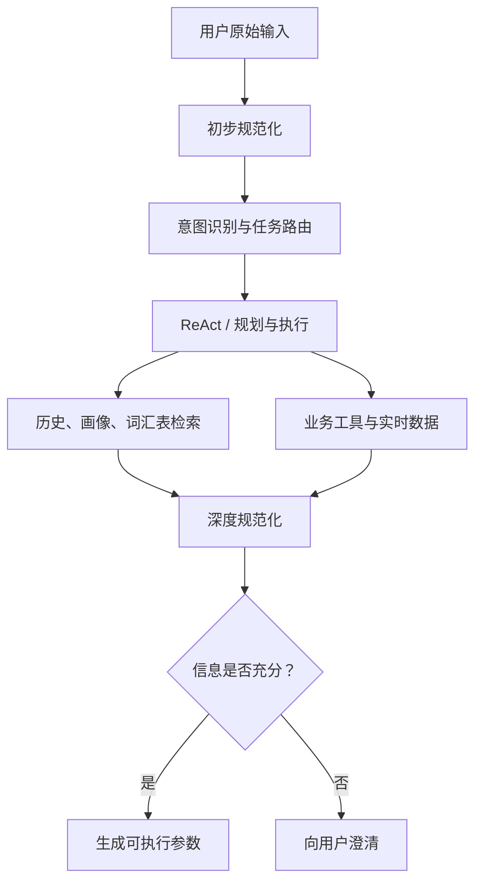

# 01｜用户输入规范化：学习笔记

> 课程：[用户输入规范化：为什么你的 Agent 连“那个”“最划算”都听不懂？](https://time.geekbang.com/column/article/994391)  
> 专栏：AI Agent 系统设计面试现场  
> 本笔记是课程内容的概括与工程化整理，不是原文转载。“工程补充”部分是课程之外的延伸。

## 学习目标

学完后应能回答四个问题：

1. 为什么意图识别之前还需要用户输入规范化？
2. 哪些问题应在入口处理，哪些必须等到检索或工具执行阶段处理？
3. 如何限制规范化模型的职责，避免它擅自回答、执行或编造？
4. 如何把模糊表达转换成结构化、可验证、可执行的约束？

## 一句话理解

**用户输入规范化，就是结合上下文，把模糊、缺失、不稳定的自然语言，转换为含义明确、证据可追溯、适合后续处理的输入。**

它与意图识别类似于传统软件工程中的需求分析：如果需求本身没有被理解清楚，后面的分类、规划和执行再准确也没有意义。

## 常见问题分类

| 类型 | 典型现象 | 示例 | 主要处理方式 |
|---|---|---|---|
| 指代问题 | 用代词或序号代替对象 | “第二个能用于生产吗？” | 从当前对话、历史记录和关键事实中解析指代 |
| 缺失问题 | 缺少主体、对象或约束 | “市场占有率多少？” | 补全省略成分；无法可靠补全时追问 |
| 表达问题 | 口语化、病句、语序混乱、临时改口 | “不是，我说的是另一个” | 识别否定、修正和话题切换 |
| 词义问题 | 缩写、黑话、内部代号或多义词 | “这个方案不够 P8” | 结合行业、组织及用户词汇表消歧 |
| 主观判断 | 使用不可直接执行的形容词 | “更高级”“最划算” | 将主观标准拆成可量化约束 |
| 外部事实 | 依赖实时数据或工具结果 | “现在最便宜的是哪个？” | 检索或调用工具，禁止凭模型记忆猜测 |

## 核心架构：分阶段规范化

不能假设入口处调用一次大模型，就能处理所有输入问题。跨会话指代、实时事实和主观比较通常需要历史召回或工具结果。



### 三种处理时机

| 时机 | 适用场景 | 特点 |
|---|---|---|
| 意图识别之前 | 通用型、C 端 Agent | 独立处理常见指代、缺失、病句和术语问题 |
| 与意图识别一起 | 用户较少、领域封闭的专用 Agent | 调用更少，但职责容易混杂 |
| 执行过程中 | 严重依赖历史、检索或工具结果的输入 | 适合跨会话指代、实时事实和“最划算”等问题 |

实践中通常采用“两阶段”：

- **初步处理**：解决多数显性的语言问题。
- **深度处理**：嵌入 ReAct 或执行循环，利用补充上下文完成推断。

## 规范化模块的职责边界

### 可以做

- 指代消解；
- 省略句补全和病句修正；
- 术语标准化、黑话解释和多义词消歧；
- 判断是否需要澄清；
- 判断是否需要搜索或调用工具；
- 输出带证据和置信度的结构化结果。

### 不可以做

- 直接回答用户问题；
- 执行业务工具；
- 做最终推荐或生成完整方案；
- 越权完成意图识别；
- 擅自补充事实；
- 强行猜测低置信信息；
- 伪造实时信息。

职责边界应直接写入 Prompt。否则模型可能把规范化、意图判断、回答和执行混为一体。

## 上下文从哪里来

深度规范化至少需要考虑三类上下文：

1. **用户画像**：长期兴趣、偏好、常用含义和选择习惯。
2. **关键事实**：用户态度、已经确认的结论、Agent 前几轮输出的要点。
3. **历史对话召回**：既包括摘要，也包括能够支持当前判断的细节。

关键原则：**推断必须有证据来源；没有证据时进入澄清流程。**

## 两个进阶方案

### 1. 属性检索与历史召回

场景：用户隔了多天后说“你上次推荐的看樱花的那个地方”。

处理过程：

1. 从输入提取“樱花、出游、地点”等属性。
2. 用这些属性检索历史对话。
3. 将召回结果放入模型上下文。
4. 基于证据完成指代消解。
5. 如果召回不足，扩大检索或向用户澄清。

这里的重点不是让模型凭印象回忆，而是“先检索证据，再进行推断”。

### 2. 可演进词汇表

不同领域中的同一缩写可能含义不同，因此可以维护：

- 行业或组织公共词汇表；
- 用户个人词汇表；
- 内部项目、产品和人物的别名表。

候选新词可通过离线分析产生，并根据出现次数、涉及用户数、连续出现频率等指标升级为正式词条。需要同时控制漏收和误收。

## 为什么必须量化形容词

任何未量化的形容词，都可能导致输出漂移。

例如“性价比更高”至少可能表示：

- 同等价格下，质量、性能、品牌或服务更好；
- 同等质量下，价格更低；
- 更符合该用户的品牌、售后或风险偏好。

不能简单地把“性价比高”翻译成“最低价”。最终应将它转换为价格区间、性能门槛、品牌范围、售后条件等工具参数。

## 推荐的结构化输出（工程补充）

```json
{
  "original_input": "第二个适合生产吗？",
  "normalized_input": "Saga 分布式事务方案适合生产环境吗？",
  "resolved_references": [
    {
      "expression": "第二个",
      "entity": "Saga 分布式事务方案",
      "evidence": "当前对话中的第二个候选方案"
    }
  ],
  "missing_fields": [],
  "ambiguous_terms": [],
  "quantified_constraints": {},
  "needs_clarification": false,
  "requires_search": false,
  "confidence": 0.96
}
```

建议始终保留：

- 原始输入，方便审计；
- 规范化输入，供下游使用；
- 指代映射和证据；
- 缺失字段和歧义项；
- 是否需要澄清或搜索；
- 置信度。

## Prompt 骨架（工程补充）

```text
你是用户输入规范化模块，不是问答助手。

目标：
结合给定上下文，将用户输入转换为明确、完整、适合下游意图识别的结构。

允许：
- 指代消解、缺失补全、病句修正
- 术语标准化、黑话解释、多义词消歧
- 判断是否需要澄清或搜索

禁止：
- 回答用户的问题
- 执行工具或做最终推荐
- 编造上下文中不存在的事实
- 对低置信内容强行猜测

规则：
1. 每个补全部分都必须给出证据。
2. 无法唯一确定时，needs_clarification=true。
3. 实时事实只能标记 requires_search=true。
4. 形容词和极值词应尽可能转化为可量化约束。
5. 严格按指定 JSON Schema 输出。
```

可以持续积累特殊输入作为 few-shot 示例；示例很多时，可先检索出与当前输入最相近的少量示例再注入 Prompt。

## 完整性检查清单

- [ ] 主体、动作、对象是否完整？
- [ ] 每个代词、序号和别名是否已经解析？
- [ ] 指代结果是否有可追溯证据？
- [ ] 缩写、黑话和多义词是否结合领域解释？
- [ ] 主观形容词是否已转为可衡量条件？
- [ ] 是否错误地把“更划算”等同于“更便宜”？
- [ ] 是否存在需要实时检索的事实？
- [ ] 低置信内容是否进入澄清流程？
- [ ] 规范化模块是否越权回答或执行？

## 评估指标（工程补充）

| 指标 | 含义 |
|---|---|
| 指代解析准确率 | 代词、序号、别名是否解析到正确实体 |
| 缺失字段召回率 | 应被发现的缺失信息是否都被识别 |
| 错误补全率 | 系统擅自添加错误事实的比例，越低越好 |
| 澄清准确率 | 该追问时是否追问，不该追问时是否避免打扰 |
| 约束转换准确率 | 主观描述是否正确转成业务参数 |
| 下游任务成功率 | 规范化后是否提高意图识别和工具执行成功率 |
| 额外延迟与成本 | 多阶段调用带来的时间和 Token 开销 |

测试集应覆盖单轮、多轮、跨会话、行业黑话、改口、主观判断和实时事实等场景。

## 面试回答模板

> 我把用户输入规范化设计为初步处理和深度处理两个阶段。初步处理通常位于意图识别之前，负责指代消解、省略补全、表达修正、术语标准化和澄清判断；深度处理嵌入 ReAct 循环，结合用户画像、关键事实、历史对话检索及工具结果，处理跨会话指代、实时事实和主观约束。规范化模块只输出带证据与置信度的结构化输入，不直接回答或执行工具。低置信度进入澄清流程，实时事实进入搜索流程。线上通过指代准确率、错误补全率、澄清准确率和下游任务成功率进行评估。

面试时最好再补充一个与自己项目有关的特殊案例，并准备好：

1. 原始输入为什么困难；
2. 需要哪些上下文；
3. 检索、推断和澄清如何衔接；
4. Prompt 的职责边界；
5. 如何评估准确率与错误补全。

## 速记卡片

**Q：这一讲最核心的思想是什么？**  
A：深度整合上下文，把模糊语言变成可执行约束。

**Q：为什么入口调用一次 LLM 不够？**  
A：有些问题依赖跨会话历史、实时数据或工具结果，入口阶段缺少必要证据。

**Q：什么时候必须追问？**  
A：存在多个合理解释，且上下文不能唯一确定时。

**Q：规范化和意图识别有什么区别？**  
A：规范化回答“用户明确说了什么”，意图识别回答“这个输入属于什么任务、应路由到哪里”。

**Q：为什么命名重要？**  
A：有意义的名称比“方案一、第二个”更容易稳定引用，能降低后续指代错误。

**Q：处理主观词的关键是什么？**  
A：结合用户、场景和业务规则，把它转换成可衡量的参数。

## 练习题

### 练习一：指代消解

Agent 先介绍了 TCC、Saga、本地消息表三个方案。用户问：

> 第二个适合生产吗？

写出：

1. 规范化输入；
2. 指代映射；
3. 证据来源；
4. 是否需要澄清。

### 练习二：信息缺失

用户在讨论某智能家居公司后问：

> 市场占有率多少？

思考应补全哪个主体、哪个产品范围、哪个地区和时间范围。哪些内容可以从上下文获得，哪些需要追问或检索？

### 练习三：主观约束

用户说：

> 给我推荐一个更有性价比的方案。

列出至少四个需要确认或推断的维度，并把它们转为可能的工具参数。

### 练习四：跨会话属性指代

用户说：

> 上次你推荐的那个适合带孩子看动物的地方，附近有酒店吗？

设计“属性提取 → 历史检索 → 指代推断 → 酒店检索 → 澄清”的处理流程。

## 参考答案要点

### 练习一

- “第二个”解析为 Saga 方案。
- 证据是当前对话中候选方案的出现顺序。
- 如果对话列表稳定且没有插入其他编号对象，通常不需要澄清。
- 应保存“第二个方案 → Saga 方案”的指代事实。

### 练习二

- 主体可能是此前讨论的公司，但需要上下文证据。
- “市场占有率”还缺少产品范围、地区和统计时间。
- 历史对话可补主体；实时数值应通过检索获得。
- 如果范围会显著影响答案，应先澄清。

### 练习三

可考虑价格、性能、稳定性、服务、品牌、风险、实施成本和长期维护成本。“更有性价比”不能直接映射为最低价，应先确定比较基准，再生成价格区间、性能下限等参数。

### 练习四

- 提取“上次推荐、带孩子、看动物、地点”等属性；
- 检索历史推荐记录；
- 找到唯一地点后保存指代及证据；
- 再以该地点为中心调用酒店搜索；
- 如果召回多个地点，则先让用户选择，不能随意取一个。

## 延伸难题

一些输入即使采用上述方案仍然很难稳定解决：

- 反话、嘲讽和阴阳怪气；
- “给我想一个题目”实际可能期待多个候选的交互意图；
- 复杂人物关系中的多层指代；
- 不同用户、组织和行业对同一术语的冲突解释。

这些问题通常需要领域数据、长期记忆、关系建模、微调或专门的交互设计，而不是继续堆叠一个更长的 Prompt。
