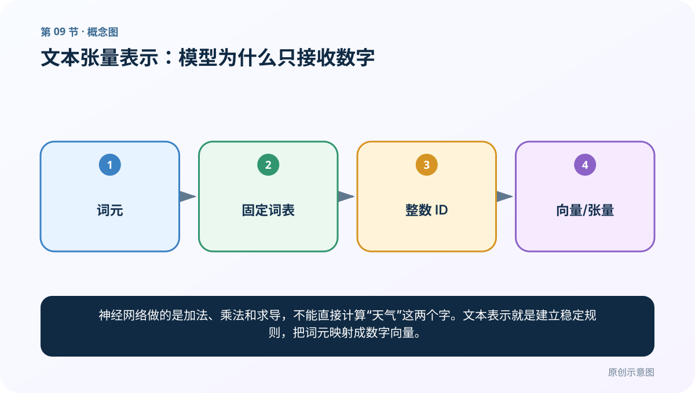
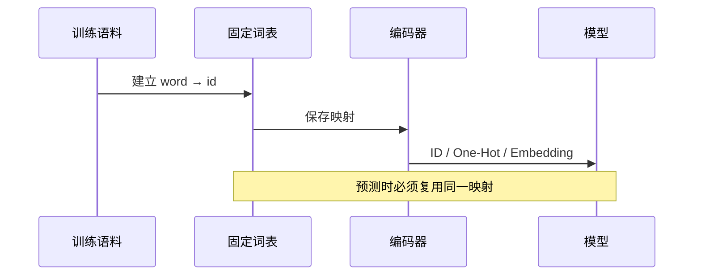

# 第 9 节：文本张量表示：模型为什么只接收数字

> 笔记编号 9/33 · 对应原视频 P13 · [打开这一集](https://www.bilibili.com/video/BV14mdfBDE4Q?p=13)

[← 上一节：08 命名实体识别与词性标注：词是什么角色](./08-ner-and-pos.md) · [返回总目录](./README.md) · [下一节：10 One-Hot 生成：从词表位置得到独热向量 →](./10-one-hot-generation.md)

## 这节解决什么问题

神经网络做的是加法、乘法和求导，不能直接计算“天气”这两个字。文本表示就是建立稳定规则，把词元映射成数字向量。



图要从左向右读。每个方框都是数据的一次变化，不是四个互不相关的名词。

## 辅助流程图


### 词表到模型输入的时序



## 真正看懂本节：从一句话到三种不同数字表示

假设固定词表是：

```text
<PAD>:0，<UNK>:1，我:2，爱:3，NLP:4
```

句子 `我 爱 NLP` 先变成 ID：

```text
[2, 3, 4]      # 形状 [L]=[3]
```

ID 只是查表地址。若直接把 4 当成比 2 “更强”的连续特征，模型会误以为编号之间有大小和距离关系。

### One-Hot 与 Embedding 的形状对照

词表大小 `V=5`，ID 2 的 One-Hot 是 `[0,0,1,0,0]`。整句变成：

```text
One-Hot: [L,V] = [3,5]
```

若设 Embedding 维度 `D=4`，三个 ID 分别查出四维向量：

```text
Embedding: [L,D] = [3,4]
```

再把两句组成 batch，并补齐到统一长度 `L=5`：

```text
IDs:       [B,L]   = [2,5]
Embedding: [B,L,D] = [2,5,4]
```

因此“张量”并不是另一种神秘编码，它只是把同类型数字按规则排成有形状的多维数组。

### OOV、UNK 和 PAD 各自解决什么

- OOV：现有词表之外的新 token，是问题状态；
- `<UNK>`：把无法识别的 token 映射到统一未知词 ID；
- `<PAD>`：为了组成 batch 补出的空位置，不是句子真实内容。

`<UNK>` 与 `<PAD>` 不能共用一个 ID：未知词仍有语义位置，padding 应在 mask 或损失中被忽略。词表只能用训练数据建立，验证与测试只复用；若每次预测都重新编号，同一个 ID 会指向不同词，已训练的 Embedding 表就失效。

### 数字化仍不等于有语义

One-Hot 保证身份可区分，却让任意两个不同词的距离相同；随机初始化的 Embedding 起初也没有可靠语义。必须通过 Word2Vec 等预训练目标或下游任务反向传播，向量位置才逐渐承载统计规律。

## 零基础精讲：把这一节慢下来

### 先看一个具体场景

神经网络无法把“猫”加上“狗”，但能处理整数和向量。词表像一本带页码的字典：词 ID 是页码，向量才是从那一页取出的可计算内容。

### 数据究竟怎样一步步变化

1. 对训练文本分词
2. 建立固定且去重的词表
3. 把每个词替换为整数 ID
4. 再把 ID 变成 One-Hot 或稠密向量

把上面四步和流程图对照起来：

> 词元 → 固定词表 → 整数 ID → 向量/张量

这里的箭头表示“左边的数据经过一次处理，变成右边的数据”，不是四个需要孤立背诵的名词。

### 第一次读代码，只盯住这一件事

看清同一个“我”为什么两次都得到同一 ID。ID 只是地址，不要对 ID 本身做大小和平均值解释。

运行前先在纸上写出你预计的结果；即使猜错，也要指出自己是在哪个箭头上理解错了。这样比复制代码后看到“能运行”更接近真正学会。

### 本节暂时不要误会

数字化不等于模型已经理解语义；它只是让后续学习成为可能。

用一句话过关：**神经网络做的是加法、乘法和求导，不能直接计算“天气”这两个字。文本表示就是建立稳定规则，把词元映射成数字向量。**

## 老师原声整理稿（按讲解顺序）

### 0:00–2:57　文本表示解决“文字不能做矩阵运算”

老师再次强调模型只处理数字。学习目标包括文本向量概念、One-Hot 原理，以及 Word2Vec 的 CBOW/Skip-Gram 推理方向。

单个词可表示为向量；一句话中多个词向量按顺序排列，就形成词向量矩阵。batch 后再多一个批次维。

### 2:57–6:53　用成绩向量类比人物特征

老师用张三多门考试成绩表示一个人：一串数字可从多个维度描述对象。类似地，一个词用若干数字表示；句子中每个词都有一行，合起来成为矩阵。

类比的边界是：词向量维度通常不是人工命名的“语文、数学”，而是通过训练学习到的分布式特征。

### 6:53–9:50　One-Hot 的身份编码

若类别为红、绿、蓝，可用 [1,0,0]、[0,1,0]、[0,0,1]。词表中每个词同样占唯一位置。优点是确定、不会混淆；缺点是词表越大向量越长，而且不同词之间没有语义距离。

老师由稀疏问题引出 Word2Vec 与 Embedding 稠密表示。

### 9:50–13:15　固定顺序、Tokenizer 与 OOV

One-Hot 的列顺序必须固定。训练时“我”若在第 1 列，预测时也必须在同一列。课程展示旧版 Keras Tokenizer/编码接口，把文本拟合为词到索引映射，再生成矩阵。

新词不在词表中会找不到。真实系统应设置 OOV/UNK 策略，并保存 tokenizer，而不是预测时重新拟合。

ID 本身只是地址：编号 5 的词不比编号 2 的词“更大”。只有进一步 One-Hot 或 Embedding 查表后才成为模型特征。

## 完整原声逐段记录

[查看本节按时间戳整理的完整音轨转写](./transcripts/p013.md)

这份记录用于核查老师讲过的内容是否遗漏；正文会纠正口误与语音识别中的技术术语。

## 零基础先记住

- 先建立去重词表，再给每个词固定编号
- One-Hot 向量长度等于词表大小，只有对应位置为 1
- Word2Vec 与 Embedding 用较短的稠密向量表达词

## 最小可运行代码

在项目根目录运行下面代码。课程原理的标准库版本集中在 [text_preprocessing_from_scratch](../../text_preprocessing_from_scratch/README.md)；需要 jieba、PyTorch、FastText 等的示例，请先按代码注释安装依赖。

```python
tokens = ["我", "爱", "自然语言", "我"]
vocab = {word: i for i, word in enumerate(dict.fromkeys(tokens))}
print(vocab)
print([vocab[word] for word in tokens])
```

### 输入和输出怎么看

先得到词到编号的映射，再把原序列变为整数序列；重复词必须得到同一编号。

## 最容易踩的坑

编号 7 不表示这个词比编号 3“大”。ID 只是地址，不能直接当连续数值特征。

## 本节知识链

`词元 → 固定词表 → 整数 ID → 向量/张量`

如果中间任意一个箭头说不清楚，就回到图上，用代码中的一个具体值手算一遍；能预测输出，才算真正理解。

## 自测

**问题：词表有 10,000 个词，One-Hot 每个词向量多长？**

<details>
<summary>点开核对答案</summary>

10,000 维，其中仅一个位置为 1，其余为 0。

</details>

## 学完检查

- [ ] 我能不用术语，用自己的话解释“这节解决什么问题”
- [ ] 我能在运行前大致猜出代码输出
- [ ] 我知道本节方法不适用或容易出错的情况
- [ ] 我能回答自测题，而不只是记住答案

[← 上一节：08 命名实体识别与词性标注：词是什么角色](./08-ner-and-pos.md) · [返回总目录](./README.md) · [下一节：10 One-Hot 生成：从词表位置得到独热向量 →](./10-one-hot-generation.md)
