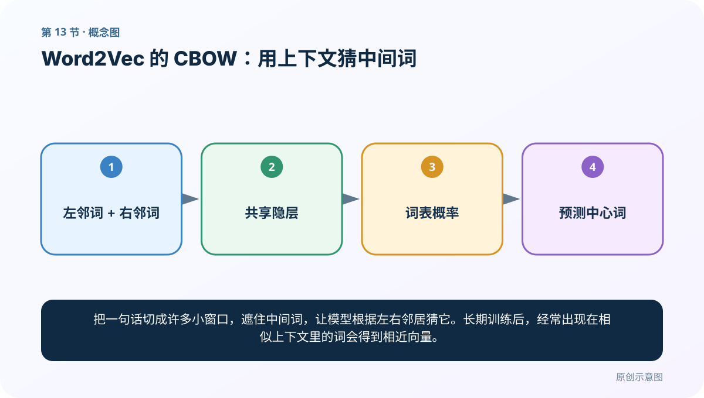
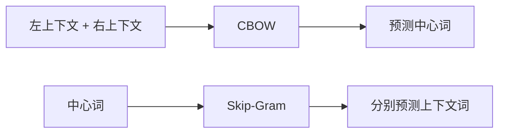
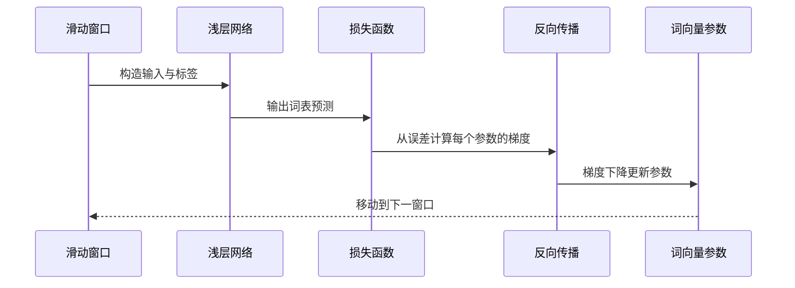

# 第 13 节：Word2Vec 的 CBOW：用上下文猜中间词

> 笔记编号 13/33 · 对应原视频 P17 · [打开这一集](https://www.bilibili.com/video/BV14mdfBDE4Q?p=17)

[← 上一节：12 手写 One-Hot：看见稀疏表示的优点和代价](./12-simple-one-hot.md) · [返回总目录](./README.md) · [下一节：14 Word2Vec 的 Skip-Gram：用中间词猜周围词 →](./14-word2vec-skipgram.md)

## 这节解决什么问题

把一句话切成许多小窗口，遮住中间词，让模型根据左右邻居猜它。长期训练后，经常出现在相似上下文里的词会得到相近向量。



图要从左向右读。每个方框都是数据的一次变化，不是四个互不相关的名词。

## 辅助流程图


### CBOW 与 Skip-Gram 方向对照



### 一次训练迭代时序



## 读 Word2Vec 前，先补齐这四块最小知识

如果你已经记住“CBOW 是上下文预测中心词”，却仍然看不懂后面的矩阵和训练过程，缺的通常不是 CBOW 定义，而是下面四块神经网络前置知识。本节先把它们补齐，再进入老师的矩阵推导。

### 1. Word2Vec 本身就是一个浅层神经网络

这里的网络只有一层隐藏表示，核心是两张会被训练的权重表。设词表大小为 `V`，词向量维度为 `D`：

- 输入词向量矩阵 `E [V, D]`：每一行保存一个词的 `D` 维向量；
- 输出权重矩阵 `O [D, V]`：把隐藏表示重新映射成整个词表的预测分数。

“隐藏层有 3 个神经元”不是说语料只有 3 个意思，而是教学示例把词向量维度 `D` 设成了 3。真正训练时可以设成 100、300 等。

One-Hot 也不是神秘计算。一个词的 One-Hot 只有一个位置为 1，乘上 `E` 后，相当于直接取出该词对应的那一行。这就是代码里常见的 embedding lookup。

### 2. 一道 CBOW 训练题究竟算了什么

仍用“我 爱 自然 语言 处理”举例。窗口为 1，遮住“自然”，上下文是“爱”和“语言”：

```text
输入：（爱，语言）
标签：自然
```

网络先从 `E` 中取出“爱”和“语言”的向量，再求平均（有些实现使用求和），得到隐藏表示：

```text
h = (E[爱] + E[语言]) / 2
```

接着计算整个词表的分数并用 Softmax 转成概率：

```text
p = softmax(h × O)
```

这里的 `p` 不是一个词，而是一整排概率，例如“我”0.05、“爱”0.08、“自然”0.62……模型把概率最大的词当作当前预测。

### 3. Loss、反向传播和梯度下降各做一件不同的事

因为正确标签是“自然”，交叉熵损失可以写成：

```text
L = -log(p[自然])
```

如果模型给“自然”的概率很高，Loss 就小；如果给得很低，Loss 就大。但 **Loss 只负责报告错了多少，本身不会修改参数**。

接下来是两个连续但不同的动作：

1. **反向传播**：从 Loss 往回计算每个参数的梯度，也就是它对这次错误负多少责任；
2. **梯度下降**：真正按照梯度修改参数。

更新公式是：`参数 = 参数 - 学习率 × 梯度`。

梯度指向 Loss 上升最快的方向，所以公式里要减去梯度，沿反方向走，才叫“梯度下降”。

一次 CBOW 样本会更新输出矩阵 `O`，也会更新这次作为输入的“爱”“语言”在 `E` 中的向量。“自然”这次是标签，它主要通过输出层承担预测目标；当它在别的窗口里充当上下文时，它在输入矩阵中的那一行也会被直接更新。

### 4. 猜词只是训练手段，词向量才是结果

训练会在大量滑动窗口上反复进行：

```text
构造猜词题
→ 前向传播得到概率
→ 用正确词计算 Loss
→ 反向传播计算梯度
→ 梯度下降修改 E 和 O
→ 移动窗口继续训练
```

频繁出现在相似上下文里的词，为了完成相似的预测任务，会被推向能产生相似预测结果的位置。最后通常保留 `E` 的各行作为词向量，而不是把“猜中间词”这个功能当作最终产品。

## 零基础精讲：把这一节慢下来

### 先看一个具体场景

在“我 爱 自然 语言 处理”中先遮住“自然”，只给模型看“爱”和“语言”。若海量文本反复提供这种猜词题，模型会逐渐学到哪些词常处于相似语境。

### 数据究竟怎样一步步变化

1. 滑动窗口选定中心位置
2. 把左右词作为输入
3. 让网络预测整个词表的概率
4. 用正确中心词计算误差并更新向量

把上面四步和流程图对照起来：

> 左邻词 + 右邻词 → 共享隐层 → 词表概率 → 预测中心词

这里的箭头表示“左边的数据经过一次处理，变成右边的数据”，不是四个需要孤立背诵的名词。

### 第一次读代码，只盯住这一件事

先只运行样本生成器，不急着训练网络。把每一行读成“根据左、右邻居，应该猜哪个中间词”。

运行前先在纸上写出你预计的结果；即使猜错，也要指出自己是在哪个箭头上理解错了。这样比复制代码后看到“能运行”更接近真正学会。

### 本节暂时不要误会

CBOW 的猜词任务是训练手段；最终需要的是权重里学到的词向量。

还要区分三个常被混在一起的词：Loss 衡量错误；反向传播计算梯度；梯度下降使用梯度更新参数。代码中的 `loss.backward()` 只计算梯度，真正修改参数通常由 `optimizer.step()` 完成。

用一句话过关：**把一句话切成许多小窗口，遮住中间词，让模型根据左右邻居猜它。长期训练后，经常出现在相似上下文里的词会得到相近向量。**

## 老师原声整理稿（按讲解顺序）

### 0:00–3:55　Word2Vec 用预测任务学习稠密向量

老师定义 Word2Vec：用浅层神经网络和上下文预测目标训练权重，再把某层权重矩阵作为词向量。没有人工标签也能构造监督信号，因为句子中的邻近词互相充当输入与标签。

课程指出两套方向：CBOW 用两边上下文预测中间词；Skip-Gram 用中心词预测周围词。本节重点先画 CBOW。

### 3:55–9:50　输入层、隐藏层、输出层的维度

假设语料库只有 5 个词，输入和输出都是 5 维 One-Hot；隐藏层设为 3 维。输入→隐藏权重矩阵把 5 维投到 3 维，隐藏→输出再投回 5 维词表 logits。

隐藏维 3 只是教学方便，实际可用 100、300 等。输入/输出维由词表大小决定，不能随意改成与词表不一致。

### 9:50–15:43　最终取哪张权重当词向量

老师围绕矩阵方向反复纠正 5×3 / 3×5。若采用行向量约定，One-Hot [1,V]×W[V,D] 得 [1,D]，W 的每一行对应一个词的 D 维向量；采用列向量时矩阵写法会转置。

不要只背“5×3”。先写输入在左还是右，再做矩阵乘法维度检查。课程最终要表达的是：输入到隐藏的权重表为每个词保存稠密表示。

### 15:43–22:42　CBOW 样本怎样构造

对长度窗口，选中中心词，两侧上下文作为输入，中心词为标签。例如：

```text
上下文（爱，语言） → 中心词“自然”
```

多个上下文 One-Hot 可求和/平均后送入网络。前向得到词表预测，和中心词真实 One-Hot 计算损失。

老师回顾深度学习训练三件事：前向传播得预测、损失函数衡量差异、反向传播更新权重。

### 22:42–25:41　CBOW 与 Skip-Gram 的一句话区别

老师在图旁写：

- CBOW：context → center；
- Skip-Gram：center → context。

无论哪种，训练的目标是让出现在相似上下文中的词形成有用向量，而不是最终部署一个“猜中间词”的产品。

### 25:41–40:34　手推一次矩阵乘法

老师放大输入—隐藏连接，逐项写 W11、W12 等。One-Hot 的作用是选中权重矩阵对应行：只有一个输入位置为 1，其余为 0，矩阵乘法后恰好取出该词向量。

上下文含多个词时，多个被选行会组合/平均形成隐藏表示，再乘隐藏→输出权重，Softmax 得到中心词概率。

### 40:34–45:29　损失、反向更新与遍历语料

预测分布与真实中心词计算损失，反向传播同时更新两张权重。移动窗口，重复构造下一组样本，直到多轮遍历语料。

训练完成后取输入权重（或按实现组合两套权重）作为词向量。老师最后强调这里讲的是 CBOW 的词向量获取；下一节把输入输出方向反过来讲 Skip-Gram。

## 完整原声逐段记录

[查看本节按时间戳整理的完整音轨转写](./transcripts/p017.md)

这份记录用于核查老师讲过的内容是否遗漏；正文会纠正口误与语音识别中的技术术语。

## 零基础先记住

- 训练样本形式：(上下文词集合 → 中心词)
- 输入矩阵 `E` 取出上下文向量并求和或平均，输出矩阵 `O` 再预测整个词表概率
- Loss 衡量预测错误，反向传播计算梯度，梯度下降更新两张矩阵
- 训练完成后通常取输入到隐藏层的权重矩阵 `E` 作为词向量

## 最小可运行代码

在项目根目录运行下面代码。课程原理的标准库版本集中在 [text_preprocessing_from_scratch](../../text_preprocessing_from_scratch/README.md)；需要 jieba、PyTorch、FastText 等的示例，请先按代码注释安装依赖。

```python
from text_preprocessing_from_scratch.core import cbow_examples
tokens = "我 爱 自然 语言 处理".split()
for context, target in cbow_examples(tokens, window_size=1):
    print(context, "->", target)
```

### 输入和输出怎么看

例如 ('爱','语言') → '自然'。这些只是训练样本；真正 Word2Vec 会用大量语料学习权重。

## 最容易踩的坑

CBOW 不是把相邻词简单拼接成最终词向量；相邻预测任务只是学习表示的训练信号。

也不要把“反向传播”和“梯度下降”当成同一个动作：前者负责算出怎么改，后者才按照学习率真正修改参数。

## 本节知识链

`左邻词 + 右邻词 → 共享隐层 → 词表概率 → 预测中心词`

如果中间任意一个箭头说不清楚，就回到图上，用代码中的一个具体值手算一遍；能预测输出，才算真正理解。

## 自测

**问题：窗口为 1 时，“我 爱 NLP”中以“爱”为中心的 CBOW 输入和标签是什么？**

<details>
<summary>点开核对答案</summary>

输入是上下文（我，NLP），标签是中心词“爱”。

</details>

**问题：一次训练中，Loss、反向传播、梯度下降分别负责什么？**

<details>
<summary>点开核对答案</summary>

Loss 衡量预测与正确答案相差多少；反向传播计算每个参数对这次错误的梯度；梯度下降按照学习率沿负梯度方向更新参数。

</details>

## 学完检查

- [ ] 我能不用术语，用自己的话解释“这节解决什么问题”
- [ ] 我能在运行前大致猜出代码输出
- [ ] 我知道本节方法不适用或容易出错的情况
- [ ] 我能回答自测题，而不只是记住答案

[← 上一节：12 手写 One-Hot：看见稀疏表示的优点和代价](./12-simple-one-hot.md) · [返回总目录](./README.md) · [下一节：14 Word2Vec 的 Skip-Gram：用中间词猜周围词 →](./14-word2vec-skipgram.md)
