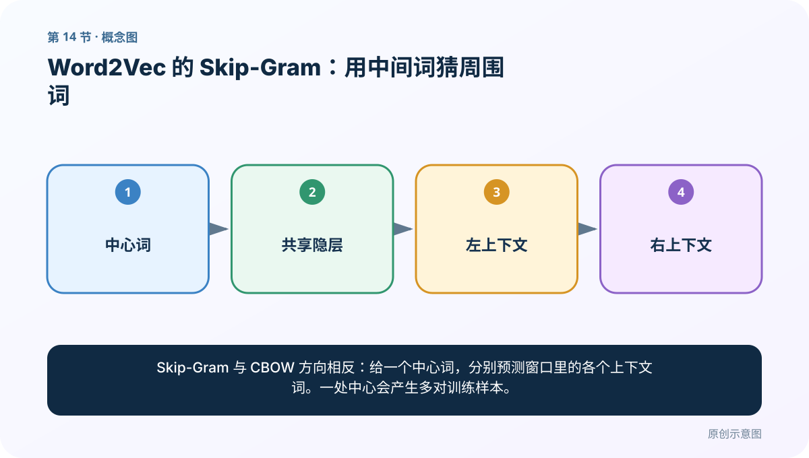
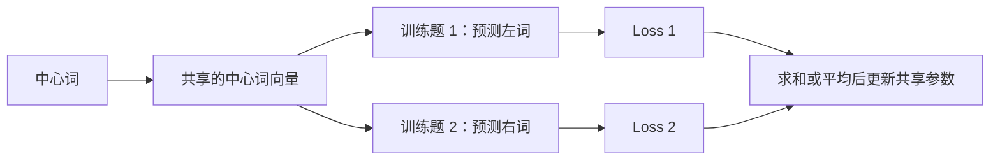
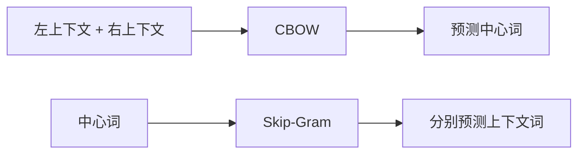
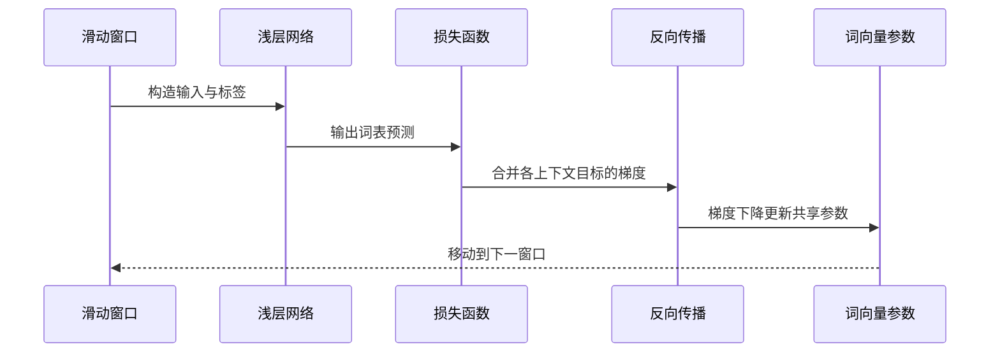

# 第 14 节：Word2Vec 的 Skip-Gram：用中间词猜周围词

> 笔记编号 14/33 · 对应原视频 P18 · [打开这一集](https://www.bilibili.com/video/BV14mdfBDE4Q?p=18)

[← 上一节：13 Word2Vec 的 CBOW：用上下文猜中间词](./13-word2vec-cbow.md) · [返回总目录](./README.md) · [下一节：15 FastText 准备：从大语料到可训练文件 →](./15-fasttext-setup.md)

## 这节解决什么问题

Skip-Gram 与 CBOW 方向相反：给一个中心词，分别预测窗口里的各个上下文词。一处中心会产生多对训练样本。



图要从左向右读。每个方框都是数据的一次变化，不是四个互不相关的名词。

## 辅助流程图



### CBOW 与 Skip-Gram 方向对照



### 一次训练迭代时序



## 先把箭头真正读懂

“中心词 → 每一个上下文词”不是让模型从中心词生成一段话，也不是“先预测左词，再拿左词预测右词”。正确理解是：**同一个中心词被重复拿来，分别形成多道训练题；这些题共用同一套参数。**

仍用“我 爱 自然 语言 处理”，窗口为 1。以“自然”为中心时，会拆成：

```text
训练题 1：自然 → 爱
训练题 2：自然 → 语言
```

扩大窗口后，还会有更远的上下文目标。每一对都可以单独视为一个监督样本，因此同一个中心词会在训练数据中连续出现多次。

### 它仍然是上一节那一个浅层神经网络

Skip-Gram 仍然使用两张共享的权重矩阵：

- `E [V, D]`：输入词向量矩阵；
- `O [D, V]`：输出权重矩阵。

输入中心词“自然”后，先从 `E` 取出它的向量：

```text
h = E[自然]
```

再通过输出矩阵得到词表概率：

```text
p = softmax(h × O)
```

对于“爱”和“语言”两个真实上下文，可以分别计算：

```text
L_爱   = -log(p[爱])
L_语言 = -log(p[语言])
```

总损失可把各上下文损失求和或平均：

```text
L = L_爱 + L_语言
```

求和与平均会改变梯度的整体尺度，但都表达同一个目标：让中心词向量更容易预测窗口内真正出现的词。

### 反向传播到底改了谁

反向传播从总 Loss 出发，计算输出矩阵 `O` 和中心词向量 `E[自然]` 的梯度；梯度下降再执行：

```text
参数 = 参数 - 学习率 × 梯度
```

两道训练题都使用同一个“自然”向量，所以它们对中心词的调整会累积到一起。随着语料不断滑动，“自然”也会作为其他词的上下文标签，所有词都在不同角色中反复参与训练。

课程图为了突出“预测左边和右边”，会把两端画成两个输出；标准实现更常把它们拆成多个 `(中心词, 上下文词)` 训练对，并复用同一个输出层。两种画法要表达的训练目标相同，但不能误解成“左上下文继续预测右上下文”。

### 为什么这种训练能得到词义相近的向量

假设“猫”和“狗”经常出现在“喜欢、吃、可爱、宠物”等相似词附近。为了降低预测这些上下文词时的 Loss，梯度下降会把“猫”和“狗”的中心词向量调整到能产生相似输出概率的位置。于是它们的向量逐渐靠近。

这不是模型先理解了“猫狗都是动物”，而是大量上下文预测任务把这种使用规律压进了参数。

## 零基础精讲：把这一节慢下来

### 先看一个具体场景

Skip-Gram 把上一节的箭头反过来：给模型“自然”，分别要求它猜附近可能出现“爱”和“语言”。一个中心词会拆成多道训练题。

### 数据究竟怎样一步步变化

1. 选定一个中心词
2. 列出窗口内每个邻居
3. 为每个邻居建立一对样本
4. 多次误差共同更新中心词向量

把上面四步和流程图对照起来：

```text
中心词 → 共享的中心词向量
             ├→ 预测左词 → Loss 1
             └→ 预测右词 → Loss 2
Loss 1 与 Loss 2 求和或平均 → 更新共享参数
```

左右上下文是并列的预测目标，不是前后相接的计算步骤。代码里常把它们拆成两行训练样本。

### 第一次读代码，只盯住这一件事

观察同一个 center 为什么连续出现多次。每一行只对应一个上下文标签，而不是一次输出整个句子。

运行前先在纸上写出你预计的结果；即使猜错，也要指出自己是在哪个箭头上理解错了。这样比复制代码后看到“能运行”更接近真正学会。

### 本节暂时不要误会

Skip-Gram 不是 n-gram，也不是跳着切词；它描述的是“中心预测周围”的训练方向。

它也不是“预测出左词以后，再根据左词预测右词”。左、右目标共享中心词向量和网络参数，各自计算损失，再共同贡献梯度。

用一句话过关：**Skip-Gram 与 CBOW 方向相反：给一个中心词，分别预测窗口里的各个上下文词。一处中心会产生多对训练样本。**

## 老师原声整理稿（按讲解顺序）

### 0:00–2:56　Skip-Gram 从中心预测多个上下文

老师紧接 CBOW 反转任务。给定中心词，分别预测窗口左侧和右侧词。一个中心词可产生多个训练对，例如：

```text
爱 → 我
爱 → 自然
```

### 2:56–5:54　网络结构可复用，样本方向不同

输入、隐藏、输出三层与词表维度都可沿用。区别是输入 One-Hot 现在代表中心词，标签是某个上下文词。

老师复制上一张图修改箭头，提醒不要误以为 Skip-Gram 是全新网络；它主要改变训练样本与损失目标。

### 5:54–7:51　多个上下文损失怎样处理

中心词预测左词与右词会得到多个损失，可求和或平均，再反向更新同一套权重。实际高效 Word2Vec 常使用负采样等方法，不会每次对超大词表做完整 Softmax；课程先掌握基础原理。

### 7:51–9:53　最终拿到谁的词向量

Skip-Gram 同样从输入到隐藏的权重中取得中心词稠密表示。老师用“基于中间预测两边”作结。

常见经验是 CBOW 训练较快，Skip-Gram 对低频词更友好，但效果依赖语料、窗口、负采样等，不能把经验当绝对定律。

## 完整原声逐段记录

[查看本节按时间戳整理的完整音轨转写](./transcripts/p018.md)

这份记录用于核查老师讲过的内容是否遗漏；正文会纠正口误与语音识别中的技术术语。

## 零基础先记住

- 样本形式：(中心词 → 一个上下文词)
- 同一中心对应多道并列训练题，它们共享 `E` 和 `O`
- 多个损失求和或平均，反向传播计算累计梯度，梯度下降再更新权重
- 计算通常更多，但对低频词往往更有帮助

## 最小可运行代码

在项目根目录运行下面代码。课程原理的标准库版本集中在 [text_preprocessing_from_scratch](../../text_preprocessing_from_scratch/README.md)；需要 jieba、PyTorch、FastText 等的示例，请先按代码注释安装依赖。

```python
from text_preprocessing_from_scratch.core import skipgram_examples
tokens = "我 爱 自然 语言 处理".split()
for center, context in skipgram_examples(tokens, window_size=1):
    print(center, "->", context)
```

### 输入和输出怎么看

“爱”会分别产生 爱→我、爱→自然；序列边缘只有一侧邻居。

## 最容易踩的坑

不要把 Skip-Gram 理解为跳着取词的 n-gram。它是一个预测任务，skip 指由中心预测窗口上下文。

## 本节知识链

`中心词 → 共享向量 → 分别预测每个上下文词 → 合并损失 → 反向传播 → 梯度下降更新共享参数`

如果中间任意一个箭头说不清楚，就回到图上，用代码中的一个具体值手算一遍；能预测输出，才算真正理解。

## 自测

**问题：CBOW 和 Skip-Gram 最核心的方向差异是什么？**

<details>
<summary>点开核对答案</summary>

CBOW：上下文→中心；Skip-Gram：中心→上下文。

</details>

**问题：Skip-Gram 为什么不能画成“中心词 → 左词 → 右词”？**

<details>
<summary>点开核对答案</summary>

因为左词和右词是由同一个中心词产生的并列训练目标。模型不会先用中心词预测左词，再用左词预测右词；它会复用同一套参数，分别计算各目标的损失。

</details>

## 学完检查

- [ ] 我能不用术语，用自己的话解释“这节解决什么问题”
- [ ] 我能在运行前大致猜出代码输出
- [ ] 我知道本节方法不适用或容易出错的情况
- [ ] 我能回答自测题，而不只是记住答案

[← 上一节：13 Word2Vec 的 CBOW：用上下文猜中间词](./13-word2vec-cbow.md) · [返回总目录](./README.md) · [下一节：15 FastText 准备：从大语料到可训练文件 →](./15-fasttext-setup.md)
