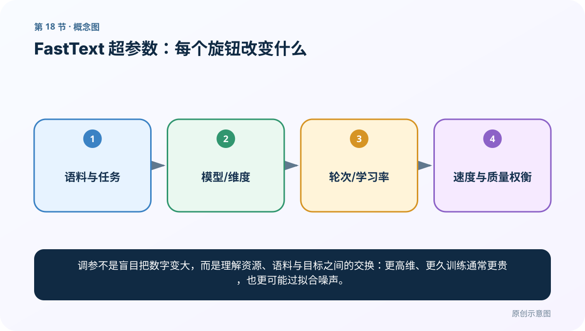
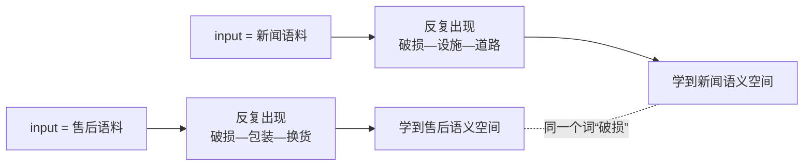
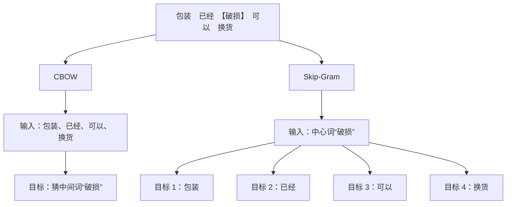
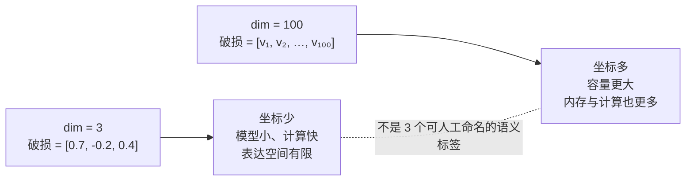
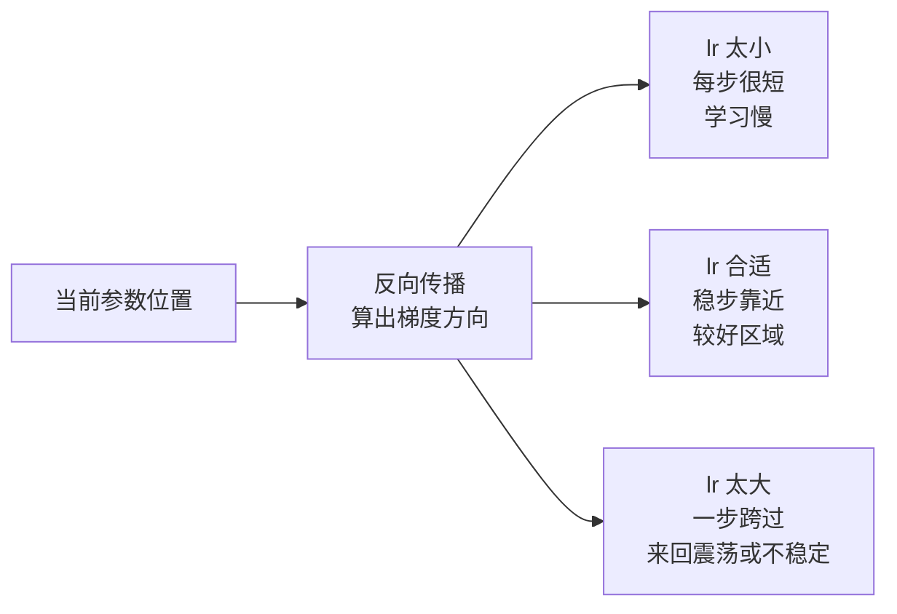
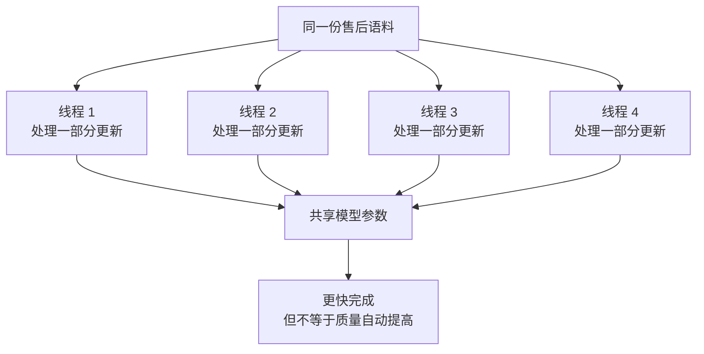
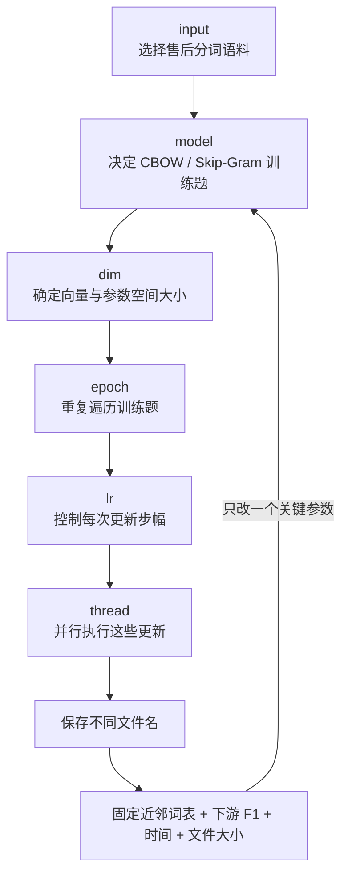

# 第 18 节：FastText 超参数：每个旋钮改变什么

> 笔记编号 18/33 · 对应原视频 P22 · [打开这一集](https://www.bilibili.com/video/BV14mdfBDE4Q?p=22)

[← 上一节：17 FastText 加载、查看与评估：向量好不好要验证](./17-fasttext-evaluation.md) · [返回总目录](./README.md) · [下一节：19 Word2Vec 与 Embedding：预训练方法和查表层的区别 →](./19-embedding-vs-word2vec.md)

## 这节解决什么问题

同一份语料交给 FastText，换一组参数，就会改变“怎样造训练题、向量能装多少信息、整份语料学习几遍、每一步改多大、同时用多少 CPU”。这一节不是背参数名，而是要能预测：**某个参数改变后，训练数据、学习过程、资源开销和最终词向量会怎样变化。**



## 先建立全局地图：六个输入项分别管哪里


课堂把这六项都放进 `train_unsupervised(...)` 里讲，但要先纠正一个术语：`input` 是**必需的数据路径**，不是可调的数值超参数；其余五项才是这节重点调整的训练配置。它们也不在同一层：

| 输入项 | 它直接控制什么 | 它不直接控制什么 |
|---|---|---|
| `input` | 从哪份文本学习 | 不保证语料正确、干净 |
| `model` | CBOW 或 Skip-Gram 的预测方向 | 不自动决定哪个一定更准 |
| `dim` | 词向量长度与表示容量 | 不等于“维度越大语义越好” |
| `epoch` | 遍历语料的次数 | 不等于有效新信息增加 |
| `lr` | 参数更新的初始步幅 | 不是训练轮数 |
| `thread` | 并行训练线程数 | 不直接增加向量维度或语料量 |

## 一个例子贯穿全节：训练“电商售后词向量”

假设我们收集了大量已分词的售后对话，其中有这些句子：

```text
快递 到了 但是 包装 破损
收到 商品 时 外壳 已经 破损
包装 压坏 可以 申请 换货
退款 一直 没有 到账
物流 很快 商品 完好
```

我们希望训练后查询“破损”，近邻能出现“压坏、外壳、包装、换货”等词。评价不能只看一个漂亮结果，所以先固定一组检查词：

- 高频词：“商品”“快递”；
- 低频词：“凹陷”“碎裂”；
- 业务词：“退款”“换货”；
- 容易混淆的词：“到账”“到货”。

接下来每次只改一个输入项，其余不动，再比较固定词的近邻、下游售后分类 F1、训练时间和模型大小。这样才能知道是哪个旋钮造成了变化。

---

## 参数 1：`input`——决定模型究竟从哪种语言世界学习

### 配图：语料不是装进模型的“原料袋”，而是模型看到的全部世界



### 它在代码里做什么

`input` 必须指向一个 FastText 能读取的 UTF-8 文本文件。无监督词向量训练不需要人工类别标签，但需要从文本窗口自动生成预测任务。对中文而言，通常要先分好词并用空格隔开；否则整句话可能被当作一个 token。

```python
input="data/after_sale_tokenized.txt"
```

FastText 读取这份文件，建立词表，统计词频，再从相邻词中生成 CBOW 或 Skip-Gram 训练样本。它不是“只告诉程序文件在哪儿”这么简单：**文件里的领域、词频、分词和噪声，决定模型有机会学到什么。**

### 换一份 `input` 会发生什么

- 换成更大的同领域干净语料：模型通常能看到更多上下文，低频业务词更有机会被学到；
- 混入大量无关新闻：高频通用关系可能更稳定，但“退款—到账”“破损—换货”等业务关系可能被稀释；
- 分词错误：`包装破损` 若总被粘成一个词，模型就很难分别学好“包装”和“破损”；
- 重复灌入同一批句子：训练 token 数变多，却没有增加同等数量的新信息。

### 例子：为什么不能只追求文件大

语料 A 有 10 万条干净售后对话；语料 B 有 100 万条文本，但 90% 是复制新闻。B 更大，却未必更适合“售后意图分类”。正确比较方式是固定同一组验证词和下游任务，而不是看到文件更大就宣布模型更好。

### 这一项最容易误会

`input` 不是超参数，也不是标签文件。它是训练数据入口。老师课堂里用较小文件快速演示，是为了跑通流程，不代表小语料能得到正式可用的向量。

---

## 参数 2：`model`——决定每个窗口被改造成哪一种预测题

### 配图：同一句话，CBOW 与 Skip-Gram 造出的题不同

以“包装 已经 破损 可以 换货”、窗口半径为 2、中心词为“破损”为例：



### 它在代码里做什么

```python
model="cbow"       # 上下文 → 中心词
# 或
model="skipgram"   # 中心词 → 每一个上下文词
```

CBOW 会把同一窗口中的多个上下文表示汇总后猜中心词。Skip-Gram 会拿中心词分别预测窗口里的每一个上下文词。两者都在学习词向量，但一次训练样本的输入、目标和更新次数不同。

### 为什么预测方向会影响结果

CBOW 把多个上下文合在一起，信号更平滑，训练通常更快。售后语料里“包装、已经、可以、换货”共同指向“破损”，偶尔出现一个噪声词时，其他上下文还能提供信息。

Skip-Gram 把“破损→包装”“破损→换货”等关系分别学习。一个低频中心词只要出现一次，也能产生多个中心词—上下文词训练对，因此常被认为更有机会照顾低频词；但它也会生成更多预测任务，训练通常更慢。这里的“常”是经验，不是数学保证，FastText 官方教程也建议用自己的语料验证。

### 例子：该选 CBOW 还是 Skip-Gram

若售后语料非常大，目标主要是快速得到稳定的常见业务词向量，可以先以 CBOW 建基线。若“碎裂、凹陷、漏液”等故障词很少，但又很重要，可以再训练 Skip-Gram 比较低频词近邻和下游分类表现。

不要这样下结论：“Skip-Gram 一定比 CBOW 准。”模型效果还受语料规模、词频、子词参数、维度和评估任务影响。课堂只是把默认的 Skip-Gram 改成 CBOW，展示模型类型可以切换。

---

## 参数 3：`dim`——决定一个词用多少个数字表示

### 配图：维度变大，相当于给表示空间增加更多可调坐标



### 它在代码里做什么

```python
dim=100
```

`dim=100` 表示每个词最终用长度为 100 的稠密向量表示。查询：

```python
model.get_word_vector("破损").shape
```

会得到 `(100,)`。这些维度不是人工规定的“情感维、物流维、损坏维”，而是训练共同学出的坐标。单独解释某一维通常没有意义，词与词之间的方向、距离和组合关系才重要。

### 调小或调大会发生什么

- `dim` 较小：参数更少，模型文件更小，训练和近邻检索通常更快；但复杂关系可能被挤在有限空间里；
- `dim` 较大：提供更高表示容量，可能容纳更多语义和句法差异；同时需要更多内存、存储、计算和足够数据；
- 大到超出数据支撑：多出来的自由度可能只是在记录偶然共现和噪声，不保证下游指标提高。

FastText 的核心向量矩阵规模会随 `dim` 近似线性增长。把 100 维改为 300 维，向量相关的存储和计算通常也会明显增加，但实际 `.bin` 文件还包含词典、子词桶等内容，所以不能简单断言总文件一定精确变成 3 倍。

### 例子：50 维为什么可能胜过 300 维

假设只有 10 万条售后对话。50 维模型的分类 F1 为 0.87、文件 80 MB；300 维模型 F1 为 0.868、文件 430 MB。此时 300 维容量更大，却没有带来任务收益。若换成数亿 token、多领域且更复杂的语料，300 维才可能体现优势。

因此选择 `dim` 的问题不是“最大能填多少”，而是“在我的语料与任务上，增加的容量是否值得增加的成本”。

---

## 参数 4：`epoch`——决定整份语料被学习多少遍

### 配图：一轮不是一次更新，而是走完整份训练语料


### 它在代码里做什么

```python
epoch=5
```

`epoch=5` 表示训练过程计划遍历整份语料 5 轮。它不是“只更新 5 次”：一轮里会经过大量 token 和窗口，因此会有很多次参数更新。严格地说，FastText 还可能对高频词做子采样，所以某个 token 是否每轮都进入一次有效训练，要受其他配置影响；但“完整遍历语料次数”是理解 `epoch` 的正确第一层。

### 调小或调大会发生什么

- 太小：模型还没充分调整，近邻可能杂乱，低频词尤其学不稳；
- 适中：同样的共现关系被反复确认，损失和任务指标逐渐稳定；
- 太大：耗时近似随轮数增加，还可能不断强化语料中的重复、偏差和错误分词；验证指标可能不再提升甚至下降。

语料规模决定合理轮数。只有几千句时，多学几轮可能必要；若语料已有数十亿 token，一轮本身就包含大量更新，未必需要很多轮。

### 例子：老师为什么把 `epoch` 设成 1

课堂把训练轮数设为 1，模型很快就训练完成。这个设置的目的，是证明“手动参数→训练→保存”的代码链路能跑通。老师也明确提醒：只训练一轮，拿新模型查近邻，效果很可能不如前面训练更充分的模型。

在售后例子里，可以固定其他项，比较 `epoch=1、5、10`：

| epoch | 可能观察到的现象 | 应怎样判断 |
|---:|---|---|
| 1 | 很快，但“破损”的近邻不稳定 | 可能欠训练 |
| 5 | 业务近邻和分类 F1 提升 | 可作为候选 |
| 10 | 耗时约继续增加，F1 几乎不动 | 继续增加价值有限 |

表中的结果只是预期现象，不是预先写死的实验结论；真正数值必须由同一验证集测得。

---

## 参数 5：`lr`——决定每一步沿纠错方向改多远

### 配图：梯度给方向，学习率控制步幅



### 它在代码里做什么

```python
lr=0.05
```

训练样本预测错后，反向传播算出每个参数对这次错误的梯度。最小化损失时，可以把一次更新直观写成：

```text
新参数 = 旧参数 - 当前学习率 × 梯度
```

所以 `lr` 不是“模型学多少轮”，而是控制更新步幅。FastText 的 `lr` 是训练开始时的学习率，训练过程中会随进度衰减；日志接近 100% 时看到学习率接近 0，并不表示一开始没有学习。

### 调小或调大会发生什么

- `lr` 太小：每次只改一点，训练更稳但可能在给定 epoch 内来不及学好；
- `lr` 合适：损失总体下降，固定验证指标得到有效提升；
- `lr` 太大：不是“学得更认真”，而是每次跨得太远，可能越过较好区域，造成震荡或不稳定。

学习率和轮数是联动的：较小 `lr` 往往需要更多更新机会，较大 `lr` 可能更快到达可用区域，却更冒险。因此比较学习率时必须同时记录 `epoch`，不能把“训练更久”误认为“学习率更好”。

### 例子：一次“破损→换货”的纠错

模型一开始给“换货”很低的预测分数。梯度告诉模型应该拉近“破损”和“换货”相关的表示：

- `lr=0`：参数完全不变，模型学不到这次关系；
- `lr=0.0001`：只移动极小距离，需要很多样本和轮次才明显；
- `lr=0.05`：以正常步幅累计关系；
- `lr=5`：可能一次改得过猛，同时破坏已经形成的其他关系。

这些数值用于说明方向，不是本语料已经验证的推荐值。官方 Python API 对无监督训练的常见默认值是 `0.05`，但最终仍需在自己的固定评估上选择。

---

## 参数 6：`thread`——决定有多少 CPU 线程同时参与训练

### 配图：多线程主要换速度，不是给模型增加新知识



### 它在代码里做什么

```python
thread=10
```

`thread` 指定并行训练线程数。FastText 的训练以 CPU 多线程并行更新共享参数，增加线程通常能提高吞吐量、缩短墙钟时间。课堂环境里老师看到默认值由 CPU 数量计算，并把它手动设成 10；不同版本、机器和 Python 包装层的默认值可能不同，应查看自己安装版本的函数说明。

### 调小或调大会发生什么

- `thread=1`：通常最慢，但官方 FAQ 建议在需要严格比较参数、希望结果可复现时使用单线程；
- 增加到与可用 CPU 资源相称：通常训练更快；
- 远超机器实际能力：会产生线程调度和资源争抢，速度未必继续提高，还会影响同机其他任务；
- 多线程重复训练：由于更新顺序可能不同，即使配置相同，最后向量也可能有细微差异。

这里最关键的边界是：`thread` 改变的主要是**并行方式和训练速度**，不是语料内容、词向量长度或训练轮数。它也不保证“线程越多效果越好”。

### 例子：公平比较参数时为什么先用 1 个线程

你想判断 `dim=50` 和 `dim=100` 谁更好，却每次使用 10 个线程。两次训练的并行更新顺序可能略有不同，微小波动会混进比较结果。如果数据和时间允许，调参小实验可以先设 `thread=1` 提高可复现性；最终大规模训练再根据机器资源增加线程。

---

## 六个旋钮放回同一条训练链



这张图要按因果关系读：先有语料，再决定怎样从窗口造预测题；每个词用 `dim` 个数字承载表示；训练过程把语料走 `epoch` 遍；每次反向更新的初始步幅由 `lr` 控制；这些更新可以由多个 `thread` 并行执行。最后的质量只能靠固定评估确认。

## 一套更好的完整实验例子

### 第一步：先保存基线

```python
import fasttext

baseline = fasttext.train_unsupervised(
    input="data/after_sale_tokenized.txt",
    model="skipgram",
    dim=100,
    epoch=5,
    lr=0.05,
    thread=1,  # 调参阶段优先可复现
)
baseline.save_model("models/after_sale_sg_d100_e5_lr005.bin")
```

文件名直接记录关键配置，避免覆盖唯一模型。还要另存一行实验记录：

```text
语料版本=v3；model=skipgram；dim=100；epoch=5；
lr=0.05；thread=1；训练时间=...；分类F1=...；模型大小=...
```

### 第二步：只改一个参数

例如只比较模型类型：

```python
cbow = fasttext.train_unsupervised(
    input="data/after_sale_tokenized.txt",
    model="cbow",   # 只有这里与基线不同
    dim=100,
    epoch=5,
    lr=0.05,
    thread=1,
)
cbow.save_model("models/after_sale_cbow_d100_e5_lr005.bin")
```

### 第三步：固定评估，不挑成功截图

```python
probe_words = ["商品", "快递", "破损", "退款", "凹陷", "到账", "到货"]

for word in probe_words:
    print(word, baseline.get_nearest_neighbors(word, k=5))
```

近邻只做直观检查。正式选择还要把词向量放进同一个售后意图分类器，比较同一验证集的 F1。同时记录训练时间和模型大小，才能看到完整交换：

| 实验 | 唯一改动 | 近邻检查 | 分类 F1 | 时间 | 大小 | 结论 |
|---|---|---|---:|---:|---:|---|
| A | 基线 | 待填写 | 待填写 | 待填写 | 待填写 | 基准 |
| B | `model=cbow` | 待填写 | 待填写 | 待填写 | 待填写 | 与 A 比 |
| C | `dim=200` | 待填写 | 待填写 | 待填写 | 待填写 | 与 A 比 |
| D | `epoch=10` | 待填写 | 待填写 | 待填写 | 待填写 | 与 A 比 |
| E | `lr=0.01` | 待填写 | 待填写 | 待填写 | 待填写 | 与 A 比 |

这里故意不编造任何“实验结果”。没有真实运行和验证集，就只能写待填写，不能为了让表格好看而虚构 F1。

## 老师原声整理稿（按讲解顺序）

### 0:00–1:59　最后一步是把默认训练改成手动参数

老师回到 `train_unsupervised`：前几节一直直接使用默认参数，现在希望切换 CBOW、改变向量维度、训练轮数、学习率和线程数。本节因此定义新的“超参数设置”函数，并先回顾默认训练调用。

这里的动机很重要：手动传参不是为了让代码显得复杂，而是让每次训练的条件明确、可保存、可比较。

### 1:59–2:58　先看函数定义，但不试图一次记住全部参数

老师点进函数定义，看到很多可选项，并明确说不把所有参数逐个讲完，只讲课堂常用项；遇到其他参数时再查文档。

第一个是 `input`，指向之前准备好的训练数据文件。它是必需数据路径，不是严格意义上的超参数。把它和其他配置写在一起，是为了组成一次完整、可复现的训练调用。

### 2:58–3:57　model 与 dim：换预测方向、换向量长度

`model` 的默认模式在课堂安装版本中是 Skip-Gram。老师把它改成 CBOW，说明这里选择的是哪一种词向量训练方式。

`dim` 是词向量维度。老师先提到默认 100，又用夸张的 500、50 万提醒：维度可以改，但不能只追求大。维度越大，参数和资源开销越高，也需要更多数据支撑。

接着设置 `epoch=1`。老师用“如果跑 1000 轮，今天就不用下课”解释 epoch 会直接增加训练时间；课堂为了快速验证代码，只训练一轮。

### 3:58–4:57　epoch、lr 与 thread：训练多久、每步多大、并行多少

老师确认 `epoch` 是训练轮数，`lr` 是学习率，再设置 `thread=10`。线程数与机器 CPU 资源有关，不能不看硬件就无限增大。

课堂中这些数值是演示配置，不是通用最优答案。特别是 `epoch=1`，它主要用于让课堂训练尽快完成。

### 4:57–5:56　改完参数仍要保存为新的二进制模型

参数设定后，训练流程与前面没有本质变化：仍然是训练、保存 `.bin` 模型、输出成功提示。不同配置应保存为不同文件名，否则覆盖旧模型后就无法公平回看。

老师随后串起前四个函数：获取训练数据；训练并保存；加载和查看；用近邻检验效果。超参数设置不是孤立的一段代码，而是插入同一条实验生命周期。

### 5:56–6:54　一轮训练很快，但效果可能更差

测试新函数时，训练只花很短时间。老师马上追问为什么，答案是只训练了一轮。他也明确说明：如果拿这个新模型查询近邻，效果可能不如前面训练更充分的模型，因为训练轮数太少。

这正是本节最后的判断标准：参数首先改变训练过程，最终是否“更好”仍要重新加载并用固定方法评估。快不等于好，大也不等于好。

## 完整原声逐段记录

[查看本节按时间戳整理的完整音轨转写](./transcripts/p022.md)

这份记录用于核查老师讲过的内容是否遗漏；正文已纠正 ASR 中的 `CBOW`、`Skip-Gram`、`epoch`、`lr`、`thread` 等技术术语，并把课堂演示值与通用建议分开。

## 零基础先记住

- `input` 选择语料世界；严格说它是必需路径，不是超参数；
- `model` 改变训练题：CBOW 是上下文猜中心词，Skip-Gram 是中心词分别猜上下文词；
- `dim` 决定一个词用多少个数字表示，容量与成本都会随之变化；
- `epoch` 决定整份语料学几遍，一轮内部包含大量更新；
- `lr` 决定每次纠错的初始步幅，FastText 训练中会随进度衰减；
- `thread` 主要控制 CPU 并行和速度，多线程会影响严格复现；
- 参数没有统一最优值，必须固定语料和评估，一次只改一个关键变量。

## 最小可运行代码

在项目根目录运行下面代码。需要先安装 `fasttext`，并准备 UTF-8、已分词、以空格隔开的文本文件。

```python
import fasttext

config = {
    "input": "data/after_sale_tokenized.txt",
    "model": "skipgram",
    "dim": 100,
    "epoch": 5,
    "lr": 0.05,
    "thread": 1,
}

print("本次训练配置：")
for key, value in config.items():
    print(f"{key:>6} = {value}")

model = fasttext.train_unsupervised(**config)
model.save_model("models/after_sale_sg_d100_e5_lr005.bin")

print("向量形状：", model.get_word_vector("破损").shape)
print("近邻：", model.get_nearest_neighbors("破损", k=5))
```

### 输入和输出怎么看

先核对打印出的配置，确认这次实验究竟改了什么。若 `dim=100`，查询“破损”的向量形状应为 `(100,)`。近邻内容取决于真实语料，不能在运行前写死；如果语料里从未形成可靠的“破损—包装—换货”共现，代码成功也不会凭空生成正确业务语义。

## 最容易踩的坑

1. 把 `input` 当成无关紧要的文件名，忽略语料领域、编码和分词；
2. 说 CBOW 或 Skip-Gram “一定更好”，却不做固定评估；
3. 认为 `dim` 越大越高级，忽略数据量、文件大小和下游收益；
4. 把 `epoch=5` 理解成只有 5 次参数更新；
5. 把 `lr` 当成轮数，或者认为学习率越大收敛后一定更好；
6. 把 `thread` 当成质量参数，认为线程越多词向量就越准确；
7. 一次改五个参数，结果变化后无法归因；
8. 覆盖旧模型、没记录语料版本，导致实验无法复现。

## 进一步阅读：课堂没展开、但 FastText 还常见的参数

老师明确说这集只讲常用项。FastText 无监督训练还提供 `ws`（上下文窗口）、`minCount`（最低词频）、`minn/maxn`（字符子词长度范围）、`neg`（负样本数）、`loss`、`bucket` 等参数。它们不是本集老师逐项讲解的内容，因此不混入上面“六个课堂参数”中；需要继续调优时，可查看 [FastText Python API 参数表](https://fasttext.cc/docs/en/python-module.html) 与 [官方词向量教程](https://fasttext.cc/docs/en/unsupervised-tutorial.html)。

## 本节知识链

`input 选择语料 → model 生成训练题 → dim 确定表示容量 → epoch 决定重复遍历 → lr 控制更新步幅 → thread 并行执行 → 固定评估决定是否采用`

## 自测

**问题 1：把 `dim` 从 100 提到 300，为什么不保证效果提升？**

<details>
<summary>点开核对答案</summary>

它增加了表示容量，也增加存储和计算成本；若语料不足或任务不需要，多出的自由度可能只拟合噪声，固定验证指标未必提升。

</details>

**问题 2：`epoch=1` 为什么训练很快，却不能据此说配置更好？**

<details>
<summary>点开核对答案</summary>

它只把整份语料遍历一轮，更新机会较少。速度提升来自训练工作量减少，不代表词向量关系已经学充分，仍需用固定近邻和下游指标评估。

</details>

**问题 3：梯度、学习率、线程数分别负责什么？**

<details>
<summary>点开核对答案</summary>

梯度给出本次纠错的方向；学习率控制沿该方向更新的初始步幅；线程数控制多少 CPU 线程并行执行训练更新，主要影响速度和复现性。

</details>

**问题 4：为什么做严格参数对比时可以先设 `thread=1`？**

<details>
<summary>点开核对答案</summary>

多线程共享参数时，更新先后顺序可能变化，造成细微结果差异。单线程更容易复现，让参数本身的影响更容易被识别。

</details>

## 学完检查

- [ ] 我能指出 `input` 是必需路径，不是严格意义上的超参数
- [ ] 我能用同一个句子画出 CBOW 与 Skip-Gram 造题方式
- [ ] 我能解释 `dim` 变大时容量、计算和存储为何一起变化
- [ ] 我知道一轮 epoch 内部包含大量窗口和参数更新
- [ ] 我能区分梯度给方向、`lr` 管步幅、`thread` 管并行
- [ ] 我不会把课堂的 `epoch=1、thread=10` 当成通用最优配置
- [ ] 我能设计一次“固定其他项、只改一个参数”的对照实验
- [ ] 我会用近邻、下游指标、时间和模型大小共同选配置

[← 上一节：17 FastText 加载、查看与评估：向量好不好要验证](./17-fasttext-evaluation.md) · [返回总目录](./README.md) · [下一节：19 Word2Vec 与 Embedding：预训练方法和查表层的区别 →](./19-embedding-vs-word2vec.md)
