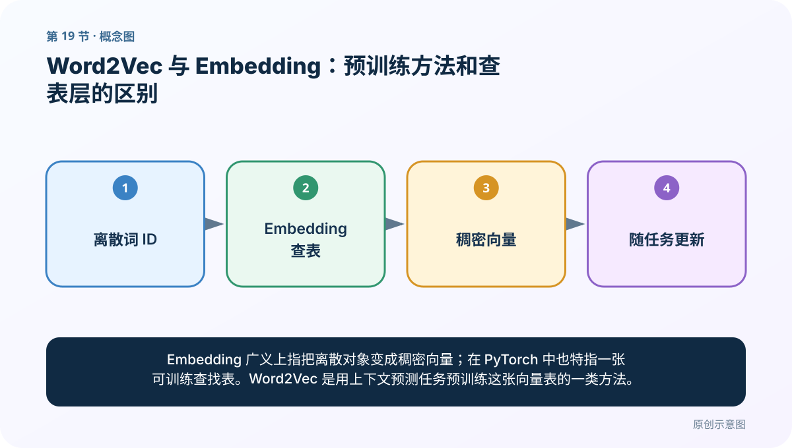
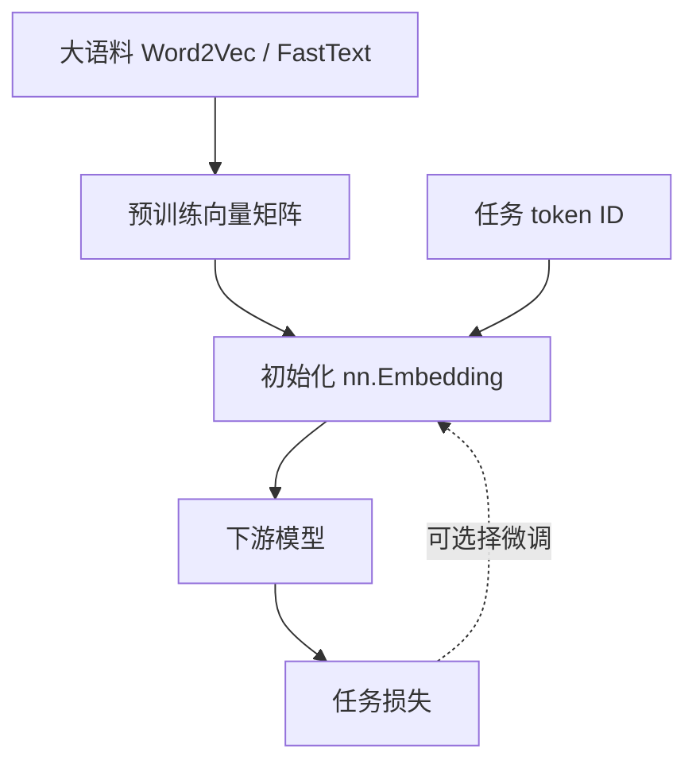
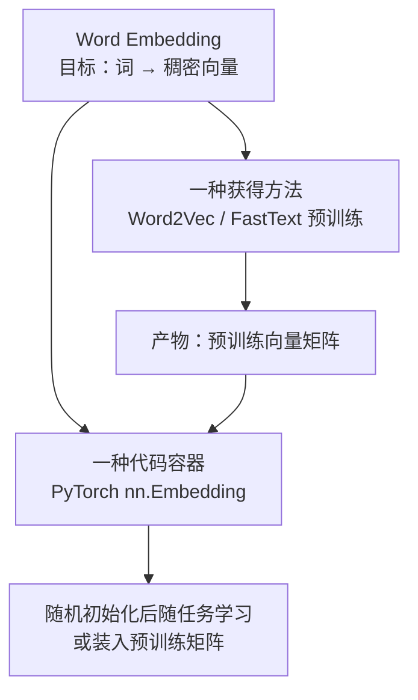
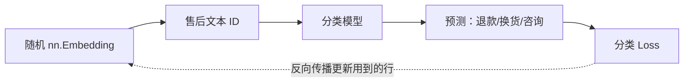
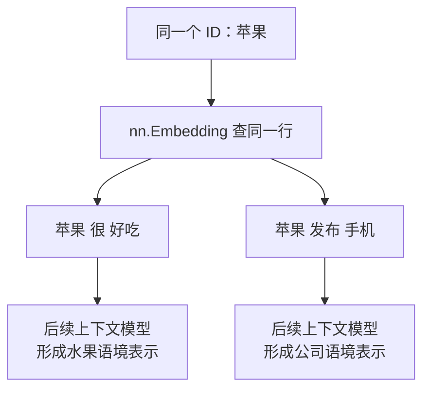

# 第 19 节：Word2Vec 与 Embedding：预训练方法和查表层的区别

> 笔记编号 19/33 · 对应原视频 P23 · [打开这一集](https://www.bilibili.com/video/BV14mdfBDE4Q?p=23)

[← 上一节：18 FastText 超参数：每个旋钮改变什么](./18-fasttext-hyperparameters.md) · [返回总目录](./README.md) · [下一节：20 Embedding 取词向量：从句子到三维张量 →](./20-embedding-lookup.md)

## 这节解决什么问题

Embedding 广义上指把离散对象变成稠密向量；在 PyTorch 中也特指一张可训练查找表。Word2Vec 是用上下文预测任务预训练这张向量表的一类方法。



图要从左向右读。每个方框都是数据的一次变化，不是四个互不相关的名词。

## 辅助流程图


### 预训练与任务内 Embedding 关系



## 零基础精讲：把这一节慢下来

### 先看一个具体场景

Embedding 像一张“ID→向量”的可训练表；Word2Vec 像一种预先把这张表学好的练习方法。你可以随机建表随任务训练，也可以先装入预训练结果。

### 数据究竟怎样一步步变化

1. 离散词先变成 ID
2. Embedding 按 ID 取出一行
3. 任务损失可以继续更新这行
4. Word2Vec 可为这些行提供较好的初始值

把上面四步和流程图对照起来：

> 离散词 ID → Embedding 查表 → 稠密向量 → 随任务更新

这里的箭头表示“左边的数据经过一次处理，变成右边的数据”，不是四个需要孤立背诵的名词。

### 第一次读代码，只盯住这一件事

相同 ID 1 出现两次，所以 vectors[0] 与 vectors[2] 相同。先理解查表，再理解梯度如何改表。

运行前先在纸上写出你预计的结果；即使猜错，也要指出自己是在哪个箭头上理解错了。这样比复制代码后看到“能运行”更接近真正学会。

### 本节暂时不要误会

随机初始化的 nn.Embedding 不会天生知道“猫”和“狗”相近。

用一句话过关：**Embedding 广义上指把离散对象变成稠密向量；在 PyTorch 中也特指一张可训练查找表。Word2Vec 是用上下文预测任务预训练这张向量表的一类方法。**

## 真正看懂这节：先把三个不同层次分开

这节难懂，是因为老师连续使用了 `Word Embedding`、`Word2Vec`、`nn.Embedding`，三个词都与“词向量”有关，却不是同一类东西。先不要背“静态、动态”，把它们放到三个层次：

| 层次 | 它是什么 | 大白话 |
|---|---|---|
| Word Embedding | 一类表示思想 | 把词变成一小排可计算的数字 |
| Word2Vec | 一类训练方法 | 通过猜上下文，把这些数字提前学出来 |
| `nn.Embedding` | 神经网络模块 | 保存一张“词 ID → 向量”的表，并按 ID 取行 |



最重要的判断是：**Word2Vec 和 `nn.Embedding` 不是只能二选一。** Word2Vec 可以先产出一张向量矩阵，再把它装进 `nn.Embedding`，两者正好可以前后衔接。

### 第一步：什么叫“词变成向量”

假设词表只有 4 个词：

| 词 | ID |
|---|---:|
| 包装 | 0 |
| 破损 | 1 |
| 完好 | 2 |
| 退款 | 3 |

如果向量维度 `D=3`，就需要一张 `4×3` 的表：

| ID | 当前向量 |
|---:|---|
| 0 | `[0.2, 0.8, -0.1]` |
| 1 | `[0.7, 0.6, -0.4]` |
| 2 | `[-0.3, 0.5, 0.9]` |
| 3 | `[0.6, -0.2, 0.1]` |

“破损”先变成 ID `1`，再拿 ID `1` 去表里取第 1 行，得到 `[0.7, 0.6, -0.4]`。这就是最小的 Embedding 查表。它没有自动做相似度、分类或翻译，只完成“编号 → 一行参数”。


### 第二步：这张表里的数字从哪里来

有两条常见路线。

#### 路线 A：随机建表，边做业务任务边学



刚创建 `nn.Embedding(4, 3)` 时，表里的数字通常只是随机初始值。“破损”和“损坏”并不会天然靠近。售后分类训练不断产生 Loss，反向传播才逐渐修改用到的向量行，让它们变得有利于当前任务。

这就是老师“边干活边学习”的比喻：模型一边学分类，一边调整 Embedding。但更准确的说法是“任务内联合训练”，不是不用训练。

#### 路线 B：先用大语料预训练，再拿来做业务任务


Word2Vec 先在大量语料上用 CBOW 或 Skip-Gram 造猜词题。训练结束后，把输入向量矩阵保存下来。下游模型不必从随机数字出发，而是从已经学到一些共现关系的向量开始。

这就是“预训练”的含义：**先在任务 A 学到可复用参数，再把参数交给任务 B。** 它不是先训练一个完整售后分类器，而是先训练可复用的词表示。

### 第三步：最容易把人带偏的“静态与动态”

课堂用“Word2Vec 是静态词向量，`nn.Embedding` 会动态更新”帮助初学者区分训练流程，但这句话必须补三个边界：

1. Word2Vec 向量装入下游模型后，可以冻结，也可以继续微调；并非天生永远不变。
2. 随机创建的 `nn.Embedding` 也可以被设置成不更新；并非天生一定变化。
3. 即使 `nn.Embedding` 正在训练，同一时刻同一个 ID 查到的仍是同一行。“苹果很好吃”和“苹果发布手机”中的“苹果”若 ID 相同，基础查表向量也相同。

因此，“训练中会更新”不等于“能根据一句话的上下文产生不同词义”。后者叫**上下文化表示**，通常要靠 RNN、Transformer、BERT 等后续网络根据整句重新计算。



所以本节最准确的四句话是：

- `nn.Embedding` 是一张可训练或可冻结的查找表；
- Word2Vec 是训练词向量的一套预训练目标；
- Word2Vec 的结果可以用来初始化 `nn.Embedding`；
- 仅靠 `nn.Embedding` 查表，还没有解决一词多义的上下文变化。

### 第四步：预训练矩阵怎样装进 `nn.Embedding`

假设下游词表顺序是 `[包装, 破损, 完好, 退款]`，就必须按这个顺序构造矩阵。每一行必须与 ID 严格对齐：

```python
import torch

# 行号必须与下游词表 ID 完全一致
weights = torch.tensor([
    [0.2,  0.8, -0.1],  # 0 包装
    [0.7,  0.6, -0.4],  # 1 破损
    [-0.3, 0.5,  0.9],  # 2 完好
    [0.6, -0.2,  0.1],  # 3 退款
], dtype=torch.float32)

frozen = torch.nn.Embedding.from_pretrained(weights, freeze=True)
trainable = torch.nn.Embedding.from_pretrained(weights, freeze=False)

ids = torch.tensor([1, 3, 1])
print(trainable(ids))
```

`freeze=True` 表示下游训练时先不改这张表；`freeze=False` 表示允许微调。两种选择都合法，要根据语料量和验证集效果决定。

最危险的错误不是维度写错，而是**行顺序错位**。如果下游 ID `1` 表示“破损”，矩阵第 1 行却放了“退款”的向量，代码仍能运行，但所有词义都对不上。

### 一张决策表：到底该怎么选

| 情况 | 更合理的起点 |
|---|---|
| 下游标注数据很少，且有匹配领域的预训练向量 | 加载预训练向量，先冻结或用较小学习率微调 |
| 词表很特殊，预训练覆盖差，但任务数据不少 | 随机 Embedding，随任务训练 |
| 通用预训练与业务词都重要 | 命中词加载预训练，未命中词合理初始化，再整体微调 |
| 需要同一个词随上下文变化 | Embedding 后还要接上下文模型，不能只靠查表 |

## 老师原声整理稿（按讲解顺序）

### 0:00–2:55　Embedding 的广义与狭义

老师说明广义 Word Embedding 是所有把离散词变成稠密向量的技术，Word2Vec、FastText 都属于其中。狭义课堂语境常指神经网络里的词嵌入层（如 nn.Embedding）。

### 2:55–7:48　预训练 Word2Vec 与任务内 Embedding 的流程差异

Word2Vec/FastText 通常先在大语料单独训练、保存，再把向量用于下游任务。nn.Embedding 则可以作为模型第一层，与分类/翻译损失一起端到端更新。

两者也能结合：加载预训练矩阵初始化 Embedding，再选择冻结或微调。

### 7:48–12:53　再复习 CBOW、Skip-Gram 与权重矩阵

老师回到前向—损失—反向传播，强调输入到隐藏的权重矩阵可作为词向量。CBOW 用上下文预测中心，Skip-Gram 用中心预测上下文。

nn.Embedding 只完成 ID 查表，本身没有 CBOW/Skip-Gram 训练目标；它的语义来自下游损失或加载的预训练权重。

### 12:53–18:51　函数复习与选择题

课堂复习 FastText 的训练、保存、加载、取向量、最近邻和超参数，并用题目检查两种模式方向与经验差异。

窗口扩大时，CBOW 会聚合更多上下文预测中心；Skip-Gram 会让中心产生更多上下文训练对。

### 18:51–27:54　课堂扩展阅读与图示纠正

老师讨论 CBOW/Skip-Gram 哪个更适合高频/低频词，并借助外部生成的解释检查图。重要结论是：CBOW 聚合上下文时常先求和或平均，再预测中心；图中矩阵方向要以实际输入约定核对。

课程现场也说明生成式辅助内容可能写错，必须用公式和维度验证。最终可记经验：CBOW 速度快、对高频稳定；Skip-Gram 训练对更多、常照顾低频。具体效果仍以实验为准。

## 完整原声逐段记录

[查看本节按时间戳整理的完整音轨转写](./transcripts/p023.md)

这份记录用于核查老师讲过的内容是否遗漏；正文会纠正口误与语音识别中的技术术语。

## 零基础先记住

- Word2Vec 向量可先在大语料学好，再放入下游模型
- nn.Embedding 可随机初始化或加载预训练权重，也可以选择冻结或更新
- 预训练提供起点，任务内训练提供针对性；两者可以结合
- 同一 ID 查表仍得到同一行；上下文动态词义要靠后续上下文模型

## 最小可运行代码

在项目根目录运行下面代码。课程原理的标准库版本集中在 [text_preprocessing_from_scratch](../../text_preprocessing_from_scratch/README.md)；需要 jieba、PyTorch、FastText 等的示例，请先按代码注释安装依赖。

```python
import torch

# 假设这是按下游词表顺序整理好的预训练矩阵
weights = torch.tensor([
    [0.2,  0.8, -0.1],  # 包装
    [0.7,  0.6, -0.4],  # 破损
    [-0.3, 0.5,  0.9],  # 完好
    [0.6, -0.2,  0.1],  # 退款
])

frozen = torch.nn.Embedding.from_pretrained(weights, freeze=True)
trainable = torch.nn.Embedding.from_pretrained(weights, freeze=False)
ids = torch.tensor([1, 3, 1])

vectors = trainable(ids)
print(vectors.shape)
print(torch.equal(vectors[0], vectors[2]))
print(frozen.weight.requires_grad, trainable.weight.requires_grad)
```

### 输入和输出怎么看

输出形状是 `[3,3]`；相同 ID 查到相同向量。最后输出 `False True`：同一份预训练权重装入 `nn.Embedding` 后，可以选择冻结，也可以选择允许下游任务微调。

## 最容易踩的坑

不要把“Word2Vec 静态、nn.Embedding 动态”背成绝对规则。是否更新由冻结/微调设置决定；而参数随训练更新，也不等于同一个词能随句子上下文产生不同向量。

## 本节知识链

`离散词 ID → Embedding 查表 → 稠密向量 → 随任务更新`

如果中间任意一个箭头说不清楚，就回到图上，用代码中的一个具体值手算一遍；能预测输出，才算真正理解。

## 自测

**问题：nn.Embedding 会自动理解“猫”和“狗”相近吗？**

<details>
<summary>点开核对答案</summary>

不会。初始只是参数表，必须通过训练目标或加载预训练权重才逐渐形成语义。

</details>

## 学完检查

- [ ] 我能不用术语，用自己的话解释“这节解决什么问题”
- [ ] 我能在运行前大致猜出代码输出
- [ ] 我知道本节方法不适用或容易出错的情况
- [ ] 我能回答自测题，而不只是记住答案

[← 上一节：18 FastText 超参数：每个旋钮改变什么](./18-fasttext-hyperparameters.md) · [返回总目录](./README.md) · [下一节：20 Embedding 取词向量：从句子到三维张量 →](./20-embedding-lookup.md)
