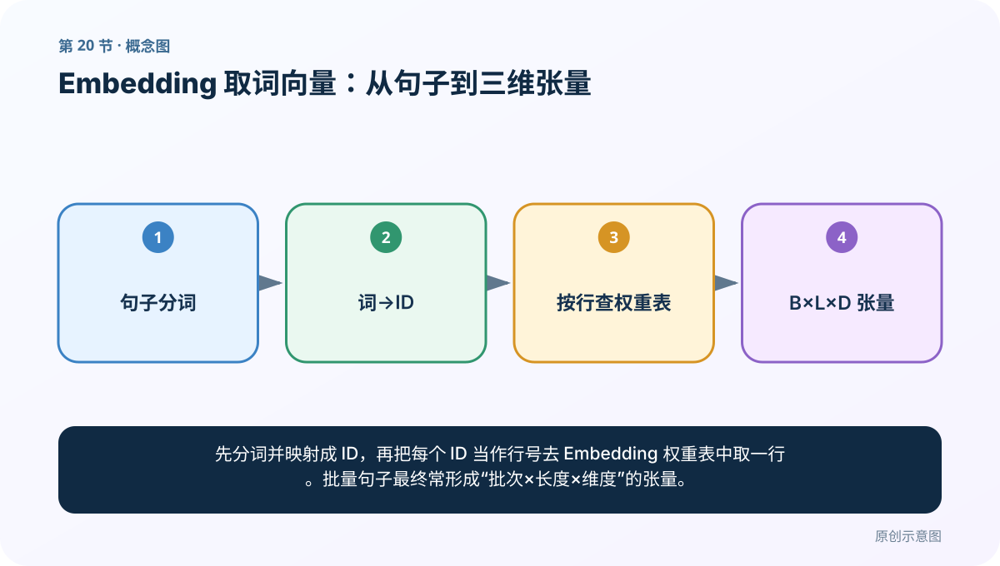
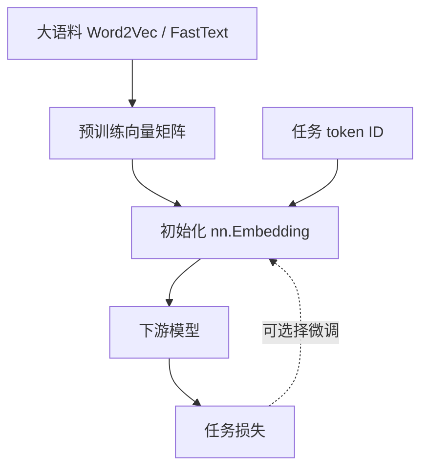
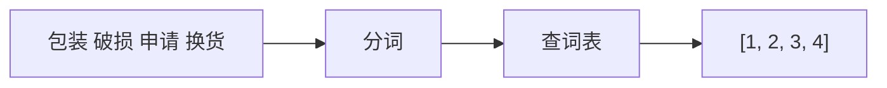
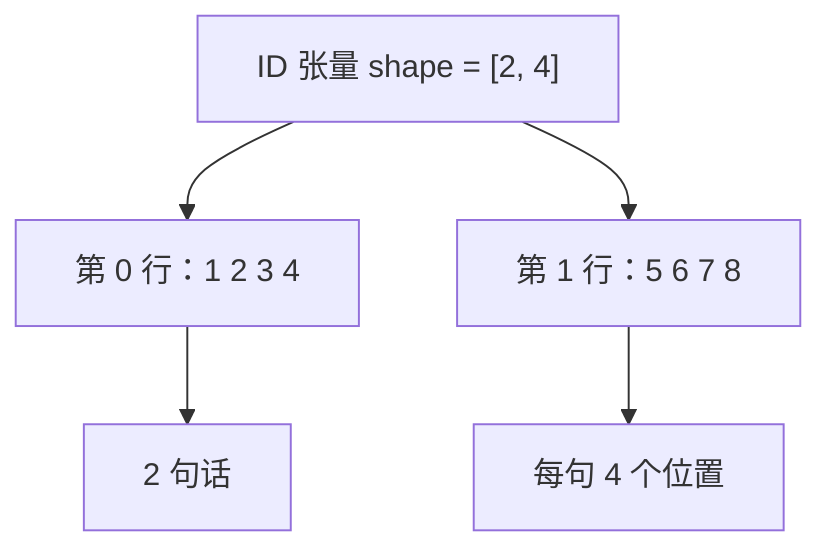
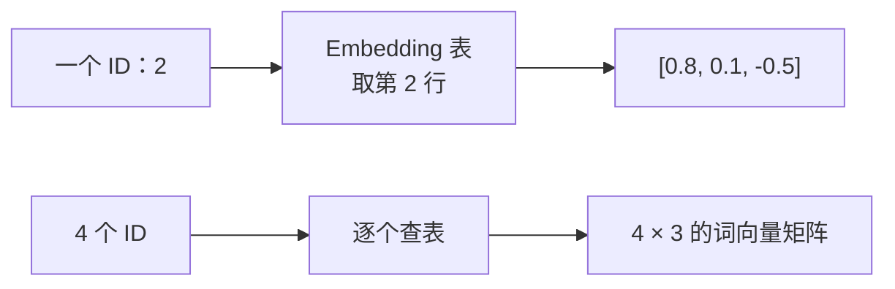
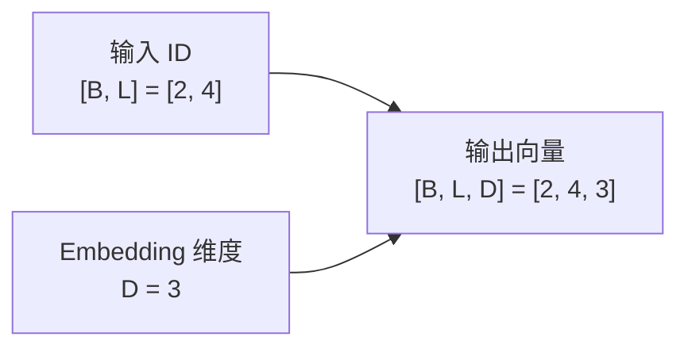

# 第 20 节：Embedding 取词向量：从句子到三维张量

> 笔记编号 20/33 · 对应原视频 P24 · [打开这一集](https://www.bilibili.com/video/BV14mdfBDE4Q?p=24)

[← 上一节：19 Word2Vec 与 Embedding：预训练方法和查表层的区别](./19-embedding-vs-word2vec.md) · [返回总目录](./README.md) · [下一节：21 Embedding 可视化：把高维空间投影到屏幕 →](./21-embedding-visualization.md)

## 这节解决什么问题

先分词并映射成 ID，再把每个 ID 当作行号去 Embedding 权重表中取一行。批量句子最终常形成“批次×长度×维度”的张量。



图要从左向右读。每个方框都是数据的一次变化，不是四个互不相关的名词。

## 辅助流程图


### 预训练与任务内 Embedding 关系



## 零基础精讲：把这一节慢下来

### 先看一个具体场景

一个批次有 32 句话，每句统一为 20 个词，每个词查成 128 维向量，输出就像 32 个“20×128”的小表，形状是 [32,20,128]。

### 数据究竟怎样一步步变化

1. 句子分词并变成 ID
2. 把多句 ID 堆成 B×L
3. 每个 ID 查 Embedding 的一行
4. 末尾增加向量维得到 B×L×D

把上面四步和流程图对照起来：

> 句子分词 → 词→ID → 按行查权重表 → B×L×D 张量

这里的箭头表示“左边的数据经过一次处理，变成右边的数据”，不是四个需要孤立背诵的名词。

### 第一次读代码，只盯住这一件事

代码输入 [1,3] 表示 1 句话、3 个位置；embedding_dim=4，所以输出必然是 [1,3,4]。

运行前先在纸上写出你预计的结果；即使猜错，也要指出自己是在哪个箭头上理解错了。这样比复制代码后看到“能运行”更接近真正学会。

### 本节暂时不要误会

ID 必须在 0 到词表行数减 1 之间；越界不是未知词策略，而是程序错误。

用一句话过关：**先分词并映射成 ID，再把每个 ID 当作行号去 Embedding 权重表中取一行。批量句子最终常形成“批次×长度×维度”的张量。**

## 真正看懂这节：把一句话亲手变成三维张量

“三维张量”听起来像立体几何，其实只是**一张表外面再套一层批次**。不要先想公式，先把一条句子完整走一遍。

我们使用两条已经分词的售后文本：

```text
句子 A：包装 破损 申请 换货
句子 B：物流 很快 商品 完好
```

### 第一步：词不能直接做矩阵运算，所以先编号

建立词表：

| 词 | ID |
|---|---:|
| `<PAD>` | 0 |
| 包装 | 1 |
| 破损 | 2 |
| 申请 | 3 |
| 换货 | 4 |
| 物流 | 5 |
| 很快 | 6 |
| 商品 | 7 |
| 完好 | 8 |

于是两句话变成：

```text
句子 A → [1, 2, 3, 4]
句子 B → [5, 6, 7, 8]
```

这一步只是在换名字：`2` 没有“破损程度为 2”的含义，它只是词表中的行号。



### 第二步：两句话叠成一个二维 ID 张量

```text
[
  [1, 2, 3, 4],
  [5, 6, 7, 8]
]
```

它的形状是 `[2, 4]`：

- 第一个数字 `2`：batch 中有 2 句话；
- 第二个数字 `4`：每句话有 4 个 token。

可以把它理解成 2 行、每行 4 个格子。每个格子里放的是一个词 ID。



### 第三步：Embedding 表为每个 ID 准备一行向量

假设：

```python
embedding = torch.nn.Embedding(
    num_embeddings=9,
    embedding_dim=3,
)
```

权重表形状就是 `[9, 3]`：

- `num_embeddings=9`：有 9 个可查询 ID，也就是 9 行；
- `embedding_dim=3`：每一行有 3 个数字。

为了便于手算，假设其中几行是：

| ID | 词 | 向量 |
|---:|---|---|
| 1 | 包装 | `[0.1, 0.2, 0.3]` |
| 2 | 破损 | `[0.8, 0.1, -0.5]` |
| 3 | 申请 | `[0.2, 0.7, 0.0]` |
| 4 | 换货 | `[0.6, 0.5, -0.1]` |

把 ID `[1, 2, 3, 4]` 交给 Embedding，不是做普通乘法，而是依次取第 1、2、3、4 行：

```text
[
  [ 0.1, 0.2,  0.3],  # 包装
  [ 0.8, 0.1, -0.5],  # 破损
  [ 0.2, 0.7,  0.0],  # 申请
  [ 0.6, 0.5, -0.1]   # 换货
]
```

原来一句话有 4 个 ID；现在每个 ID 展开成 3 个数字，所以一句话变成 `[4, 3]`。



### 第四步：为什么最后是 `[2, 4, 3]`

两句话都做同样的查表：

```text
输入：[2, 4]
      2 句话 × 每句 4 个 ID

输出：[2, 4, 3]
      2 句话 × 每句 4 个位置 × 每个词 3 个数字
```



三个维度分别是：

1. `B`（batch）：这次同时处理几句话；
2. `L`（length）：每句话有几个位置；
3. `D`（embedding dimension）：每个位置用几个数字表示。

所谓“三维”不是屏幕上的长宽高，而是定位一个数字需要三个下标：

```text
vectors[第几句话, 第几个词, 这个词向量的第几个数字]
```

例如 `vectors[0, 1, 2]` 表示：第 0 句话、第 1 个 token（“破损”）、其向量第 2 个数，也就是上例中的 `-0.5`。

### 形状规则只有一句

`nn.Embedding` 会保留输入 ID 张量的所有形状，并在末尾增加一个 `D`：

| 输入 ID 形状 | 含义 | 输出形状（`D=3`） |
|---|---|---|
| `[]` 标量 | 一个 ID | `[3]` |
| `[4]` | 一句话 4 个 ID | `[4, 3]` |
| `[2, 4]` | 2 句话，每句 4 个 ID | `[2, 4, 3]` |
| `[8, 2, 4]` | 额外还有一层分组 | `[8, 2, 4, 3]` |

不是 Embedding 固定输出三维，而是本例输入刚好二维，所以末尾再加向量维后成为三维。

### 为什么句子必须先补到同样长度

若第三句话只有两个词：

```text
客服 耐心 → [9, 10]
```

它不能直接和长度 4 的两句话堆成普通矩形张量。通常先补 `<PAD>`：

```text
[9, 10, 0, 0]
```

再与其他句子组成 `[B,L]`。`padding_idx=0` 可以让 PyTorch 把第 0 行作为填充行，并在普通训练中不更新该行；但后续 RNN、Attention 或池化仍需知道哪些位置是 PAD，不能把填充当成真实词参与语义计算。第 32 节会专门讲截断、补齐和 mask。

### 这段代码怎样逐行读

```python
import torch

vocab = {
    "<PAD>": 0, "包装": 1, "破损": 2, "申请": 3, "换货": 4,
    "物流": 5, "很快": 6, "商品": 7, "完好": 8,
}

ids = torch.tensor([
    [1, 2, 3, 4],
    [5, 6, 7, 8],
], dtype=torch.long)

embedding = torch.nn.Embedding(
    num_embeddings=len(vocab),
    embedding_dim=3,
    padding_idx=0,
)

vectors = embedding(ids)
print(ids.shape)       # torch.Size([2, 4])
print(vectors.shape)   # torch.Size([2, 4, 3])
print(torch.equal(vectors[0, 1], embedding.weight[2]))  # True
```

最后一行是整节最重要的验证：`ids[0,1]` 等于 2，所以 `vectors[0,1]` 必须正好等于权重表第 2 行。

### 报错时按这四项排查

1. ID 张量必须是整数索引，通常使用 `torch.long`，不能把词字符串直接传入；
2. 所有 ID 必须满足 `0 ≤ ID < num_embeddings`；
3. 词表 ID 与权重表行号必须始终一致；
4. batch 中变长句子要先补齐，或使用框架支持的变长序列方案。

## 老师原声整理稿（按讲解顺序）

### 0:00–3:57　从表示法进入词向量可视化案例

老师总结稀疏 One-Hot 与稠密 Word2Vec/Embedding，并提出案例目标：准备两句话，分词、建词表、取 Embedding 权重，再把词向量可视化观察关系。

### 3:57–7:44　新项目与依赖

课堂新建工程，导入 jieba、TensorFlow/Keras Tokenizer 与后续可视化工具。旧版依赖今天可能变化；核心流程可用 Python 字典和 PyTorch 完成，不必绑定某个 Tokenizer 版本。

### 7:44–13:28　两句话先分词并放进列表

老师定义句子列表，遍历每句调用 jieba，把结果保存为“句子列表中的 token 列表”。要打印检查，避免把 generator 对象直接塞入后续。

若环境日志过多，可调日志级别，但不要因此忽略真正异常。

### 13:28–17:22　Tokenizer 建词表

将分词结果拟合为 token→id 映射。老师纠正输入对象：应传 token 列表而不是未切分原句。查看 word_index 的 keys/values 可理解词与编号。

词表顺序一旦用于 Embedding 必须固定保存。

### 17:22–20:20　文本序列化为 ID

每个句子中的 token 按映射变为整数序列。例如同一个“我”无论出现在何处都应得到相同 ID。

不同句长尚未补齐时是变长列表；若要组成 batch 张量，后面还需 padding。

### 20:20–24:30　Embedding 查表与权重矩阵

创建 Embedding(num_embeddings=V,embedding_dim=D)，ID [B,L] 查表后为 [B,L,D]。老师查看权重参数：矩阵每一行就是某个 ID 当前的词向量。

随机初始化的向量没有语义，只是为可视化流程准备数据；要看到可靠聚类，需要训练或加载预训练向量。本节先完成“词→ID→按行查向量”的链路。

## 完整原声逐段记录

[查看本节按时间戳整理的完整音轨转写](./transcripts/p024.md)

这份记录用于核查老师讲过的内容是否遗漏；正文会纠正口误与语音识别中的技术术语。

## 零基础先记住

- num_embeddings 是词表行数，embedding_dim 是每个词的向量长度
- 输入形状可以是任意 ID 网格，输出会在末尾多一个 embedding 维
- 同一个 ID 在同一次权重状态下查到同一行
- PyTorch 索引通常使用 torch.long，并满足 0 ≤ ID < num_embeddings

## 最小可运行代码

在项目根目录运行下面代码。课程原理的标准库版本集中在 [text_preprocessing_from_scratch](../../text_preprocessing_from_scratch/README.md)；需要 jieba、PyTorch、FastText 等的示例，请先按代码注释安装依赖。

```python
import torch
vocab = {
    "<PAD>": 0, "包装": 1, "破损": 2, "申请": 3, "换货": 4,
    "物流": 5, "很快": 6, "商品": 7, "完好": 8,
}
ids = torch.tensor([
    [1, 2, 3, 4],
    [5, 6, 7, 8],
], dtype=torch.long)
embedding = torch.nn.Embedding(len(vocab), 3, padding_idx=0)
vectors = embedding(ids)

print("输入：", ids.shape)
print("输出：", vectors.shape)
print("查表核对：", torch.equal(vectors[0, 1], embedding.weight[2]))
```

### 输入和输出怎么看

输入形状 `[2,4]`，输出形状 `[2,4,3]`：2 个句子、每句 4 个 token、每个 token 3 维。`ids[0,1]=2`，所以核对结果为 `True`。

## 最容易踩的坑

词表编号必须从 0 到 num_embeddings-1；任何越界 ID 都会报错。还要区分 `[B,L]` 的 ID 张量和 `[B,L,D]` 的查表结果，不要把新增的 D 维误认为又多了一句话。

## 本节知识链

`句子分词 → 词→ID → 按行查权重表 → B×L×D 张量`

如果中间任意一个箭头说不清楚，就回到图上，用代码中的一个具体值手算一遍；能预测输出，才算真正理解。

## 自测

**问题：输入是 [32, 20]，embedding_dim=128，输出形状是什么？**

<details>
<summary>点开核对答案</summary>

[32, 20, 128]，分别是批量、序列长度和词向量维度。

</details>

## 学完检查

- [ ] 我能不用术语，用自己的话解释“这节解决什么问题”
- [ ] 我能在运行前大致猜出代码输出
- [ ] 我知道本节方法不适用或容易出错的情况
- [ ] 我能回答自测题，而不只是记住答案

[← 上一节：19 Word2Vec 与 Embedding：预训练方法和查表层的区别](./19-embedding-vs-word2vec.md) · [返回总目录](./README.md) · [下一节：21 Embedding 可视化：把高维空间投影到屏幕 →](./21-embedding-visualization.md)
