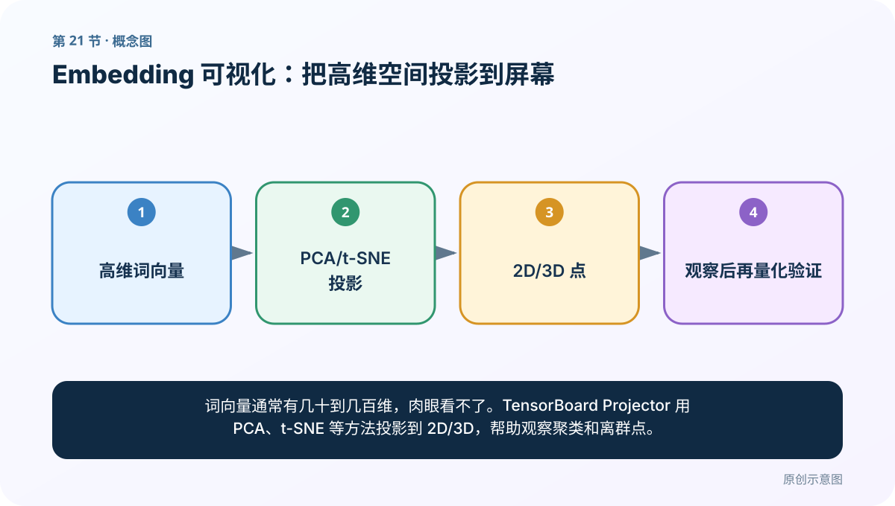
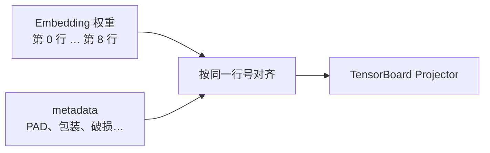
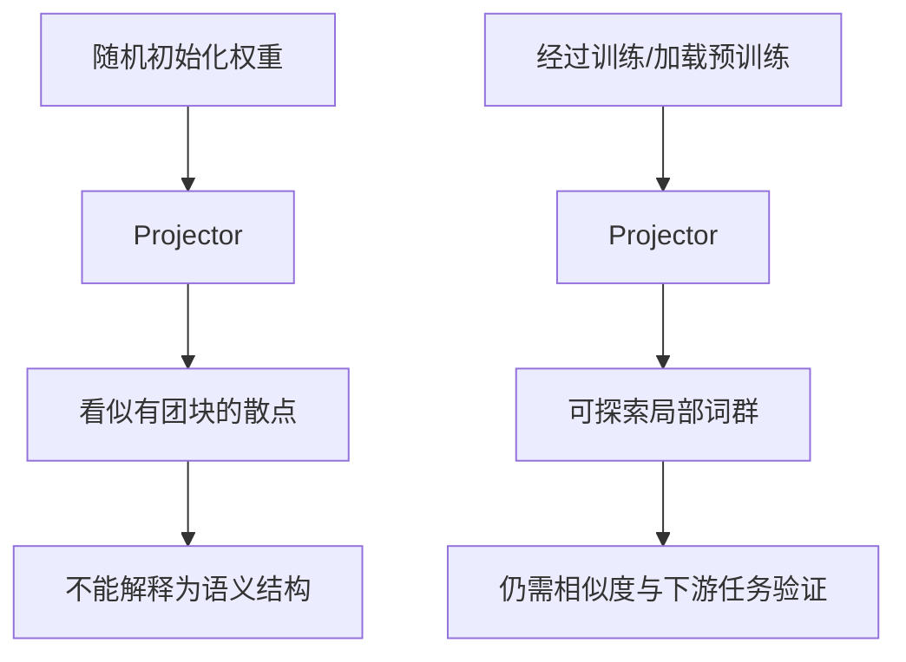

# 第 21 节：Embedding 可视化：把高维空间投影到屏幕

> 笔记编号 21/33 · 对应原视频 P25 · [打开这一集](https://www.bilibili.com/video/BV14mdfBDE4Q?p=25)

[← 上一节：20 Embedding 取词向量：从句子到三维张量](./20-embedding-lookup.md) · [返回总目录](./README.md) · [下一节：22 标签数量分布：先发现类别不平衡 →](./22-label-distribution.md)

## 这节解决什么问题

词向量通常有几十到几百维，肉眼看不了。TensorBoard Projector 用 PCA、t-SNE 等方法投影到 2D/3D，帮助观察聚类和离群点。



图要从左向右读。每个方框都是数据的一次变化，不是四个互不相关的名词。

## 辅助流程图


## 零基础精讲：把这一节慢下来

### 先看一个具体场景

300 维词向量无法直接画在屏幕上，降维就像把立体城市拍成一张照片：能看大致街区，但远近关系会因拍摄角度而变形。

### 数据究竟怎样一步步变化

1. 收集同一空间中的高维向量
2. 用 PCA 或 t-SNE 投影到 2D/3D
3. 用词标签观察簇和离群点
4. 回原空间计算指标验证猜想

把上面四步和流程图对照起来：

> 高维词向量 → PCA/t-SNE 投影 → 2D/3D 点 → 观察后再量化验证

这里的箭头表示“左边的数据经过一次处理，变成右边的数据”，不是四个需要孤立背诵的名词。

### 第一次读代码，只盯住这一件事

先让 TensorBoard 成功读到 runs 目录，再在 Projector 搜索三个示例词；图用于发现问题，不用于单独下结论。

运行前先在纸上写出你预计的结果；即使猜错，也要指出自己是在哪个箭头上理解错了。这样比复制代码后看到“能运行”更接近真正学会。

### 本节暂时不要误会

二维图上靠近不保证原高维空间最近，投影结果也会受算法参数影响。

用一句话过关：**词向量通常有几十到几百维，肉眼看不了。TensorBoard Projector 用 PCA、t-SNE 等方法投影到 2D/3D，帮助观察聚类和离群点。**

## 真正看懂这节：高维向量为什么能画在二维屏幕上

上一节得到的 Embedding 权重表形状是 `[V,D]`：

- `V`：词表中有多少个词；
- `D`：每个词有多少维。

例如 9 个词、每词 3 维，矩阵形状就是 `[9,3]`。可视化工具要同时收到两样东西：

1. `mat`：第 0 行到第 8 行的向量；
2. `metadata`：第 0 行到第 8 行分别叫什么词。



若向量第 2 行是“破损”，metadata 第 2 项却写成“完好”，图依然能画出来，但标签全部错位。因此可视化的第一原则不是“图漂亮”，而是**行与标签严格一一对应**。

### 降维不是删除几列

100 维向量不能直接画在平面上。PCA、t-SNE 等降维算法会根据高维向量之间的关系，为每个词计算两个或三个显示坐标：


屏幕上的 `(x,y)` 不是模型原来的前两维，也不是新的正式词向量，只是为了观察而生成的投影坐标。高维空间被压到二维后必然丢失信息，所以图上看起来相邻，不等于原空间中一定最相似；图上分开，也不一定表示毫无关系。

### 用售后词表看懂“聚类”

如果向量经过充分训练，可能出现：

```text
包装、破损、完好、商品 形成一片区域
退款、换货、申请、到账 形成另一片区域
```

这表示模型在训练语料中学到了一些相似用法。但它不证明：

- “破损”和“完好”是同义词；
- 这组向量一定适合售后分类；
- 图上的二维距离就是精确余弦相似度；
- 每次换一种降维设置，图形都保持不变。

相反词也常因为出现在相似句式中而靠近，例如“物流很快”和“物流很慢”。Embedding 学的是分布用法，不是词典里的同义关系。

### 为什么随机 Embedding 画不出语义



任何随机点经过降维都能形成某种视觉形状。只有确认向量已经由有效训练目标学过，且用定量方法复核，才可以对局部聚集作谨慎解释。

### `add_embedding` 到底接收什么

```python
from torch.utils.tensorboard import SummaryWriter

writer = SummaryWriter("runs/after_sale")
writer.add_embedding(
    mat=embedding.weight.detach().cpu(),  # [V, D]
    metadata=id_to_word,                  # 长度必须是 V
    tag="售后词向量",
)
writer.close()
```

检查清单：

- `mat` 必须是二维 `[V,D]`；
- `metadata` 必须恰好有 `V` 项；
- 第 `i` 个标签必须对应矩阵第 `i` 行；
- 从 GPU 张量写日志前先 `.detach().cpu()`；
- 不需要让日志写入动作参与反向传播。

### 正确的阅读顺序

1. 先检查元数据是否对齐；
2. 再确认向量是随机、预训练还是任务微调后的；
3. 在图上寻找候选关系；
4. 回到原始向量计算余弦相似度或近邻；
5. 最后用下游任务判断是否真正有用。

可视化负责“提出值得检查的问题”，不负责“宣布模型已经正确”。

## 老师原声整理稿（按讲解顺序）

### 0:00–3:53　把词与对应向量一起写入日志

老师在已取得 Embedding 权重后做可视化。需要两份一一对应的数据：

- 词向量矩阵 [V,D]；
- V 个词标签，顺序与矩阵行一致。

课堂例子约 20 个词、每词 8 维，因此矩阵 [20,8]。词数量与权重表行数若不匹配，Projector 标签会错位。

### 3:53–8:35　从 word_index 按 ID 顺序取向量

Tokenizer 的 word_index 是 word→index。老师遍历字典，将每个 index 转为张量，送入 Embedding 取对应行，并同步保存 word。

必须按索引排序，而不是依赖任意字典遍历顺序。若索引从 1 开始，Embedding 行数与第 0 行保留位也要一致。

### 8:35–12:22　SummaryWriter.add_embedding

```python
writer.add_embedding(vectors, metadata=words, tag="demo")
writer.close()
```

TensorBoard 日志写入 runs 目录。vectors 应是二维 [V,D]；metadata 长度为 V。

### 12:22–16:22　启动 TensorBoard 并进入 Projector

终端切到日志所在项目，运行：

```bash
tensorboard --logdir=runs --host=127.0.0.1
```

浏览器通常打开 6006 端口。若提示 No dashboards/data，检查 logdir 是否指到实际事件文件，而不是反复刷新空目录。

Projector 可选择 PCA、t-SNE 等投影，每个点代表一个词。搜索词只能帮助定位，不代表投影距离必然可靠。

### 16:22–22:42　高维图只能探索，不能代替评估

老师点击点观察相近词，并总结流程：句子列表→分词→建词表→ID→Embedding→日志→浏览器可视化。

降维会扭曲距离。图中靠近的词还应回到原始 D 维向量计算余弦相似度；随机未训练 Embedding 形成的“聚类”没有语义证据。

课堂最后扩展张量 reshape 的问题。无论怎样变形，都要保持元素总数不变，并明确词标签仍对应哪一行。

## 完整原声逐段记录

[查看本节按时间戳整理的完整音轨转写](./transcripts/p025.md)

这份记录用于核查老师讲过的内容是否遗漏；正文会纠正口误与语音识别中的技术术语。

## 零基础先记住

- SummaryWriter.add_embedding 写入向量和词标签
- TensorBoard 读取 runs 日志目录并在浏览器展示
- 投影会丢失信息，只适合探索，不是最终质量证明

## 最小可运行代码

在项目根目录运行下面代码。课程原理的标准库版本集中在 [text_preprocessing_from_scratch](../../text_preprocessing_from_scratch/README.md)；需要 jieba、PyTorch、FastText 等的示例，请先按代码注释安装依赖。

```python
import torch
from torch.utils.tensorboard import SummaryWriter
words = ["猫", "狗", "汽车"]
vectors = torch.randn(3, 8)  # 仅验证写日志流程，不代表已有语义
writer = SummaryWriter("runs/words")
writer.add_embedding(vectors, metadata=words, tag="demo")
writer.close()
# 终端运行：tensorboard --logdir=runs
```

### 输入和输出怎么看

浏览器打开 TensorBoard 提示的本地地址，在 Projector 中可切换投影方法并搜索词。由于示例向量是随机数，这张图只能验证“3 行向量与 3 个词标签正确对齐”，不能解释词义聚类。

## 最容易踩的坑

若张量需要梯度，直接 .numpy() 会报错；先 tensor.detach().cpu().numpy()。另外，二维近邻不一定等于原高维近邻。

## 本节知识链

`高维词向量 → PCA/t-SNE 投影 → 2D/3D 点 → 观察后再量化验证`

如果中间任意一个箭头说不清楚，就回到图上，用代码中的一个具体值手算一遍；能预测输出，才算真正理解。

## 自测

**问题：投影图中两个词靠得近，能断言它们在原空间也最近吗？**

<details>
<summary>点开核对答案</summary>

不能。降维会扭曲距离，需要回到原向量计算余弦相似度验证。

</details>

## 学完检查

- [ ] 我能不用术语，用自己的话解释“这节解决什么问题”
- [ ] 我能在运行前大致猜出代码输出
- [ ] 我知道本节方法不适用或容易出错的情况
- [ ] 我能回答自测题，而不只是记住答案

[← 上一节：20 Embedding 取词向量：从句子到三维张量](./20-embedding-lookup.md) · [返回总目录](./README.md) · [下一节：22 标签数量分布：先发现类别不平衡 →](./22-label-distribution.md)
