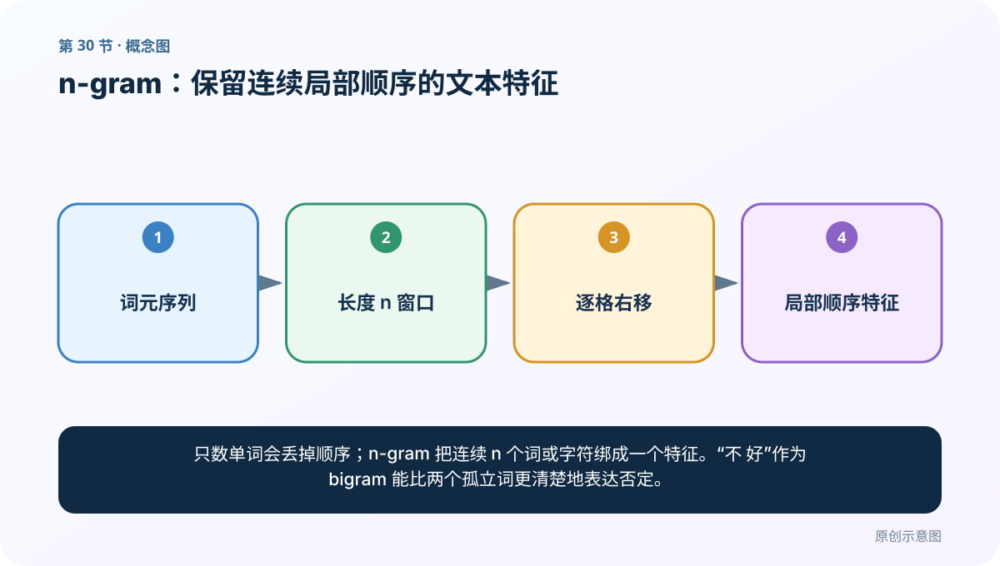
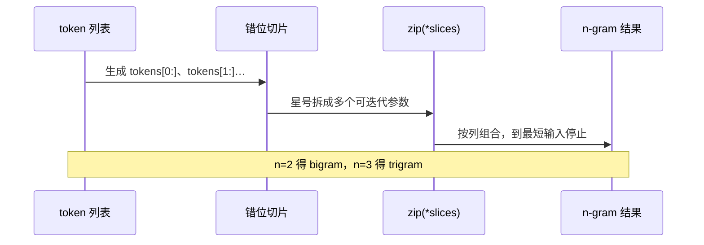
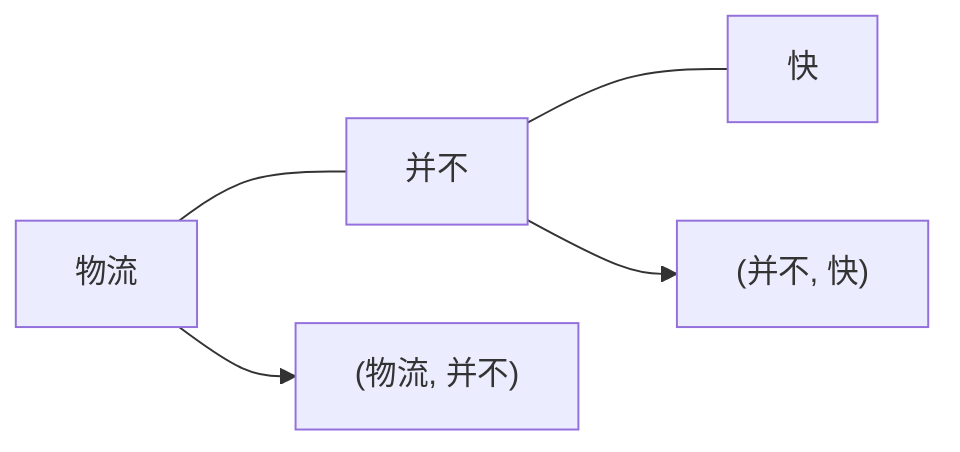
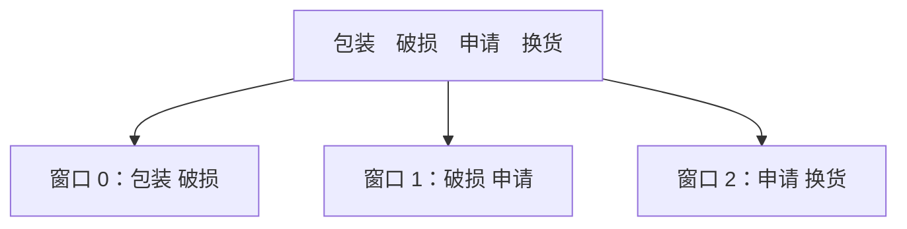

# 第 30 节：n-gram：保留连续局部顺序的文本特征

> 笔记编号 30/33 · 对应原视频 P34 · [打开这一集](https://www.bilibili.com/video/BV14mdfBDE4Q?p=34)

[← 上一节：29 zip：把多个等长位置对齐成元组](./29-zip-function.md) · [返回总目录](./README.md) · [下一节：31 文本相似度：先对齐特征，再比较方向或集合 →](./31-text-similarity.md)

## 这节解决什么问题

只数单词会丢掉顺序；n-gram 把连续 n 个词或字符绑成一个特征。“不 好”作为 bigram 能比两个孤立词更清楚地表达否定。



图要从左向右读。每个方框都是数据的一次变化，不是四个互不相关的名词。

## 辅助流程图


### zip 解包与 n-gram 滑窗



## 零基础精讲：把这一节慢下来

### 先看一个具体场景

“电影 好看”和“电影 不 好看”都含有“电影、好看”。只数孤立词容易忽略否定；bigram 能保留“不→好看”这段局部顺序。

### 数据究竟怎样一步步变化

1. 选择词或字符作为基本单位
2. 放置长度为 n 的连续窗口
3. 窗口每次右移一格
4. 把每个局部片段作为新特征

把上面四步和流程图对照起来：

> 词元序列 → 长度 n 窗口 → 逐格右移 → 局部顺序特征

这里的箭头表示“左边的数据经过一次处理，变成右边的数据”，不是四个需要孤立背诵的名词。

### 第一次读代码，只盯住这一件事

4 个 token、窗口 n=2 会产生 4-2+1=3 个 bigram。先用公式手算数量再看列表。

运行前先在纸上写出你预计的结果；即使猜错，也要指出自己是在哪个箭头上理解错了。这样比复制代码后看到“能运行”更接近真正学会。

### 本节暂时不要误会

n 越大特征越稀疏；n-gram 只保留局部顺序，不能完整理解长距离语义。

用一句话过关：**只数单词会丢掉顺序；n-gram 把连续 n 个词或字符绑成一个特征。“不 好”作为 bigram 能比两个孤立词更清楚地表达否定。**

## 真正看懂这节：n-gram 就是一把长度为 n 的滑动尺

句子：

```text
物流 并不 快
```

若只看 unigram（单个词），得到：

```text
物流、并不、快
```

模型知道出现过“快”，却可能忽略前面的否定。bigram 把连续两个词绑在一起：

```text
(物流, 并不)、(并不, 快)
```

`(并不, 快)` 保留了局部顺序，更容易表达“并不快”。



### 一句话能产生多少个 n-gram

长度为 `L` 的 token 序列，若 `n ≤ L`，连续 n-gram 数量是：

```text
L - n + 1
```

例如 4 个词 `[包装, 破损, 申请, 换货]`：

| n | 结果 | 数量 |
|---:|---|---:|
| 1 | 包装；破损；申请；换货 | 4 |
| 2 | 包装-破损；破损-申请；申请-换货 | 3 |
| 3 | 包装-破损-申请；破损-申请-换货 | 2 |
| 4 | 包装-破损-申请-换货 | 1 |
| 5 | 无 | 0 |



### 课程里的 `zip(*slices)` 为什么能工作

对 bigram，先做两个错位切片：

```python
tokens[:-1]  # 包装 破损 申请
tokens[1:]   # 破损 申请 换货
```

再按位置 zip：

```text
(包装, 破损)
(破损, 申请)
(申请, 换货)
```

一般 n-gram 可以写成：

```python
def ngrams(tokens, n):
    if n <= 0:
        raise ValueError("n 必须大于 0")
    slices = [tokens[i:] for i in range(n)]
    return list(zip(*slices))
```

### `set` 去重什么时候会出错

句子“非常 好 非常 好”有三个 bigram：

```text
(非常, 好), (好, 非常), (非常, 好)
```

若转成 set，最后只剩两个不同 bigram，`(非常,好)` 的出现次数从 2 变成 1。

- 只关心“是否出现过”：set 可以；
- 需要词频、TF-IDF 或计数特征：必须保留重复；
- 需要原始顺序：还不能把结果当无序集合。

### word n-gram 与 character n-gram

- 词 n-gram：先分词，单位是 token；可读性较好，但受分词影响；
- 字符 n-gram：直接按字符滑动；对拼写变体、未登录词更稳，但特征更多。

FastText 的字符子词 n-gram 与这里的通用滑窗思想相通，但它在词内部构造子词表示，不要和整句 word bigram 完全等同。

### n 越大为什么不一定越好

n 变大可以保留更长局部顺序，也会让组合数量爆炸、每个组合更稀有。“包装破损申请换货”这个四元组可能只出现一次，无法稳定统计。实践中要在表达力、覆盖率、内存和数据量之间选择，并在验证集比较。

## 老师原声整理稿（按讲解顺序）

### 0:00–2:59　先把 n-gram 写成可复用函数

老师新建脚本，先写定义：连续 n 个字或词构成小词组特征，帮助计算机观察局部文本规律。unigram、bigram、trigram 分别是连续 1、2、3 个 token；实践里 n 常设为 2 或 3。

函数接收一个 token 列表，课程示例用 `n = 2`，随后准备测试输入。

### 2:59–6:52　滑动切片产生错位的列表

核心是生成 n 份错位切片。bigram 时：

```python
tokens = [1, 3, 2, 1, 5, 3]
slices = [tokens[i:] for i in range(2)]
# [1,3,2,1,5,3]
# [3,2,1,5,3]
```

第一行从位置 0 开始，第二行从位置 1 开始。两行纵向对齐的位置，就是所有相邻二元组。

### 6:52–8:50　zip(*slices) 完成滑动窗口组合

```python
grams = list(zip(*slices))
# [(1,3), (3,2), (2,1), (1,5), (5,3)]
```

星号把切片列表拆成多个 zip 参数；zip 自动在最短切片结束，因此不会产生越界窗口。若 n 改成 3，就会生成三份错位切片并组合成三元组。

### 8:50–10:01　去重是否正确取决于任务

课堂最后用 set 返回无重复 n-gram，并说明集合显示顺序可能变化：

```python
def create_ngrams(tokens, n):
    return set(zip(*(tokens[i:] for i in range(n))))
```

若只建“有哪些特征”的词表，set 合理；若要统计 n-gram 频率、保留出现顺序或训练语言模型，就应返回 list 或 Counter，不能提前去重。

## 完整原声逐段记录

[查看本节按时间戳整理的完整音轨转写](./transcripts/p034.md)

这份记录用于核查老师讲过的内容是否遗漏；正文会纠正口误与语音识别中的技术术语。

## 零基础先记住

- unigram=1 个单位，bigram=2 个，trigram=3 个
- 滑动窗口每次向右移动一格，不能跳词
- 词 n-gram 与字 n-gram 是不同粒度，需按任务选择

## 最小可运行代码

在项目根目录运行下面代码。课程原理的标准库版本集中在 [text_preprocessing_from_scratch](../../text_preprocessing_from_scratch/README.md)；需要 jieba、PyTorch、FastText 等的示例，请先按代码注释安装依赖。

```python
from text_preprocessing_from_scratch.core import ngrams
tokens = ["这个", "电影", "不", "好看"]
print("bigram:", ngrams(tokens, 2))
print("1~2 gram:", ngrams(tokens, 2, include_lower_orders=True))
```

### 输入和输出怎么看

bigram 有 3 个连续词对；include_lower_orders=True 会同时保留 4 个 unigram。

## 最容易踩的坑

课程示例若用 set 去重，会丢失出现次数和原顺序。做计数特征时通常应保留列表，再交给 Counter。

## 本节知识链

`词元序列 → 长度 n 窗口 → 逐格右移 → 局部顺序特征`

如果中间任意一个箭头说不清楚，就回到图上，用代码中的一个具体值手算一遍；能预测输出，才算真正理解。

## 自测

**问题：长度为 L 的序列有多少个连续 n-gram（L≥n）？**

<details>
<summary>点开核对答案</summary>

L-n+1 个，因为窗口起点可从 0 移到 L-n。

</details>

## 学完检查

- [ ] 我能不用术语，用自己的话解释“这节解决什么问题”
- [ ] 我能在运行前大致猜出代码输出
- [ ] 我知道本节方法不适用或容易出错的情况
- [ ] 我能回答自测题，而不只是记住答案

[← 上一节：29 zip：把多个等长位置对齐成元组](./29-zip-function.md) · [返回总目录](./README.md) · [下一节：31 文本相似度：先对齐特征，再比较方向或集合 →](./31-text-similarity.md)
