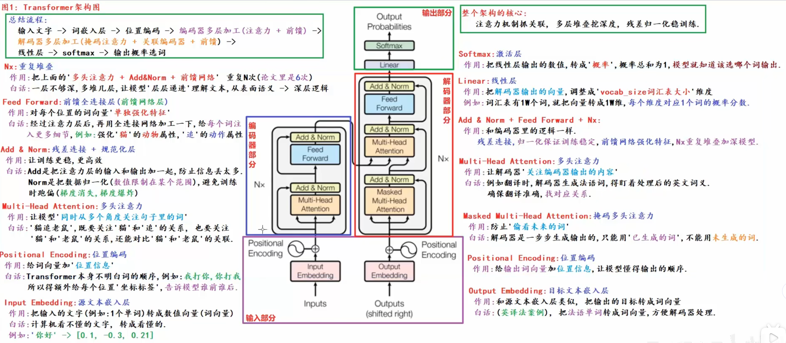
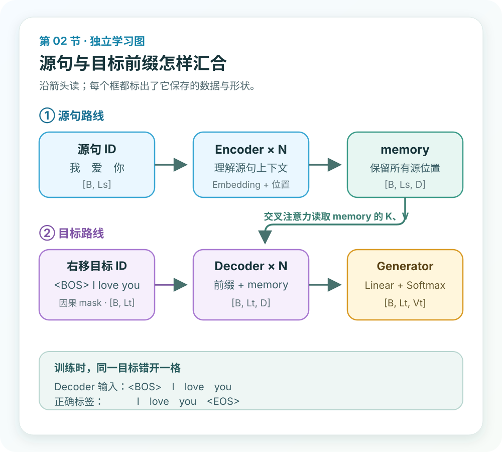
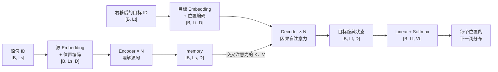
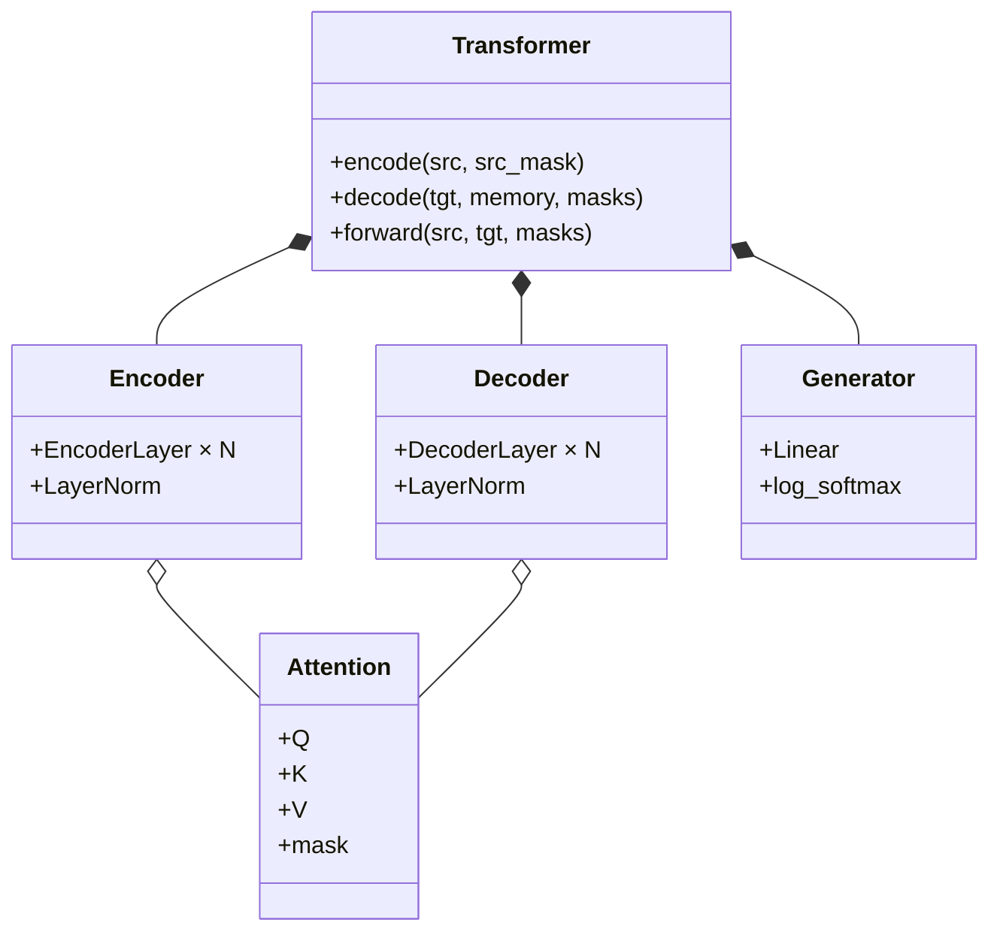

# 第 2 节：总体架构文字版：Encoder 理解，Decoder 生成

> 教材编号 2/38 · 原视频 P107 仅作可选溯源：[打开这一集](https://www.bilibili.com/video/BV14mdfBDE4Q?p=107)（不看视频也能完成本节）

[← 上一节：1 Transformer 的由来：为什么不再逐词递归](./01-transformer-origin.md) · [返回总目录](./README.md) · [下一节：3 架构图上半部分：看懂 Encoder 数据流 →](./03-transformer-diagram-upper.md)

## 这节解决什么问题

源句先由 Encoder 变成带上下文的 memory；Decoder 一边看已经给出的目标前缀，一边查询 memory，预测下一个词。

## 老师课堂这张总架构图必须保留

下面就是你提供的课堂总图。它同时保留了中央的标准 Encoder–Decoder 架构、老师在左右两侧写下的作用说明，以及“组件—子层—层—完整模块”的层级关系。**先点图片右下角的“放大查看”读原图；不要试图在文章宽度内辨认所有小字。**



第一次读这张图只走两条线：

1. **左路源句**：`Inputs → Input Embedding + Positional Encoding → Encoder × N → memory`。
2. **右路目标前缀**：`Outputs (shifted right) → Output Embedding + Positional Encoding → Decoder × N → Linear → Softmax → Output Probabilities`。

中间从 Encoder 指向 Decoder 的横线尤其不能漏掉：它表示 Decoder 不只是看自己已经写出的目标词，还会反复查询 Encoder 对源句产生的结果。下文会保留老师的讲解顺序，把图中每个方块逐一拆开。

### 为了先看清数据流，再看一张简化图



课堂原图负责保留完整结构和老师的批注；简化图只负责回答“数据从哪里来、到哪里去、形状怎样变化”。两张图不是互相替代。

## 不看视频也能学懂：先把陌生词压缩成 8 个

这一节第一次出现的名词很多，但真正的新关系只有一条：**把已知的源句压成一份可查询的记忆，再根据已经写出的目标前缀预测下一个词。** 先把下面 8 个词弄清楚，后面的框图就不会只剩方框。

| 名词 | 在本节中只需要这样理解 |
|---|---|
| token | 分词后送入模型的单位，例如“我”“爱”“你”或 `<BOS>` |
| token ID | token 在词表里的整数编号；编号只表示身份，不表示大小 |
| Embedding | 用 ID 查表，取出长度为 `D` 的向量 |
| 位置编码 | 给向量补上“这是第几个位置”的信息 |
| Encoder | 把源句每个位置改写成包含上下文的表示 |
| memory | Encoder 的全部输出；不是一条摘要，而是源句每个位置各有一个向量 |
| Decoder | 同时查看目标前缀和 memory，产生目标侧隐藏表示 |
| Generator | `Linear + Softmax/LogSoftmax`，把隐藏向量变成目标词表上的分数或概率 |

这一节统一采用 `batch_first=True` 的形状顺序：

```text
B = 一次处理的句子数
Ls = 源句 token 数
Lt = 当前目标序列 token 数
D = 每个隐藏向量的宽度
Vs / Vt = 源词表 / 目标词表大小
```

于是 `[B, Ls, D]` 的意思不是三个神秘参数，而是：`B` 句话，每句话有 `Ls` 个位置，每个位置用 `D` 个数字表示。

## 用“我爱你 → I love you”完整走一遍训练

先看一条已经对齐的训练样本：

```text
源句：我 爱 你
目标：I love you
```

为了让模型学会何时开始和结束，目标侧还会加入特殊 token：

```text
完整目标：<BOS> I love you <EOS>
```

### 第 1 步：源句变成 Encoder 能处理的张量

假设源词表把 `我、爱、你` 编成 `[8, 21, 35]`。ID 经过 Embedding 查表，再加位置编码：

```text
src_ids             [1, 3]
src_embedding       [1, 3, D]
+ position          [1, 3, D]
Encoder memory      [1, 3, D]
```

序列长度仍是 3。Encoder 没把整句压成一个向量，而是为三个源位置都产生一份带上下文的表示。例如“爱”位置的向量现在不只表示“爱”这个词，还混入了它与“我”“你”的关系。

### 第 2 步：把一个目标序列错开一格，自动制造训练题

训练时完整译文是已知的，但不能让当前位置直接看到它要预测的答案。做法是把同一条目标序列切成两份：

| 位置 | 1 | 2 | 3 | 4 |
|---|---|---|---|---|
| Decoder 输入 `tgt_in` | `<BOS>` | `I` | `love` | `you` |
| 正确标签 `tgt_out` | `I` | `love` | `you` | `<EOS>` |

这叫**右移目标序列**。第 3 列的训练题可以读成：“已知前缀 `<BOS> I`，再结合源句 `我爱你`，下一个词应该是什么？”答案是 `love`。

### 第 3 步：Decoder 先看目标前缀，但不能偷看未来

Decoder 的第一个子层是带因果 mask 的自注意力：

```text
预测 I       只能看 <BOS>
预测 love    可以看 <BOS>, I
预测 you     可以看 <BOS>, I, love
预测 <EOS>   可以看 <BOS>, I, love, you
```

训练时四个位置可以并行计算，但 mask 会把右上角“未来答案”挡住。**并行计算不等于允许偷看未来。**

### 第 4 步：Decoder 再用当前目标状态查询源句 memory

第二个子层是交叉注意力。以准备预测 `love` 的位置为例：

```text
Query：当前目标位置的状态（它已经知道前缀 <BOS> I）
Key：  源句 memory 的三个位置
Value：源句 memory 的三个位置
```

可以把它理解为：当前正在写英文第二个词，于是拿着“我已经写了 I，现在需要下一个词”的问题，去源句的三个位置中寻找最相关的信息。此时通常会重点读取“爱”，但权重是模型学出来的，不是人工指定的词对齐规则。

### 第 5 步：Generator 为每个位置给整个目标词表打分

若目标词表有 `Vt=10,000` 个 token：

```text
Decoder 隐藏状态   [1, 4, D]
Linear logits      [1, 4, 10000]
Softmax 后概率     [1, 4, 10000]
正确标签           [1, 4]
```

第 2 个位置的 10,000 个数分别表示“下一个 token 是词表中每个候选词”的分数。训练损失会把这组分布与正确标签 `love` 比较；反向传播再调整 Embedding、Attention、FFN 和 Generator 中的参数。

### 第 6 步：四个位置一起算损失

一次训练不是只学 `I → love`。这条样本同时产生四道下一词预测题：

```text
<BOS>                 → I
<BOS> I               → love
<BOS> I love          → you
<BOS> I love you      → <EOS>
```

到这里，四大部分就不再只是需要背诵的名词：输入部分准备两路数字；Encoder 写 memory；Decoder 根据“目标前缀 + memory”产生状态；Generator 把状态变成下一词分布。

## 回到老师总图：每一个方块到底做什么

现在再从课堂图最下方往上读。下面每一块都回答四件事：**输入是什么、内部做什么、输出是什么、结果送到哪里。** 统一沿用前面的例子，并暂设 `B=1`、`Ls=3`、`Lt=4`、隐藏宽度为 `D`、目标词表大小为 `Vt`。

先定位左侧源句路线：

| 图中方块 | 接收什么 | 送出什么 | 这一块改变了什么 |
|---|---|---|---|
| Inputs | 源句 token | 源 ID `[1,3]` | 文字身份变成整数身份 |
| Input Embedding | 源 ID `[1,3]` | 源向量 `[1,3,D]` | 增加特征维，不混合位置 |
| Positional Encoding | 源向量 `[1,3,D]` | 仍为 `[1,3,D]` | 加入位置信号，形状不变 |
| Encoder Self-Attention | 源表示 `[1,3,D]` | 上下文化源表示 `[1,3,D]` | 不同源位置开始交换信息 |
| Encoder FFN | `[1,3,D]` | `[1,3,D]` | 每个位置独立加工特征 |
| Encoder × N | 一层的输出 | memory `[1,3,D]` | 逐层加深表示，长度不消失 |

再定位右侧目标与输出路线：

| 图中方块 | 接收什么 | 送出什么 | 这一块改变了什么 |
|---|---|---|---|
| Outputs shifted right | 完整目标错开一格 | 目标输入 `[1,4]` | 制造四道“预测下一词”题 |
| Output Embedding + Position | 目标输入 `[1,4]` | 目标表示 `[1,4,D]` | 加入目标词义和目标顺序 |
| Masked Self-Attention | 目标表示 `[1,4,D]` | 前缀状态 `[1,4,D]` | 只混合自己与过去，遮住未来 |
| Cross-Attention | 目标状态 + memory | `[1,4,D]` | 每个目标位置查询整个源句 |
| Decoder FFN + N 层 | `[1,4,D]` | Decoder 状态 `[1,4,D]` | 逐层加工目标侧表示 |
| Linear | `[1,4,D]` | logits `[1,4,Vt]` | 最后一维从隐藏宽度变成词表宽度 |
| Softmax / LogSoftmax | logits `[1,4,Vt]` | 概率或对数概率 `[1,4,Vt]` | 在每个位置的词表维上归一化 |

### 1. `Inputs`：源文本先变成 token ID

老师把左下角称为原文本或源文本输入。以“我 爱 你”为例，分词后先得到三个 token，再按源词表查到 `[8,21,35]`。这一步的输出形状是 `[B,Ls]=[1,3]`。

ID 只是词表中的地址。`35` 不表示“你”比 `8` 表示的“我”更大，也不携带语义距离；它只是让后面的查表操作知道该取哪一行。

**结果送到哪里：**三个 ID 送入 `Input Embedding`。这一步还没有 Attention，也还没有理解上下文。

### 2. `Input Embedding`：给每个源 token 取出一个 D 维向量

Embedding 本质是一个可训练表格。输入 `[1,3]`，查出三行向量后得到 `[1,3,D]`。序列长度仍是 3，只是每个位置从“一个整数编号”变成了“D 个可学习数字”。

在本项目代码里，查出的向量还会乘 `sqrt(D)`，再交给位置编码。Embedding 自己只按 ID 查表，**不会让“我”读取“爱”和“你”**；跨位置的信息交换要等到自注意力。

**结果送到哪里：**送到源侧 Positional Encoding，与位置向量逐元素相加。

### 3. 源侧 `Positional Encoding`：在不改变形状的前提下加入顺序

老师用“我爱你”和“你爱我”说明：用到的词相同，位置互换后角色已经不同。自注意力需要额外的位置信号，才能区分“第一个位置的我”和“第三个位置的我”。

词向量和位置向量都是 `[1,3,D]`，逐元素相加后仍是 `[1,3,D]`：

```text
源词向量        [1, 3, D]
位置向量        [1, 3, D]
相加后的输入    [1, 3, D]
```

这不是把 token ID 加上位置编号，也不是在序列末尾再拼一列。它是在每个位置的 D 个特征上加入一组位置模式。

**结果送到哪里：**送入第一个 EncoderLayer。

### 4. Encoder 的 `Multi-Head Attention`：让每个源词读取整句

这里是 Encoder 自注意力，所以 Query、Key、Value 都来自同一份源序列表示。拆成 `h` 个头后，注意力分数的典型形状是 `[B,h,Ls,Ls]`；例子中最后两维是 `3×3`，表示三个 Query 位置分别对三个 Key 位置打分。

老师用“从多个角度看关系”解释多头：分析“猫追老鼠”时，可能既要关注“猫—追”的施事关系，也要关注“追—老鼠”的受事关系。技术上，多头的依据是各头拥有不同的投影参数；**但不能保证某一个头永远对应人类命名的某种语法关系**。

各头汇总 Value 后重新拼回 D 维，因此输出仍是 `[B,Ls,D]`。变化的是每个位置的内容：例如“爱”位置已经能带上与“我”“你”的关系。

**结果送到哪里：**进入包住这个组件的残差、Dropout 与 LayerNorm 外壳。

### 5. 第一处 `Add & Norm`：保留旧信息，并整理特征尺度

`Add` 是残差连接：把进入子层前的 `x` 与子层新算出的结果相加。两者都必须是 `[B,Ls,D]`，否则无法逐元素相加。它给旧信息和梯度提供一条更直接的路径，但不等于“永远原样保留全部输入”。

`Norm` 是 LayerNorm：对每个 token 自己的 D 个特征做归一化并学习缩放、偏移。它不是在 batch 中统计所有句子的均值，也不是 BatchNorm。

课堂总图采用原论文常见的 Post-LN 画法：`Norm(x + Sublayer(x))`；本项目从零实现为了训练稳定采用 Pre-LN：`x + Sublayer(Norm(x))`。**顺序不同是明确的架构变体，不是图画错或代码写错。**

**结果送到哪里：**送入同一 EncoderLayer 的 Position-wise FFN。

### 6. `Feed Forward`：交流结束后，每个位置独立加工

FFN 对每个位置使用同一套两层全连接网络，常见形状路线是：

```text
[B, Ls, D] → Linear(D, d_ff) → 非线性 → Linear(d_ff, D) → [B, Ls, D]
```

它会改变每个 token 内部的特征组合，但不直接让第 1 个位置与第 3 个位置交流；跨位置交流已经由前面的 Attention 完成。可以把它理解为“先开会交换信息，再让每个人独立整理会议结论”。

FFN 后还会再经过一套残差、Dropout 与 LayerNorm。于是一个 EncoderLayer 有两个子层：**自注意力子层 + FFN 子层**。

### 7. Encoder 旁边的 `N×`：重复的是层结构，不是共享同一个对象

老师反复区分四级层级：

```text
Attention / FFN / LayerNorm / 残差     ← 组件
组件装进残差与归一化外壳              ← 子层
两个子层串起来                        ← EncoderLayer
N 个独立 EncoderLayer 逐层串起来      ← Encoder
```

原论文基础模型取 `N=6`，所以老师课堂上说“一个 Encoder 由六个 EncoderLayer 组成”。这里的 6 是配置，不是定义；本节最小代码用 2 层只是为了运行更快。各层结构相同，参数通常独立，第 1 层输出成为第 2 层输入，依次向上。

Encoder 顶部得到 `memory=[B,Ls,D]`。它仍保留 Ls 个源位置，不是把整句挤成一个 `[B,D]` 摘要，也不是最终译文。

**结果送到哪里：**同一份 memory 会作为 Key/Value 提供给每一个 DecoderLayer 的交叉注意力。

### 8. `Outputs (shifted right)`：这是训练时的目标前缀，不是模型最终输出

课堂图右下角最容易被误读。训练时真实目标句已知，所以把它错开一格：

```text
送入 Decoder：<BOS> I love you
正确标签：     I love you <EOS>
```

图中的 `Outputs (shifted right)` 指第一行，不是顶部预测结果偷偷绕回底部。真正翻译时没有完整正确目标，只能从 `<BOS>` 开始，把自己刚生成的词逐个追加回去。

### 9. `Output Embedding + Positional Encoding`：给目标前缀加入词义与顺序

目标 token ID 也要查 Embedding，得到 `[B,Lt,D]`，再加目标侧位置编码。目标词表与源词表可能不同，因此源、目标 Embedding 可以是两张不同的表；某些实现会做权重共享，但**图本身并不要求一定共享**。

位置编码在右侧同样必要：`<BOS> I love` 和 `<BOS> love I` 的前缀顺序不同，下一词分布也应不同。

**结果送到哪里：**进入第一个 DecoderLayer 的 Masked Multi-Head Self-Attention。

### 10. `Masked Multi-Head Attention`：目标侧只能看自己和过去

这仍是自注意力，所以 Q、K、V 都来自目标前缀；不同点是加入因果 mask。目标长度为 `Lt` 时，每个头的分数矩阵最后两维为 `Lt×Lt`。第 2 个目标位置可以读第 1、2 个位置，不能读第 3、4 个未来位置。

训练时四个目标位置可以并行计算，但未来位置会在 Softmax 前被屏蔽；推理时未来词本来就还不存在。因果 mask 解决的是“训练时不能偷看答案”，目标 padding mask 则解决“不要关注补齐位”，两者不要混成一个概念。

**结果送到哪里：**经过残差与归一化后，作为下一块交叉注意力的 Query 来源。

### 11. Decoder 中间的 `Multi-Head Attention`：拿目标状态查询 Encoder memory

这一块没有写 `Masked`，而且有一条从 Encoder 横跨过来的线。它是交叉注意力：

```text
Query：Decoder 当前目标状态        [B, Lt, D]
Key：  Encoder memory              [B, Ls, D]
Value：Encoder memory              [B, Ls, D]
权重：                              [B, h, Lt, Ls]
输出：                              [B, Lt, D]
```

准备预测 `love` 时，目标状态表达“前面已经有 `<BOS> I`，现在还缺什么”，再到源句“我 爱 你”的三个位置中寻找依据。注意力权重可能更偏向“爱”，但不是人工写死的一一词对齐。

老师特别解释了图中的连接：DecoderLayer 自己的目标状态逐层向上传；与此同时，**每个 DecoderLayer 都读取同一份 Encoder memory**。不是 Encoder 第 1 层只配 Decoder 第 1 层、Encoder 第 2 层只配 Decoder 第 2 层。

### 12. Decoder 的 `Feed Forward + Add & Norm + N×`：三种子层组成一层

交叉注意力后仍然是 Position-wise FFN，并再次配残差与归一化。一个 DecoderLayer 因此有三个子层：

1. 带因果 mask 的目标自注意力子层；
2. 查询 Encoder memory 的交叉注意力子层；
3. 对每个目标位置独立加工的 FFN 子层。

完整 Decoder 再把这个三子层结构堆叠 N 次。老师在这里强调代码复用：Attention、FFN、残差和 LayerNorm 等组件在 Encoder 已实现，Decoder 主要重新组织它们，并新增 Q/K/V 来源和 mask 规则。

Decoder 顶部仍输出隐藏状态 `[B,Lt,D]`；到这一步还没有变成词表概率。

### 13. `Linear`：把每个 D 维隐藏状态变成 Vt 个候选分数

Linear 对每个目标位置做同一个投影：`D → Vt`。如果 `D=512`、目标词表 `Vt=10,000`，输入 `[1,4,512]`，输出 logits 就是 `[1,4,10000]`。

每个位置的 10,000 个 logits 对应目标词表中的 10,000 个候选 token。logit 是未归一化分数，可以为负，也不要求和为 1。

### 14. `Softmax` 与 `Output Probabilities`：归一化候选，而不是完成事实判断

Softmax 沿最后的词表维 `Vt` 归一化，使每个目标位置的候选概率和为 1。课程实现使用 `LogSoftmax`，输出对数概率，再配合 `NLLLoss`；数学上等价于常见的 `CrossEntropyLoss(logits, labels)` 组合，但接口形式不同。

老师课堂上用“选概率最高的词”建立第一层直觉，这对应贪心选择。实际生成还可能使用 beam search、温度采样、top-k 或 top-p，因此 Softmax 的最大项**不保证每次都被选中**。更重要的是，这些概率表示模型在训练语料中学到的候选分布，不等于事实正确率。

训练时 `[B,Lt,Vt]` 的每个位置都与 `[B,Lt]` 的正确下一词计算损失；推理时通常只取当前最后一个位置的分布，选出一个 token，追加后再进行下一轮。

### 一条线复述完整数据流

```text
源 ID [B,Ls]
  → 源 Embedding + Position [B,Ls,D]
  → EncoderLayer × N
  → memory [B,Ls,D]
                                      ┐
右移目标 ID [B,Lt]                    │
  → 目标 Embedding + Position [B,Lt,D]│
  → 因果自注意力                      │
  → 交叉注意力读取 memory ◀───────────┘
  → FFN，DecoderLayer × N
  → Decoder 状态 [B,Lt,D]
  → Linear [B,Lt,Vt]
  → Softmax / LogSoftmax
  → 每个位置的下一词分布
```

## 训练和真正翻译，最容易混淆的地方

训练时，正确译文存在，所以可以一次准备出整张 `tgt_in`，用 mask 并行计算所有位置。真正翻译一句新句子时，没有正确目标可供右移，只能从 `<BOS>` 开始循环：

```text
第 1 次：<BOS>                  → 预测 I
第 2 次：<BOS> I                → 预测 love
第 3 次：<BOS> I love           → 预测 you
第 4 次：<BOS> I love you       → 预测 <EOS>，停止
```

因此“Transformer 能并行训练”不等于“自回归生成时所有词也能同时凭空出现”。不使用 KV cache 的朴素实现会在每一步重新计算前缀；实际系统常缓存已经算过的 Key/Value 来减少重复计算，但缓存不改变“下一个 token 依赖已生成前缀”这一逻辑。

## 三种 Attention 到底是谁问谁

| 位置 | Query 来自 | Key / Value 来自 | 它解决的问题 |
|---|---|---|---|
| Encoder 自注意力 | 源句 | 源句 | 每个源词读取其他源词，形成上下文表示 |
| Decoder 因果自注意力 | 目标前缀 | 目标前缀 | 当前目标位置读取已经出现的目标词 |
| Decoder 交叉注意力 | Decoder 当前状态 | Encoder memory | 当前目标位置从源句中取翻译所需的信息 |

“Self-Attention”中的 `Self` 表示 Q、K、V 来自同一条序列，不表示模型只看自己一个位置；“Cross-Attention”才表示查询和被查询的信息来自两侧。

## 再看组件层级：不要把“层”和“整个模块”叫混

```text
组件：Multi-Head Attention、FFN、LayerNorm、残差、Dropout
  ↓ 组件装进带残差和归一化的外壳
子层：注意力子层 / FFN 子层
  ↓ 多个子层按顺序组合
EncoderLayer 或 DecoderLayer
  ↓ 独立参数的层重复 N 次
Encoder 或 Decoder
  ↓ 两侧再加 Embedding、位置编码和 Generator
完整 Transformer
```

原论文的基础配置使用 6 个 EncoderLayer 和 6 个 DecoderLayer，但“6”是一个架构配置，不是 Encoder 这个概念的定义。课程后面的练习可以为了更快运行改成 2 层，数据流仍然相同。

## 本节边界：现在懂到什么程度就够了

学完本节，你应该能用上面的翻译例子说明每条箭头在传什么；暂时不要求手算注意力权重、正弦位置编码或 LayerNorm。反过来，只会背“输入、Encoder、Decoder、输出”还不算过关，因为那无法回答下面三个问题：

1. Decoder 训练输入为什么要右移？
2. memory 为什么保留源句长度 `Ls`？
3. 预测 `love` 时，Decoder 的两种注意力分别读取什么？

## 老师原声整理稿：P107 的完整讲解顺序（按原声校正整理）

### 0:00–2:57　学习目标不是只背“四部分”

老师开头先规定本节目标：能够叙述 Transformer 总架构的组成，而且还能继续说出各部分包含哪些层、每层大致负责什么。场景先放在序列到序列的机器翻译上，同时提到这套架构也可服务文本生成，并可把别人训练好的模型加载过来做迁移学习；迁移学习的具体方法留给后续专题。

接着老师在图上框出四个大区：**输入部分、Encoder、Decoder、输出部分**。他用“别人问你学了什么，只答小学、初中、高中、大学”作反例：四个分类名称虽然没错，却没有说明内部学了什么。因此面试或自测不能停在“四部分”，还要继续向下讲层和组件。

老师看到 Attention 方块时多次重复 Q、K、V，是要先建立一个检查习惯：任何 Attention 都要追问“谁提供 Query、谁提供 Key、谁提供 Value”。P107 暂不手算，后续章节再展开。

### 2:57–4:55　先认输入组件，再用词序说明位置编码

老师说 Transformer 中不少命名延续了前面 RNN、LSTM、GRU 课程的表达，因此 Embedding 不应再被当成全新概念。Input Embedding 把 token 变成词向量，Positional Encoding 再提供位置信息。

他用“我爱你”和“你爱我”说明：词集合完全一样，位置变化后施事和受事互换，句义当然不同。所以模型既需要“这是什么词”，也需要“这个词在第几个位置”。

随后老师从下往上依次点到 Multi-Head Attention、Add（残差连接）、Norm（层归一化）、Feed Forward 和 N×。这时他的要求只是先认结构，不要求学生已经会解释公式；本页前面的逐块详解是为了把后续课程需要的最低背景提前补齐。

### 4:55–9:51　Encoder 的四级层级被反复拆开

老师先框出完整 Encoder，再复制 EncoderLayer，说明原论文基础配置里一个 Encoder 由 6 个 EncoderLayer 串联。然后把一个 EncoderLayer 拆成两个子层：Multi-Head Self-Attention 子层和 Feed Forward 子层；两个子层外都配 Add 与 Norm。

他反复说“往里放什么组件，就叫什么子层”，是在区分容器与零件：

1. Attention、FFN、残差、LayerNorm 是**组件**；
2. 某个核心组件装进通用连接外壳后形成**子层**；
3. 两个子层组成一个 **EncoderLayer**；
4. 多个 EncoderLayer 组成完整 **Encoder**。

老师也回答了“能否用 12 层、32 层”：可以改变层数，更多层可能带来更强容量，也会增加计算。课堂说的 6 来自原论文基础模型，不是所有 Transformer 的固定规则。

### 9:52–12:50　两路输入与顶部预测不能混为一谈

老师重新回到底部，用英译法训练举例：左侧是已知英语源句，右侧是训练时已知的法语目标前缀，顶部才是模型预测的法语结果。也就是说，右下角 Output Embedding 接收的是目标侧训练输入，不等于模型已经把正确答案预测出来。

他把输入部分概括成“源文本嵌入 + 目标文本嵌入”，两侧都还要加位置编码。输出部分则由 Linear 和 Softmax 组成：Linear 产生目标词表上的候选分数，Softmax 把分数归一化成概率。老师用“选择概率最高的词”作为入门直觉；编辑补充是实际生成也可能采样或使用 beam search。

这一段还布置了手绘架构作业：不是照抄四个大框，而是要在纸上标出每块名称、层级与连线。老师认为手绘能迫使学生主动重建结构，也是当时面试可能要求口述或画图的准备。

### 12:50–15:49　再次从组件走回完整 Encoder

老师第二次沿 Encoder 向下追问：N 个什么？答案是 N 个 EncoderLayer；每个 EncoderLayer 有几个子层？答案是两个。随后再次指出，多头自注意力和 FFN 是被装进子层中的组件，Add 与 Norm 是两个子层都要经历的通用连接处理。

这一段有意重复，不是新增公式。老师希望学生形成稳定的四步口述：**组件 → 子层 → EncoderLayer → Encoder**。如果把“六个编码器”说成“六个 Encoder”，层级就错了；正确说法是一个 Encoder 内部堆叠六个 EncoderLayer。

### 15:49–18:49　Decoder 复用层级，但每层多一个子层

老师让学生照着 Encoder 的层级自己回答 Decoder：完整 Decoder 由多个 DecoderLayer 组成，每个 DecoderLayer 又由三个子层组成，子层内部仍放具体组件。

三个子层分别是带 mask 的目标自注意力、读取 Encoder 输出的普通多头注意力，以及 FFN。老师此时主要要求辨认“masked”和“未写 masked”的两个 Attention 方块；为什么要 mask、两种 Attention 的 Q/K/V 来自哪里，会在后面的拆图课程继续讲。

他还提前解释代码实现策略：Encoder 与 Decoder 有大量相同组件，所以后面写 Decoder 时会直接复用已经实现的 Attention、FFN、残差和归一化模块，而不是全部重写。

### 18:49–21:45　两种“逐层传递”必须同时看见

老师先说明 EncoderLayer 之间是顺序传递：第 1 层处理后的结果成为第 2 层输入，再继续向上。DecoderLayer 自己的目标状态同样逐层传递。

但 Decoder 还有第二条信息来源：Encoder 最终输出要送到 Decoder 的交叉注意力。老师特意纠正了“Encoder 第 1 层只连接 Decoder 第 1 层”的想象；图的含义是每个 DecoderLayer 都能使用同一份 Encoder 输出，而 Decoder 自己的状态再一层接一层向上传。

这正是总图中最容易漏掉的横向连线，也是为什么只背“左边编码、右边解码”仍然不能解释翻译过程。

### 21:45–23:19　三道课堂检查题与真正的过关标准

老师最后用三道题检查结构是否真的进入脑中：

1. **输入部分主要负责什么？**词嵌入与位置编码，不负责最终分类或生成。
2. **哪一部分把编码后的源信息交给 Decoder？**Encoder 产生并提供编码结果；具体读取发生在 Decoder 交叉注意力。
3. **Decoder 自注意力怎样处理目标序列？**它会对目标序列不同位置分配不同权重，并受因果 mask 限制，不能读取未来目标词。

老师明确说这节只是“初步知道架构”，残差、LayerNorm、Attention 等每项为什么这样算还要逐一展开。因此本节过关标准不是会背术语，而是能不看图画出四部分、Encoder 两个子层、Decoder 三个子层、Encoder→Decoder 横线，并沿箭头口述每一块接收和送出的内容。

## 辅助流程图



读图时不要从组件名称开始。先沿着蓝图中的两路输入找：源句进入 Encoder 后成为 `memory`；右移目标进入 Decoder，并在每一层查询同一份 `memory`。最后只有 Generator 会把最后一维从 `D` 改成目标词表大小 `Vt`。

### 组件层级图



## 完整原声逐段记录

[查看本节按时间戳整理的完整音轨转写](./transcripts/p107.md)

这份逐段记录用于核查老师讲过的内容是否遗漏；学习时优先阅读上面的校正文章，遇到想追溯的细节再按时间戳查看原声记录。

## 零基础先记住

- 输入部分：Embedding + Positional Encoding
- Encoder 与 Decoder 都由重复层堆叠
- Generator 把 Decoder 隐藏状态映射为目标词表概率

## 最小可运行代码

下面代码默认从项目根目录运行，使用 [transformer_from_scratch](../../transformer_from_scratch/README.md) 中经过测试的 PyTorch 实现。这里不假装用随机参数完成翻译；它只验证本节最重要的接口：目标右移、mask 和四个关键形状。

```python
import torch

from transformer_from_scratch import make_model, subsequent_mask

torch.manual_seed(0)

# 约定：0=<PAD>, 1=<BOS>, 2=<EOS>。
# src 表示“我 爱 你”；完整目标表示“<BOS> I love you <EOS>”。
src = torch.tensor([[8, 21, 35]])
tgt_full = torch.tensor([[1, 11, 27, 42, 2]])

# 同一目标错开一格：左边喂给 Decoder，右边作为正确答案。
tgt_in = tgt_full[:, :-1]
tgt_out = tgt_full[:, 1:]

model = make_model(
    src_vocab=50,
    tgt_vocab=60,
    n=2,
    d_model=32,
    d_ff=64,
    h=4,
    dropout=0.0,
)

src_mask = (src != 0).unsqueeze(1)       # [B, 1, Ls]
tgt_mask = subsequent_mask(tgt_in.size(1))

memory = model.encode(src, src_mask)
decoder_hidden = model.decode(tgt_in, memory, src_mask, tgt_mask)
log_probs = model.generator(decoder_hidden)

print("src:", src.shape)                    # [1, 3]
print("tgt_in / tgt_out:", tgt_in.shape, tgt_out.shape)  # [1, 4] [1, 4]
print("memory:", memory.shape)              # [1, 3, 32]
print("decoder_hidden:", decoder_hidden.shape)  # [1, 4, 32]
print("log_probs:", log_probs.shape)        # [1, 4, 60]

# 训练时可把 [B, Lt, Vt] 与 [B, Lt] 展平后计算 NLLLoss。
loss = torch.nn.functional.nll_loss(
    log_probs.reshape(-1, log_probs.size(-1)),
    tgt_out.reshape(-1),
)
print("loss:", float(loss.detach()))
```

### 输入和输出怎么看

`memory` 的长度是 3，因为它对应源句三个位置；`decoder_hidden` 的长度是 4，因为训练时一共产生四道下一词预测题；`log_probs` 最后一维是 60，因为示例目标词表有 60 个候选 token。随机初始化模型得到的词并没有意义，只有经过真实平行语料训练后，概率分布才可能表达翻译关系。

## 最容易踩的坑

1. **把 memory 当成一个句向量**：它通常仍是 `[B, Ls, D]`，保留所有源位置。
2. **把训练目标原封不动喂进去再预测自己**：正确做法是 `tgt_in = target[:-1]`、`tgt_out = target[1:]`，再用因果 mask 防止未来泄露。
3. **把 Decoder 输出当成词表概率**：Decoder 先输出 `[B, Lt, D]`；经过 Generator 才得到 `[B, Lt, Vt]`。
4. **认为六层共享同一套参数**：每层结构相同，但通常拥有独立参数；重复的是结构，不是同一个对象被调用六次。
5. **认为原论文的 6 层是永远正确的层数**：层数是可配置超参数，改变它会改变容量、计算和显存。

## 本节知识链

`源词元 → Encoder → memory → Decoder → 词表概率`

Transformer 学习的主线始终是形状。每经过一个箭头，都问自己：batch、序列长度、特征维、头数和词表维中的哪一个发生了变化？

## 自测

### 题 1：memory 跟谁等长？

`src` 形状是 `[2, 7]`，`tgt_in` 形状是 `[2, 5]`，`D=64`。`memory` 和 Decoder 隐藏状态分别是什么形状？

<details>
<summary>点开核对答案</summary>

`memory=[2, 7, 64]`，因为它是 Encoder 对 7 个源位置的表示。Decoder 隐藏状态是 `[2, 5, 64]`，因为它对应 5 个目标输入位置。

</details>

### 题 2：训练输入和标签怎样切？

完整目标是 `<BOS> I love NLP <EOS>`。写出 `tgt_in` 和 `tgt_out`。

<details>
<summary>点开核对答案</summary>

`tgt_in=<BOS> I love NLP`，`tgt_out=I love NLP <EOS>`。两个序列等长，位置一一对应，每一格都在预测下一格。

</details>

### 题 3：预测 `love` 时，两种注意力分别看什么？

<details>
<summary>点开核对答案</summary>

Decoder 因果自注意力读取已经出现的目标前缀 `<BOS> I`；交叉注意力用当前目标状态作 Query，读取 Encoder 对整个源句“我 爱 你”产生的 memory。它不能在自注意力里看到未来的 `love` 或 `you`。

</details>

## 技术依据与版本边界

- 原始 Transformer 论文的基础翻译模型采用编码器—解码器结构，并在基础配置中各堆叠 6 层：[Attention Is All You Need](https://arxiv.org/abs/1706.03762)。
- 本课程统一用 `batch_first=True` 写成 `[B, L, D]`；PyTorch 也支持默认的 `[L, B, D]`，不要把轴顺序差异误认为模型原理不同：[torch.nn.Transformer 形状说明](https://docs.pytorch.org/docs/stable/generated/torch.nn.Transformer.html)。
- 课程仓库的 `transformer_from_scratch` 为了更易训练采用 Pre-LN；原论文图使用的是残差后再 LayerNorm 的 Post-LN。两者归一化位置不同，但不改变本节的四部分数据流。

## 学完检查

- [ ] 我能不用术语解释本节组件解决的问题
- [ ] 我能在运行前写出关键张量形状
- [ ] 我能指出 Q、K、V 或 mask 的来源
- [ ] 我知道代码“形状正确但逻辑可能错误”的情况
- [ ] 我能独立回答自测题

[← 上一节：1 Transformer 的由来：为什么不再逐词递归](./01-transformer-origin.md) · [返回总目录](./README.md) · [下一节：3 架构图上半部分：看懂 Encoder 数据流 →](./03-transformer-diagram-upper.md)
