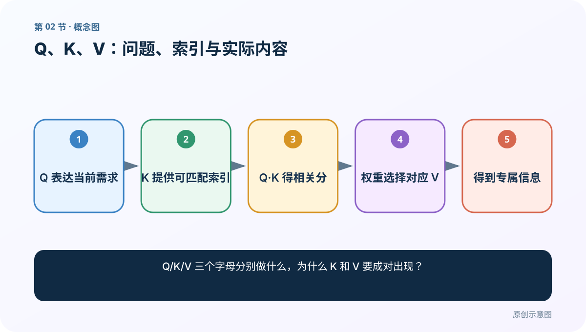
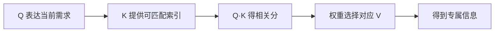
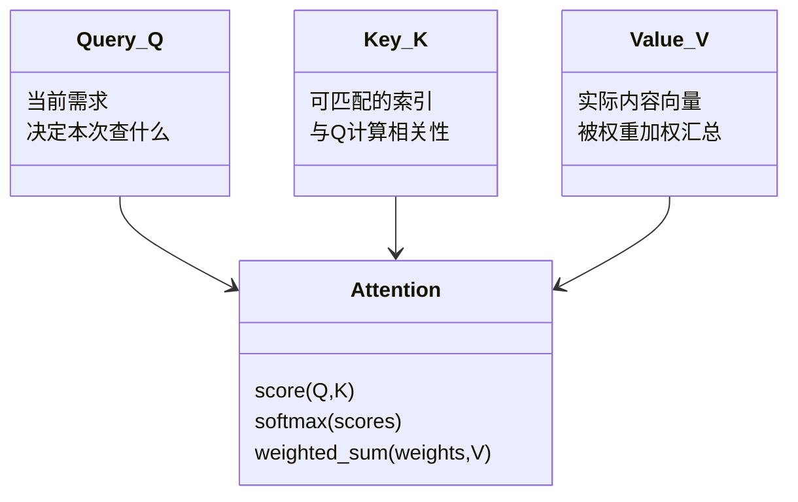
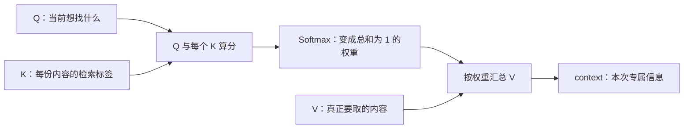
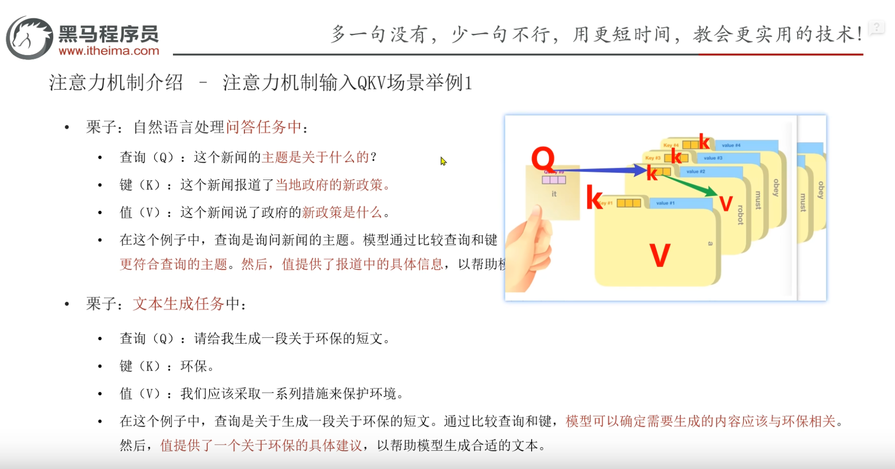

# 第 2 节：Q、K、V：问题、索引与实际内容

> 笔记编号 2/14 · 对应原视频 P67 · [打开这一集](https://www.bilibili.com/video/BV14mdfBDE4Q?p=67)

[← 上一节：1 注意力机制介绍：把有限精力分给更相关的信息](./01-attention-introduction.md) · [返回总目录](./README.md) · [下一节：3 注意力实现步骤：算分、归一化、加权求和 →](./03-attention-steps.md)

## 这节解决什么问题

Q/K/V 三个字母分别做什么，为什么 K 和 V 要成对出现？



图从左向右读。先跟着数据或推理过程走一遍，再学习下面的术语。

## 辅助流程图



### Q、K、V 的职责 UML



### 注意力的三步主流程



## 零基础精讲：先把这一节真正弄懂

### 老师课堂这张 QKV 场景图必须保留



这张图承担的是“先建立角色直觉”的任务。请先点图片右下角的“放大查看”阅读原图，再看下面的校正说明。图中的文件夹类比可以帮助记住 **Q 负责提出当前需求，K 负责参与匹配，V 负责提供实际内容**；但它不是在声称神经网络内部真的存着文字标签和文件夹。

### 先别背字母：把一次注意力想成“带目录的资料桌”

桌上摆着三份资料。每份资料有两部分：封面标签和正文内容。

| 资料位置 | 封面标签：K | 正文：V |
|---|---|---|
| 1 | 环保 | 减少一次性塑料、植树、节能 |
| 2 | 金融 | 利率变化与企业融资 |
| 3 | 科技 | 新型电池的研究进展 |

现在有人提出需求：“请生成一段关于环保的短文。”这份需求就是 Q。模型先让 Q 与三个 K 都比较，得到“这份资料对当前问题有多相关”的分数；再把分数变成权重，最后用权重混合三个 V。于是：

```text
Q 决定：这一轮正在找什么
K 决定：每个候选位置与 Q 有多匹配
V 决定：该位置真正贡献什么内容
```

这里最容易被一句话带偏：**K 不是最终答案，Q·K 的结果也不是答案。** Q 与 K 只产生权重；真正被汇总并送到下一层的是 V。

### 把老师图中的两种任务逐句读懂

#### 场景一：问答——“这个新闻的主题是关于什么的？”

- **Q**：当前问题“这篇新闻的主题是什么”。它表达这一轮要寻找的东西。
- **K**：新闻各位置或各条记录的可匹配表示。课堂把“报道了当地政府的新政策”当成容易检索的标签。
- **V**：与这些 K 一一对应的实际信息，例如政策的具体内容。
- **结果**：Q 与所有 K 比较后，政策相关位置得到较大权重；这些权重再作用到对应 V，形成回答当前问题所需的上下文。

老师口头说“找到 K 再找到 V”，是检索类比。标准软注意力通常不会只拿最高分的一条 V，而是把所有允许位置的 V 按权重加权求和。

#### 场景二：生成——“请生成一段关于环保的短文”

- **Q**：生成需求，核心词是“生成、环保、短文”。老师借此提醒：理解题目要抓决定任务的关键词，不要机械背整句话。
- **K**：候选资料的主题表示，例如环保、金融、体育、科技。
- **V**：每份候选资料真正携带的内容，例如环保位置中的具体措施。
- **结果**：环保 K 与 Q 更匹配，其对应 V 的贡献较大，生成模块由此获得更适合当前主题的内容表示。

这个例子只负责解释分工。在现代 Transformer 中，Q/K/V 通常是向量，而且生成每个 token 时会重新计算；它并不是先从人工建立的“环保资料库”取出一段固定答案。

### 用一组确定数字亲手算完一次

为了让计算能手算，假设只有一个查询、三个候选位置，向量只有两维：

```text
Q  = [1.0, 0.0]
K₁ = [1.0, 0.0]    环保
K₂ = [0.0, 1.0]    金融
K₃ = [0.6, 0.4]    科技中的节能电池
```

先用点积计算 Q 与每个 K 的匹配分：

```text
scores = [Q·K₁, Q·K₂, Q·K₃]
       = [1.0, 0.0, 0.6]
```

再做 Softmax，得到约 `[0.491, 0.181, 0.329]`。它们不是“各取正文的 49.1%、18.1%、32.9% 字符”，而是分别乘对应的 V 向量。若：

```text
V₁ = [1.0, 0.0]
V₂ = [0.0, 1.0]
V₃ = [0.8, 0.2]
```

则输出为：

```text
context = 0.491V₁ + 0.181V₂ + 0.329V₃
        ≈ [0.754, 0.246]
```

这就是老师后半段“0.8 乘一个向量、0.1 再乘另一个向量，然后相加”的准确含义：注意力混合的是向量，不是裁剪文章文本。

### 从一条查询推广到真正的张量

先定义符号：`B` 是批大小，`Lq` 是查询数，`Lk` 是候选位置数，`Dk` 是 Q/K 的匹配维，`Dv` 是 V 的内容维。

| 张量 | 形状 | 含义 |
|---|---|---|
| Q | `[B,Lq,Dk]` | 每个查询位置想找什么 |
| K | `[B,Lk,Dk]` | 每个候选位置拿什么参与匹配 |
| V | `[B,Lk,Dv]` | 每个候选位置真正提供什么内容 |
| scores | `[B,Lq,Lk]` | 每个 Q 对每个 K 的匹配分 |
| weights | `[B,Lq,Lk]` | 在 `Lk` 轴归一化后的权重 |
| output | `[B,Lq,Dv]` | 每个查询得到的 V 加权和 |

K 与 V 必须有相同的候选位置数 `Lk`，因为 `weights[..., i]` 必须乘到 `V[..., i, :]`。Q 与 K 的最后一维要能参与匹配；输出的最后一维则由 V 的 `Dv` 决定。

Transformer 的缩放点积注意力把这条规则写成：

```text
Attention(Q,K,V) = softmax(QKᵀ / √Dk) V
```

原始论文把注意力定义为“一个 query 和一组 key-value 对映射到输出”，并明确输出是 values 的加权和。缩放、Mask 和多头会在后续课程继续拆解。技术依据见 [《Attention Is All You Need》3.2 节](https://arxiv.org/abs/1706.03762)。

### 类比到真实模型时，必须跨过这四道边界

1. **Q 不一定是一句问句。** 自注意力里，每个 token 位置都会产生自己的 Q。
2. **K 不一定是人工标签。** 它通常由隐藏向量乘可学习矩阵 `W_K` 得到；V 同理由 `W_V` 得到。
3. **同源不等于相同。** 自注意力常写成 `Q=XW_Q`、`K=XW_K`、`V=XW_V`；三者来自同一个 X，但投影矩阵不同，数值和职责都不同。
4. **K 本身不保证省计算。** 课堂“先查标签比逐字读正文省事”是帮助理解的检索类比。标准密集注意力仍会让 Q 与所有 K 计算分数；它的核心价值是把“匹配依据”和“被汇总内容”分开，而不是凭空跳过所有候选。

### 自注意力和交叉注意力中，Q/K/V 从哪里来

| 场景 | Q 来自 | K、V 来自 | 大白话 |
|---|---|---|---|
| Encoder 自注意力 | 源序列 | 同一源序列 | 每个源词查询整句 |
| Decoder 因果自注意力 | 目标前缀 | 同一目标前缀 | 每个位置只查询自己和过去 |
| Encoder–Decoder 交叉注意力 | Decoder 当前状态 | Encoder 输出 memory | 当前目标位置查询源句 |

所以“Q 是问题、K 是索引、V 是内容”是一套职责说明；谁来扮演这三个角色，要看注意力发生在哪一层。

## 老师原声整理稿（按讲解顺序）

### 0:00–2:49　先写下老师要求记住的总句，再区分三个角色

老师承接上一节，指出 Q、K、V 是注意力机制中最重要的三个概念。他先纠正自己的口误，再让学生在本子上记一句总括：三者“分工明确、协同完成聚焦关键信息的任务”。

随后老师依次规定角色：Q（Query）是当前要解决的问题或任务需求，也可理解为触发这次注意力计算的需求向量；K（Key）是用来与 Q 匹配的索引，要与 Q 计算相似度；V（Value）是最终想获取和汇总的实际内容。相似度越高，说明对应位置越值得当前任务关注。

### 2:49–5:47　文件夹与文章类比：一个 K 必须对应一个 V

老师把“帮我找与环保相关的素材”写成 Q，并在桌面上画出多份文章。每篇文章左上角有一个主题、标题或分类标签，这个标签类比 K；文章正文类比 V。Q 不直接逐字阅读所有正文，而先与各个 K 比较，再沿着匹配程度找到相应 V。

他反复强调“一篇文章有一个 K，也有一个对应 V”“一个 K 对一个 V”，目的不是规定现实文章只能有一个标签，而是让学生记住位置对齐：第 i 个 K 产生的权重必须作用在第 i 个 V 上。老师又说加入 K 是为了减少匹配运算；编辑校正是，这在倒排索引或两阶段检索中可以成立，但标准密集注意力仍与所有 K 打分，不能把类比直接当复杂度结论。

### 5:47–8:45　课件中的问答与文本生成两套场景

老师明确说“这个图要留着”，然后沿课件逐项辨认。问答场景里，“这个新闻的主题是什么”是 Q；“新闻报道了当地政府的新政策”充当可匹配的 K；政策的具体内容充当 V。Q 与 K 的匹配告诉模型哪些位置更相关，V 才提供回答所需的实际信息。

文本生成场景里，“请生成一段关于环保的短文”是 Q。老师把它继续压缩成“生成、环保、短文”几个关键词，并顺带提醒学生：背面试题也不要逐字死记，要先抓决定含义的关键词。候选 K 可以类比为环保、金融、新闻、体育等主题；找到环保相关 K 后，还必须使用它对应的 V，单有标题无法组成短文。

### 8:45–10:44　再换一个科学新闻问题，并总结 QKV 的本质

老师又提出“这篇文章的内容主要是什么”，并以“介绍了最新的科学发现”为候选信息，继续让学生练习先用 Q 与 K 算相似度。他提到点积、欧氏距离、余弦相似度都可以形成某种匹配规则；具体使用哪一种要看注意力实现，不能混成同一个公式。

随后老师要求写下 QKV 核心逻辑：Query 表达当前任务需求；Key 与 Query 计算相似度，帮助定位相关信息；Value 作为实际内容，根据相似度形成最终输出。这个总结保留了职责主线，但“定位”不能被理解成数据库只返回唯一记录。

### 10:44–13:51　从‘选中一条’推进到按 0.8/0.1/0.1 混合多个 V

老师在最后一步补上了软注意力最关键的细节：与 Q 相关的 K 往往不只一个。假设三个位置的比例是 0.8、0.1、0.1，就分别用这些标量乘三个位置的 V 向量，再把结果相加。0.8 不是截取某篇文章 80% 的文字，而是乘在该位置的数值向量上。

因此当前查询得到的输出每次可能不同：Q 变化会改变与各 K 的分数，权重随之变化，最终混合出的 V 也变化。老师在这里暂不要求学生已经会矩阵运算，因为下一集 P68 会正式拆“先算权重、再加权求和”的实现过程。

## 完整原声逐段记录

[查看本节按时间戳整理的完整音轨转写](./transcripts/p067.md)

逐段记录用于核查老师讲解是否遗漏；正文会进一步纠正口误和语音识别中的技术术语。

## 零基础先记住

- Q 提出当前需求；K 参与匹配；V 提供被汇总的实际内容
- 每个 K_i 必须与 V_i 保持位置对应
- 标准软注意力会混合多条 V，而不是数据库式只返回一条
- 自注意力中的 Q/K/V 可同源，但由不同投影得到

## 最小可运行代码

下面代码默认从项目根目录运行；专题配套实现见 [attention_from_scratch 配套实现](../../attention_from_scratch/README.md)。

```python
import torch

q = torch.tensor([[1.0, 0.0]])
k = torch.tensor([[[1.0, 0.0], [0.0, 1.0], [0.6, 0.4]]])
v = torch.tensor([[[1.0, 0.0], [0.0, 1.0], [0.8, 0.2]]])

scores = torch.bmm(k, q.unsqueeze(-1)).squeeze(-1)
weights = torch.softmax(scores, dim=-1)
context = torch.bmm(weights.unsqueeze(1), v).squeeze(1)

print("scores:", scores)
print("weights:", weights, "sum:", weights.sum(-1))
print("context:", context)
```

### 输入和输出怎么看

`scores` 的形状是 `[1,3]`，对应一个 Q 与三个 K 的分数；`weights` 约为 `[0.491,0.181,0.329]` 且总和为 1；`context` 的形状是 `[1,2]`，约为 `[0.754,0.246]`，最后一维跟 V 的内容维一致。

## 最容易踩的坑

不要把课件中的“标签—正文”类比照搬成模型实现：K/V 通常都是学习得到的向量。也不要把最高分当成唯一答案；除非使用硬选择，软注意力会用所有未被 mask 的 V 做加权和。

## 本节知识链

`Q 表达当前需求 → K 提供可匹配索引 → Q·K 得相关分 → 权重选择对应 V → 得到专属信息`

## 自测

**问题：若 K₁ 的权重是 0.8，却把 V₁ 和 V₂ 的顺序互换，会发生什么？为什么 Q/K/V 来自同一个 X 时仍不能说三者相同？**

<details>
<summary>点开核对答案</summary>

0.8 会错误地乘到原本属于 K₂ 的内容上，K 与 V 的对应关系被破坏。自注意力虽从同一 X 出发，但通常分别乘 W_Q、W_K、W_V；来源相同不代表投影结果或职责相同。

</details>

## 学完检查

- [ ] 我能用自己的话复述老师的讲解顺序
- [ ] 我能在运行前预测关键输出或张量形状
- [ ] 我知道这节方法最容易用错的地方
- [ ] 我能独立回答自测题

[← 上一节：1 注意力机制介绍：把有限精力分给更相关的信息](./01-attention-introduction.md) · [返回总目录](./README.md) · [下一节：3 注意力实现步骤：算分、归一化、加权求和 →](./03-attention-steps.md)
