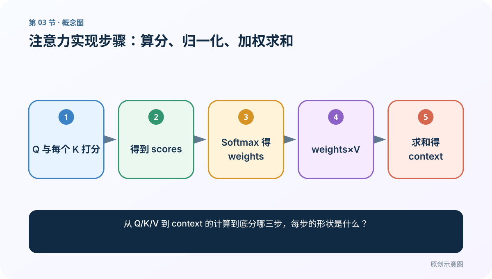
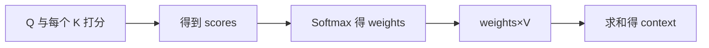
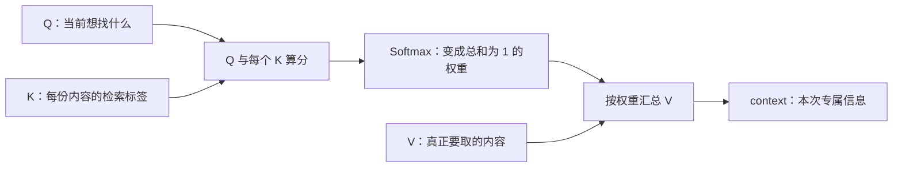
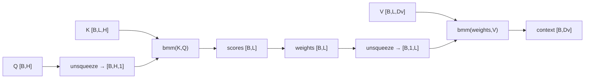
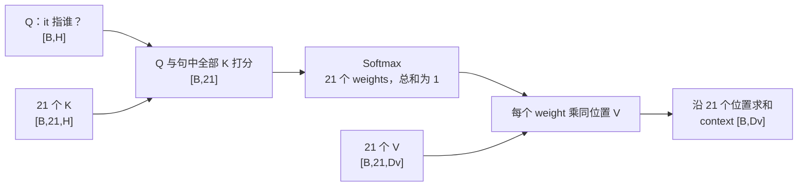

# 第 3 节：注意力实现步骤：算分、归一化、加权求和

> 笔记编号 3/14 · 对应原视频 P68 · [打开这一集](https://www.bilibili.com/video/BV14mdfBDE4Q?p=68)

[← 上一节：2 Q、K、V：问题、索引与实际内容](./02-qkv-introduction.md) · [返回总目录](./README.md) · [下一节：4 Seq2Seq 任务：编码器把输入交给解码器逐词生成 →](./04-seq2seq-task.md)

## 这节解决什么问题

从 Q/K/V 到 context 的计算到底分哪三步，每步的形状是什么？



图从左向右读。先跟着数据或推理过程走一遍，再学习下面的术语。

## 辅助流程图



### 注意力的三步主流程



### 单查询注意力的形状链



## 零基础精讲：把老师的 `it` 例子完整算成 Attention

### 老师究竟在问什么

课堂句子的核心结构可以压缩成：

```text
A robot must obey the orders given it by human beings,
except where such orders would conflict with the First Law.
```

老师问：`it` 指谁？正确理解需要把 `it` 放回整句，重点查看 `robot` 等相关位置，而不能只研究 `it` 自己的词向量。

在课堂类比里：

- `Q`：当前问题——“`it` 指代谁？”
- `K`：句中每个 token 用来参与匹配的表示。
- `V`：每个 token 真正可贡献给输出的内容表示。

原句约有 21 个 token，就应有约 21 个 K、21 个对应 V，也会产生 21 个分数和 21 个权重。课件只写出 0.5、0.3、0.19 等较大数字，是为了让图能看清；**真实计算不能因为某些数很小就假装那些位置不存在**，除非它们被 mask 或实现确实采用稀疏选择。

### 一张图看清老师的两步



老师把它总结为两个动作：**先算权重，再加权求和。** 为了和代码术语对齐，可以拆成三个可检查的小步骤：

1. `scores = score(Q,K)`：每个 Q 与所有 K 计算原始相关分。
2. `weights = softmax(scores)`：沿候选位置轴归一化。
3. `context = Σ weights_i × V_i`：给对应 V 加权并沿位置轴求和。

第二种拆法多写了 Softmax，并不与老师的“两步”冲突：老师把“打分与归一化”合称为算权重。

### 不要把 score 和 weight 当成同一个东西

老师口头有时把 0.5、0.3 直接称为“相似度分数”或“权重”。正式实现最好分开：

| 名称 | 允许的数值 | 是否总和为 1 | 用途 |
|---|---:|---:|---|
| `scores` | 任意实数 | 否 | 表示 Q 与各 K 的原始兼容程度 |
| `weights` | 通常在 0 到 1 之间 | 是 | 直接乘对应的 V |
| `context` | 一个向量 | 不适用 | 汇总后交给后续网络 |

例如 `scores=[2,1,0]`，Softmax 不是简单除以 3，而是：

```text
exp(scores) = [7.389, 2.718, 1.000]
weights     = [0.665, 0.245, 0.090]
```

分数相差 1，不表示权重也只差 1；Softmax 比较的是指数后的相对大小。

### 用二维 V 手算加权求和，而不是只算一个标量

假设三个候选位置的 V 是：

```text
V₁ = [10, 0]
V₂ = [ 0,20]
V₃ = [ 5, 5]
```

逐位置相乘：

```text
0.665V₁ = [6.65, 0.00]
0.245V₂ = [0.00, 4.90]
0.090V₃ = [0.45, 0.45]
```

再把三个向量按列相加：

```text
context ≈ [7.10, 5.35]
```

这正是老师反复解释“0.5 乘 `robot` 的词向量、0.3 乘另一个位置的词向量，再相加”的意思。乘的是数值向量，不是单词字符串，也不是从文章中截取 50% 的文字。

### 每一步的形状为什么这样变化

先看课堂的一条查询版本：

```text
Q        [B,H]
K        [B,L,H]
V        [B,L,Dv]
scores   [B,L]       ← 每个查询对 L 个候选各有一个分数
weights  [B,L]       ← 形状不变，只在 L 轴归一化
context  [B,Dv]      ← L 被加权求和消失，V 的内容维 Dv 保留
```

若句子有 21 个 token，`L=21`。Q/K 的最后一维必须满足打分规则；V 的最后一维可以是另一个 `Dv`，最终输出宽度由 V 决定。

多个查询同时计算时，只需再保留查询长度 `Lq`：

```text
Q [B,Lq,Dk] × Kᵀ [B,Dk,Lk] → scores [B,Lq,Lk]
weights [B,Lq,Lk] × V [B,Lk,Dv] → output [B,Lq,Dv]
```

### “普通 Q 升级成更强大的 Q”应该怎样准确理解

这是老师帮助初学者建立直觉的说法：原来只拿 `it` 自己的表示做后续判断，现在得到的向量融合了 `robot` 等相关上下文，因此更容易做指代消解。

但在严格记号里，Attention 的输出是 **V 的加权和**，通常叫 `context`、`attention output` 或上下文表示；它不等于原始 Q，也不是把 Q 的数字原地修改。某些网络会再把 `context` 与 Q 拼接、相加或做残差连接，那是 Attention 之后的模块设计。

### 软注意力、硬注意力、自注意力不是同一条分类轴

老师先用数值帮助区分：软注意力可以出现 0.5、0.3 等连续权重，硬注意力更像 0/1 离散选择。更准确地说：

- **软注意力**：对多个 V 做连续、通常可微的加权和。
- **硬注意力**：离散选取一个或少量位置，训练方式可能不同。
- **自注意力**：描述 Q、K、V 的来源——它们来自同一序列。

因此自注意力完全可以是软注意力。不能把“软、硬、自”理解成三个互斥选项。

### Mask 必须放在 Softmax 前

padding 或未来位置不能参与权重分配时，应在 Softmax 前把对应 score 设为极小值。Softmax 后这些位置的权重才接近或等于 0。若先做 Softmax，再直接把若干权重清零而不重新归一化，剩余权重的总和就不再是 1。

### 关于老师后半段几个扩展例子的边界

- “注意力比普通 Q 更强”表示它提供了任务相关上下文，不保证每次都找对指代。
- “注意力减少计算”不能当成通用结论；标准密集注意力仍会比较所有 Q–K 位置。
- 老师用聊天模型“每若干轮压缩一次对话”帮助理解信息聚合，但不同产品的上下文管理、摘要和缓存策略并不相同，不能据此断言某个具体产品内部怎样实现。
- Attention 是网络前向传播中的一个模块，不是能独立完成分类、翻译或生成的完整模型。

## 老师原声整理稿（按讲解顺序）

### 0:00–2:53　老师先给出“两步版”，并说明权重数由候选数决定

老师开场直接把实现压成两步。第一步，用 Query 向量和 Key 向量计算相似度，得到注意力权重分布；第二步，用权重分布乘内容的向量形式，也就是对应的 Value，再把结果合起来。

他特意追问：课件为什么只写 0.8、0.1、0.1 三个数？因为示意场景只有三个候选位置。如果有 30 个词，就应产生 30 个权重。每个权重必须乘自己的 V：第一个数乘第一个 V，第二个数乘第二个 V，不能错位。老师也再次强调，文字本身不能和 0.8 相乘，真正参与计算的是文字的向量表示。

这一段还第一次说“普通 Q 变成更强大的 Q”：经过注意力后，送往后续网络的不再只有孤立问题，而是融合了相关内容的表示。严格术语应称 `attention output` 或 `context`；“增强 Q”是课堂直觉。

### 2:53–7:48　`it` 指代谁：21 个词就有 21 组 K/V 与 21 个权重

老师读出机器人三定律风格的句子，并问其中 `it` 指谁。他先用“小明来到商店，他买了一斤苹果”帮助学生理解代词必须借上下文消解，然后把 `it` 当作 Q。

句子约有 21 个词，所以每个词都提供一个 K；`it` 的 Q 要和全部 21 个 K 逐一计算匹配，得到 21 个分数。每个位置同时还有自己的 Value vector，分数转成权重后再乘对应 V。老师在图里只留下 0.5、0.3、0.19 等几个较大的数，因为它们合计约 0.99，其他数太小不便展示；编辑补充是实际密集计算仍包含那些小权重。

老师反复沿箭头解释：先拿 `it` 与每个 word 的 K 打分，再拿每个分数乘左侧同位置的 V。这个重复是本节最重要的连线检查，不能压成一句“QK 后乘 V”就跳过。

### 7:48–9:46　软、硬、自注意力，以及“它只是一个前向环节”

老师根据权重形式区分软注意力和硬注意力：连续的 0.5、0.3 属于软权重，0/1 式离散选择更接近硬注意力，并说课程实践会更多使用软注意力。他随后预告自注意力，但此处不展开。

这里需要补上一条分类边界：软/硬描述怎样分配权重，自注意力描述 Q/K/V 是否来自同一序列，两条分类轴可以同时成立。

老师还提醒不要把 Attention 神化成完整模型。它只是前向传播中的一个加权汇总环节，负责改变信息怎样流向后续网络；分类器、Decoder 或其他任务头才使用这份结果完成具体任务。

### 9:47–16:42　重新画图后，老师要求同时会说“大白话版”和“专业版”

虽然学生已经看过一次，老师仍重新整理板书，因为他担心大家只会看图、不会自己表达。他要求先写一句本质总结：“先算权重，再加权求和。”

第一步的大白话版是：用当前问题 Q 和**所有**索引 K 做对比，计算每个索引与问题的相关程度，得到一组重要性系数。老师多次强调“所有”，避免学生误以为只与某一个 K 比。

专业版是：Query 向量与每个 Key 向量通过选定的兼容函数计算 score，再得到 attention weights。课堂提到点积、余弦相似度和欧氏距离等可能方式；编辑校正是它们是不同的打分设计，不能在同一个公式里随意互换。课程后面会分别讲常见规则。

老师回到 `it` 示例，口头列出它与 `robot`、`a` 等位置的 0.5、0.3 分数，为第二步作准备。这些数字是教学假设，不是从预训练模型真实计算得到的实验结果。

### 16:42–23:39　第二步：attention weights 与对应 Value 做加权求和

老师把第一步的权重称作每份内容的“重要程度系数”：给每个 V 按系数加权，再把所有向量相加，得到最终聚焦结果。专业说法是 `attention weights` 与对应 `value vectors` 加权求和。

他特意纠正“0.5 乘 robot”这句话：不是让数字乘英文单词，而是 `0.5 × robot 的向量`。同理，0.3 乘另一个位置的 V，所有结果相加才得到最终输出向量。

老师把结果先称 `attention output`，又提示后面 Seq2Seq 架构中会看到“中间语义张量 C”或 `context`。他在屏幕上移动并重新排版例图的过程不需要逐鼠标复刻，但目的必须保留：把 Q、每个 K 的分数、同位置 V 与最终求和结果放在同一张图中，检查对应关系。

### 23:39–29:30　动态加权聚合、上下文增强与指代消解

排完图后，老师要求再做总结：注意力的本质是动态加权聚合，使模型自动识别输入中哪些信息与当前任务最相关；输出不再是孤立词向量，而是融合句中相关信息的上下文增强向量。

他继续用 `it` 说明为什么称为“增强”：只把 `it` 的原始词向量送下去，很难知道它指代谁；若输出融合了 `robot` 等上下文，后续网络就获得更多判断证据。老师把这称为从普通 Q 升级成更强大的 Q，并说模型据此完成指代消解。

编辑边界是：Attention 提供有利证据，不保证一定正确解决指代；而且输出在数学上是 V 的加权和，不等于原始 Q 本身。网络是否再与 Q 融合，要看外层结构。

### 29:30–34:25　应用范围、RNN 对比和两个延伸类比

老师把注意力概括为深度学习中常见的信息分配技术：针对当前任务，把更多权重给更有辨识度的部分。随后预告 Transformer 中还会遇到自注意力、多头注意力和 masked 多头注意力。

他再次与 RNN 对比：循环网络按时间步传递状态，长距离信息可能衰减；注意力允许当前查询直接重新查看多个位置。这里应避免把“有 Attention”直接等同于“整个模型都可并行”，因为是否可并行还取决于有没有循环、自回归依赖和具体架构。

老师又用聊天模型压缩多轮对话、以及根据姓氏 `HANG` 缩小国家候选范围作类比，想说明“先找到相关范围，再把精力放到重点上”。这些例子保留为思路延伸，但不能据此断言某个具体聊天产品固定每 10 轮摘要一次，也不能说标准 Attention 会真正删除其他候选。

### 34:25–37:25　三道课堂检查题，以及为什么每个翻译步都要重算

老师最后安排三道选择题：

1. 注意力在自然语言处理中做什么？——帮助模型对输入不同部分动态分配关注。
2. Q/K/V 分别是什么？——Q 表达查询，K 参与匹配，V 提供实际内容。
3. 注意力如何改善机器翻译？——让生成不同目标词时，能动态调整对源句不同位置的关注程度。

为了回答第三题，他重新拿 `welcome to Wuhan` 举例：生成“欢迎”时的权重可以示意为 0.8/0.1/0.1；生成下一个词时，Q 已经变化，权重可能变成 0.3/0.5/0.2。每生成一个词都要用当前 Q 与所有 K 重新打分，得到新的 context。这正是“动态”二字，不能把第一步算出的权重整句复用。

## 完整原声逐段记录

[查看本节按时间戳整理的完整音轨转写](./transcripts/p068.md)

逐段记录用于核查老师讲解是否遗漏；正文会进一步纠正口误和语音识别中的技术术语。

## 零基础先记住

- scores 不是概率
- Softmax 要沿输入位置维
- context 维度跟 V 的内容维度走

## 最小可运行代码

下面代码默认从项目根目录运行；专题配套实现见 [attention_from_scratch 配套实现](../../attention_from_scratch/README.md)。

```python
import torch

q = torch.tensor([[1.0, 0.0]])
k = torch.tensor([[[2.0, 0.0], [1.0, 0.0], [0.0, 1.0]]])
v = torch.tensor([[[10.0, 0.0], [0.0, 20.0], [5.0, 5.0]]])

scores = torch.bmm(k, q.unsqueeze(-1)).squeeze(-1)
weights = torch.softmax(scores, dim=-1)
weighted_values = weights.unsqueeze(-1) * v
context = weighted_values.sum(dim=1)

print("scores:", scores)
print("weights:", weights, "sum:", weights.sum(-1))
print("weighted values:\n", weighted_values)
print("context:", context)
```

### 输入和输出怎么看

`scores=[2,1,0]`；`weights` 约为 `[0.665,0.245,0.090]`，总和为 1；三行 `weighted_values` 分别是三个权重乘对应 V；最后沿候选位置轴求和，得到 `context≈[7.102,5.345]`。形状依次为 `[1,3]`、`[1,3]`、`[1,3,2]`、`[1,2]`。

## 最容易踩的坑

Q 和 K 的匹配维必须满足所选打分规则；K 与 V 的候选位置数必须相同；V 的内容维可以不同。不要把 raw scores 当成概率，也不要把老师说的“增强 Q”误写成 `context == Q`。

## 本节知识链

`Q 与每个 K 打分 → 得到 scores → Softmax 得 weights → weights×V → 求和得 context`

## 自测

**问题：一句话有 21 个候选位置，课件只画出 3 个较大权重。实际密集软注意力会产生几个权重？输出为什么不是这 21 个权重本身？**

<details>
<summary>点开核对答案</summary>

会产生 21 个权重，每个候选位置一个。权重只是标量系数；还要让每个权重乘同位置的 V，再沿 21 个位置求和，最终得到内容维为 `Dv` 的 context 向量。

</details>

## 学完检查

- [ ] 我能用自己的话复述老师的讲解顺序
- [ ] 我能在运行前预测关键输出或张量形状
- [ ] 我知道这节方法最容易用错的地方
- [ ] 我能独立回答自测题

[← 上一节：2 Q、K、V：问题、索引与实际内容](./02-qkv-introduction.md) · [返回总目录](./README.md) · [下一节：4 Seq2Seq 任务：编码器把输入交给解码器逐词生成 →](./04-seq2seq-task.md)
