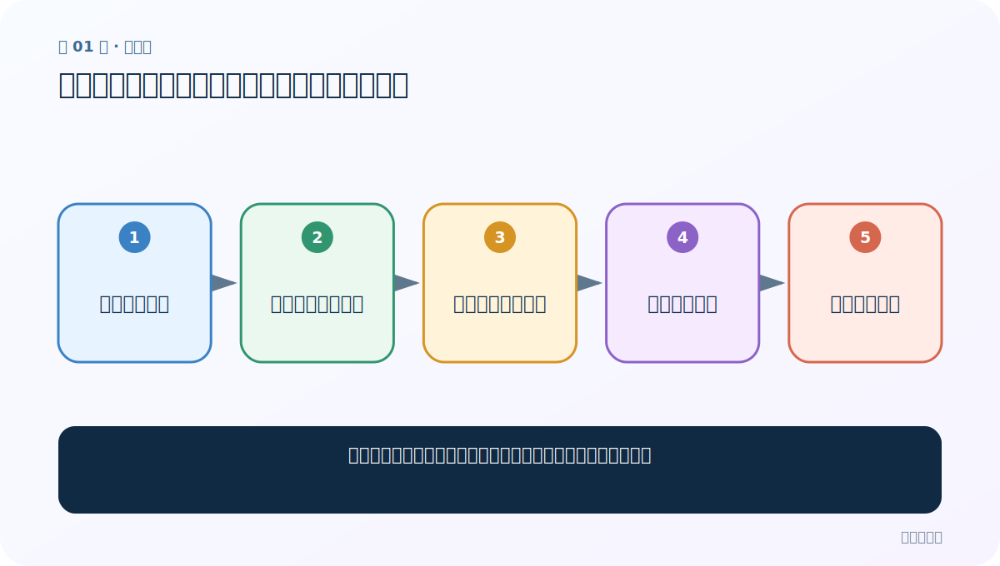
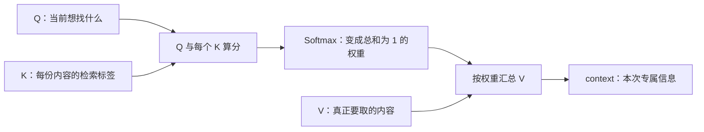

# 第 1 节：注意力机制介绍：把有限精力分给更相关的信息

> 笔记编号 1/14 · 对应原视频 P66 · [打开这一集](https://www.bilibili.com/video/BV14mdfBDE4Q?p=66)

← 已是第一节 · [返回总目录](./README.md) · [下一节：2 Q、K、V：问题、索引与实际内容 →](./02-qkv-introduction.md)

## 这节解决什么问题

模型面对一长串输入时，为什么不该把每个位置都看得一样重？



图从左向右读。先跟着数据或推理过程走一遍，再学习下面的术语。

## 辅助流程图


### 注意力的三步主流程



## 老师原声整理稿（按讲解顺序）

### 0:00–3:51　本章会学什么

老师先给路线：注意力概念、Q/K/V、实现步骤、Seq2Seq 中的用法、常见打分公式、bmm，再手写代码。注意力最早在机器翻译中大放异彩，随后成为 Transformer 的核心。

### 3:51–8:39　从人的视觉与学习说起

人看图片时不会逐像素平均观察，而会先看脸、标题或当前关心的物体。老师把它概括为：用有限精力从海量信息中筛出高价值部分。注意力不是只留下一个位置，而是给不同位置不同权重。

### 8:39–13:35　RNN 的长序列与串行局限

普通 RNN 依靠隐藏状态逐步压缩历史，序列很长时早期细节容易衰减，而且时间步必须串行。注意力让当前预测能直接回看编码器的多个位置，不必只依赖一个最终压缩状态。需要校正的是：注意力本身不自动让所有 Seq2Seq 计算完全并行；Transformer 去掉循环后才充分并行。

### 13:35–18:31　翻译时权重是动态的

以 “welcome to Wuhan” 为例：生成“欢迎”时更关注 welcome，生成“来”时更关注 to，生成“武汉”时更关注 Wuhan。每个目标词都重新得到一组权重；它们不是手写常数，而是训练学出的概率分布。

### 18:31–24:29　一句话总结

注意力让模型针对当前任务，对输入不同部分动态分配关注比例，再按比例汇总信息。软注意力给所有位置连续权重；硬注意力更像离散选择，后面单独区分。

## 完整原声逐段记录

[查看本节按时间戳整理的完整音轨转写](./transcripts/p066.md)

逐段记录用于核查老师讲解是否遗漏；正文会进一步纠正口误和语音识别中的技术术语。

## 零基础先记住

- 权重随当前查询动态变化
- 注意力缓解单一固定向量的信息瓶颈
- 权重表示模型内部贡献，不等同因果解释

## 最小可运行代码

下面代码默认从项目根目录运行；专题配套实现见 [attention_from_scratch 配套实现](../../attention_from_scratch/README.md)。

```python
scores = [2.0, 0.5, -1.0]
import torch
weights = torch.softmax(torch.tensor(scores), dim=0)
print(weights, weights.sum())
```

### 输入和输出怎么看

三个分数变成非负权重，且总和为 1；分数最高的位置权重最大。

## 最容易踩的坑

不要把注意力权重直接解释为“模型作决定的唯一原因”。

## 本节知识链

`大量输入信息 → 当前任务产生需求 → 计算各位置重要度 → 动态分配权重 → 汇总关键内容`

## 自测

**问题：生成不同目标词时，输入端的注意力权重会一样吗？**

<details>
<summary>点开核对答案</summary>

通常不一样；查询变了，相关性和权重也会重新计算。

</details>

## 学完检查

- [ ] 我能用自己的话复述老师的讲解顺序
- [ ] 我能在运行前预测关键输出或张量形状
- [ ] 我知道这节方法最容易用错的地方
- [ ] 我能独立回答自测题

← 已是第一节 · [返回总目录](./README.md) · [下一节：2 Q、K、V：问题、索引与实际内容 →](./02-qkv-introduction.md)
