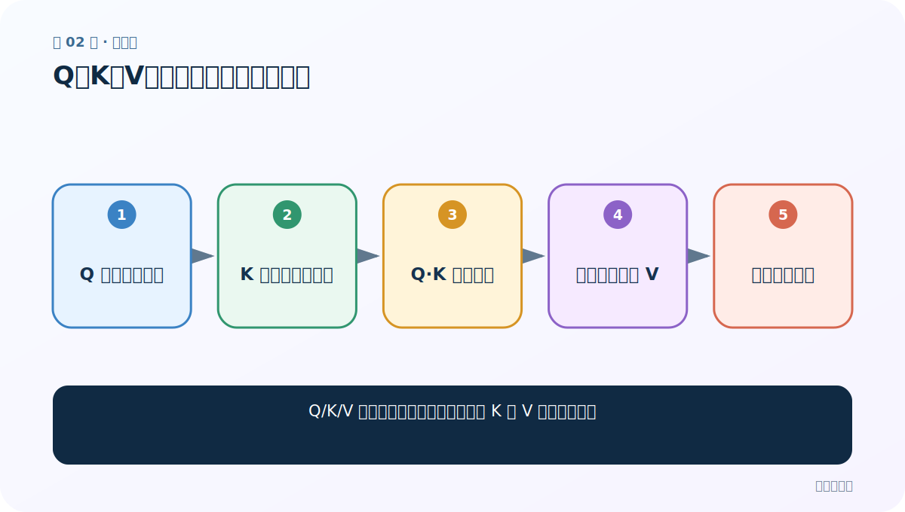
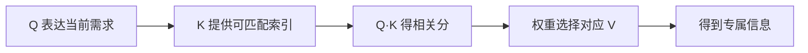
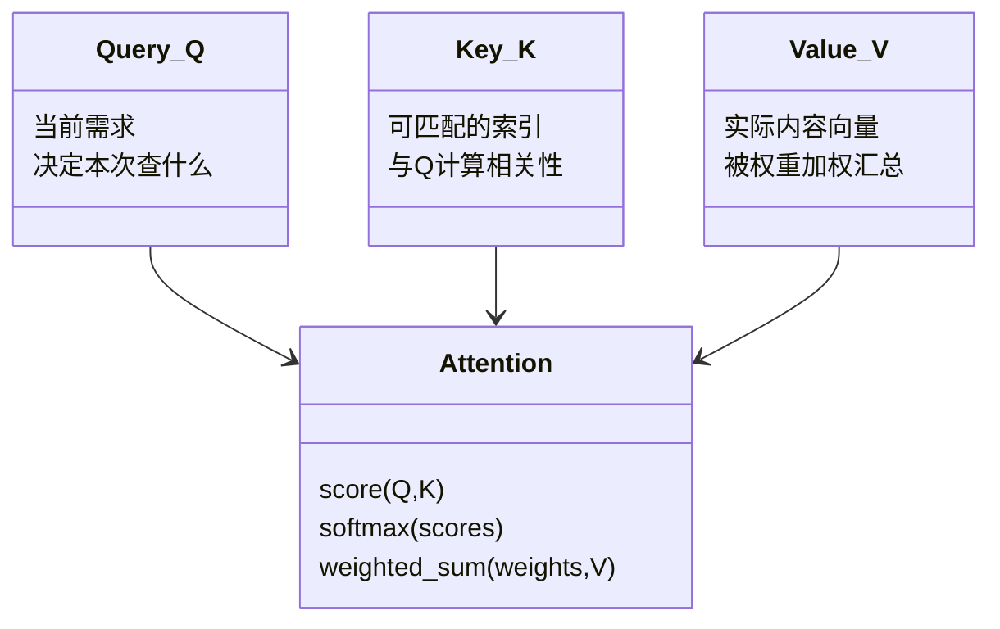
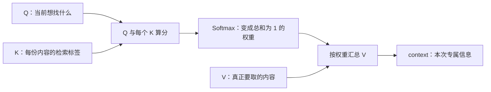

# 第 2 节：Q、K、V：问题、索引与实际内容

> 笔记编号 2/14 · 对应原视频 P67 · [打开这一集](https://www.bilibili.com/video/BV14mdfBDE4Q?p=67)

[← 上一节：1 注意力机制介绍：把有限精力分给更相关的信息](./01-attention-introduction.md) · [返回总目录](./README.md) · [下一节：3 注意力实现步骤：算分、归一化、加权求和 →](./03-attention-steps.md)

## 这节解决什么问题

Q/K/V 三个字母分别做什么，为什么 K 和 V 要成对出现？



图从左向右读。先跟着数据或推理过程走一遍，再学习下面的术语。

## 辅助流程图



### Q、K、V 的职责 UML



### 注意力的三步主流程



## 老师原声整理稿（按讲解顺序）

### 0:00–2:49　三个角色

老师要求先记大白话：Q 是当前要解决的问题；K 是用来与 Q 匹配的索引；V 是匹配后真正取出的内容。它们分工协作完成“聚焦关键信息”。

### 2:49–6:45　文章搜索类比

Q 是搜索词，K 可以是每篇文章的标题/标签，V 是文章内容。先比较 Q 与所有 K，标题越相关，对应文章 V 的权重越高。K 与 V 的序列位置必须一一对应。

### 6:45–10:44　翻译中的 Q/K/V

解码器当前隐藏状态常充当 Q；编码器每个位置的隐藏状态常同时充当 K 和 V。Q 与每个 K 算分，再用概率加权所有 V，得到当前目标词专用的 context。

### 10:44–13:51　不是数据库查找

注意力通常不是只取最高 K 对应的一条 V，而是软加权求和。Q/K/V 的维度可以通过不同线性层投影，三者也不要求原始来源完全不同。

## 完整原声逐段记录

[查看本节按时间戳整理的完整音轨转写](./transcripts/p067.md)

逐段记录用于核查老师讲解是否遗漏；正文会进一步纠正口误和语音识别中的技术术语。

## 零基础先记住

- Q=需求，K=匹配索引，V=实际内容
- K_i 与 V_i 必须位置对应
- 软注意力会混合多条 V

## 最小可运行代码

下面代码默认从项目根目录运行；专题配套实现见 [attention_from_scratch 配套实现](../../attention_from_scratch/README.md)。

```python
items = [{"key":"财经", "value":"财经文章全文"}, {"key":"汽车", "value":"汽车文章全文"}]
query = "买车"
print(query, [x["key"] for x in items])
```

### 输入和输出怎么看

示例把检索需求、可匹配标签和真实内容分开。

## 最容易踩的坑

V 不是 Q 与 K 的相似度；相似度只负责产生 V 的权重。

## 本节知识链

`Q 表达当前需求 → K 提供可匹配索引 → Q·K 得相关分 → 权重选择对应 V → 得到专属信息`

## 自测

**问题：为什么不能打乱 V 的顺序而保留 K 不动？**

<details>
<summary>点开核对答案</summary>

每个 K 的权重会套到错误内容 V 上，索引与内容失去对应。

</details>

## 学完检查

- [ ] 我能用自己的话复述老师的讲解顺序
- [ ] 我能在运行前预测关键输出或张量形状
- [ ] 我知道这节方法最容易用错的地方
- [ ] 我能独立回答自测题

[← 上一节：1 注意力机制介绍：把有限精力分给更相关的信息](./01-attention-introduction.md) · [返回总目录](./README.md) · [下一节：3 注意力实现步骤：算分、归一化、加权求和 →](./03-attention-steps.md)
