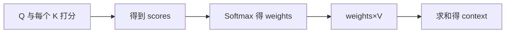
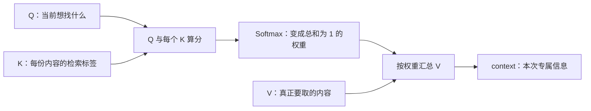
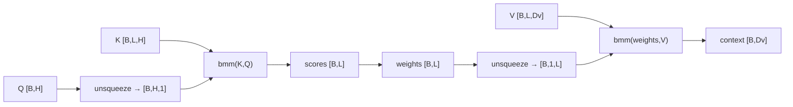

# 第 3 节：注意力实现步骤：算分、归一化、加权求和

> 笔记编号 3/14 · 对应原视频 P68 · [打开这一集](https://www.bilibili.com/video/BV14mdfBDE4Q?p=68)

[← 上一节：2 Q、K、V：问题、索引与实际内容](./02-qkv-introduction.md) · [返回总目录](./README.md) · [下一节：4 Seq2Seq 任务：编码器把输入交给解码器逐词生成 →](./04-seq2seq-task.md)

## 这节解决什么问题

从 Q/K/V 到 context 的计算到底分哪三步，每步的形状是什么？


图从左向右读。先跟着数据或推理过程走一遍，再学习下面的术语。

## 辅助流程图



### 注意力的三步主流程



### 单查询注意力的形状链



## 老师原声整理稿（按讲解顺序）

### 0:00–9:46　先把注意力放回前向传播：它是加权环节，不是整个模型

老师先区分软注意力和硬注意力。软注意力不会只留下一个位置，而是给多个位置连续权重，例如 0.5、0.3、0.1；硬注意力更接近只选择极少数位置。课程后面还会讲自注意力，但本节先把最通用的计算骨架讲清楚。

这里最重要的边界是：注意力机制只是前向传播中的一个环节，不等于一套能独立完成所有任务的模型。它接收查询、索引和内容，完成一次动态加权汇总，再把增强后的表示交给后续网络。把这层边界立住，后面看到 Attention、Self-Attention 或 Multi-Head Attention 时才不会把不同层次混在一起。

### 9:47–16:42　第一步：让 Q 与所有 K 比较，得到权重分布

老师把计算概括成两句话：先算权重，再做加权求和。第一步不能只拿 Q 和某一个 K 比，而是让当前问题 Q 与所有索引 K 逐一计算相关程度，得到一组分数。相似度可以用点积、余弦相似度等方式，具体公式可以变化，但“一个查询对应所有候选位置的一组分数”不变。

课堂继续使用句子中的 eat 作查询：eat 的向量要分别与 robot、a 等位置的 K 比较，可能得到 0.5、0.3 等权重。数字本身只是演示，真正想隔离的变量是“哪些位置和当前问题更相关”。K 与 V 必须保持位置对应，否则给 K 算出的权重会套到错误内容上。

原始相关性分数还不一定是概率。实际实现通常再用 Softmax 把它变成非负且总和为 1 的 attention weights；归一化必须沿候选位置维完成，不能误写到 batch 或特征维。

### 16:42–23:39　第二步：用权重乘对应 V，再把结果相加

拿到权重后，老师把它解释成每份内容的重要程度系数。每个权重乘同一位置的 V 向量，再把所有乘积相加，得到本次注意力的输出。专业表达就是“attention weights 与对应 value 向量做加权求和”。

例如 robot 的权重是 0.5，就用 0.5 乘 robot 对应的 V；a 的权重是 0.3，就用 0.3 乘它的 V，最后把各项相加。这里相加的是向量，不是把单词文本直接相加。输出向量的内容维度跟 V 一致，而权重数组的长度跟候选位置数一致。

老师把这个输出称为 attention output，后续架构中也常称 context。名字不同，作用相同：它把分散在多个位置的信息压成一份与当前查询相关的表示。

### 23:39–30:29　为什么说输出是“增强后的 Q”

老师随后解释注意力真正改变了什么。过去若只把 eat 自己的词向量送给后续网络，模型能利用的上下文有限；注意力输出则融合了整句中与 eat 最相关的信息。因此它不再是孤立的单词向量，而可以理解为一份上下文增强表示。

课堂用指代消解说明这个差别：模型通过权重判断 it 更可能指向 robot，再把相关内容汇总到输出中。这个例子不是说注意力天然就能百分之百消解所有指代，而是说明动态加权能为后续预测提供比单个词向量更完整的证据。

老师反复强调“普通 Q 升级成更强大的 Q”，指的正是这一步：查询本身提出需求，K 决定如何匹配，V 提供真正内容，最终输出综合了全句最相关的信息。

### 30:29–37:25　回到翻译与长上下文：权重会随当前任务动态变化

课程最后把注意力与 RNN 对比。循环网络按时间顺序传递状态，长距离信息可能逐步衰减；注意力允许当前步骤直接对所有候选位置重新分配权重。它不能自动消除全部计算成本，也不是“其他位置完全不看”，但能让模型把更多容量放到当前最相关的信息上。

在机器翻译中，每生成一个目标词，解码器状态都会变化，因此 Q 也变化。生成“欢迎”时，源句中 Welcome 的权重可能最高；生成“武汉”时，权重会重新分配到 Wuhan。老师用这个例子说明注意力不是一次算完后全句共用，而是可以在每个生成步骤重新计算专属 context。

本节最终应能完整复述：Q 与所有 K 计算分数，Softmax 得到权重，权重与对应 V 加权求和，输出上下文增强表示。后面的多头和自注意力虽然结构更复杂，仍建立在这条主线上。

## 完整原声逐段记录

[查看本节按时间戳整理的完整音轨转写](./transcripts/p068.md)

逐段记录用于核查老师讲解是否遗漏；正文会进一步纠正口误和语音识别中的技术术语。

## 零基础先记住

- scores 不是概率
- Softmax 要沿输入位置维
- context 维度跟 V 的内容维度走

## 最小可运行代码

下面代码默认从项目根目录运行；专题配套实现见 [attention_from_scratch 配套实现](../../attention_from_scratch/README.md)。

```python
import torch
q=torch.randn(2,8); k=torch.randn(2,5,8); v=torch.randn(2,5,6)
scores=torch.bmm(k,q.unsqueeze(-1)).squeeze(-1)
w=torch.softmax(scores,dim=-1)
context=torch.bmm(w.unsqueeze(1),v).squeeze(1)
print(scores.shape,w.shape,context.shape)
```

### 输入和输出怎么看

scores/weights=[2,5]，context=[2,6]。

## 最容易踩的坑

Q 和 K 的匹配维必须相同；V 的内容维可以不同。

## 本节知识链

`Q 与每个 K 打分 → 得到 scores → Softmax 得 weights → weights×V → 求和得 context`

## 自测

**问题：有 5 个输入词时，一个查询会有几个注意力权重？**

<details>
<summary>点开核对答案</summary>

5 个，每个输入位置一个。

</details>

## 学完检查

- [ ] 我能用自己的话复述老师的讲解顺序
- [ ] 我能在运行前预测关键输出或张量形状
- [ ] 我知道这节方法最容易用错的地方
- [ ] 我能独立回答自测题

[← 上一节：2 Q、K、V：问题、索引与实际内容](./02-qkv-introduction.md) · [返回总目录](./README.md) · [下一节：4 Seq2Seq 任务：编码器把输入交给解码器逐词生成 →](./04-seq2seq-task.md)
