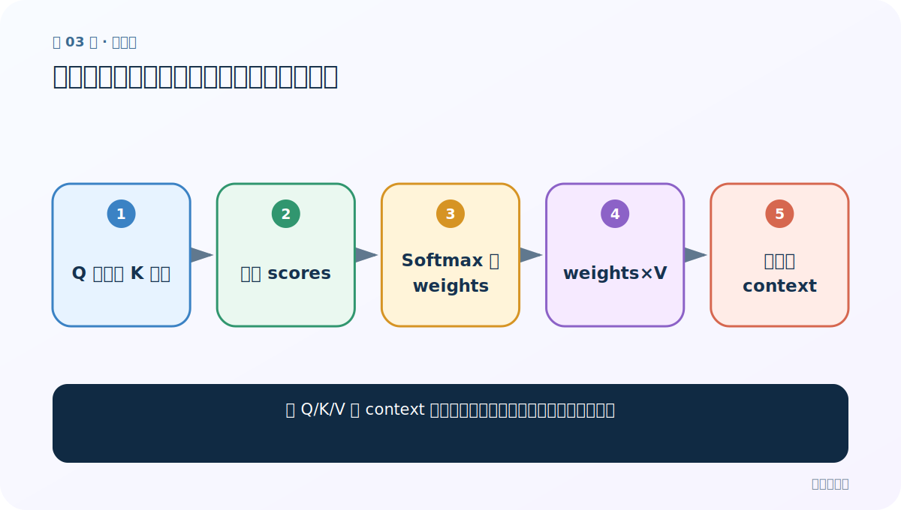
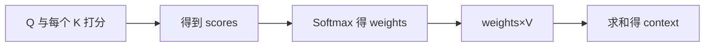
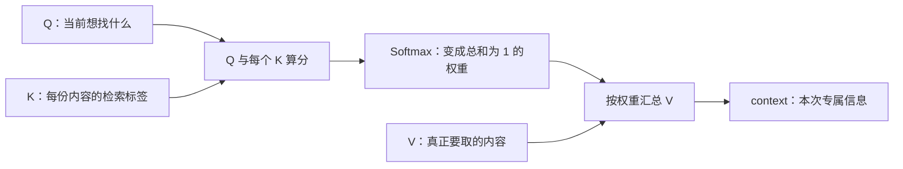
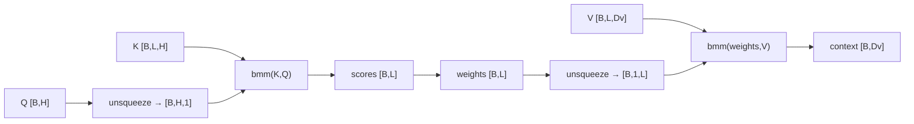

# 第 3 节：注意力实现步骤：算分、归一化、加权求和

> 笔记编号 3/14 · 对应原视频 P68 · [打开这一集](https://www.bilibili.com/video/BV14mdfBDE4Q?p=68)

[← 上一节：2 Q、K、V：问题、索引与实际内容](./02-qkv-introduction.md) · [返回总目录](./README.md) · [下一节：4 Seq2Seq 任务：编码器把输入交给解码器逐词生成 →](./04-seq2seq-task.md)

## 这节解决什么问题

从 Q/K/V 到 context 的计算到底分哪三步，每步的形状是什么？



图从左向右读。先跟着数据或推理过程走一遍，再学习下面的术语。

## 辅助流程图



### 注意力的三步主流程



### 单查询注意力的形状链



## 老师原声整理稿（按讲解顺序）

### 0:00–6:57　第一步：匹配分

对一个 Q 与 L 个 K 分别计算相关性，得到 L 个 scores。可用点积、线性拼接、加法网络等。分数可正可负，尚不是概率。

### 6:57–13:57　第二步：Softmax

沿 L 个输入位置做 Softmax，得到非负且和为 1 的 weights。维度一定是序列位置维；若写错 dim，可能在 batch 或特征维归一化。

### 13:57–22:57　第三步：加权求和

每个 weight_i 乘对应 V_i，再把 L 项相加，得到一个 context。context 的最后维度等于 V 的特征维 D_v。

### 22:57–30:58　为什么能训练

初始权重可能乱，但预测损失通过反向传播更新打分函数和前面编码器，让与任务更相关的位置逐步得到更合适权重。

### 30:58–37:25　零基础形状口诀

单查询：Q[B,H]，K[B,L,H]，scores/weights[B,L]，V[B,L,Dv]，context[B,Dv]。B 是批量，L 是输入长度，H 是匹配维度，Dv 是内容维度。

## 完整原声逐段记录

[查看本节按时间戳整理的完整音轨转写](./transcripts/p068.md)

逐段记录用于核查老师讲解是否遗漏；正文会进一步纠正口误和语音识别中的技术术语。

## 零基础先记住

- scores 不是概率
- Softmax 要沿输入位置维
- context 维度跟 V 的内容维度走

## 最小可运行代码

下面代码默认从项目根目录运行；专题配套实现见 [attention_from_scratch 配套实现](../../attention_from_scratch/README.md)。

```python
import torch
q=torch.randn(2,8); k=torch.randn(2,5,8); v=torch.randn(2,5,6)
scores=torch.bmm(k,q.unsqueeze(-1)).squeeze(-1)
w=torch.softmax(scores,dim=-1)
context=torch.bmm(w.unsqueeze(1),v).squeeze(1)
print(scores.shape,w.shape,context.shape)
```

### 输入和输出怎么看

scores/weights=[2,5]，context=[2,6]。

## 最容易踩的坑

Q 和 K 的匹配维必须相同；V 的内容维可以不同。

## 本节知识链

`Q 与每个 K 打分 → 得到 scores → Softmax 得 weights → weights×V → 求和得 context`

## 自测

**问题：有 5 个输入词时，一个查询会有几个注意力权重？**

<details>
<summary>点开核对答案</summary>

5 个，每个输入位置一个。

</details>

## 学完检查

- [ ] 我能用自己的话复述老师的讲解顺序
- [ ] 我能在运行前预测关键输出或张量形状
- [ ] 我知道这节方法最容易用错的地方
- [ ] 我能独立回答自测题

[← 上一节：2 Q、K、V：问题、索引与实际内容](./02-qkv-introduction.md) · [返回总目录](./README.md) · [下一节：4 Seq2Seq 任务：编码器把输入交给解码器逐词生成 →](./04-seq2seq-task.md)
