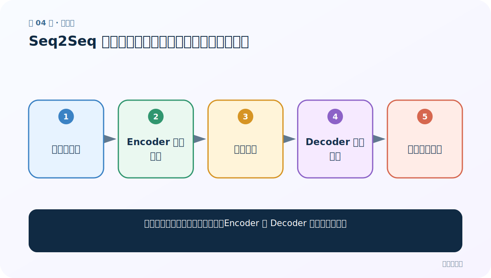
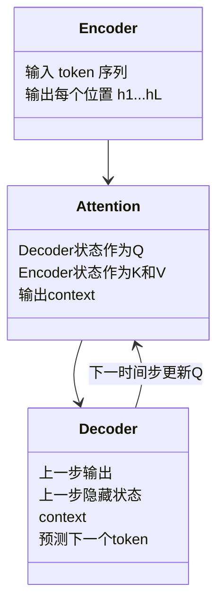

# 第 4 节：Seq2Seq 任务：编码器把输入交给解码器逐词生成

> 笔记编号 4/14 · 对应原视频 P69 · [打开这一集](https://www.bilibili.com/video/BV14mdfBDE4Q?p=69)

[← 上一节：3 注意力实现步骤：算分、归一化、加权求和](./03-attention-steps.md) · [返回总目录](./README.md) · [下一节：5 Seq2Seq 加入注意力：每个目标词拥有自己的 context →](./05-seq2seq-with-attention.md)

## 这节解决什么问题

输入和输出长度不同的翻译任务，Encoder 与 Decoder 各自负责什么？



图从左向右读。先跟着数据或推理过程走一遍，再学习下面的术语。

## 辅助流程图


### Encoder、Attention、Decoder 的模块关系



## 老师原声整理稿（按讲解顺序）

### 0:00–5:59　句子到句子的任务

老师用机器翻译说明 Seq2Seq：输入 N 个词，输出 M 个词，N 与 M 可以不同。也可用于摘要、对话等。

### 5:59–12:55　Encoder

编码器逐词读取源句，产生隐藏状态。普通框架常只把最终状态压成固定中间向量 C 交给解码器。

### 12:55–21:53　Decoder

解码器用 C、上一步隐藏状态和上一步生成词预测下一词。训练时常用真实上一词（teacher forcing），推理时只能使用自己刚生成的词。

### 21:53–29:56　固定向量瓶颈

所有源句信息都塞进一个 C，长句容易丢细节。注意力的动机正是让解码器每一步直接查看全部编码器状态。

### 29:56–33:59　边界符

实际序列需要 SOS/EOS/PAD 等特殊 token，解码从 SOS 开始，生成 EOS 停止。

## 完整原声逐段记录

[查看本节按时间戳整理的完整音轨转写](./transcripts/p069.md)

逐段记录用于核查老师讲解是否遗漏；正文会进一步纠正口误和语音识别中的技术术语。

## 零基础先记住

- Encoder 读源句，Decoder 生成目标句
- N 与 M 不必相等
- 训练与推理的上一词来源不同

## 最小可运行代码

下面代码默认从项目根目录运行；专题配套实现见 [attention_from_scratch 配套实现](../../attention_from_scratch/README.md)。

```python
source=["welcome","to","Wuhan"]
target=["欢迎","来","武汉","<EOS>"]
print(len(source),len(target))
```

### 输入和输出怎么看

源长 3、目标长 4，说明 Seq2Seq 不要求等长。

## 最容易踩的坑

不能用目标句未来词帮助当前推理，否则发生信息泄漏。

## 本节知识链

`源语言序列 → Encoder 状态序列 → 中间表示 → Decoder 逐步生成 → 目标语言序列`

## 自测

**问题：解码为什么需要 EOS？**

<details>
<summary>点开核对答案</summary>

输出长度未知，模型用 EOS 表示生成结束。

</details>

## 学完检查

- [ ] 我能用自己的话复述老师的讲解顺序
- [ ] 我能在运行前预测关键输出或张量形状
- [ ] 我知道这节方法最容易用错的地方
- [ ] 我能独立回答自测题

[← 上一节：3 注意力实现步骤：算分、归一化、加权求和](./03-attention-steps.md) · [返回总目录](./README.md) · [下一节：5 Seq2Seq 加入注意力：每个目标词拥有自己的 context →](./05-seq2seq-with-attention.md)
