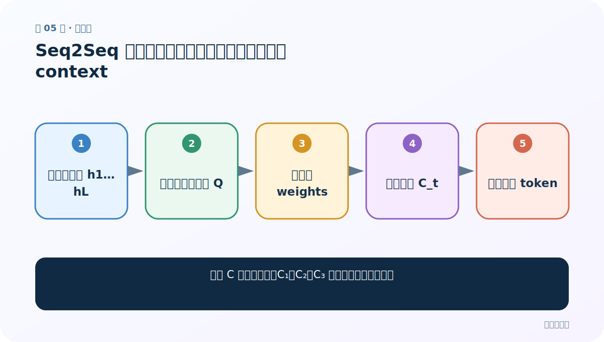
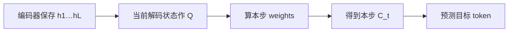
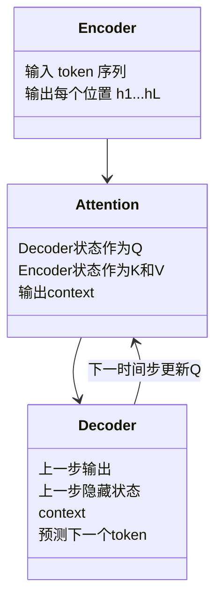
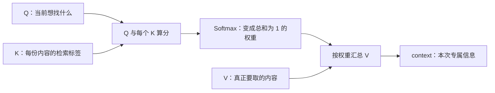

# 第 5 节：Seq2Seq 加入注意力：每个目标词拥有自己的 context

> 笔记编号 5/14 · 对应原视频 P70 · [打开这一集](https://www.bilibili.com/video/BV14mdfBDE4Q?p=70)

[← 上一节：4 Seq2Seq 任务：编码器把输入交给解码器逐词生成](./04-seq2seq-task.md) · [返回总目录](./README.md) · [下一节：6 普通 Encoder-Decoder：一个 C 服务所有解码步骤 →](./06-plain-encoder-decoder.md)

## 这节解决什么问题

固定 C 为什么不够，C₁、C₂、C₃ 又怎样随解码步变化？



图从左向右读。先跟着数据或推理过程走一遍，再学习下面的术语。

## 辅助流程图



### Encoder、Attention、Decoder 的模块关系



### 注意力的三步主流程



## 老师原声整理稿（按讲解顺序）

### 0:00–4:58　固定 C 的问题

普通 Encoder-Decoder 每次预测都使用同一个 C，等于认为所有源词对所有目标词贡献相同。长句信息被挤进一个向量。

### 4:58–9:58　动态 C_t

加入注意力后，第 1、2、3 个目标词分别使用 C_1、C_2、C_3。每个 C_t 都由当前解码状态与编码器各位置重新打分得到。

### 9:58–14:57　翻译对齐直觉

生成“欢迎”时 welcome 权重大，生成“来”时 to 权重大；但仍会给其他词小权重以处理短语、一词多义和语序变化。

### 14:57–18:03　计算闭环

Decoder 状态→Q；Encoder 状态→K/V；Softmax 得权重；加权 V 得 C_t；Decoder 用 C_t 和历史生成新词，下一步状态再形成新 Q。

## 完整原声逐段记录

[查看本节按时间戳整理的完整音轨转写](./transcripts/p070.md)

逐段记录用于核查老师讲解是否遗漏；正文会进一步纠正口误和语音识别中的技术术语。

## 零基础先记住

- 每个解码步都有独立 context
- 注意力是软对齐，不要求一一对应
- 当前 Decoder 状态决定本步查询

## 最小可运行代码

下面代码默认从项目根目录运行；专题配套实现见 [attention_from_scratch 配套实现](../../attention_from_scratch/README.md)。

```python
contexts=["C_欢迎","C_来","C_武汉"]
for step,c in enumerate(contexts,1): print(step,c)
```

### 输入和输出怎么看

三个目标时间步明确使用不同 context。

## 最容易踩的坑

注意力不要求源词数与目标词数相同。

## 本节知识链

`编码器保存 h1…hL → 当前解码状态作 Q → 算本步 weights → 得到本步 C_t → 预测目标 token`

## 自测

**问题：为什么生成下一个词时权重会变化？**

<details>
<summary>点开核对答案</summary>

Decoder 状态和已生成历史变化，使 Q 变化。

</details>

## 学完检查

- [ ] 我能用自己的话复述老师的讲解顺序
- [ ] 我能在运行前预测关键输出或张量形状
- [ ] 我知道这节方法最容易用错的地方
- [ ] 我能独立回答自测题

[← 上一节：4 Seq2Seq 任务：编码器把输入交给解码器逐词生成](./04-seq2seq-task.md) · [返回总目录](./README.md) · [下一节：6 普通 Encoder-Decoder：一个 C 服务所有解码步骤 →](./06-plain-encoder-decoder.md)
