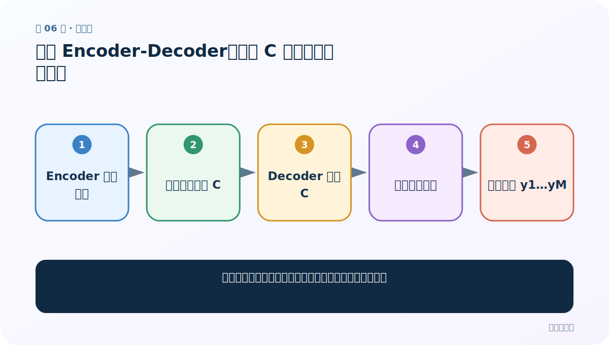
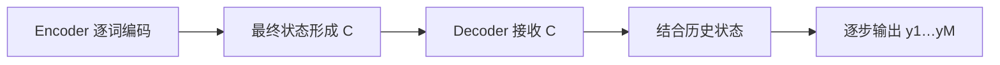
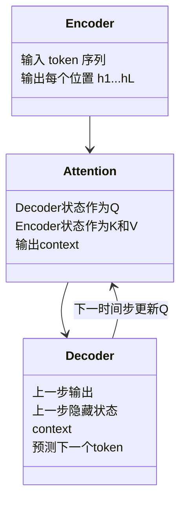

# 第 6 节：普通 Encoder-Decoder：一个 C 服务所有解码步骤

> 笔记编号 6/14 · 对应原视频 P71 · [打开这一集](https://www.bilibili.com/video/BV14mdfBDE4Q?p=71)

[← 上一节：5 Seq2Seq 加入注意力：每个目标词拥有自己的 context](./05-seq2seq-with-attention.md) · [返回总目录](./README.md) · [下一节：7 带注意力 Encoder-Decoder：从公式看 Cᵢ 怎样生成 →](./07-attentive-encoder-decoder.md)

## 这节解决什么问题

在加入注意力前，先准确看懂传统框架的信息流和瓶颈。



图从左向右读。先跟着数据或推理过程走一遍，再学习下面的术语。

## 辅助流程图



### Encoder、Attention、Decoder 的模块关系



## 老师原声整理稿（按讲解顺序）

### 0:00–3:58　编码器的非线性压缩

老师把 Encoder 看作 RNN/GRU：每步输入词向量并更新隐藏状态，最终得到固定中间语义向量 C。

### 3:58–6:55　解码器依赖 C 与历史

预测 y_1 用 C 与初始状态；预测 y_2 还要带 y_1 的信息；预测第 10 个词要带前 9 个生成历史。

### 6:55–8:11　关键判断

这仍没有注意力，因为每个解码步拿到的 C 完全相同。把普通框架看懂，才能看到后面唯一重要变化：C 从固定变为动态。

## 完整原声逐段记录

[查看本节按时间戳整理的完整音轨转写](./transcripts/p071.md)

逐段记录用于核查老师讲解是否遗漏；正文会进一步纠正口误和语音识别中的技术术语。

## 零基础先记住

- 普通框架只传固定 C
- Decoder 仍有自回归历史
- 固定 C 是主要信息瓶颈

## 最小可运行代码

下面代码默认从项目根目录运行；专题配套实现见 [attention_from_scratch 配套实现](../../attention_from_scratch/README.md)。

```python
fixed_c="same context"
print([fixed_c for _ in range(3)])
```

### 输入和输出怎么看

三个解码步拿到完全相同的 C。

## 最容易踩的坑

“没有注意力”不等于 Decoder 没有隐藏状态。

## 本节知识链

`Encoder 逐词编码 → 最终状态形成 C → Decoder 接收 C → 结合历史状态 → 逐步输出 y1…yM`

## 自测

**问题：普通 Seq2Seq 每步变化的是什么、不变的是什么？**

<details>
<summary>点开核对答案</summary>

Decoder 历史状态变化；传入的固定 C 不变。

</details>

## 学完检查

- [ ] 我能用自己的话复述老师的讲解顺序
- [ ] 我能在运行前预测关键输出或张量形状
- [ ] 我知道这节方法最容易用错的地方
- [ ] 我能独立回答自测题

[← 上一节：5 Seq2Seq 加入注意力：每个目标词拥有自己的 context](./05-seq2seq-with-attention.md) · [返回总目录](./README.md) · [下一节：7 带注意力 Encoder-Decoder：从公式看 Cᵢ 怎样生成 →](./07-attentive-encoder-decoder.md)
