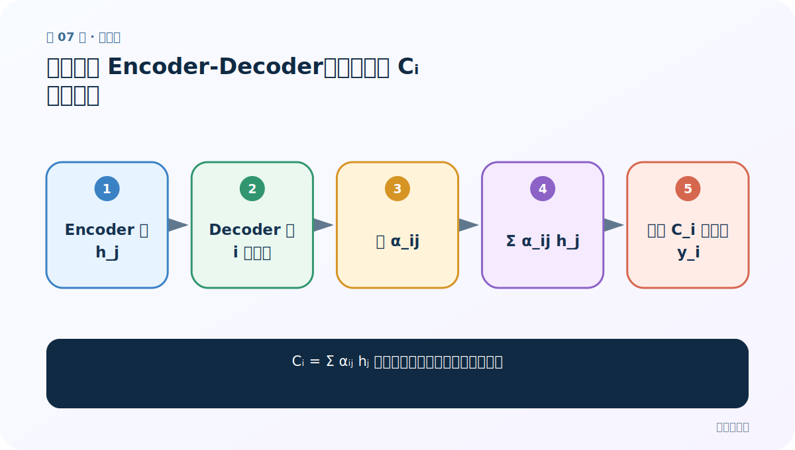
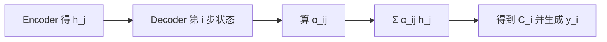
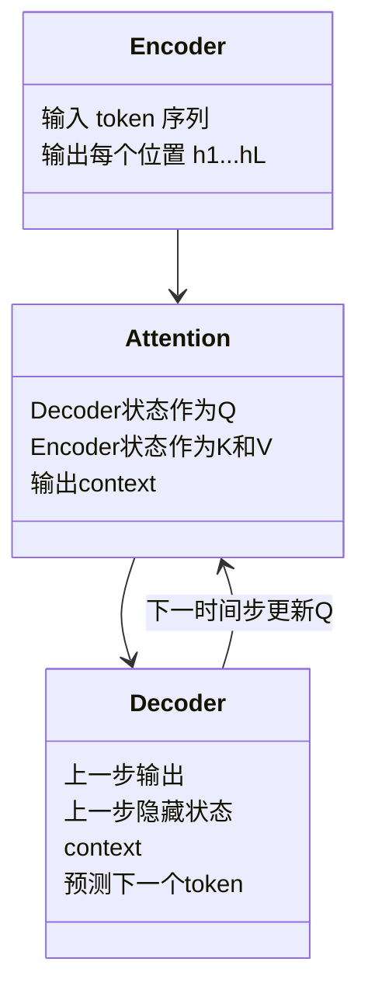
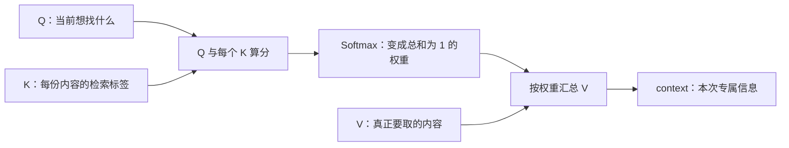

# 第 7 节：带注意力 Encoder-Decoder：从公式看 Cᵢ 怎样生成

> 笔记编号 7/14 · 对应原视频 P72 · [打开这一集](https://www.bilibili.com/video/BV14mdfBDE4Q?p=72)

[← 上一节：6 普通 Encoder-Decoder：一个 C 服务所有解码步骤](./06-plain-encoder-decoder.md) · [返回总目录](./README.md) · [下一节：8 注意力概率分布：Decoder 状态如何与所有 Encoder 状态比较 →](./08-attention-probabilities.md)

## 这节解决什么问题

Cᵢ = Σ αᵢⱼ hⱼ 中每个下标和函数到底表示什么？



图从左向右读。先跟着数据或推理过程走一遍，再学习下面的术语。

## 辅助流程图



### Encoder、Attention、Decoder 的模块关系



### 注意力的三步主流程



## 老师原声整理稿（按讲解顺序）

### 0:00–4:54　同一个翻译例子

老师用 Tom / chase / Jerry 展示：普通框架贡献相同不合理，注意力给三个源词 0.6/0.2/0.2 等权重。数字只是示意，真实权重由模型计算。

### 4:54–8:51　F1、F2、g 的大白话

F2 表示 Encoder 对源词的编码，得到 h_j；α_ij 表示生成第 i 个目标词时，第 j 个源位置的重要程度；g 是加权求和。F1 表示 Decoder 根据 C_i 与历史生成新词的规则。

### 8:52–14:50　公式逐项读

C_i = Σ_{j=1}^{Lx} α_ij h_j。Lx 是源句长度；h_j 是第 j 个源词的编码；α_ij 是本目标步对该源词的权重；求和后得到一个与源长度无关的固定维 context。

### 14:50–20:53　权重矩阵

若目标 3 步、源 3 词，所有 α 可排成 3×3 矩阵：每一行对应一个目标步，每行通常和为 1。不是说翻译只能 3 对 3。

### 20:53–24:40　C₁、C₂、C₃ 的关系

三个 context 使用相同计算规则，但 Decoder 查询不同，所以权重行不同，最终 C 不同。

## 完整原声逐段记录

[查看本节按时间戳整理的完整音轨转写](./transcripts/p072.md)

逐段记录用于核查老师讲解是否遗漏；正文会进一步纠正口误和语音识别中的技术术语。

## 零基础先记住

- i 指目标位置，j 指源位置
- 每个 C_i 是全部 h_j 的加权和
- 权重矩阵形状是 [目标长度,源长度]

## 最小可运行代码

下面代码默认从项目根目录运行；专题配套实现见 [attention_from_scratch 配套实现](../../attention_from_scratch/README.md)。

```python
import torch
alpha=torch.tensor([.6,.2,.2])
h=torch.tensor([[1.,0.],[0.,1.],[1.,1.]])
print(alpha @ h)
```

### 输入和输出怎么看

得到本目标步的 2 维 context：[0.8,0.4]。

## 最容易踩的坑

α_ij 是标量权重，h_j 是向量；不要把两者维度混为一谈。

## 本节知识链

`Encoder 得 h_j → Decoder 第 i 步状态 → 算 α_ij → Σ α_ij h_j → 得到 C_i 并生成 y_i`

## 自测

**问题：目标长 5、源长 3，注意力矩阵多大？**

<details>
<summary>点开核对答案</summary>

5×3，每个目标步一行、每个源位置一列。

</details>

## 学完检查

- [ ] 我能用自己的话复述老师的讲解顺序
- [ ] 我能在运行前预测关键输出或张量形状
- [ ] 我知道这节方法最容易用错的地方
- [ ] 我能独立回答自测题

[← 上一节：6 普通 Encoder-Decoder：一个 C 服务所有解码步骤](./06-plain-encoder-decoder.md) · [返回总目录](./README.md) · [下一节：8 注意力概率分布：Decoder 状态如何与所有 Encoder 状态比较 →](./08-attention-probabilities.md)
