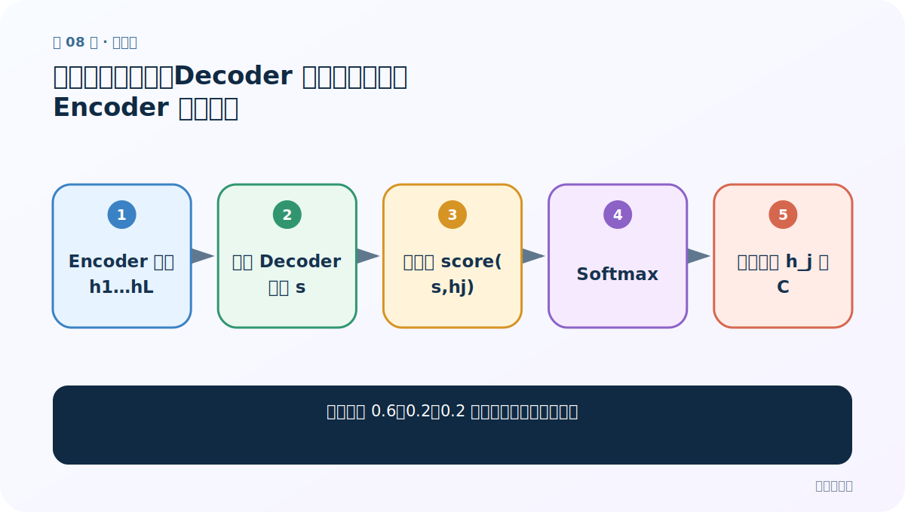
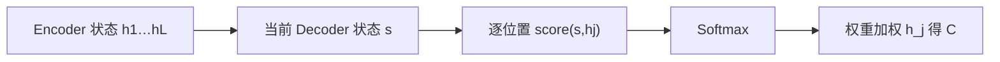
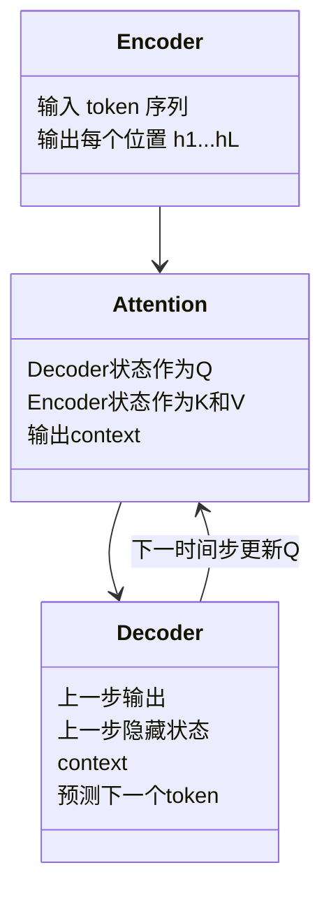
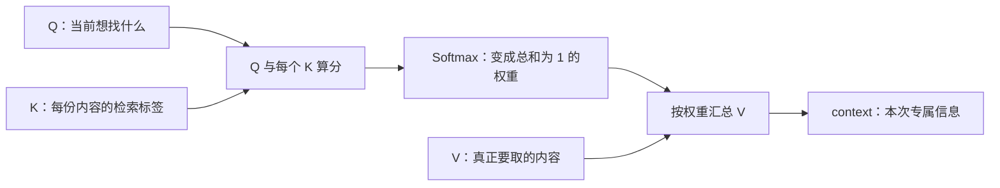

# 第 8 节：注意力概率分布：Decoder 状态如何与所有 Encoder 状态比较

> 笔记编号 8/14 · 对应原视频 P73 · [打开这一集](https://www.bilibili.com/video/BV14mdfBDE4Q?p=73)

[← 上一节：7 带注意力 Encoder-Decoder：从公式看 Cᵢ 怎样生成](./07-attentive-encoder-decoder.md) · [返回总目录](./README.md) · [下一节：9 软注意力、硬注意力与自注意力 →](./09-attention-types.md)

## 这节解决什么问题

示例里的 0.6、0.2、0.2 是怎样一步步算出来的？



图从左向右读。先跟着数据或推理过程走一遍，再学习下面的术语。

## 辅助流程图



### Encoder、Attention、Decoder 的模块关系



### 注意力的三步主流程



## 老师原声整理稿（按讲解顺序）

### 0:00–4:54　核心问题

老师明确要算的是：生成当前目标词时，应重点关注 Encoder 的哪些词。源长与目标长可以不同，不能靠位置硬对齐。

### 4:54–10:52　两边的隐藏状态

Encoder 每个 h_j 同时含当前词表示和左侧上下文；Decoder 当前 s_i 含已生成历史。注意力拿 s_i 与每个 h_j 比较。

### 10:52–13:42　第一、二步

score(s_i,h_j) 得到匹配分；把所有 j 的分数组成向量，经 Softmax 得 α_i1…α_iL。分数高的位置概率通常高。

### 13:44–16:42　第三步

用 α_ij 给 Encoder 状态加权求和得到专属 C_i。每个 Decoder 步的 s_i 不同，因此分数、概率、C_i 都会变。

### 16:42–21:22　面试式总结

一：当前 Decoder 状态与所有 Encoder 状态算匹配；二：Softmax 转成关注比例；三：用比例加权 Encoder 状态得到当前步 context，再交给 Decoder 生成词。

## 完整原声逐段记录

[查看本节按时间戳整理的完整音轨转写](./transcripts/p073.md)

逐段记录用于核查老师讲解是否遗漏；正文会进一步纠正口误和语音识别中的技术术语。

## 零基础先记住

- 源/目标不需要位置对齐
- Decoder 当前状态决定查询
- Softmax 权重沿源位置求和为 1

## 最小可运行代码

下面代码默认从项目根目录运行；专题配套实现见 [attention_from_scratch 配套实现](../../attention_from_scratch/README.md)。

```python
import torch
scores=torch.tensor([[2.0,.5,.5]])
weights=torch.softmax(scores,dim=-1)
print(weights,weights.sum(-1))
```

### 输入和输出怎么看

得到一行三列的概率，和为 1。

## 最容易踩的坑

Softmax 前的匹配分不需要位于 0~1。

## 本节知识链

`Encoder 状态 h1…hL → 当前 Decoder 状态 s → 逐位置 score(s,hj) → Softmax → 权重加权 h_j 得 C`

## 自测

**问题：为什么下一目标步要重新算概率？**

<details>
<summary>点开核对答案</summary>

Decoder 状态变了，代表当前需求的 Q 变了。

</details>

## 学完检查

- [ ] 我能用自己的话复述老师的讲解顺序
- [ ] 我能在运行前预测关键输出或张量形状
- [ ] 我知道这节方法最容易用错的地方
- [ ] 我能独立回答自测题

[← 上一节：7 带注意力 Encoder-Decoder：从公式看 Cᵢ 怎样生成](./07-attentive-encoder-decoder.md) · [返回总目录](./README.md) · [下一节：9 软注意力、硬注意力与自注意力 →](./09-attention-types.md)
