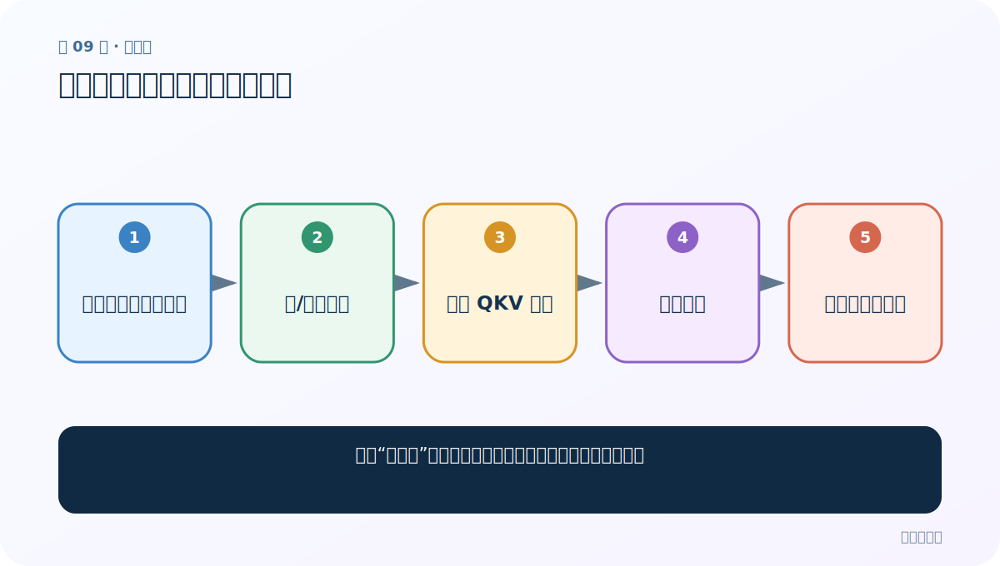
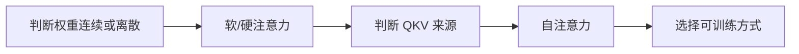
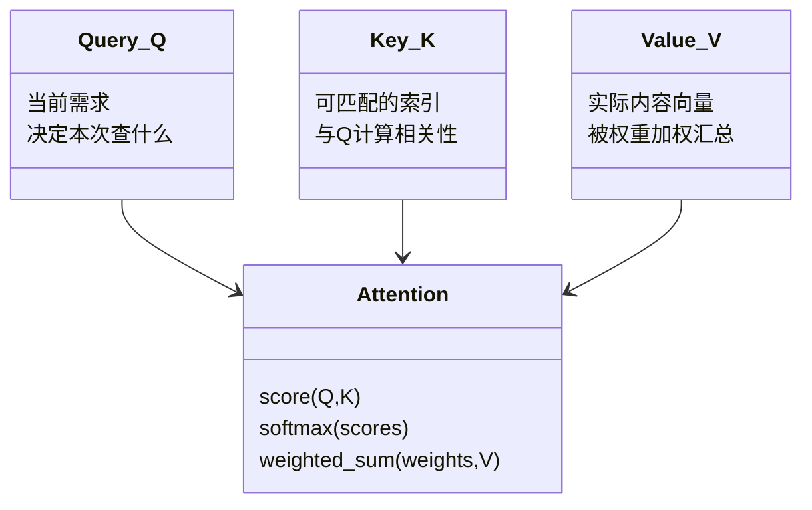

# 第 9 节：软注意力、硬注意力与自注意力

> 笔记编号 9/14 · 对应原视频 P74 · [打开这一集](https://www.bilibili.com/video/BV14mdfBDE4Q?p=74)

[← 上一节：8 注意力概率分布：Decoder 状态如何与所有 Encoder 状态比较](./08-attention-probabilities.md) · [返回总目录](./README.md) · [下一节：10 常见注意力计算规则：拼接式、加法式与缩放点积 →](./10-attention-scoring-rules.md)

## 这节解决什么问题

三种“注意力”名称分别按什么标准区分，最容易混在哪里？



图从左向右读。先跟着数据或推理过程走一遍，再学习下面的术语。

## 辅助流程图



### Q、K、V 的职责 UML



## 老师原声整理稿（按讲解顺序）

### 0:00–4:51　软注意力

前面一直使用软注意力：对所有源位置给连续权重，加权求和，整体可微，能用普通反向传播训练。

### 4:51–8:41　硬注意力

硬注意力更像选中一个/少数位置，权重近似 0/1。离散采样通常不可直接求导，训练可能需要强化学习、采样估计或可微近似。课程只作了解。

### 8:41–11:36　自注意力

自注意力按 Q/K/V 是否来自同一序列区分。常见 Q=XW_Q、K=XW_K、V=XW_V；来源相同但投影参数不同，所以“Q=K=V”更准确地说是来自同一 X，不一定数值完全相等。

### 11:36–14:54　两个维度别混

软/硬描述权重选择方式；自注意力描述信息来源。自注意力通常也是软注意力，因此这些名称不是互斥的同一分类表。

## 完整原声逐段记录

[查看本节按时间戳整理的完整音轨转写](./transcripts/p074.md)

逐段记录用于核查老师讲解是否遗漏；正文会进一步纠正口误和语音识别中的技术术语。

## 零基础先记住

- 软/硬看权重方式
- 自注意力看 QKV 来源
- 自注意力中的 Q/K/V 常由同一 X 不同投影得到

## 最小可运行代码

下面代码默认从项目根目录运行；专题配套实现见 [attention_from_scratch 配套实现](../../attention_from_scratch/README.md)。

```python
print("soft: [0.6,0.2,0.2]")
print("hard: [1,0,0]")
print("self: Q,K,V all projected from X")
```

### 输入和输出怎么看

三行分别显示分类依据。

## 最容易踩的坑

“Q=K=V”不代表经过 W_Q/W_K/W_V 后三个张量数值仍完全相同。

## 本节知识链

`判断权重连续或离散 → 软/硬注意力 → 判断 QKV 来源 → 自注意力 → 选择可训练方式`

## 自测

**问题：自注意力能同时也是软注意力吗？**

<details>
<summary>点开核对答案</summary>

可以，而且 Transformer 的常见自注意力就是连续 Softmax 权重。

</details>

## 学完检查

- [ ] 我能用自己的话复述老师的讲解顺序
- [ ] 我能在运行前预测关键输出或张量形状
- [ ] 我知道这节方法最容易用错的地方
- [ ] 我能独立回答自测题

[← 上一节：8 注意力概率分布：Decoder 状态如何与所有 Encoder 状态比较](./08-attention-probabilities.md) · [返回总目录](./README.md) · [下一节：10 常见注意力计算规则：拼接式、加法式与缩放点积 →](./10-attention-scoring-rules.md)
