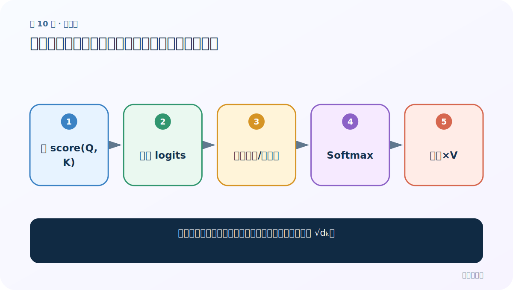
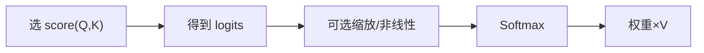
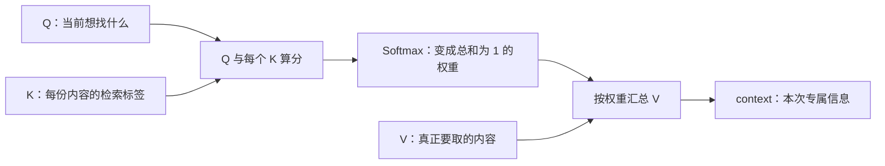

# 第 10 节：常见注意力计算规则：拼接式、加法式与缩放点积

> 笔记编号 10/14 · 对应原视频 P75 · [打开这一集](https://www.bilibili.com/video/BV14mdfBDE4Q?p=75)

[← 上一节：9 软注意力、硬注意力与自注意力](./09-attention-types.md) · [返回总目录](./README.md) · [下一节：11 bmm：一次完成一批三维矩阵乘法 →](./11-bmm.md)

## 这节解决什么问题

不同打分公式只是写法不同吗，为什么缩放点积要除以 √dₖ？



图从左向右读。先跟着数据或推理过程走一遍，再学习下面的术语。

## 辅助流程图



### 注意力的三步主流程



## 老师原声整理稿（按讲解顺序）

### 0:00–4:47　共同主干

无论公式怎样，主干都一样：Q 与 K 算相关分→Softmax→概率乘 V→汇总。一般注意力常见拼接/加法打分；自注意力常用缩放点积。

### 4:47–11:43　拼接式打分

把 Q 与 K_j 拼接，经 Linear 得标量分：score=vᵀtanh(W[Q;K_j]) 等。课堂把“拼接→线性变换→Softmax→乘 V”拆成三部分。

### 11:43–16:27　加法/非线性变体

可以在打分网络中加入 tanh、额外线性层和求和，让函数学习更复杂关系。网络更深不保证更好，需看任务与计算成本。

### 16:46–22:55　缩放点积

score=QKᵀ/√d_k。点积把对应维相乘后求和；d_k 大时点积幅度容易变大，使 Softmax 极端饱和、梯度变小。除以 √d_k 缩小尺度，使概率较稳定。

### 22:55–25:37　分类口径纠正

课堂用 Q/K/V 相等区分自注意力；更严谨是它们来自同一序列的投影。前两种也可用于自注意力，第三种也能用于交叉注意力；公式与注意力来源不是严格绑定。

## 完整原声逐段记录

[查看本节按时间戳整理的完整音轨转写](./transcripts/p075.md)

逐段记录用于核查老师讲解是否遗漏；正文会进一步纠正口误和语音识别中的技术术语。

## 零基础先记住

- 打分函数输出 logits
- 缩放防止大维点积导致 Softmax 饱和
- 打分公式与 QKV 来源是两个选择

## 最小可运行代码

下面代码默认从项目根目录运行；专题配套实现见 [attention_from_scratch 配套实现](../../attention_from_scratch/README.md)。

```python
import math, torch
q=torch.randn(2,8); k=torch.randn(2,5,8)
scores=torch.bmm(k,q.unsqueeze(-1)).squeeze(-1)/math.sqrt(8)
print(scores.shape)
```

### 输入和输出怎么看

每个查询对 5 个 key 得 5 个缩放分数。

## 最容易踩的坑

√d_k 中的 d_k 是 Q/K 匹配维，不是序列长度。

## 本节知识链

`选 score(Q,K) → 得到 logits → 可选缩放/非线性 → Softmax → 权重×V`

## 自测

**问题：为什么不是除以 d_v？**

<details>
<summary>点开核对答案</summary>

Softmax 前的点积发生在 Q/K 匹配空间，尺度由 d_k 决定。

</details>

## 学完检查

- [ ] 我能用自己的话复述老师的讲解顺序
- [ ] 我能在运行前预测关键输出或张量形状
- [ ] 我知道这节方法最容易用错的地方
- [ ] 我能独立回答自测题

[← 上一节：9 软注意力、硬注意力与自注意力](./09-attention-types.md) · [返回总目录](./README.md) · [下一节：11 bmm：一次完成一批三维矩阵乘法 →](./11-bmm.md)
