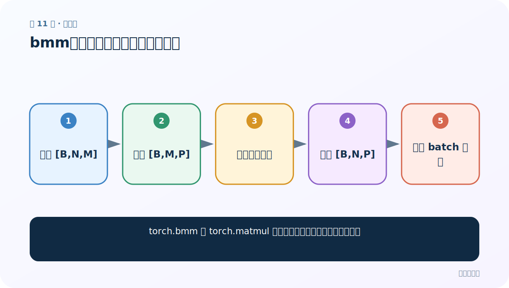
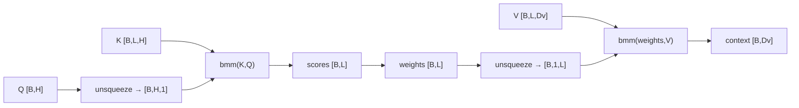

# 第 11 节：bmm：一次完成一批三维矩阵乘法

> 笔记编号 11/14 · 对应原视频 P76 · [打开这一集](https://www.bilibili.com/video/BV14mdfBDE4Q?p=76)

[← 上一节：10 常见注意力计算规则：拼接式、加法式与缩放点积](./10-attention-scoring-rules.md) · [返回总目录](./README.md) · [下一节：12 注意力代码实现：从 Q/K/V 到增强后的查询 →](./12-attention-code.md)

## 这节解决什么问题

torch.bmm 与 torch.matmul 有什么差别，注意力为什么常用它？



图从左向右读。先跟着数据或推理过程走一遍，再学习下面的术语。

## 辅助流程图


### 单查询注意力的形状链



## 老师原声整理稿（按讲解顺序）

### 0:00–2:53　为什么先补 bmm

注意力要对一个 batch 的矩阵批量做乘法。老师在写模块前先比较 torch.matmul 与 torch.bmm。

### 2:55–7:54　matmul 更通用

matmul 支持多种维度，并可对 batch 维广播。例如 [10,3,4] 与 [1,4,5] 可以广播为 10 批得到 [10,3,5]。

### 7:54–11:52　bmm 的严格输入

bmm 专门接受两个三维张量 [B,N,M] 与 [B,M,P]，batch B 必须相等，不做广播，输出 [B,N,P]。表达意图明确。速度优势要在实际硬件和规模上基准测试，不能绝对断言总更快。

### 11:52–18:45　课堂实验

老师构造 [10,3,4] 与 [10,4,5]，两者都得 [10,3,5]；把第二个 batch 改 1，matmul 可广播，bmm 报 batch 不匹配。

### 18:45–20:01　在注意力中的位置

K[B,L,H]×Q[B,H,1]→scores[B,L,1]；weights[B,1,L]×V[B,L,Dv]→context[B,1,Dv]，正好都是三维批量乘法。

## 完整原声逐段记录

[查看本节按时间戳整理的完整音轨转写](./transcripts/p076.md)

逐段记录用于核查老师讲解是否遗漏；正文会进一步纠正口误和语音识别中的技术术语。

## 零基础先记住

- bmm 只接三维
- batch 维必须一致
- 内侧矩阵维必须匹配

## 最小可运行代码

下面代码默认从项目根目录运行；专题配套实现见 [attention_from_scratch 配套实现](../../attention_from_scratch/README.md)。

```python
import torch
a=torch.randn(10,3,4); b=torch.randn(10,4,5)
print(torch.bmm(a,b).shape)
```

### 输入和输出怎么看

输出 [10,3,5]。

## 最容易踩的坑

bmm 不会把 batch=1 自动广播到 batch=10。

## 本节知识链

`准备 [B,N,M] → 准备 [B,M,P] → 同批逐项相乘 → 得到 [B,N,P] → 不做 batch 广播`

## 自测

**问题：[B,1,L] bmm [B,L,D] 输出什么？**

<details>
<summary>点开核对答案</summary>

[B,1,D]。

</details>

## 学完检查

- [ ] 我能用自己的话复述老师的讲解顺序
- [ ] 我能在运行前预测关键输出或张量形状
- [ ] 我知道这节方法最容易用错的地方
- [ ] 我能独立回答自测题

[← 上一节：10 常见注意力计算规则：拼接式、加法式与缩放点积](./10-attention-scoring-rules.md) · [返回总目录](./README.md) · [下一节：12 注意力代码实现：从 Q/K/V 到增强后的查询 →](./12-attention-code.md)
