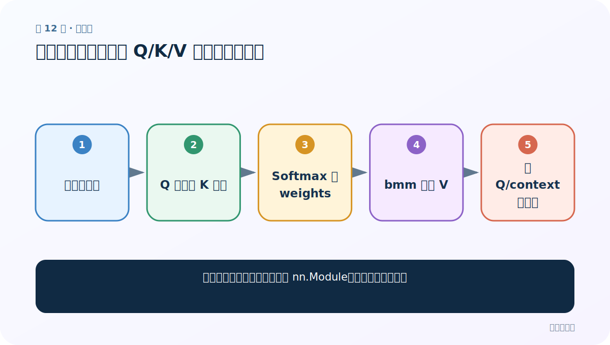
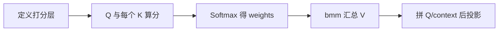
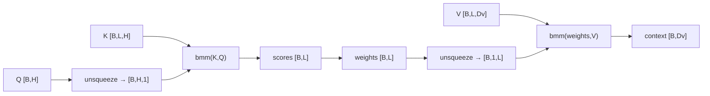
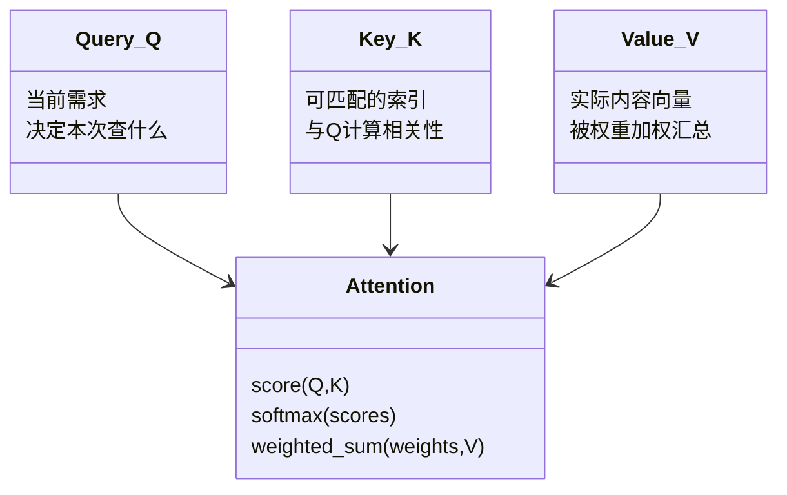

# 第 12 节：注意力代码实现：从 Q/K/V 到增强后的查询

> 笔记编号 12/14 · 对应原视频 P77 · [打开这一集](https://www.bilibili.com/video/BV14mdfBDE4Q?p=77)

[← 上一节：11 bmm：一次完成一批三维矩阵乘法](./11-bmm.md) · [返回总目录](./README.md) · [下一节：13 注意力测试代码：检查形状、概率和与梯度 →](./13-attention-test.md)

## 这节解决什么问题

怎样把注意力三步写成可训练 nn.Module，并逐层追踪形状？



图从左向右读。先跟着数据或推理过程走一遍，再学习下面的术语。

## 辅助流程图



### 单查询注意力的形状链



### Q、K、V 的职责 UML



## 老师原声整理稿（按讲解顺序）

### 0:00–3:52　任务与模块接口

课程把单个 Q 变成包含上下文的“增强 Q”。forward 接 Q、K、V；初始化接 query_size、key_size、value_size 与 output_size。示例后来统一为批量张量。

### 3:52–10:57　两层 Linear

第一层用于 Q/K 打分；第二层把原 Q 与 context 拼接后投影到输出维。参数必须按实际输入最后一维定义。

### 11:56–18:54　零基础形状设定

Q[B,Hq]；K[B,L,Hk]；V[B,L,Dv]。若 Hq≠Hk，需投影到共同匹配维。课程部分口述把 K 说成 [1,32]，但对 32 个词逐一打分时应保留序列维 [1,32,Hk]。

### 18:54–23:59　算分与概率

将 Q 扩展到每个 key 位置，或使用点积/general attention，一次得到 scores[B,L]。Softmax(dim=-1) 得 weights[B,L]。

### 23:59–28:04　bmm 加权 V

weights.unsqueeze(1) 变 [B,1,L]，与 V[B,L,Dv] 做 bmm，得 context[B,1,Dv]，squeeze 后 [B,Dv]。

### 28:04–31:17　增强查询

拼接 Q[B,Hq] 与 context[B,Dv] 得 [B,Hq+Dv]，经 Linear 输出 [B,output_size]。同时返回 weights 方便可视化与检查。

## 完整原声逐段记录

[查看本节按时间戳整理的完整音轨转写](./transcripts/p077.md)

逐段记录用于核查老师讲解是否遗漏；正文会进一步纠正口误和语音识别中的技术术语。

## 零基础先记住

- K/V 必须保留序列维 L
- Softmax 沿 L
- 最终投影可把拼接维降回模型隐藏维

## 最小可运行代码

下面代码默认从项目根目录运行；专题配套实现见 [attention_from_scratch 配套实现](../../attention_from_scratch/README.md)。

```python
import torch
from attention_from_scratch.model import DotProductAttention
q=torch.randn(2,8); k=torch.randn(2,5,8); v=torch.randn(2,5,8)
context,weights=DotProductAttention()(q,k,v)
print(context.shape,weights.shape)
```

### 输入和输出怎么看

context=[2,8]，weights=[2,5]。

## 最容易踩的坑

把 K 写成 [B,H] 会只剩一个 key，注意力失去在多个位置间选择的意义。

## 本节知识链

`定义打分层 → Q 与每个 K 算分 → Softmax 得 weights → bmm 汇总 V → 拼 Q/context 后投影`

## 自测

**问题：为什么 weights 要先 unsqueeze(1)？**

<details>
<summary>点开核对答案</summary>

bmm 需要三维 [B,1,L]，才能与 [B,L,Dv] 相乘。

</details>

## 学完检查

- [ ] 我能用自己的话复述老师的讲解顺序
- [ ] 我能在运行前预测关键输出或张量形状
- [ ] 我知道这节方法最容易用错的地方
- [ ] 我能独立回答自测题

[← 上一节：11 bmm：一次完成一批三维矩阵乘法](./11-bmm.md) · [返回总目录](./README.md) · [下一节：13 注意力测试代码：检查形状、概率和与梯度 →](./13-attention-test.md)
