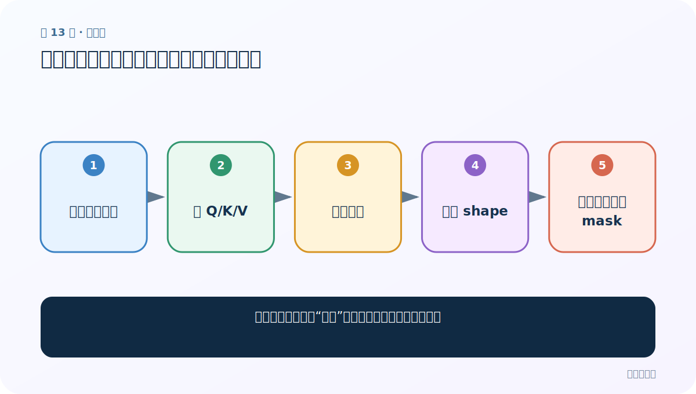
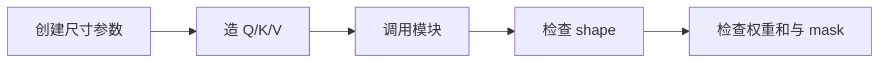
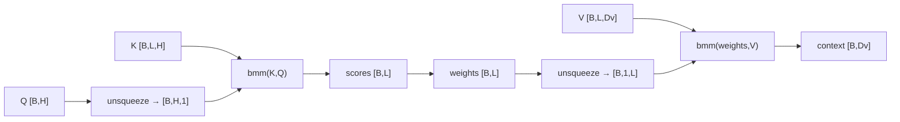

# 第 13 节：注意力测试代码：检查形状、概率和与梯度

> 笔记编号 13/14 · 对应原视频 P78 · [打开这一集](https://www.bilibili.com/video/BV14mdfBDE4Q?p=78)

[← 上一节：12 注意力代码实现：从 Q/K/V 到增强后的查询](./12-attention-code.md) · [返回总目录](./README.md) · [下一节：14 参数解释：把 1×32、32×64、1×96 全部读成语义 →](./14-attention-parameters.md)

## 这节解决什么问题

怎样证明模块不只“能跑”，还满足注意力的基本性质？



图从左向右读。先跟着数据或推理过程走一遍，再学习下面的术语。

## 辅助流程图



### 单查询注意力的形状链



## 老师原声整理稿（按讲解顺序）

### 0:00–1:54　测试数据

老师设置查询/键维 32、32 个词、V 维 64，并创建随机 Q、K、V。随机值只用于结构测试。

### 1:54–3:48　运行与打印

实例化自定义模块，得到 output 与 attention weights。output 是增强表示，weights 对每个词给一个概率。

### 3:48–5:55　必须验证的性质

若 L=32，weights 形状应 [B,32]，每行和约等于 1；output 形状应与配置输出维一致。还应测试 padding mask 后无效位置权重为 0，以及 backward 能产生有限梯度。

## 完整原声逐段记录

[查看本节按时间戳整理的完整音轨转写](./transcripts/p078.md)

逐段记录用于核查老师讲解是否遗漏；正文会进一步纠正口误和语音识别中的技术术语。

## 零基础先记住

- 概率和约等于 1
- mask 后 PAD 权重为 0
- 测试要覆盖 batch>1

## 最小可运行代码

下面代码默认从项目根目录运行；专题配套实现见 [attention_from_scratch 配套实现](../../attention_from_scratch/README.md)。

```python
import torch
from attention_from_scratch.model import DotProductAttention
q=torch.randn(2,8); k=torch.randn(2,5,8); v=torch.randn(2,5,8)
c,w=DotProductAttention()(q,k,v)
print(c.shape,w.shape,w.sum(-1))
```

### 输入和输出怎么看

context=[2,8]、weights=[2,5]，两行权重和都为 1。

## 最容易踩的坑

只用 batch=1 很容易隐藏 squeeze 把 batch 维误删的 bug。

## 本节知识链

`创建尺寸参数 → 造 Q/K/V → 调用模块 → 检查 shape → 检查权重和与 mask`

## 自测

**问题：为什么用 torch.allclose 而不是 ==1？**

<details>
<summary>点开核对答案</summary>

浮点运算有微小舍入误差，应在容差内比较。

</details>

## 学完检查

- [ ] 我能用自己的话复述老师的讲解顺序
- [ ] 我能在运行前预测关键输出或张量形状
- [ ] 我知道这节方法最容易用错的地方
- [ ] 我能独立回答自测题

[← 上一节：12 注意力代码实现：从 Q/K/V 到增强后的查询](./12-attention-code.md) · [返回总目录](./README.md) · [下一节：14 参数解释：把 1×32、32×64、1×96 全部读成语义 →](./14-attention-parameters.md)
