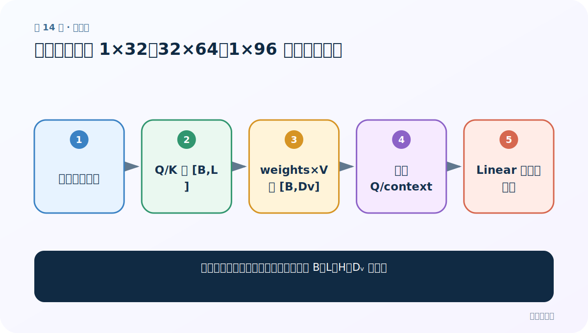
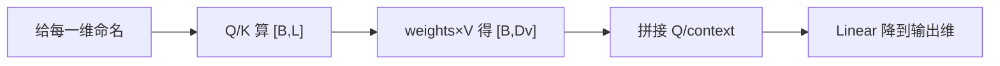
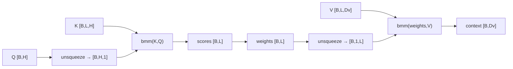
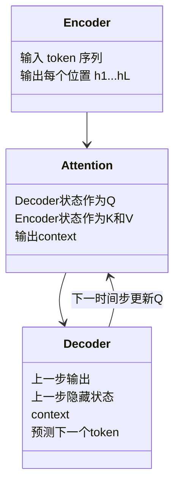

# 第 14 节：参数解释：把 1×32、32×64、1×96 全部读成语义

> 笔记编号 14/14 · 对应原视频 P79 · [打开这一集](https://www.bilibili.com/video/BV14mdfBDE4Q?p=79)

[← 上一节：13 注意力测试代码：检查形状、概率和与梯度](./13-attention-test.md) · [返回总目录](./README.md) · 已是最后一节 →

## 这节解决什么问题

面对一串形状数字，怎样不靠背诵而从 B、L、H、Dᵥ 推导？



图从左向右读。先跟着数据或推理过程走一遍，再学习下面的术语。

## 辅助流程图



### 单查询注意力的形状链



### Encoder、Attention、Decoder 的模块关系



## 老师原声整理稿（按讲解顺序）

### 0:00–5:52　先回顾完整公式

QK 先算匹配分；可选缩放与 mask；Softmax；再乘 V 得 context。mask 防止看到 padding 或因果未来位置，后面 Transformer 继续展开。

### 5:52–13:46　图中的 Q、K、V

在解码器生成当前词时，上一步隐藏状态/当前查询是 Q；Encoder 的各位置状态是 K/V。每个 key 都与 Q 比较，权重再汇总 value。

### 13:47–20:43　加法式与矩阵式

逐位置打分再相加和批量矩阵乘法都实现同一概念。矩阵实现避免 Python 循环、利于硬件并行；不能简单归因于框架品牌。

### 20:43–28:39　逐步推导示例

设 B=1、L=32、Hq=Hk=32、Dv=64。Q=[1,32]；K=[1,32,32]；V=[1,32,64]；scores/weights=[1,32]；context=[1,64]。

### 28:39–34:56　拼接与降维

Q[1,32] 与 context[1,64] 拼成 [1,96]，Linear(96,32) 得增强 Q[1,32]。这里的 96 不是神秘参数，而是 32+64。老师最后反复让同学把每个数字对应回批量、词数和特征维。

## 完整原声逐段记录

[查看本节按时间戳整理的完整音轨转写](./transcripts/p079.md)

逐段记录用于核查老师讲解是否遗漏；正文会进一步纠正口误和语音识别中的技术术语。

## 零基础先记住

- 1=batch，32 可能是 L 或 H，必须看位置
- 96=查询维32+内容维64
- Linear 改最后一维，不改 batch

## 最小可运行代码

下面代码默认从项目根目录运行；专题配套实现见 [attention_from_scratch 配套实现](../../attention_from_scratch/README.md)。

```python
B,L,H,Dv=1,32,32,64
print("Q",(B,H),"K",(B,L,H),"V",(B,L,Dv),"concat",(B,H+Dv))
```

### 输入和输出怎么看

打印每个张量的语义形状，concat 为 [1,96]。

## 最容易踩的坑

同一个数字 32 可能代表词数，也可能代表特征维，不能只看数值判断。

## 本节知识链

`给每一维命名 → Q/K 算 [B,L] → weights×V 得 [B,Dv] → 拼接 Q/context → Linear 降到输出维`

## 自测

**问题：B=4、L=10、H=8、Dv=16 时 context 形状？**

<details>
<summary>点开核对答案</summary>

[4,16]；序列维已被加权求和。

</details>

## 学完检查

- [ ] 我能用自己的话复述老师的讲解顺序
- [ ] 我能在运行前预测关键输出或张量形状
- [ ] 我知道这节方法最容易用错的地方
- [ ] 我能独立回答自测题

[← 上一节：13 注意力测试代码：检查形状、概率和与梯度](./13-attention-test.md) · [返回总目录](./README.md) · 已是最后一节 →
