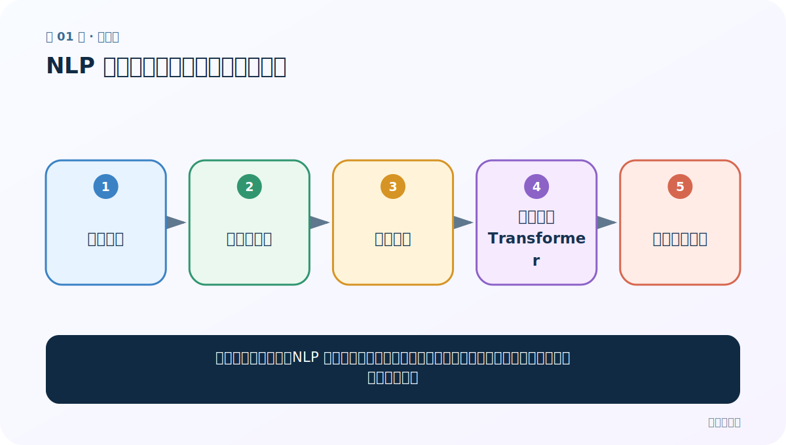
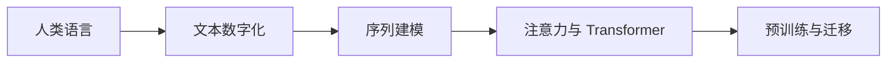
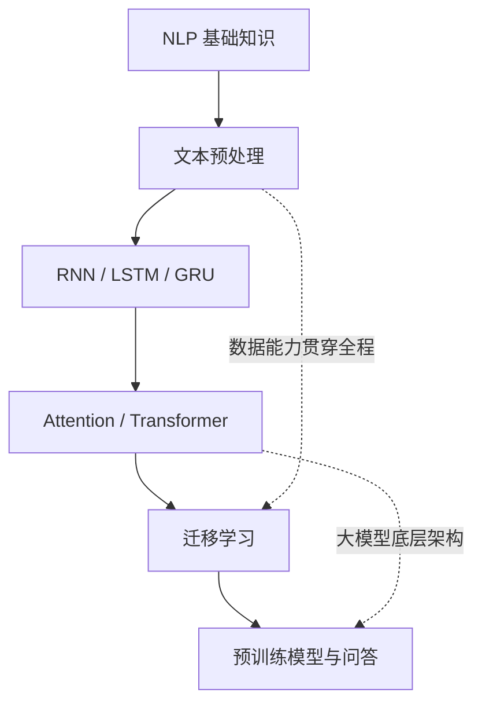
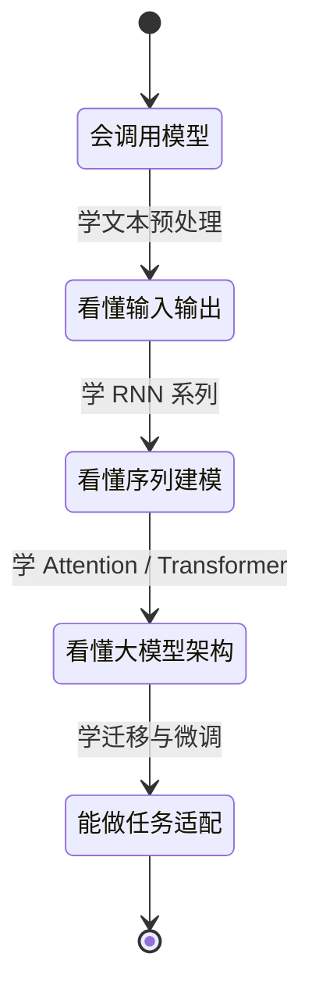

# 第 1 节：课程导学：为什么学 NLP，以及整门课怎样走

> 笔记编号 1/4 · 对应原视频 P1 · [打开这一集](https://www.bilibili.com/video/BV14mdfBDE4Q?p=1)

← 已是第一节 · [返回总目录](./README.md) · [下一节：2 阶段大纲：六章内容、重点难点与案例路线 →](./02-stage-outline.md)

## 这节解决什么问题

建立整门课的地图：NLP 为什么是大模型的前置基础，六个模块分别解决什么问题，需要哪些前置能力。



图从左向右读。先跟着数据或推理过程走一遍，再学习下面的术语。

## 辅助流程图



### 六大模块依赖图



### 从会使用到会开发




## 零基础精讲：先把这一节真正弄懂

### 先从一个真实问题开始

假设你在聊天框里输入：

> “我昨天买的耳机坏了，能不能退？”

人一眼就知道：用户买过耳机、耳机坏了、现在想退货。计算机最开始看到的却只是一串字符。它不知道“坏了”表达负面状态，也不知道“退”在这里是退货，不是后退。

NLP 要做的事情，可以先粗略理解成两步：

1. **理解**：用户在说什么、提到了什么、想做什么；
2. **生成**：给出意思正确、顺序自然、符合场景的回答。

例如系统最后回复：

> “可以，请提供订单号，我帮你查询退货条件。”

这就是一次最小的“理解 → 生成”闭环。以后学到的所有术语，都是在帮助计算机把这件事做得更准确。

### 计算机处理一句话，究竟经历了什么

先只记住下面这条主线：

| 步骤 | 人话解释 | 后面对应的知识 |
|---|---|---|
| 1. 收到文字 | 获得原始句子 | 文本与语料 |
| 2. 切成小单位 | 把句子拆成词、字或子词 | 分词、Tokenizer |
| 3. 变成数字 | 为每个小单位分配编号和向量 | 词表、Embedding |
| 4. 联系上下文 | 判断前后内容怎样互相影响 | RNN、Attention、Transformer |
| 5. 完成任务 | 分类、抽取、翻译或生成答案 | 任务模型、迁移学习 |

为什么一定要“变成数字”？因为神经网络的计算本质上是加法、乘法和矩阵运算，它不能直接拿“耳机”两个汉字去相乘。

### 六个模块不是六堆互不相关的名词

把整门课想成建一座房子：

- **NLP 基础**是先看设计图，知道房子要解决什么需求；
- **文本预处理**是整理砖、水泥和尺寸，让材料可以使用；
- **RNN/LSTM/GRU**是早期的承重结构，帮助理解序列记忆；
- **Attention/Transformer**是更现代的主体结构；
- **迁移学习**是使用已经建好的主体，改造成自己的用途；
- **预训练模型**是可以直接装修、调整和投入使用的成品框架。

如果直接跳到 Transformer，就像第一次学建筑便研究摩天楼的钢结构：每个词都认识，组合起来却不知道在做什么。

### 第一次学习时，哪些内容可以暂时不懂

这一节出现 RNN、LSTM、GRU、Attention、Transformer、BERT 和 GPT。**现在都不需要解释公式，也不用背结构。**

你只需要给它们先贴上临时标签：

- RNN/LSTM/GRU：研究“怎样记住前文”；
- Attention：研究“当前应该重点看哪里”；
- Transformer：把注意力机制组织成完整模型；
- BERT/GPT：基于 Transformer 家族构建的预训练模型。

后面每个标签都会被逐层打开。现在的目标只是知道它们在学习路线中的位置。

### 零基础怎样使用这套笔记

每节按以下顺序阅读：

1. 先回答“这节解决什么问题”；
2. 沿流程图说一遍数据从哪里来、到哪里去；
3. 再读老师讲解，不懂的术语先做标记，不要卡住；
4. 运行最小代码，先预测输出再执行；
5. 完成自测，能用自己的话回答才进入下一节。

**过关标准不是背出定义，而是能讲清楚一条因果链。**本节的因果链是：人类语言不能直接参与神经网络计算，所以要把文字数字化，再用模型学习上下文，最后完成理解或生成任务。

## 老师原声整理稿（按讲解顺序）

### 0:00–1:59　老师先回答：为什么 NLP 值得学

老师开场给出两个理由。第一，NLP 与日常生活紧密相连：语音助手、机器翻译、智能客服、情感分析、智能写作和自动摘要都属于它的应用。第二，NLP 是理解大模型底层逻辑的一把钥匙。

NLP 是 Natural Language Processing，即自然语言处理。课程把它说成让计算机“听懂、看懂，还会说”人类语言：既要理解输入，也要生成符合人类表达习惯的输出。

这句话需要拆开理解。计算机并不会直接接收“词义”，它先接收数字；模型通过数据与训练目标，学会数字表示之间的关系。后面的分词、词向量、序列模型、注意力和预训练，都是在补齐这条路线中的某一环。

### 1:59–3:52　为什么课程要按六个模块安排

老师把课程拆成六大模块，并强调顺序不是随意的：

1. NLP 基础知识：先知道领域要解决什么问题、经历过哪些技术路线。
2. 文本预处理：把原始文字整理成模型可接收的数据。
3. RNN 及其变体：学习早期序列建模的核心思路。
4. Transformer：掌握注意力、位置、残差、归一化等大模型底层组件。
5. 迁移学习：把别人预训练好的能力迁移到自己的任务。
6. 预训练模型与综合问答：认识 BERT、GPT、ELMo 等路线并串起全局。

顺序背后的逻辑是：先知道问题，再准备数据；先理解按时间步处理序列的办法，再理解 Transformer 为什么改变了这件事；最后才是如何使用现成的大模型。

### 3:52–4:49　文本预处理是所有实战的入口

老师列出分词、词性标注、命名实体识别、Word2Vec、Embedding 和数据增强。它们的共同任务是把脏乱的自然语言材料变成可训练、可评估、可复现的数据。

“模型很强，所以不用处理数据”是常见误区。训练、微调或评估时，样本怎么切分、词怎么编号、长度怎么统一、标签怎么映射，仍然会直接决定结果是否可信。

### 4:49–5:49　为什么先学 RNN、LSTM 和 GRU

RNN 是经典的序列模型：当前时刻不仅看当前输入，还接收前一时刻的隐藏状态。它让模型能够携带历史信息，但普通 RNN 在长序列上容易遭遇梯度消失或梯度爆炸。

LSTM 使用遗忘门、输入门、输出门和细胞状态，给长期信息提供更稳定的通路；GRU 用更新门和重置门做更精简的门控。课程先学它们，是为了看懂“序列信息怎样流动”和“长距离记忆为什么困难”。

### 5:49–6:47　Transformer 是课程核心，但术语要说准确

老师把 Transformer 作为大模型的核心架构专题。课程会从多头注意力、残差连接、位置编码和归一化讲到完整代码。

这里校正音轨中的术语：2017 年论文名是 **Attention Is All You Need**；BERT 于 2018 年发布。今天许多主流语言模型确实建立在 Transformer 家族上，但具体模型可能采用 Encoder-only、Decoder-only 或 Encoder–Decoder，不应把所有模型说成完全相同的结构。

### 5:49–7:45　迁移学习与预训练模型解决成本问题

企业通常不会为每个小任务从零训练巨型模型。更常见的做法是加载预训练模型，直接推理、提取特征，或在自己的标注数据上继续微调。

老师提到 Transformers 工具库、Pipeline、AutoModel，以及中文分类、完形填空、下一句预测等任务。学习重点不只是“会点接口”，还要知道输入如何被 tokenizer 处理、模型头对应什么任务、微调时哪些参数在更新。

### 7:45–9:44　课程希望形成的四类能力

老师归纳了技术、思维、实战和职业发展四类收获。换成学习动作就是：

- 能解释 LSTM、Attention、Transformer 的信息流；
- 能根据任务和数据选择模型，而不是只记模型名；
- 能独立完成数据处理、训练、评估与推理；
- 能把项目讲成“问题—方案—验证—改进”的完整故事。

课程包含姓名分类、英法翻译、文本分类等案例。案例的意义在于重复整套开发流程，而不是只追求一次运行成功。

### 9:44–11:14　需要哪些基础，应该怎样补

老师建议先具备 Python、神经网络和 PyTorch 基本操作。零基础并不意味着不能学，而是遇到张量、反向传播、优化器和训练循环时，需要同步补齐。

建议每节执行四个动作：先用自己的话说问题，再画数据流；然后写出关键张量形状，最后运行最小代码。不要一开始就追求背完整公式或照抄几百行实现。

## 完整原声逐段记录

[查看本节按时间戳整理的完整音轨转写](./transcripts/p001.md)

逐段记录用于核查老师讲解是否遗漏；正文会进一步纠正口误和语音识别中的技术术语。

## 零基础先记住

- NLP 同时包含对人类语言的理解与生成
- 六个模块存在依赖关系，不能只挑最后的模型接口
- 文本预处理决定模型实际接收到什么数据
- RNN 系列帮助理解序列记忆，Transformer 是后续大模型架构基础

## 最小可运行代码

下面代码是帮助理解本节概念的最小示例，默认从项目根目录运行。

```python
modules = [
    "NLP 基础", "文本预处理", "RNN/LSTM/GRU",
    "Attention/Transformer", "迁移学习", "预训练模型",
]
for index, module in enumerate(modules, start=1):
    print(index, module)
```

### 输入和输出怎么看

程序按课程依赖顺序打印六个模块。先能解释相邻模块为什么相连，再进入具体章节。

## 最容易踩的坑

不要把“会调用一个大模型接口”等同于理解 NLP。数据表示、训练目标、序列结构和评估方法仍然决定模型能否正确落地。

## 本节知识链

`人类语言 → 文本数字化 → 序列建模 → 注意力与 Transformer → 预训练与迁移`

## 自测

**问题：为什么课程要在 Transformer 前安排文本预处理和 RNN 系列？**

<details>
<summary>点开核对答案</summary>

文本预处理说明语言如何成为模型输入；RNN 系列说明序列信息如何逐步传递及其长距离困难。理解这两点后，才看得懂 Transformer 用并行注意力解决了什么问题。

</details>

## 学完检查

- [ ] 我能用自己的话复述老师的讲解顺序
- [ ] 我能在运行前预测关键输出或张量形状
- [ ] 我知道这节方法最容易用错的地方
- [ ] 我能独立回答自测题

← 已是第一节 · [返回总目录](./README.md) · [下一节：2 阶段大纲：六章内容、重点难点与案例路线 →](./02-stage-outline.md)
