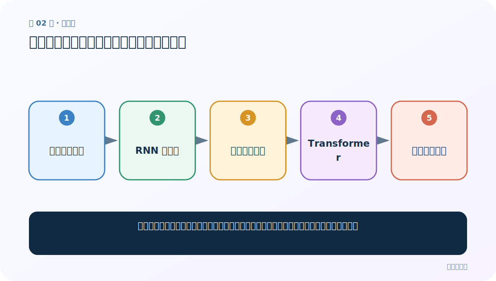
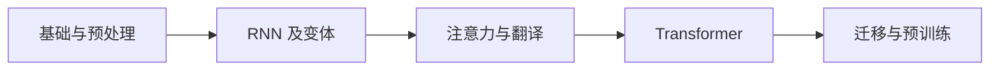
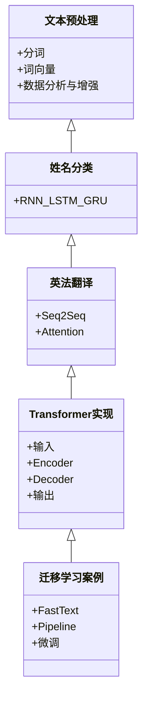
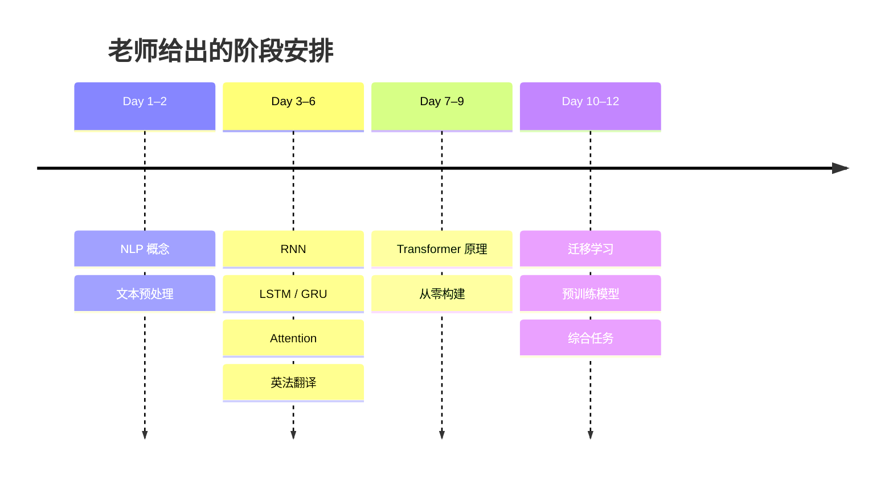

# 第 2 节：阶段大纲：六章内容、重点难点与案例路线

> 笔记编号 2/4 · 对应原视频 P2 · [打开这一集](https://www.bilibili.com/video/BV14mdfBDE4Q?p=2)

[← 上一节：1 课程导学：为什么学 NLP，以及整门课怎样走](./01-course-guide.md) · [返回总目录](./README.md) · [下一节：3 NLP 概念与发展：从图灵测试到 Transformer →](./03-nlp-concepts-and-history.md)

## 这节解决什么问题

把老师在思维导图中展开的全部章节、案例、重点和学习时间，整理成一张可执行的路线图。



图从左向右读。先跟着数据或推理过程走一遍，再学习下面的术语。

## 辅助流程图



### 案例与知识依赖 UML



### 学习时间与难度分布



## 老师原声整理稿（按讲解顺序）

### 0:00–3:52　先把六章展开，而不是只记章名

老师在思维导图中逐章展开课程。第一章是 NLP 概念，要求以理解为主；第二章是文本预处理；第三章是 RNN 及其变体；第四章是 Transformer；第五章是迁移学习；第六章用经典模型与面试问题收尾。

RNN 的基本层级被再次回顾：输入层接收数值化序列，循环层维护随时间传递的隐藏状态，输出层完成分类或预测。普通 RNN 有缺陷，因此继续学 LSTM 和 GRU。

老师强调 Transformer 的技术脉络：Attention 是核心机制，2017 年 Transformer 论文提出完整架构，2018 年 BERT 的成功推动了广泛关注。这个专题既是原理重点，也是面试高频区。

### 3:52–5:46　文本预处理具体学什么

文本预处理专题依次包括：

- 认识预处理及文本处理基本方法；
- 文本张量表示；
- 文本数据分析；
- 文本数据增强；
- 词向量可视化案例。

老师特别标记了文本向量表示和数据分析。原因是模型不接收原始字符串，表示法决定信息如何进入模型；分析则帮助发现长度、类别、词频和脏数据问题。

表示法会从稀疏 One-Hot 走到稠密 Word2Vec/Embedding，并接触 FastText。课程后面再次使用 FastText 做分类，因此前后的知识不是孤立章节。

### 5:46–7:44　RNN、LSTM、GRU 与姓名分类

老师先快速复习传统 RNN，再详细讲变体。LSTM 中有遗忘门、输入门、输出门和细胞状态；GRU 以更新门和重置门简化门控结构。学习时要回答“每个门让哪些信息保留或丢弃”，不能只背门名。

配套案例是根据姓名判断所属语言或国家类别。完整路线包括字符编码、变长序列、循环模型、分类输出、训练和预测。老师提醒代码不一定概念难，但量会明显增大，因此需要课后补敲和整理。

### 7:44–11:36　Attention 与 Seq2Seq 英法翻译

老师把注意力列为重要基础。类比人的视觉注意：看到复杂场景时，不会平均关注所有细节，而会把更多资源放在相关区域。模型中的注意力不是生理机制复刻，而是用可学习的权重决定当前 Query 应从哪些 Key/Value 读取更多信息。

接着用 Seq2Seq 完成英语到法语翻译。Encoder 把源句压成表示，Decoder 按时间步生成目标句；Attention 允许 Decoder 每一步重新查看源序列各位置，缓解单一固定向量的信息瓶颈。

老师预计这部分会出现较长代码，课堂上先跟住“数据从哪里来、送到哪里”，课后再补齐实现。重点是传统 RNN、LSTM、GRU、Attention 和翻译案例。

### 11:36–15:33　Transformer 的四部分与构建难点

Transformer 被拆成输入、Encoder、Decoder 和输出四部分。后续会先认识背景与架构，再解析每个组件，最后从代码组装完整模型。

老师指出难点主要有两个：组件多，以及张量维度变换多。因此需要把每一层的输入输出形状写清楚。Encoder 更偏向构造上下文理解表示；Decoder 通过因果注意力逐步生成。现代模型根据任务选择其中一部分或两者组合。

### 15:33–19:13　迁移学习、FastText 与 Transformers 工具库

迁移学习被老师概括为“把别人的模型拿过来使用”。更精确地说，是把源任务或大语料中学到的参数/表示迁移到目标任务，可选择冻结、部分微调或整体微调。

课程先用 FastText 接触词向量和文本分类，再介绍常见预训练模型与 Hugging Face Transformers。案例包括情感分析、中文分类、完形填空和下一句预测。Pipeline 方便快速推理；AutoTokenizer/AutoModel 等接口则更适合看清内部输入输出和定制训练。

### 19:13–22:27　结尾问题与学习节奏

最后一章会比较 Transformer、BERT、ELMo、GPT 等模型并整理经典问题。老师给出的计划大致是：前两天学概念和预处理，中间约六天集中攻 RNN/Attention/Transformer，最后几天处理迁移学习与预训练模型。

“打怪”类比表达的是逐关通过：一节代码没跑通、形状没说清，不要直接跳到整模。难度真正上升后，课堂侧重听懂思路，课后必须再次运行和补注释。

## 完整原声逐段记录

[查看本节按时间戳整理的完整音轨转写](./transcripts/p002.md)

逐段记录用于核查老师讲解是否遗漏；正文会进一步纠正口误和语音识别中的技术术语。

## 零基础先记住

- 课程案例按数据处理 → 序列建模 → 注意力 → Transformer → 迁移学习递进
- RNN、LSTM、GRU、Attention、英法翻译和 Transformer 是老师标出的重点难点
- 长代码先追踪数据流与形状，再补实现细节
- Transformers 是工具库名称；Transformer 是模型架构名称

## 最小可运行代码

下面代码是帮助理解本节概念的最小示例，默认从项目根目录运行。

```python
roadmap = {
    "文本预处理": ["分词", "词向量", "分析", "增强"],
    "序列模型": ["RNN", "LSTM", "GRU", "姓名分类"],
    "生成模型": ["Attention", "Seq2Seq", "Transformer"],
    "迁移学习": ["FastText", "Pipeline", "微调"],
}
for stage, tasks in roadmap.items():
    print(f"{stage}: {' -> '.join(tasks)}")
```

### 输入和输出怎么看

输出四条学习路线。它不是课程标题清单，而是后一个任务对前一个能力的依赖。

## 最容易踩的坑

不要用 P2 的时间安排逼自己机械赶进度。老师的天数是课堂规划；零基础应以能复述数据流、运行代码和完成自测为过关标准。

## 本节知识链

`基础与预处理 → RNN 及变体 → 注意力与翻译 → Transformer → 迁移与预训练`

## 自测

**问题：为什么姓名分类安排在英法翻译之前？**

<details>
<summary>点开核对答案</summary>

姓名分类先练习字符输入、循环隐藏状态和分类训练；英法翻译在这些基础上增加 Encoder–Decoder、目标序列生成与 Attention，依赖更复杂。

</details>

## 学完检查

- [ ] 我能用自己的话复述老师的讲解顺序
- [ ] 我能在运行前预测关键输出或张量形状
- [ ] 我知道这节方法最容易用错的地方
- [ ] 我能独立回答自测题

[← 上一节：1 课程导学：为什么学 NLP，以及整门课怎样走](./01-course-guide.md) · [返回总目录](./README.md) · [下一节：3 NLP 概念与发展：从图灵测试到 Transformer →](./03-nlp-concepts-and-history.md)
