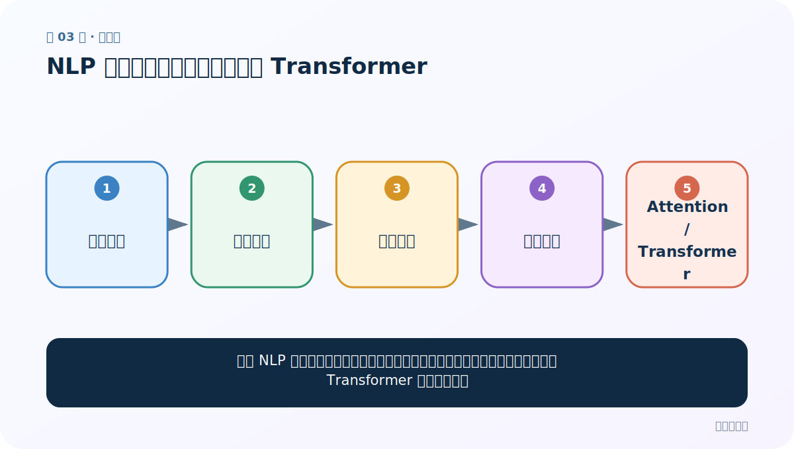
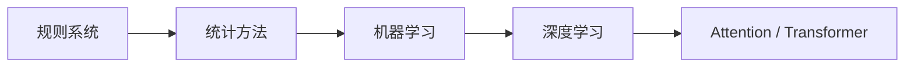
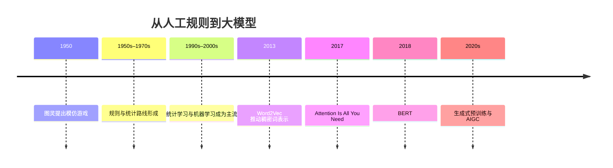
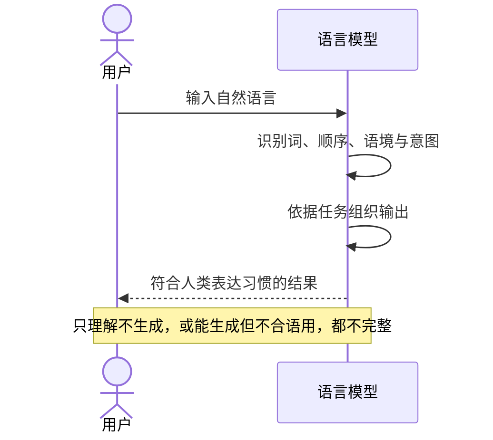

# 第 3 节：NLP 概念与发展：从图灵测试到 Transformer

> 笔记编号 3/4 · 对应原视频 P3 · [打开这一集](https://www.bilibili.com/video/BV14mdfBDE4Q?p=3)

[← 上一节：2 阶段大纲：六章内容、重点难点与案例路线](./02-stage-outline.md) · [返回总目录](./README.md) · [下一节：4 NLP 应用场景：语音助手、身份核验与机器翻译 →](./04-nlp-applications.md)

## 这节解决什么问题

理解 NLP 的目标、理解与生成的区别，以及规则、统计、机器学习、深度学习和 Transformer 的发展关系。



图从左向右读。先跟着数据或推理过程走一遍，再学习下面的术语。

## 辅助流程图



### NLP 技术路线时间线



### 理解—生成闭环



## 老师原声整理稿（按讲解顺序）

### 0:00–1:54　这一节只要求建立概念框架

老师列出三个目标：什么是 NLP、它大致经历了什么发展、有哪些应用场景。这里以“了解”为主，不需要死背年份，但要知道后面的技术为什么会出现。

NLP 是计算机科学、人工智能与语言学的交叉领域，目标是让计算机处理、理解并生成人类语言。音轨多次把 NLP 识别成“LP”，把 Natural Language Processing 识别错；正文统一校正为标准术语。

### 1:54–4:50　大模型为什么需要“理解 + 生成”

老师用互动问题解释大模型流行的语言基础。第一，系统要能理解用户输入。像口语中的停顿、歧义、上下文省略，如果理解错，后续答案就会答非所问。

第二，生成结果还要符合人类表达习惯。老师故意把“今天天气很好，适合敲代码”打乱词序；人仍可能猜到意思，但这种句子不是自然输出。因此 NLP 不只是识别几个关键词，还要处理顺序、语法、语义与语用。

理解与生成可以对应不同任务，但在对话系统里构成闭环：先理解问题，再组织自然答案。

### 4:50–5:49　应用场景与即将学习的切词

老师列出语音识别、语音合成、自然语言理解、机器翻译、文本分类和情感分析。语音系统通常还包含声学信号处理；NLP 主要处理识别后的文本或用于生成待合成的文本。

长文章不能不经组织地直接丢给任意模型。除了模型本身的上下文长度限制，还需要 tokenization，把文本切成 token 并映射为 ID。课程接下来用 jieba 演示精确模式、全模式和搜索引擎模式。现代 Transformer tokenizer 可能按子词或字节切分，不等同于 jieba 中文词分词，但目的都包含把文本转成可处理单位。

### 5:49–8:44　1950 年的图灵测试

老师通过网页解释图灵测试：测试者用文本与另一端的人和机器交谈，再根据回答判断对方是谁。如果机器的表现让测试者难以可靠区分，就展现出类似人类对话的行为。

需要校正两点。图灵 1950 年论文的标准英文题名是 **Computing Machinery and Intelligence**，其中提出“模仿游戏”。课堂提到“吃下含氰化物的苹果”与图灵之死有关，但把 Apple 标志解释为乔布斯纪念图灵的说法没有可靠依据，应把它当作课堂逸闻而不是历史事实。

图灵测试衡量的是交互表现，不直接证明机器拥有意识，也不是今天评价 NLP 模型的唯一指标。

### 8:44–11:42　规则派与统计派

老师把规则方法概括为“人说了算”：领域专家手写词典、语法或决策规则。例如判断议论文结构，需要专家先定义论点、论据和论证等模式。优点是可解释、在小范围内可控；缺点是覆盖成本高，容易遗漏例外，也可能带入设计者偏差。

统计方法则让“数据说了算”：从语料中的频率和共现规律估计概率。随着数据、算力和算法积累，统计方法逐步占据主流。但它也不是天然无偏，因为训练数据本身可能包含偏差。

### 11:42–14:02　机器学习、深度学习与 Transformer

2000 年前后，机器学习在 NLP 中广泛应用；2010 年代深度学习降低了手工特征工程的比重。2013 年 Word2Vec 推动稠密词向量普及；2017 年论文 **Attention Is All You Need** 提出 Transformer；2018 年 BERT 证明大规模预训练的强大效果，推动产业界深入研究该架构。

这条历史线不是“旧技术全部消失”。规则仍用于安全约束、格式校验和业务逻辑；统计思想仍存在于损失、概率分布和评估中；神经网络则擅长从大数据学习复杂表示。真正要理解的是每一代方法把哪些工作从人工规则交给了数据和参数。

## 完整原声逐段记录

[查看本节按时间戳整理的完整音轨转写](./transcripts/p003.md)

逐段记录用于核查老师讲解是否遗漏；正文会进一步纠正口误和语音识别中的技术术语。

## 零基础先记住

- NLP 的目标包含理解、处理和生成人类语言
- 规则方法依赖专家显式编码，统计/学习方法从数据估计规律
- 图灵测试关注可观察对话行为，不等于证明机器有意识
- 2017 年 Transformer 论文与 2018 年 BERT 是重要里程碑

## 最小可运行代码

下面代码是帮助理解本节概念的最小示例，默认从项目根目录运行。

```python
sentence = "今天天气很好，适合敲代码"
tokens = list(sentence)
print(tokens)
print("顺序变化后仍是同一批字吗：", sorted(tokens) == sorted(reversed(tokens)))
```

### 输入和输出怎么看

字符集合相同并不代表语义相同。序列顺序是语言信息的一部分，这也为后面的 RNN 与位置编码埋下伏笔。

## 最容易踩的坑

课堂历史故事里可能混有便于记忆的逸闻。技术结论要和可核实史实分开，例如 Apple 标志纪念图灵的说法不应作为事实记忆。

## 本节知识链

`规则系统 → 统计方法 → 机器学习 → 深度学习 → Attention / Transformer`

## 自测

**问题：为什么统计/神经方法占主流后，规则仍然有价值？**

<details>
<summary>点开核对答案</summary>

学习方法擅长从数据归纳复杂模式；规则在安全边界、固定格式、业务约束和可解释控制上仍很实用。真实系统经常组合两者。

</details>

## 学完检查

- [ ] 我能用自己的话复述老师的讲解顺序
- [ ] 我能在运行前预测关键输出或张量形状
- [ ] 我知道这节方法最容易用错的地方
- [ ] 我能独立回答自测题

[← 上一节：2 阶段大纲：六章内容、重点难点与案例路线](./02-stage-outline.md) · [返回总目录](./README.md) · [下一节：4 NLP 应用场景：语音助手、身份核验与机器翻译 →](./04-nlp-applications.md)
