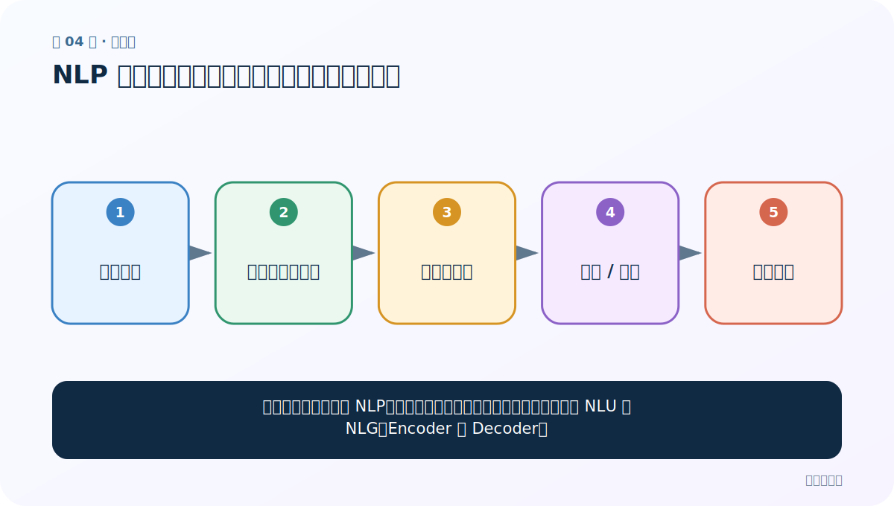
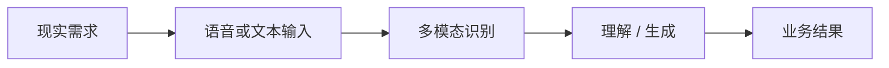
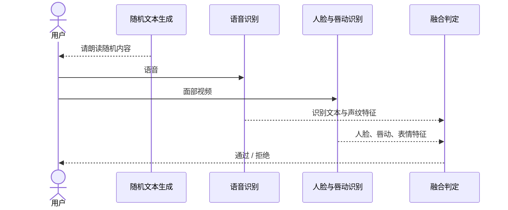
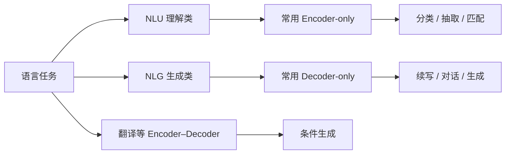

# 第 4 节：NLP 应用场景：语音助手、身份核验与机器翻译

> 笔记编号 4/4 · 对应原视频 P4 · [打开这一集](https://www.bilibili.com/video/BV14mdfBDE4Q?p=4)

[← 上一节：3 NLP 概念与发展：从图灵测试到 Transformer](./03-nlp-concepts-and-history.md) · [返回总目录](./README.md) · 已是最后一节 →

## 这节解决什么问题

看懂现实系统通常由 NLP、语音和计算机视觉等模块协作完成，并区分 NLU 与 NLG、Encoder 与 Decoder。



图从左向右读。先跟着数据或推理过程走一遍，再学习下面的术语。

## 辅助流程图



### 活体身份核验时序图



### NLU、NLG 与 Transformer 结构关系




## 零基础精讲：先把这一节真正弄懂

### 先学会拆系统，不要看到“AI”就当成一个模型

现实产品往往不是“输入一下，某个万能模型直接给答案”，而是多个模块接力。

以活体身份核验为例，系统可能要求用户朗读随机文字。完整过程可以拆成：

1. 系统临时生成一句待朗读文本；
2. 麦克风采集语音，语音识别模块判断说了什么；
3. 摄像头采集视频，视觉模块核验人脸、唇动和动作；
4. 系统比较“要求读的内容、实际识别的内容、嘴部动作”是否一致；
5. 风险模块结合多个分数，决定通过、拒绝或转人工。

这里 NLP 只负责语言相关的一部分；人脸与唇动属于计算机视觉，最后的判定还包含业务规则。学会画模块边界，比记住某个产品名字更重要。

### 为什么随机朗读比固定口令更安全

如果系统永远要求读“今天天气很好”，攻击者可以提前准备录音或视频。

随机文本相当于临时出题。攻击者不仅要伪造声音和人脸，还必须让嘴部动作与当次随机内容同步。系统验证的是多个信号是否在同一时刻相互对应。

这是一种通用的工程思路：**不要只看单一证据，要检查不同来源的证据能否互相印证。**

### 机器翻译不是查字典

逐词查字典会遇到三个问题：

- 一词多义：“苹果”可能是水果，也可能指公司；
- 词序不同：不同语言的主语、谓语、宾语位置可能不同；
- 表达不一一对应：一个短语在另一种语言里可能需要增词、减词或改写。

因此翻译模型需要两件事：

1. 结合整句上下文理解源语言；
2. 按目标语言习惯逐步生成。

这也是为什么后面会学习 Encoder–Decoder：Encoder 形成源句表示，Decoder 根据源句和已生成内容产生下一个词。

### NLU 和 NLG 用人话怎样区分

| 名称 | 先问的问题 | 常见任务 |
|---|---|---|
| NLU：自然语言理解 | “输入里有什么含义或结构？” | 分类、实体识别、意图识别、语义匹配 |
| NLG：自然语言生成 | “接下来应该输出什么文字？” | 对话、续写、摘要、翻译 |

不要把它们当成绝对分界。客服机器人先识别用户意图，再生成回复；机器翻译先理解源句，再生成目标句。一个产品经常同时包含 NLU 和 NLG。

### Encoder 和 Decoder 先贴两个临时标签

现在还没有正式学习 Transformer，不需要研究内部公式。先用“读”和“写”理解：

- **Encoder 像阅读员**：看到完整输入后，为每个位置建立包含上下文的信息；
- **Decoder 像写作者**：只能根据已经看到的条件和已经写出的前文，逐步写下一个 token。

因此：

- BERT 类 Encoder-only 模型常用于分类、抽取和匹配；
- GPT 类 Decoder-only 模型常用于续写和对话；
- Encoder–Decoder 模型适合翻译、摘要等“读一段，再生成另一段”的任务。

这是常见对应关系，不是不可改变的法律。以后判断模型结构，要看训练目标和具体任务。

### 面对任何 AI 应用，都可以问五个问题

1. 用户提供了什么输入：文字、语音、图片还是视频？
2. 每种输入由哪个模块处理？
3. 中间传递的是原始数据、标签还是向量表示？
4. 最后输出是分类结果、抽取信息还是生成文本？
5. 哪一步由模型决定，哪一步由业务规则决定？

能回答这五个问题，就已经从“看热闹”走向了“会分析系统”。

## 老师原声整理稿（按讲解顺序）

### 0:00–2:52　老师先播放语音技术与城市应用片段

这一节不再讲抽象定义，而是通过访谈片段看技术落地。视频先讨论人工智能与自我意识，再展示语音、人脸、表情等能力怎样用于现实系统。

这里要把两个话题分开：模型能否表现出智能，与机器是否具有主观意识不是同一个问题。当前 NLP 课程关注的是可计算任务，例如识别、分类、匹配和生成，不对意识问题下结论。

### 2:52–5:52　活体身份核验不是单一 NLP 模型

老师分析的城市身份认证方案大致组合了：

- 系统随机生成一段待朗读文字；
- 语音识别判断用户说了什么；
- 人脸识别确认面部身份；
- 唇动、姿态或表情判断声音与画面是否同步；
- 多种证据融合，给出是否为真实现场用户的结论。

随机文本很重要：如果每次要求相同句子，攻击者更容易准备录音或视频。动态挑战让“此刻看见的人、此刻听见的声音、此刻要求朗读的内容”相互对应。

这说明真实 AI 产品常是多模块系统。语音识别和文本理解属于 NLP/语音交叉，面部与动作分析属于计算机视觉，最后还需要业务规则与风险阈值。不能把整个活体检测笼统说成一个 NLP 模型完成。

老师进一步列出职业方向：NLP 可延伸到预训练模型、知识图谱、多轮对话；CV 可延伸到自动驾驶、无人机等；还可走多模态、工业检测等交叉方向。对初学者最紧急的仍是打牢数据与模型基础。

### 5:52–8:48　机器翻译为什么会被绕口句难住

第二段示例是机器翻译。节目用含有大量同形词、重复字和复杂语境的句子测试翻译设备。系统对常规句子可以给出大意，但面对“过过过……”一类依赖分词、词性和语境消歧的表达，容易遗漏或误解。

机器翻译并非逐词替换。源语言和目标语言在词序、语法、习惯表达上不同；同一个字在不同上下文可能是动词、助词或姓名的一部分。模型需要先建立源句上下文，再根据目标语言习惯生成。

### 8:48–10:48　再用“理解 + 生成”总结

老师回到上一节的问题：大模型能理解用户话语，同时生成用户看得懂、符合语言习惯的内容，这两项能力共同支撑了广泛应用。

NLP 任务常粗分为：

- NLU（Natural Language Understanding）：分类、实体识别、情感判断、语义匹配等；
- NLG（Natural Language Generation）：翻译、摘要、续写、对话回答等。

这个划分是学习工具，不是绝对边界。机器翻译既需要理解源句，又需要生成目标句；问答也可能同时包含检索、理解和生成。

### 10:48–11:48　Encoder 与 Decoder 怎样对应任务

老师提前预告 Transformer 的四部分：输入、Encoder、Decoder、输出。Encoder 读取完整输入并形成上下文表示，因此常用于理解类任务；Decoder 通过因果约束逐步产生 token，因此常用于生成类任务。

更准确的模型对应关系是：

- BERT 类 Encoder-only 常用于分类、抽取和匹配；
- GPT 类 Decoder-only 常用于续写和对话生成；
- 原始 Transformer/T5 等 Encoder–Decoder 常用于翻译和条件生成。

不能简单认为 NLU 永远只用 Encoder、NLG 永远只用 Decoder；具体结构由任务和模型设计决定。

### 11:48–13:05　把历史与应用串起来

老师回顾规则与统计两条路线、2013 年前后的 Word2Vec、2017 年 Transformer 论文和 2018 年 BERT，再把它们落回语音助手、机器翻译、身份认证等应用。

最终要形成的认识是：应用需求提出问题，数据与预处理形成输入，模型负责表示与预测，多模块系统再把预测变成业务结果。后面的每个技术点都能在这条链中找到位置。

## 完整原声逐段记录

[查看本节按时间戳整理的完整音轨转写](./transcripts/p004.md)

逐段记录用于核查老师讲解是否遗漏；正文会进一步纠正口误和语音识别中的技术术语。

## 零基础先记住

- 真实 AI 产品常由语音、NLP、视觉与业务规则协作
- 机器翻译不是逐词替换，需要上下文理解和目标语言生成
- NLU 偏理解，NLG 偏生成，但很多任务同时包含两者
- Encoder-only、Decoder-only、Encoder–Decoder 是三种常见 Transformer 路线

## 最小可运行代码

下面代码是帮助理解本节概念的最小示例，默认从项目根目录运行。

```python
system = {
    "challenge": "随机生成朗读文本",
    "speech": "识别说了什么",
    "vision": "核验人脸与唇动",
    "fusion": "综合证据给出风险结论",
}
for module, job in system.items():
    print(f"{module:10s} -> {job}")
```

### 输入和输出怎么看

输出活体核验的四个协作模块。真正系统还会包含阈值、失败重试、隐私保护和人工复核。

## 最容易踩的坑

不要看到系统中含有语音或文本，就把全部能力归为 NLP。先画模块边界，再确认每种输入由哪个模型处理。

## 本节知识链

`现实需求 → 语音或文本输入 → 多模态识别 → 理解 / 生成 → 业务结果`

## 自测

**问题：为什么机器翻译更适合 Encoder–Decoder，而不是简单逐词查字典？**

<details>
<summary>点开核对答案</summary>

Encoder 可结合完整源句形成上下文，Decoder 再依据上下文和已经生成的目标前缀组织目标语言。这样能处理词序变化、一词多义和非一一对应表达。

</details>

## 学完检查

- [ ] 我能用自己的话复述老师的讲解顺序
- [ ] 我能在运行前预测关键输出或张量形状
- [ ] 我知道这节方法最容易用错的地方
- [ ] 我能独立回答自测题

[← 上一节：3 NLP 概念与发展：从图灵测试到 Transformer](./03-nlp-concepts-and-history.md) · [返回总目录](./README.md) · 已是最后一节 →
