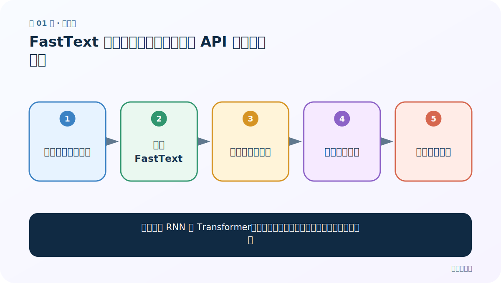
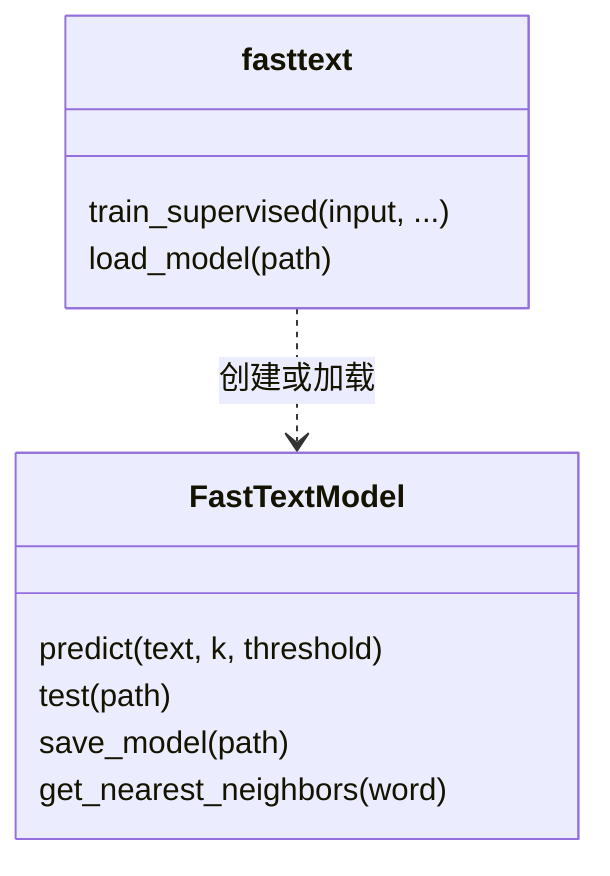

# 第 1 节：FastText 简介与环境：为什么一行 API 也值得学原理

> 笔记编号 1/11 · 对应原视频 P144 · [打开这一集](https://www.bilibili.com/video/BV14mdfBDE4Q?p=144)

← 已是第一节 · [返回总目录](./README.md) · [下一节：2 层次 Softmax 与哈夫曼树：从全部类别改成走一条路径 →](./02-hierarchical-softmax-huffman.md)

## 这节解决什么问题

已经会写 RNN 和 Transformer，为什么还要学一个调用很短的文本分类工具？



图从左向右读。先跟着数据或推理过程走一遍，再学习下面的术语。

## 辅助流程图


### FastText 文本分类总流程


### 三层结构与数据形状


### 训练、预测、保存 API 关系



## 老师原声整理稿（按讲解顺序）

### 0:00–2:47　从“代码很长”引出 FastText

老师先把本章放进迁移学习专题：FastText 工具与原理、文本分类、词向量迁移。此前用 GRU、RNN、LSTM 或 Transformer 自己搭模型，数据、网络、损失和训练循环会写很多代码；FastText 把常用流程封装成了 `train_supervised` 等 API。调用短不表示模型没有原理，而是工程细节已经由库实现。老师也回顾了 one-hot、Word2Vec 的 CBOW/Skip-gram 与 embedding，提醒大家 FastText 还能训练词向量。

### 2:47–5:30　三条加速线索

老师预告三块：简单的线性结构、层次 Softmax、负采样。为了让初学者先有直觉，他把负采样比作考试前优先复习错题与重点，而不是从第一本书第一页重新看完。这个类比只说明“只处理一小部分负例”；真正的抽样分布和损失计算要到 P146 再说。

### 5:30–10:55　用途、优点与局限

FastText 主要可用于文本分类和词向量学习。文本分类包括新闻类别和情感倾向。它的优势是训练、预测快，API 简单，在许多基线任务上能保持有竞争力的精度。老师强调“较高”是相对说法：数据没清洗、参数用默认值时，精度可能很低，后面仍需调优。局限是把局部特征汇总后做线性分类，难以细致表示长距离词序；加入 word N-gram 可以缓解，却不能等同于 RNN 或 Transformer 的上下文建模。

### 10:55–16:35　安装演示与必要纠错

老师现场展示不同 Python 环境中的安装，并提醒二进制构建可能受系统、编译器和 Python 版本影响。学习时应新建隔离环境，先验证 `import fasttext`，再跑最小数据。还要纠正一句口误：FastText 分类器的底层不是 Transformer；它更接近“嵌入查表 → 特征平均 → 线性分类”。另外，层次 Softmax 与负采样通常是不同的损失/加速选项，不是必须同时启用的同一过程。

## 完整原声逐段记录

[查看本节按时间戳整理的完整音轨转写](./transcripts/p144.md)

逐段记录用于核查老师讲解是否遗漏；正文会进一步纠正口误和语音识别中的技术术语。

## 零基础先记住

- FastText 是强基线，不是 Transformer 的简写
- API 简单与原理简单是两回事
- 先跑默认基线，再用验证集调优

## 最小可运行代码

下面代码默认从项目根目录运行；专题配套实现见 [FastText 原理配套练习包](../../fasttext_from_scratch/README.md)。

```python
try:
    import fasttext
except ImportError:
    raise SystemExit("请先在独立环境安装 fasttext；安装方式以当前官方说明为准")

model = fasttext.train_supervised(input="data/train.txt")
print(model.test("data/valid.txt"))
```

### 输入和输出怎么看

`train_supervised` 返回模型；`test` 通常返回测试样本数、Precision@1、Recall@1。

## 最容易踩的坑

直接复制旧安装命令和版本号；环境变化后可能无法构建。隔离环境并按当前官方说明安装。

## 本节知识链

`回顾复杂训练代码 → 认识 FastText → 比较速度与能力 → 拆出三层结构 → 准备运行环境`

## 自测

**问题：FastText 为什么快，但不擅长长距离词序？**

<details>
<summary>点开核对答案</summary>

它主要对词与 N-gram 嵌入做求和/平均，再接线性分类；计算并行而简单，但细致的顺序结构在汇总时会丢失。

</details>

## 学完检查

- [ ] 我能用自己的话复述老师的讲解顺序
- [ ] 我能在运行前预测关键输出或张量形状
- [ ] 我知道这节方法最容易用错的地方
- [ ] 我能独立回答自测题

← 已是第一节 · [返回总目录](./README.md) · [下一节：2 层次 Softmax 与哈夫曼树：从全部类别改成走一条路径 →](./02-hierarchical-softmax-huffman.md)
