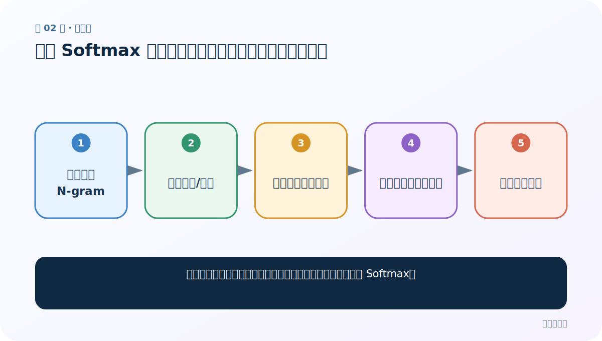
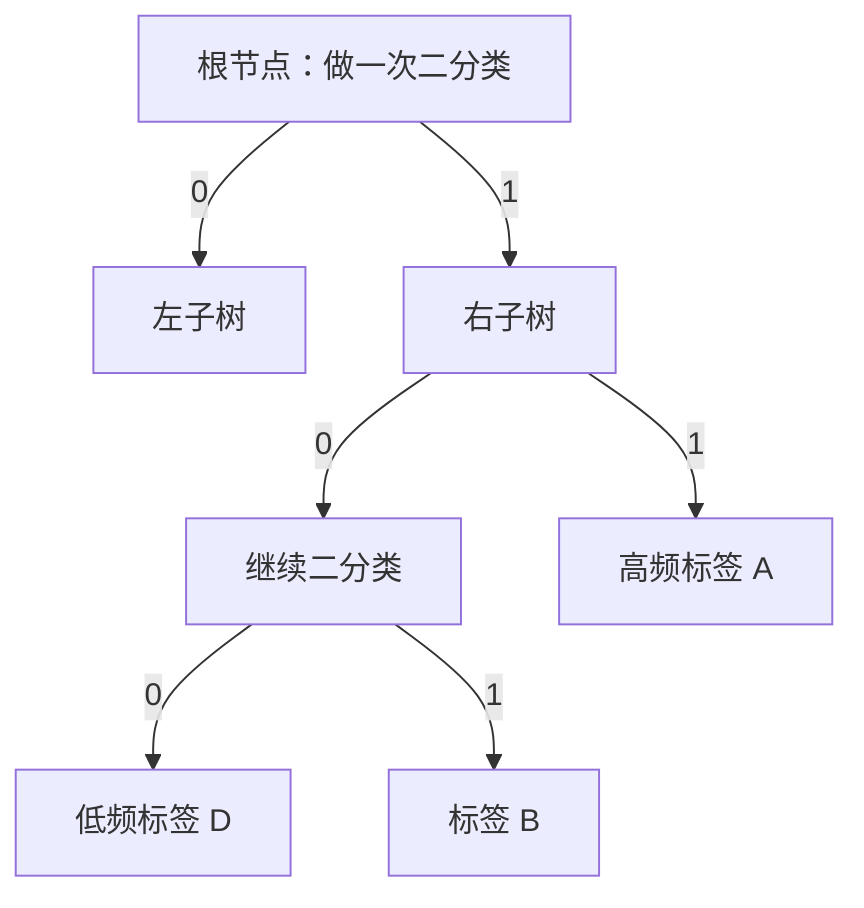

# 第 2 节：层次 Softmax 与哈夫曼树：从全部类别改成走一条路径

> 笔记编号 2/11 · 对应原视频 P145 · [打开这一集](https://www.bilibili.com/video/BV14mdfBDE4Q?p=145)

[← 上一节：1 FastText 简介与环境：为什么一行 API 也值得学原理](./01-fasttext-introduction.md) · [返回总目录](./README.md) · [下一节：3 负采样：正样本之外，只挑少量“陪练”负样本 →](./03-negative-sampling.md)

## 这节解决什么问题

类别多到几千、几万时，怎样避免每次都为所有类别计算完整 Softmax？



图从左向右读。先跟着数据或推理过程走一遍，再学习下面的术语。

## 辅助流程图


### 三层结构与数据形状


### 层次 Softmax 的哈夫曼路径



## 老师原声整理稿（按讲解顺序）

### 0:00–1:53　先看 FastText 三层结构

输入层把文本表示成词和 word N-gram；每个离散特征查到一个 D 维向量。隐藏层把这些向量求和或平均，得到整段文本的 D 维特征；输出层再根据这个特征预测标签。若一条文本有 6 个特征、嵌入维度 D=100，查表结果可理解为 `[6,100] = 6 个特征 × 每个 100 维`，平均后是 `[100]`，分类到 C 个标签后是 `[C]`。

### 1:53–5:43　老师的猜数字类比

普通 Softmax 会为 C 个类别都计算一个 logit 并统一归一化；C 很大时成本高。老师用“猜 1 到 100 的数字”类比：逐个猜像遍历全部类别，不断判断前半/后半则只沿一条分支走。这个类比帮助理解树形决策，但哈夫曼树不是普通的平衡二分查找树：它按类别频率安排路径，高频类别更靠近根，路径更短。

### 5:45–8:40　什么是带权路径长度

叶子结点表示标签，权重可以看作标签出现频次，深度是从根走到该叶子的边数。这里先说明公式解决什么问题：我们要衡量“常见标签走多远”的总成本。带权路径长度是 `WPL = Σ(叶子权重 × 叶子深度)`。哈夫曼算法让 WPL 尽量小，因此高频标签通常更靠近根。老师用权重 9、7、3、5 算出一个示例 WPL，并强调学习重点是会构树、会读路径。

### 8:45–21:41　手工构造哈夫曼树

老师按 3、5、7、9 演示：每轮取当前最小的两个权重合并；3+5=8，集合变成 7、8、9；7+8=15，集合变成 9、15；9+15=24 成为根。较小节点放左、较大放右是课堂约定，用来稳定编码；左记 0、右记 1 也只是约定，反过来同样可以，只要训练与推理一致。于是每个标签得到一串 0/1 路径。

### 21:41–30:09　路径概率怎样代替全量 Softmax

要预测某个叶子，只计算根到它路径上的几个二分类概率。这里先说明公式解决什么问题：我们要把“到达目标标签”的概率拆成沿途每次选左/右的概率。若路径编码为 `1,1,0`，则 `P(label|x)=P(1|x)×P(1|x)×P(0|x)`；每个内部节点用 sigmoid 做二分类。训练只更新这条路径相关节点。高频标签路径短，所以平均计算量下降。老师最后复盘：模型结构、层次 Softmax、负采样是理解 FastText 快的三条线，下一节继续负采样。

## 完整原声逐段记录

[查看本节按时间戳整理的完整音轨转写](./transcripts/p145.md)

逐段记录用于核查老师讲解是否遗漏；正文会进一步纠正口误和语音识别中的技术术语。

## 零基础先记住

- 哈夫曼树按频率缩短高频标签路径
- 0/1 是编码约定，不是正负的天然含义
- 层次 Softmax 只计算目标路径上的内部节点

## 最小可运行代码

下面代码默认从项目根目录运行；专题配套实现见 [FastText 原理配套练习包](../../fasttext_from_scratch/README.md)。

```python
from fasttext_from_scratch.huffman import huffman_codes
print(huffman_codes({"A": 5, "B": 9, "C": 7, "D": 3}))
```

### 输入和输出怎么看

打印每个标签的 0/1 编码；权重最大的标签通常拥有更短编码。具体左右编码可能不同，但码长性质一致。

## 最容易踩的坑

把哈夫曼树当成必然平衡的二分搜索树。它优化的是带权路径长度，不保证左右子树节点数相等。

## 本节知识链

`文本拆成 N-gram → 嵌入求和/平均 → 按频次建哈夫曼树 → 沿目标路径做二分类 → 路径概率相乘`

## 自测

**问题：1000 个标签时，层次 Softmax 为什么不必计算 1000 个输出？**

<details>
<summary>点开核对答案</summary>

目标标签对应树上的一片叶子，只需计算根到该叶子的若干次二分类，理想量级接近树高。

</details>

## 学完检查

- [ ] 我能用自己的话复述老师的讲解顺序
- [ ] 我能在运行前预测关键输出或张量形状
- [ ] 我知道这节方法最容易用错的地方
- [ ] 我能独立回答自测题

[← 上一节：1 FastText 简介与环境：为什么一行 API 也值得学原理](./01-fasttext-introduction.md) · [返回总目录](./README.md) · [下一节：3 负采样：正样本之外，只挑少量“陪练”负样本 →](./03-negative-sampling.md)
