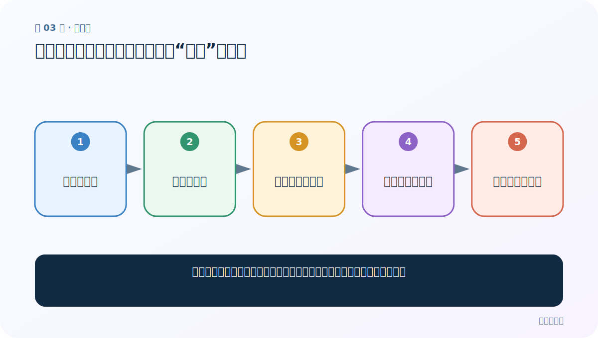
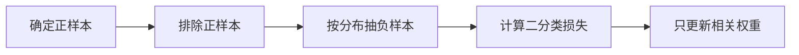
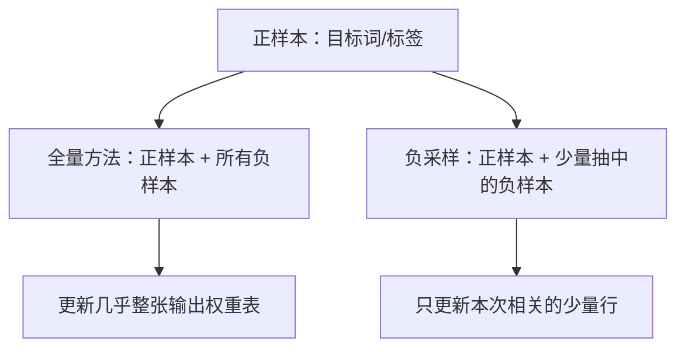

# 第 3 节：负采样：正样本之外，只挑少量“陪练”负样本

> 笔记编号 3/11 · 对应原视频 P146 · [打开这一集](https://www.bilibili.com/video/BV14mdfBDE4Q?p=146)

[← 上一节：2 层次 Softmax 与哈夫曼树：从全部类别改成走一条路径](./02-hierarchical-softmax-huffman.md) · [返回总目录](./README.md) · [下一节：4 直接训练：数据格式、预测、测试与第一版基线 →](./04-direct-training.md)

## 这节解决什么问题

词表有一万个词时，为什么每次只更新目标词和少量负词就能大幅省计算？



图从左向右读。先跟着数据或推理过程走一遍，再学习下面的术语。

## 辅助流程图



### 全量更新与负采样对比



## 老师原声整理稿（按讲解顺序）

### 0:00–2:58　全量 Softmax 的负担

老师从 Skip-gram 的输出层切入：若词表 V=10000，一次训练要产生一万个概率，还可能更新一大块输出权重。类比考试复习，如果时间有限，不会从第一天所有知识点重学，而会盯住考点和错题。负采样的核心也是不处理所有“这次不是答案”的词。

### 2:58–6:56　正样本与负样本

例子中输入 hello、目标 world（音轨把它识别成了其他词）。目标词是正样本，期望二分类输出为 1；其余 V-1 个词都是候选负样本，期望输出为 0。负采样从候选中抽 K 个，只计算 1 个正样本加 K 个负样本。若隐藏维度 D=300、V=10000，全量输出矩阵有 `300×10000=3,000,000` 个参数位置；K=5 时本步涉及 `300×(1+5)=1,800` 个位置。这里比较的是本步需要访问和更新的权重规模，不表示模型总参数被删除。

### 6:56–13:53　老师的错题本类比

传统方法像每次考试都复习整本书；负采样像复习本次考点，再加几道容易混淆的错题。抽入的负例像噪声或“陪练”，迫使模型把真正目标与其他词分开。负样本不是随便永久删掉的数据：每个训练步会重新抽样，长期看不同词仍可能被抽到。

### 13:53–19:39　完整训练步骤

先把正样本标 1；从排除正样本后的词表按采样分布抽 K 个负词并标 0；对这 K+1 个候选计算 sigmoid 二分类损失；反向传播只更新输入相关向量和这些输出行。小数据常可多抽一些负例，大数据通常每个正例配少量负例，具体 K 需要验证。

### 19:39–26:32　与层次 Softmax 的关系和课堂复盘

层次 Softmax 把类别概率改写成路径概率乘积；负采样则把全量多分类近似成若干个正/负二分类。两者都减少单步计算，但机制不同，在 FastText 配置里通常是不同 `loss` 选项，不应理解成“选 hs 后又自动叠加 ns”。老师用选择题复盘：负采样主要解决计算成本，负例应从正样本之外的候选集合按规定分布抽取。

## 完整原声逐段记录

[查看本节按时间戳整理的完整音轨转写](./transcripts/p146.md)

逐段记录用于核查老师讲解是否遗漏；正文会进一步纠正口误和语音识别中的技术术语。

## 零基础先记住

- 正样本一定保留，负样本只抽一小批
- 未抽中的权重本步不更新，不等于永远不训练
- 负采样与层次 Softmax 是两种不同加速思路

## 最小可运行代码

下面代码默认从项目根目录运行；专题配套实现见 [FastText 原理配套练习包](../../fasttext_from_scratch/README.md)。

```python
from fasttext_from_scratch.sampling import sample_negatives
vocab={"world":100, "book":60, "apple":30, "river":10}
print(sample_negatives(vocab, positive="world", k=2, seed=7))
```

### 输入和输出怎么看

得到两个不含 `world` 的负样本；固定 seed 时结果可复现。

## 最容易踩的坑

从候选集中又抽到正样本，或把 `hs` 与 `ns` 当成同时必开的两层功能。

## 本节知识链

`确定正样本 → 排除正样本 → 按分布抽负样本 → 计算二分类损失 → 只更新相关权重`

## 自测

**问题：未被抽中的 9994 个词在这一步发生什么？**

<details>
<summary>点开核对答案</summary>

它们不参与本步损失，相关输出权重不更新；后续训练步仍可能被抽中。

</details>

## 学完检查

- [ ] 我能用自己的话复述老师的讲解顺序
- [ ] 我能在运行前预测关键输出或张量形状
- [ ] 我知道这节方法最容易用错的地方
- [ ] 我能独立回答自测题

[← 上一节：2 层次 Softmax 与哈夫曼树：从全部类别改成走一条路径](./02-hierarchical-softmax-huffman.md) · [返回总目录](./README.md) · [下一节：4 直接训练：数据格式、预测、测试与第一版基线 →](./04-direct-training.md)
