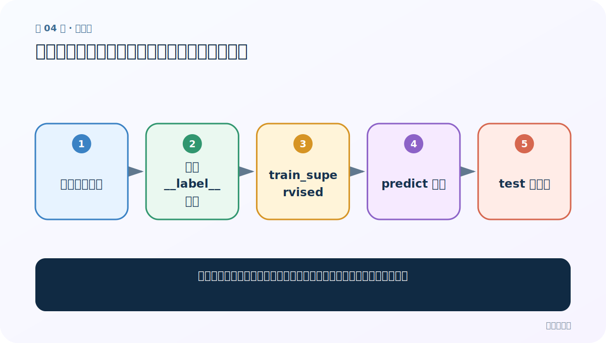
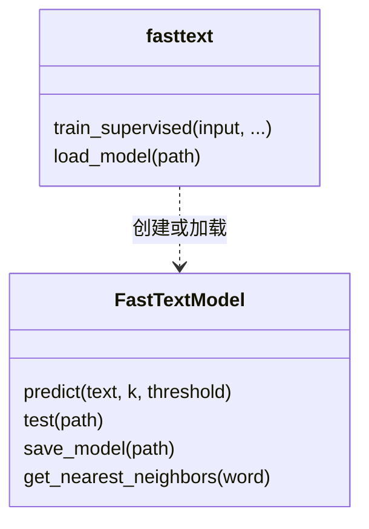
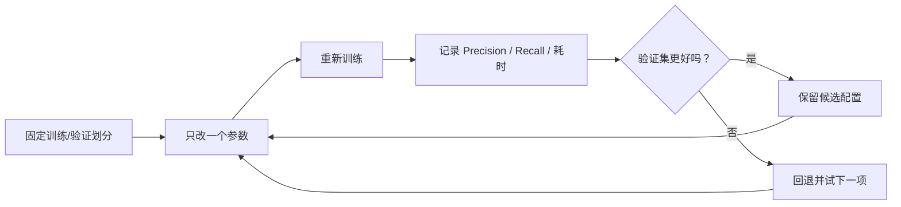

# 第 4 节：直接训练：数据格式、预测、测试与第一版基线

> 笔记编号 4/11 · 对应原视频 P147 · [打开这一集](https://www.bilibili.com/video/BV14mdfBDE4Q?p=147)

[← 上一节：3 负采样：正样本之外，只挑少量“陪练”负样本](./03-negative-sampling.md) · [返回总目录](./README.md) · [下一节：5 数据预处理：统一大小写、分开标点，并保持训练预测一致 →](./05-data-preprocessing.md)

## 这节解决什么问题

怎样用最少代码建立一个可测量的文本分类基线，并正确读懂返回结果？



图从左向右读。先跟着数据或推理过程走一遍，再学习下面的术语。

## 辅助流程图


### FastText 文本分类总流程


### 训练、预测、保存 API 关系



### 调优实验闭环



## 老师原声整理稿（按讲解顺序）

### 0:00–4:51　先分清三类任务

老师先区分二分类、单标签多分类、多标签多分类。单标签多分类表示一条文本只属于 C 类中的一个，常用 Softmax 多类交叉熵；多标签表示多个标签可同时为真，可看成 C 个独立二分类，常用 sigmoid/BCE 思路。在 FastText 中后者可用 OVA 损失。这里的“拆成多个二分类”主要是目标函数层面的理解，不一定要把一行文本真的复制 C 份。

### 4:51–14:43　数据文件与标签格式

案例数据一行包含标签与文本，标签必须带前缀 `__label__`。例如 `__label__sport 球队 赢得 决赛`。多标签样本可在一行放多个 `__label__...`。老师展示了未清洗与已清洗的训练/验证文件，并解释原数据约一万多行、标签数很多；分类训练属于监督学习，所以必须有标签。

### 14:43–19:42　一行训练与默认参数

`fasttext.train_supervised(input=...)` 读取整个训练文件并返回模型。老师进入源码查看默认参数，训练轮数、学习率、维度和损失等都可覆盖。课堂重点不是背下所有默认值，而是知道如何查看当前安装版本的函数帮助；旧视频里的默认值可能随版本变化。

### 19:42–28:34　预测与 test 输出

`model.predict(text)` 返回标签和概率；`model.test(valid_path)` 返回 `(N, P@1, R@1)`。N 是评估样本数量，P@1 是预测的第一个标签有多可靠，R@1 是真实标签被第一个预测覆盖的比例。在单标签任务里两者常接近；多标签任务里含义会不同。训练日志中的 words、labels、progress、words/sec/thread、lr、loss、eta 也被老师逐项讲解。

### 28:34–31:59　低精度不是失败，而是基线

默认参数加未清洗数据得到的指标很低，但速度确实快。老师由此列出优化路线：清洗数据、增加 epoch、调整学习率、加入 word N-gram、替换损失、自动调参、处理多标签、保存加载。正确实验方法是固定验证集、每次只改一项并记录结果，不能只挑一条训练样本看预测是否“像对的”。

## 完整原声逐段记录

[查看本节按时间戳整理的完整音轨转写](./transcripts/p147.md)

逐段记录用于核查老师讲解是否遗漏；正文会进一步纠正口误和语音识别中的技术术语。

## 零基础先记住

- 每个标签以 `__label__` 开头
- `predict` 看个例，`test` 才看整体
- 第一版默认结果是后续比较的基线

## 最小可运行代码

下面代码默认从项目根目录运行；专题配套实现见 [FastText 原理配套练习包](../../fasttext_from_scratch/README.md)。

```python
try:
    import fasttext
except ImportError:
    raise SystemExit("请先在独立环境安装 fasttext；安装方式以当前官方说明为准")

model = fasttext.train_supervised(input="data/train.txt")
print(model.test("data/valid.txt"))
```

### 输入和输出怎么看

`test` 的三元组分别是样本数、P@1、R@1；不要把第一个整数误认为准确率。

## 最容易踩的坑

拿训练文件当验证集，或只凭三条单例预测宣称模型已经很好。

## 本节知识链

`识别分类类型 → 准备 __label__ 数据 → train_supervised → predict 单条 → test 验证集`

## 自测

**问题：为什么建立低分基线仍有价值？**

<details>
<summary>点开核对答案</summary>

它提供固定参照；后续每项清洗或调参是否有效，都能用同一验证集与基线比较。

</details>

## 学完检查

- [ ] 我能用自己的话复述老师的讲解顺序
- [ ] 我能在运行前预测关键输出或张量形状
- [ ] 我知道这节方法最容易用错的地方
- [ ] 我能独立回答自测题

[← 上一节：3 负采样：正样本之外，只挑少量“陪练”负样本](./03-negative-sampling.md) · [返回总目录](./README.md) · [下一节：5 数据预处理：统一大小写、分开标点，并保持训练预测一致 →](./05-data-preprocessing.md)
