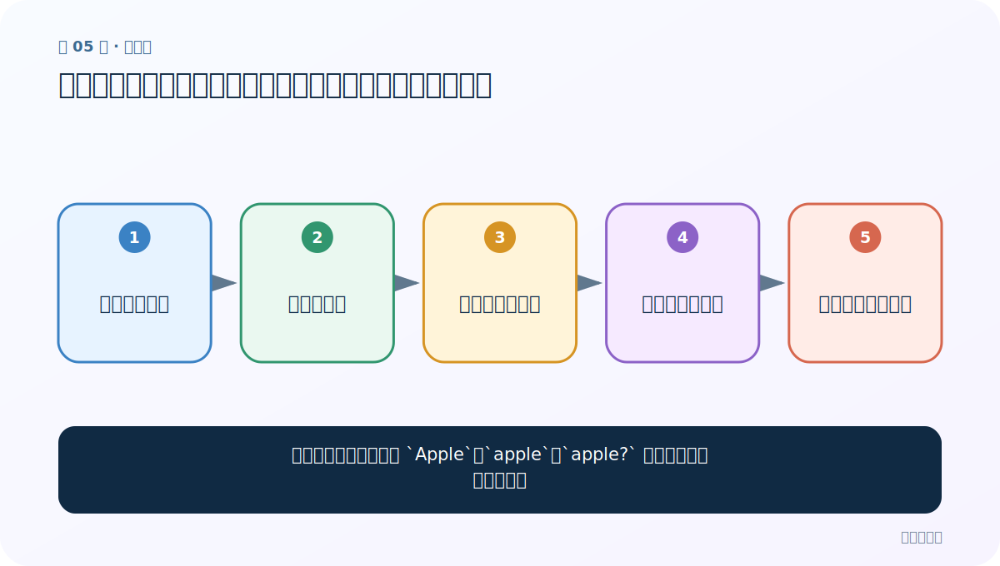
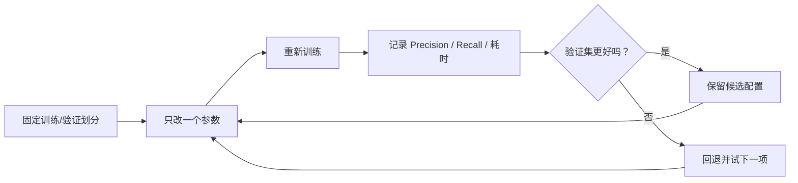

# 第 5 节：数据预处理：统一大小写、分开标点，并保持训练预测一致

> 笔记编号 5/11 · 对应原视频 P148 · [打开这一集](https://www.bilibili.com/video/BV14mdfBDE4Q?p=148)

[← 上一节：4 直接训练：数据格式、预测、测试与第一版基线](./04-direct-training.md) · [返回总目录](./README.md) · [下一节：6 训练轮数与学习率：一个决定看几遍，一个决定每步走多远 →](./06-epochs-learning-rate.md)

## 这节解决什么问题

为什么人眼觉得相同的 `Apple`、`apple`、`apple?` 会被模型当成三个特征？



图从左向右读。先跟着数据或推理过程走一遍，再学习下面的术语。

## 辅助流程图


### FastText 文本分类总流程


### 调优实验闭环



## 老师原声整理稿（按讲解顺序）

### 0:00–1:55　原始数据的问题

老师展示大小写和标点混杂的数据。程序按 token/字符串识别特征，因此 `Apple`、`apple`、`apple?` 默认是不同项，会分散本来属于同一词的统计量。课堂处理是全部转小写，并在词与标点间加入空格，让标点成为独立 token。

### 1:55–4:52　更换清洗后的训练与验证文件

老师复制上一节代码，只替换为处理后的 train/valid 文件；用于单条预测的文本也必须做相同清洗。如果训练时小写、预测时仍保留大写和粘连标点，模型会看到大量未登录或低频特征。工程上应该把清洗封装成同一个函数，训练、验证、推理共同调用，而不是手工按快捷键修改。

### 4:52–6:55　比较结果与继续调优

清洗后课堂指标从约 0.14 提升到约 0.17，说明方向有效，但具体数字只对该次数据划分与配置成立。老师强调 FastText 虽快，但默认精度不一定高，预处理只是第一步；下一节继续 epoch 和学习率。还要注意：不是标点越少越好，情感任务中的 `!`、`?` 可能有信息，应通过验证实验决定保留还是独立分词。

## 完整原声逐段记录

[查看本节按时间戳整理的完整音轨转写](./transcripts/p148.md)

逐段记录用于核查老师讲解是否遗漏；正文会进一步纠正口误和语音识别中的技术术语。

## 零基础先记住

- 模型按离散特征区分大小写与标点
- 训练和推理必须复用同一清洗函数
- 清洗规则要服务任务，不应盲目删除信息

## 最小可运行代码

下面代码默认从项目根目录运行；专题配套实现见 [FastText 原理配套练习包](../../fasttext_from_scratch/README.md)。

```python
from fasttext_from_scratch.data import normalize_text, format_labeled_line
print(normalize_text("Apple,  APPLE?"))
print(format_labeled_line(["fruit"], "Apple,  APPLE?"))
```

### 输入和输出怎么看

文本被统一为小写，标点与词分开；第二行生成合法的 `__label__fruit ...` 格式。

## 最容易踩的坑

只清洗训练集，不清洗验证集和线上输入；这会造成训练—推理分布不一致。

## 本节知识链

`检查原始样本 → 统一大小写 → 标点与单词分离 → 写出新数据文件 → 预测使用同一规则`

## 自测

**问题：为什么不建议把所有标点直接删除？**

<details>
<summary>点开核对答案</summary>

标点有时携带语气和边界信息；先分离，再用验证集决定是否保留更稳妥。

</details>

## 学完检查

- [ ] 我能用自己的话复述老师的讲解顺序
- [ ] 我能在运行前预测关键输出或张量形状
- [ ] 我知道这节方法最容易用错的地方
- [ ] 我能独立回答自测题

[← 上一节：4 直接训练：数据格式、预测、测试与第一版基线](./04-direct-training.md) · [返回总目录](./README.md) · [下一节：6 训练轮数与学习率：一个决定看几遍，一个决定每步走多远 →](./06-epochs-learning-rate.md)
