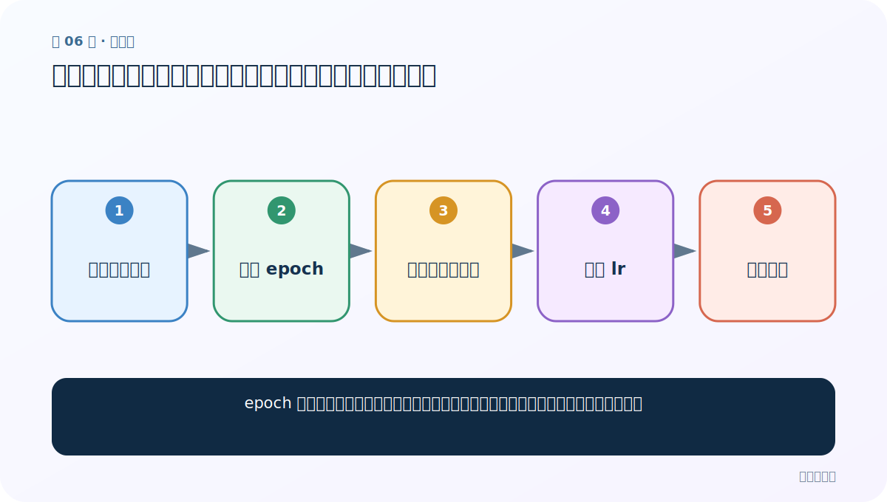
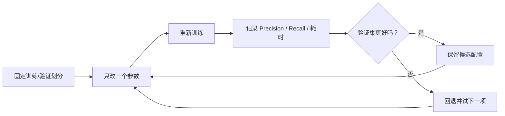

# 第 6 节：训练轮数与学习率：一个决定看几遍，一个决定每步走多远

> 笔记编号 6/11 · 对应原视频 P149 · [打开这一集](https://www.bilibili.com/video/BV14mdfBDE4Q?p=149)

[← 上一节：5 数据预处理：统一大小写、分开标点，并保持训练预测一致](./05-data-preprocessing.md) · [返回总目录](./README.md) · [下一节：7 word N-gram 与损失函数：补一点局部词序，再选合适输出方式 →](./07-ngrams-loss.md)

## 这节解决什么问题

epoch 和学习率都能改变训练效果，它们分别控制什么，为什么不能机械地越大或越小？



图从左向右读。先跟着数据或推理过程走一遍，再学习下面的术语。

## 辅助流程图


### 调优实验闭环



## 老师原声整理稿（按讲解顺序）

### 0:00–4:48　把 epoch 从默认值增大

老师复制清洗后的基线，只加入 `epoch=25`。epoch 表示把训练集完整学习多少轮；轮数增加通常让模型有更多机会拟合模式，也会线性增加训练时间。课堂结果明显提升，但这不证明 25 永远最佳：继续增大可能收益变小甚至过拟合。

### 4:48–7:45　如何确认默认参数

老师再次进入 `train_supervised` 的定义，提醒监督训练可能在通用参数基础上覆盖默认值，应以当前函数签名和帮助为准。这一段的学习目的不是背 `0.05` 或 `0.1`，而是学会分清“通用默认”和“监督任务覆盖值”。

### 7:45–9:15　学习率像下山步长

课堂把 `lr` 调大到 1 并观察指标。学习率控制一次参数更新走多远：太小像每走两步就重新看方向，稳但慢；太大像跨很大步，收敛快却可能越过低谷、震荡或发散。老师要求自己尝试大、小值并计时，而不是背“越小越好”。正确做法是同时记录训练损失、验证指标与耗时，再选组合。

## 完整原声逐段记录

[查看本节按时间戳整理的完整音轨转写](./transcripts/p149.md)

逐段记录用于核查老师讲解是否遗漏；正文会进一步纠正口误和语音识别中的技术术语。

## 零基础先记住

- epoch 是遍历数据的轮数
- lr 是每次更新的步幅
- 二者都要看验证集，不能单调追大或追小

## 最小可运行代码

下面代码默认从项目根目录运行；专题配套实现见 [FastText 原理配套练习包](../../fasttext_from_scratch/README.md)。

```python
import fasttext
model=fasttext.train_supervised(
    input="data/train.clean.txt", epoch=25, lr=0.2
)
print(model.test("data/valid.clean.txt"))
```

### 输入和输出怎么看

在同一清洗数据上以 25 轮、0.2 学习率训练并输出验证指标。

## 最容易踩的坑

调高 epoch 后又换数据集、换划分，却把指标变化都归因于 epoch。

## 本节知识链

`固定清洗数据 → 增加 epoch → 观察耗时与指标 → 调整 lr → 组合验证`

## 自测

**问题：为什么学习率很小不一定更好？**

<details>
<summary>点开核对答案</summary>

有限训练轮数内可能尚未收敛；太小会让每步改动过弱，模型还没学到合适参数就停止。

</details>

## 学完检查

- [ ] 我能用自己的话复述老师的讲解顺序
- [ ] 我能在运行前预测关键输出或张量形状
- [ ] 我知道这节方法最容易用错的地方
- [ ] 我能独立回答自测题

[← 上一节：5 数据预处理：统一大小写、分开标点，并保持训练预测一致](./05-data-preprocessing.md) · [返回总目录](./README.md) · [下一节：7 word N-gram 与损失函数：补一点局部词序，再选合适输出方式 →](./07-ngrams-loss.md)
