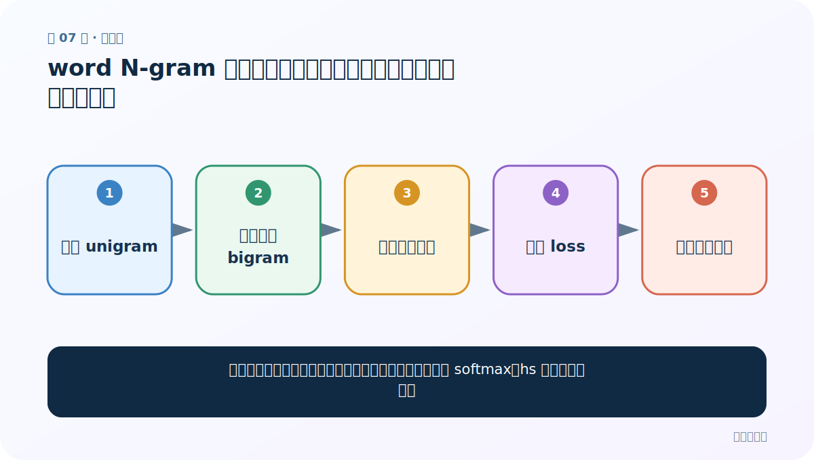
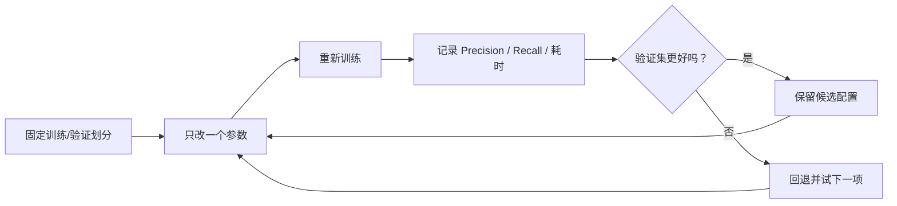
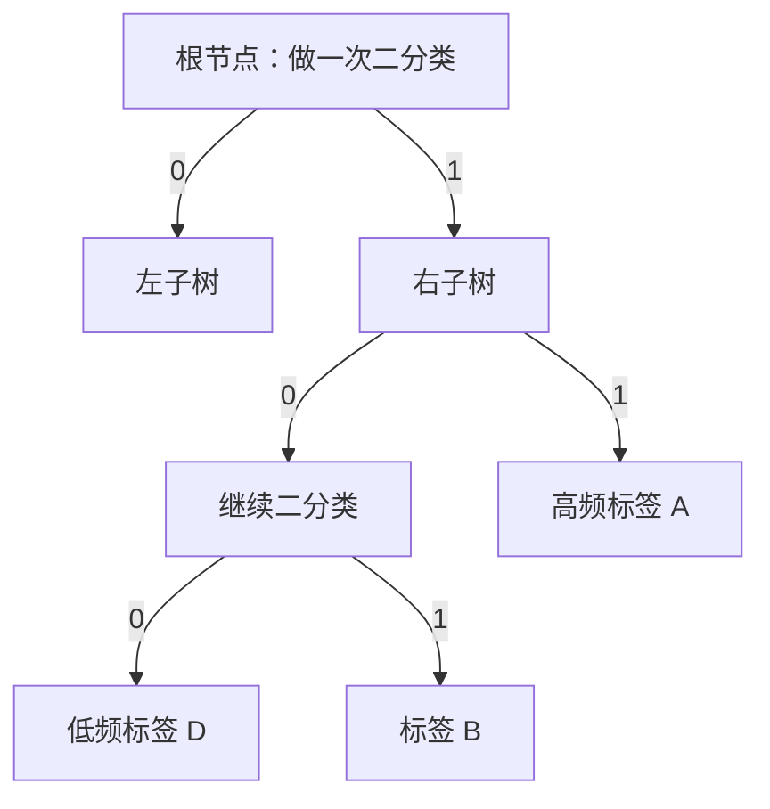

# 第 7 节：word N-gram 与损失函数：补一点局部词序，再选合适输出方式

> 笔记编号 7/11 · 对应原视频 P150 · [打开这一集](https://www.bilibili.com/video/BV14mdfBDE4Q?p=150)

[← 上一节：6 训练轮数与学习率：一个决定看几遍，一个决定每步走多远](./06-epochs-learning-rate.md) · [返回总目录](./README.md) · [下一节：8 自动调参：给验证集和时间预算，让程序寻找更好组合 →](./08-autotune.md)

## 这节解决什么问题

平均词向量会忽略词序，怎样用局部短语特征缓解，并在 softmax、hs 等损失间选择？



图从左向右读。先跟着数据或推理过程走一遍，再学习下面的术语。

## 辅助流程图


### 三层结构与数据形状


### 调优实验闭环



### 层次 Softmax 的哈夫曼路径



## 老师原声整理稿（按讲解顺序）

### 0:00–3:52　从 unigram 到 bigram

`wordNgrams=2` 表示除单词本身外，再加入相邻两个词组成的特征。例如“我 爱 武汉”包含 `我`、`爱`、`武汉`，还加入 `我_爱`、`爱_武汉`。这样“我爱”和“爱我”不再完全一样。课堂建议通常从 2 开始，3-gram 特征更多、训练更慢且更稀疏，需要自己验证。

### 3:52–4:51　调参没有脑内最优解

老师强调参数效果必须实测：加特征有可能提升，也可能因数据少、稀疏或过拟合下降。可靠做法是固定训练/验证划分，一次改一项，记录指标和运行成本，再尝试少量有依据的组合。

### 4:51–8:49　从普通 Softmax 切到层次 Softmax

课堂把 `loss` 从默认 Softmax 改为 `hs`，一行参数即可启用前面讲的层次 Softmax。普通 Softmax 适合类别量不太大且需要完整归一化的场景；`hs` 在类别很多时通过树路径降低计算。这里纠正老师口头混在一起的一点：`hs` 是 hierarchical softmax，`ns` 才是 negative sampling；二者是不同 loss 选项。

### 8:49–9:32　参数要组合验证

切到 `hs` 后还可以重新搜索学习率、epoch 和 N-gram。某个损失在一组参数上更好，不代表所有数据都更好。原理帮助你缩小搜索方向，验证集决定最终选择。

## 完整原声逐段记录

[查看本节按时间戳整理的完整音轨转写](./transcripts/p150.md)

逐段记录用于核查老师讲解是否遗漏；正文会进一步纠正口误和语音识别中的技术术语。

## 零基础先记住

- wordNgrams=2 会保留相邻两个词的局部顺序
- `hs` 与 `ns` 是不同损失选项
- 更多 N-gram 会增加特征稀疏度和计算

## 最小可运行代码

下面代码默认从项目根目录运行；专题配套实现见 [FastText 原理配套练习包](../../fasttext_from_scratch/README.md)。

```python
import fasttext
model=fasttext.train_supervised(
    input="data/train.clean.txt", epoch=25, lr=0.2,
    wordNgrams=2, loss="hs"
)
print(model.test("data/valid.clean.txt"))
```

### 输入和输出怎么看

训练一个包含 unigram/bigram 且使用层次 Softmax 的分类器。

## 最容易踩的坑

把 `wordNgrams=2` 理解成只保留 bigram。FastText 通常同时使用 1 到 N 阶 word N-gram。

## 本节知识链

`加入 unigram → 生成相邻 bigram → 共同嵌入平均 → 选择 loss → 比较验证指标`

## 自测

**问题：加入 bigram 后，“我爱你”和“你爱我”为什么更容易区分？**

<details>
<summary>点开核对答案</summary>

两句的单词集合相同，但相邻二元组分别包含 `我_爱/爱_你` 与 `你_爱/爱_我`。

</details>

## 学完检查

- [ ] 我能用自己的话复述老师的讲解顺序
- [ ] 我能在运行前预测关键输出或张量形状
- [ ] 我知道这节方法最容易用错的地方
- [ ] 我能独立回答自测题

[← 上一节：6 训练轮数与学习率：一个决定看几遍，一个决定每步走多远](./06-epochs-learning-rate.md) · [返回总目录](./README.md) · [下一节：8 自动调参：给验证集和时间预算，让程序寻找更好组合 →](./08-autotune.md)
