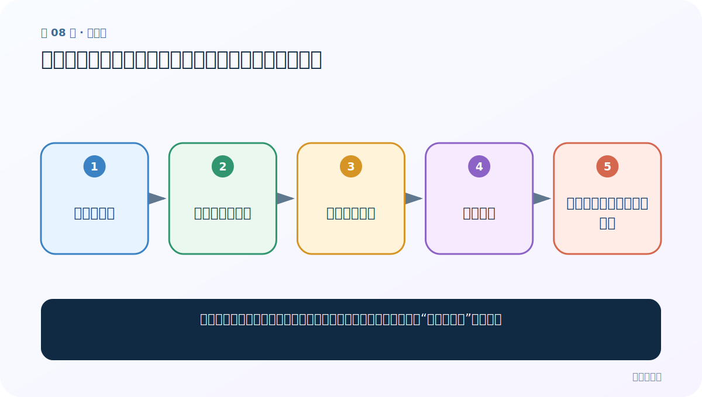
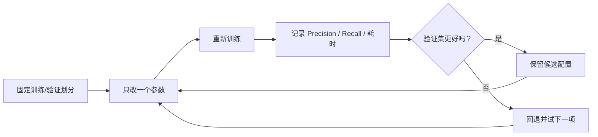

# 第 8 节：自动调参：给验证集和时间预算，让程序寻找更好组合

> 笔记编号 8/11 · 对应原视频 P151 · [打开这一集](https://www.bilibili.com/video/BV14mdfBDE4Q?p=151)

[← 上一节：7 word N-gram 与损失函数：补一点局部词序，再选合适输出方式](./07-ngrams-loss.md) · [返回总目录](./README.md) · [下一节：9 多分类多标签：OVA、k 与 threshold 的完整含义 →](./09-multilabel-ova.md)

## 这节解决什么问题

参数很多时，怎样减少手工复制代码，同时避免只在训练集上挑出“看起来最好”的配置？



图从左向右读。先跟着数据或推理过程走一遍，再学习下面的术语。

## 辅助流程图


### 调优实验闭环



## 老师原声整理稿（按讲解顺序）

### 0:00–2:57　为什么需要自动搜索

手动组合 epoch、lr、N-gram、loss 很累，也容易漏掉更优区域；网格搜索仍需要人为给范围。FastText 提供自动调参接口：传入验证集 `autotuneValidationFile`，再用 `autotuneDuration` 指定搜索时间。课堂用“老板只说三天后交结果，不规定每一步”来类比时间预算。

### 2:57–5:43　三个关键参数

`input` 是训练文件；`autotuneValidationFile` 是用于比较候选模型的验证文件；`autotuneDuration` 以秒计，是搜索预算。时间变长通常能探索更多候选，但不是无限越长越好：验证集可能被反复选择而间接过拟合，计算成本也持续增加。

### 5:43–10:18　等待、保存与迁移学习预告

自动调参会持续到预算结束，课堂短预算结果甚至比手调略低，这很正常。真正实验应在自动搜索后，用从未参与搜索的测试集做一次最终评估，并立即保存模型，避免下次重复搜索。老师借等待时间预告迁移学习：后面会直接加载别人预训练的模型完成完形填空、阅读理解、摘要、分类等任务。

## 完整原声逐段记录

[查看本节按时间戳整理的完整音轨转写](./transcripts/p151.md)

逐段记录用于核查老师讲解是否遗漏；正文会进一步纠正口误和语音识别中的技术术语。

## 零基础先记住

- 训练集拟合参数，验证集挑配置，测试集只做最终报告
- 时间预算不是质量保证
- 自动搜索完成后要保存模型和参数记录

## 最小可运行代码

下面代码默认从项目根目录运行；专题配套实现见 [FastText 原理配套练习包](../../fasttext_from_scratch/README.md)。

```python
import fasttext
model=fasttext.train_supervised(
    input="data/train.clean.txt",
    autotuneValidationFile="data/valid.clean.txt",
    autotuneDuration=180,
)
model.save_model("models/autotuned.bin")
```

### 输入和输出怎么看

最多搜索约 180 秒，返回自动选择配置后的模型并保存。

## 最容易踩的坑

用测试集作为 `autotuneValidationFile`；这样测试结果已经参与选参，不再是公正的最终评估。

## 本节知识链

`准备训练集 → 准备独立验证集 → 设置时间预算 → 自动搜索 → 在未参与调参的测试集复核`

## 自测

**问题：自动调参完成后为什么还需要独立测试集？**

<details>
<summary>点开核对答案</summary>

验证集被反复用于挑选配置，可能产生选择偏差；独立测试集才用于估计未知数据表现。

</details>

## 学完检查

- [ ] 我能用自己的话复述老师的讲解顺序
- [ ] 我能在运行前预测关键输出或张量形状
- [ ] 我知道这节方法最容易用错的地方
- [ ] 我能独立回答自测题

[← 上一节：7 word N-gram 与损失函数：补一点局部词序，再选合适输出方式](./07-ngrams-loss.md) · [返回总目录](./README.md) · [下一节：9 多分类多标签：OVA、k 与 threshold 的完整含义 →](./09-multilabel-ova.md)
