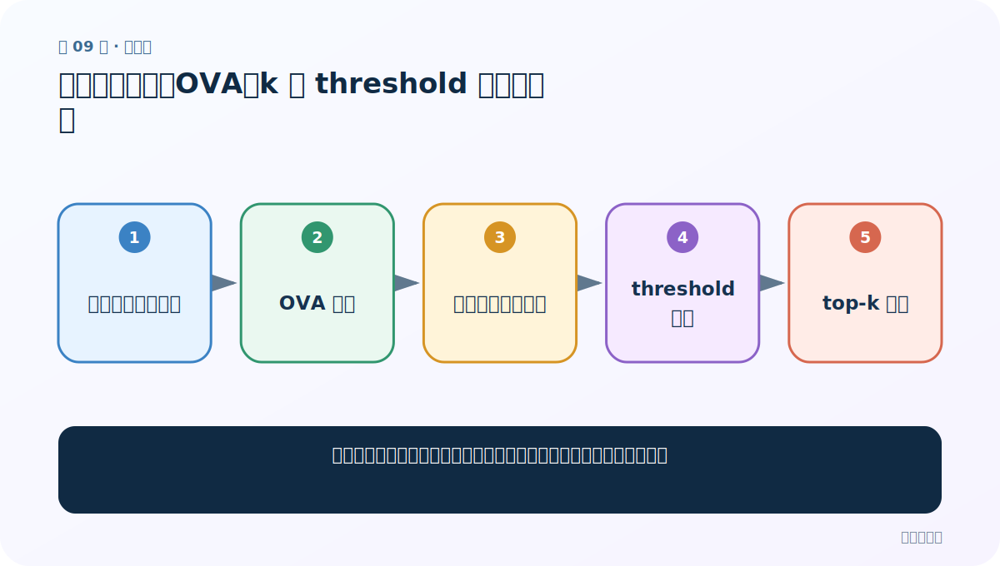
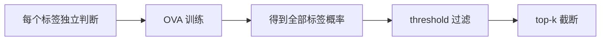
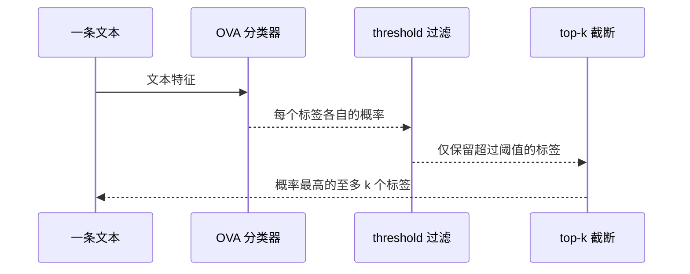
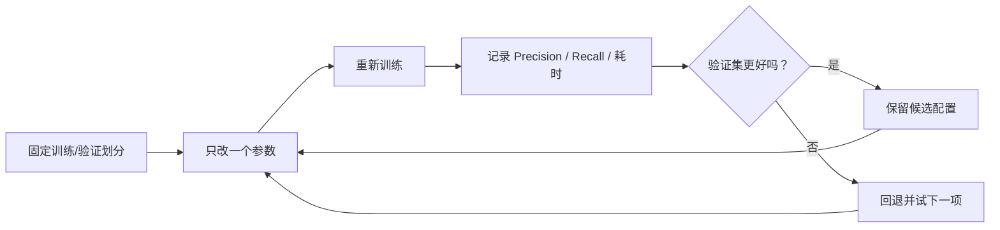

# 第 9 节：多分类多标签：OVA、k 与 threshold 的完整含义

> 笔记编号 9/11 · 对应原视频 P152 · [打开这一集](https://www.bilibili.com/video/BV14mdfBDE4Q?p=152)

[← 上一节：8 自动调参：给验证集和时间预算，让程序寻找更好组合](./08-autotune.md) · [返回总目录](./README.md) · [下一节：10 保存与加载模型：训练一次，部署和复现实验反复使用 →](./10-save-load-model.md)

## 这节解决什么问题

一段文本能同时属于多个标签时，怎样训练并控制最终返回哪些标签？



图从左向右读。先跟着数据或推理过程走一遍，再学习下面的术语。

## 辅助流程图



### 多标签预测时序



### 调优实验闭环



## 老师原声整理稿（按讲解顺序）

### 0:00–3:52　把多标签看成多个二分类

一条文本可同时有“体育”“武汉”“人物”等标签。OVA 是 one-vs-all：针对每个标签都判断“是/不是”。训练文件一行可以带多个 `__label__...`；使用 `loss='ova'` 后，模型为各标签学习相对独立的二分类分数。课堂说“拆成多条二分类”是理解目标的方式，FastText 内部不要求你手工复制成 C 行。

### 3:52–6:48　`k` 和 `threshold` 先后怎样作用

`model.predict(text, k=3, threshold=0.5)` 可按两个条件筛选。先理解 threshold：概率未达到阈值的标签直接排除；再理解 k：在剩余候选中至多返回概率最高的 k 个。所以写 k=3 并不保证一定返回 3 个，只有一个标签过阈值就只返回一个。`k=-1` 表示不设数量上限，但仍应配合理性阈值。

### 6:48–11:33　老师现场改阈值验证

课堂先看到 k=3 只返回一个标签，因为另外两个概率没过 0.5；把阈值降到 0.04 后返回两个，第三个约 0.03 仍被过滤；若再把 k 改 1，则只保留这两个中的最高者。这个实验准确展示了“阈值负责资格，k 负责名额”。阈值不应凭感觉固定 0.5，应依据每类 Precision/Recall 或业务代价在验证集上选。

## 完整原声逐段记录

[查看本节按时间戳整理的完整音轨转写](./transcripts/p152.md)

逐段记录用于核查老师讲解是否遗漏；正文会进一步纠正口误和语音识别中的技术术语。

## 零基础先记住

- OVA 为每个标签做独立的是/否判断
- threshold 决定能不能入围，k 决定最多留几个
- 多标签评估不应只看 Accuracy

## 最小可运行代码

下面代码默认从项目根目录运行；专题配套实现见 [FastText 原理配套练习包](../../fasttext_from_scratch/README.md)。

```python
import fasttext
model=fasttext.train_supervised(
    input="data/train.multilabel.txt", epoch=25, lr=0.2,
    wordNgrams=2, loss="ova"
)
labels, probs = model.predict("sample text", k=3, threshold=0.5)
print(list(zip(labels, probs)))
```

### 输入和输出怎么看

返回概率达到 0.5 的候选中至多 3 个标签，可能是 0、1、2 或 3 个。

## 最容易踩的坑

认为 `k=3` 会强制凑满三个标签；真正数量还受 threshold 限制。

## 本节知识链

`每个标签独立判断 → OVA 训练 → 得到全部标签概率 → threshold 过滤 → top-k 截断`

## 自测

**问题：候选概率为 0.93、0.40、0.03，k=3、threshold=0.5 时返回几个？**

<details>
<summary>点开核对答案</summary>

只返回 1 个，因为只有 0.93 达到阈值；k 只是上限。

</details>

## 学完检查

- [ ] 我能用自己的话复述老师的讲解顺序
- [ ] 我能在运行前预测关键输出或张量形状
- [ ] 我知道这节方法最容易用错的地方
- [ ] 我能独立回答自测题

[← 上一节：8 自动调参：给验证集和时间预算，让程序寻找更好组合](./08-autotune.md) · [返回总目录](./README.md) · [下一节：10 保存与加载模型：训练一次，部署和复现实验反复使用 →](./10-save-load-model.md)
