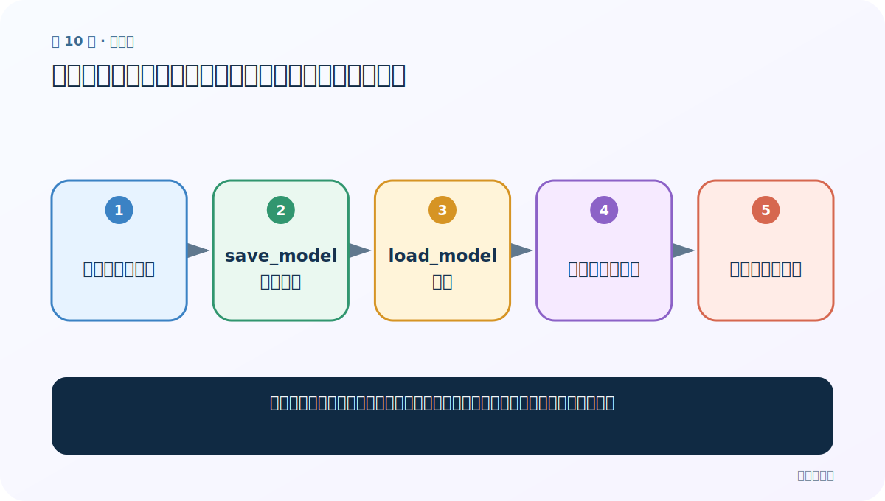
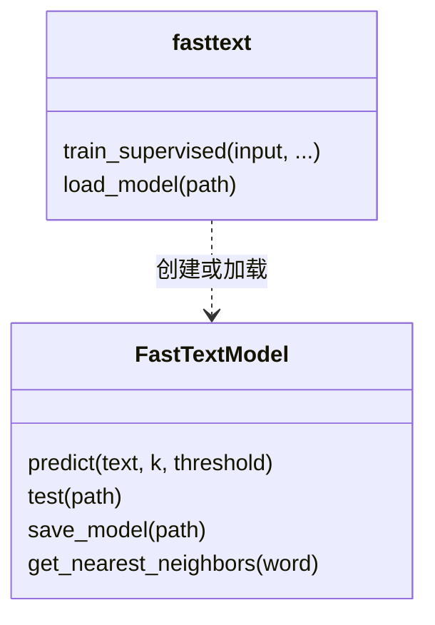

# 第 10 节：保存与加载模型：训练一次，部署和复现实验反复使用

> 笔记编号 10/11 · 对应原视频 P153 · [打开这一集](https://www.bilibili.com/video/BV14mdfBDE4Q?p=153)

[← 上一节：9 多分类多标签：OVA、k 与 threshold 的完整含义](./09-multilabel-ova.md) · [返回总目录](./README.md) · [下一节：11 词向量迁移：把别人训练好的语义坐标系拿来起步 →](./11-pretrained-vectors-transfer.md)

## 这节解决什么问题

调参跑了一小时，如果不想下次重新训练，模型、词表和配置应怎样保存与验证？



图从左向右读。先跟着数据或推理过程走一遍，再学习下面的术语。

## 辅助流程图


### 训练、预测、保存 API 关系



## 老师原声整理稿（按讲解顺序）

### 0:00–2:58　为什么必须保存

老师从自动调参可能耗时一小时切入：训练结束不保存，下次使用就得全部重跑。先创建模型目录，调用 `model.save_model('models/fasttext.bin')`。扩展名并不是 PyTorch 固定的 `.pth`；FastText 常用 `.bin`，关键是使用库对应的保存/加载接口。

### 2:58–5:42　加载后必须用新对象验证

用 `fasttext.load_model(path)` 得到新对象 `model2`，随后应调用 `model2.predict(...)`，而不是误用内存里的旧 `model`。老师现场纠正了这个变量细节，并检查保存目录确实出现文件。更可靠的验收是：同一输入在保存前后标签与概率一致或在容许误差内一致。

### 5:46–9:30　专题总结与课堂题

老师复盘 `predict`、`test`、`save_model`、`load_model`，以及 epoch、lr、wordNgrams、loss、autotune。文本分类包括二分类、单标签多分类、多标签多分类；多标签可用 OVA。课堂题强调：N-gram 通过 `wordNgrams` 配置，保存用 `save_model`，多标签用 `ova`。工程上还应同时保存清洗代码、标签说明、训练数据版本和指标，否则只有二进制文件仍无法解释模型。

## 完整原声逐段记录

[查看本节按时间戳整理的完整音轨转写](./transcripts/p153.md)

逐段记录用于核查老师讲解是否遗漏；正文会进一步纠正口误和语音识别中的技术术语。

## 零基础先记住

- 保存的是训练成果，不只是 Python 对象变量
- 加载后用新对象做回归预测
- 模型文件必须和预处理、标签表、版本记录一起管理

## 最小可运行代码

下面代码默认从项目根目录运行；专题配套实现见 [FastText 原理配套练习包](../../fasttext_from_scratch/README.md)。

```python
import fasttext
model=fasttext.train_supervised(input="data/train.clean.txt")
before=model.predict("sample text")
model.save_model("models/classifier.bin")
loaded=fasttext.load_model("models/classifier.bin")
after=loaded.predict("sample text")
print(before, after)
```

### 输入和输出怎么看

打印保存前和加载后的预测，二者应一致。

## 最容易踩的坑

加载到 `loaded` 后仍调用旧变量 `model`，导致误以为加载验证成功。

## 本节知识链

`训练或自动调参 → save_model 写入磁盘 → load_model 恢复 → 同样输入再预测 → 记录版本与指标`

## 自测

**问题：为什么只保存 `.bin` 还不够？**

<details>
<summary>点开核对答案</summary>

模型依赖同一套清洗、标签语义和库版本；缺少这些信息，线上输入可能不一致，也难以复现实验。

</details>

## 学完检查

- [ ] 我能用自己的话复述老师的讲解顺序
- [ ] 我能在运行前预测关键输出或张量形状
- [ ] 我知道这节方法最容易用错的地方
- [ ] 我能独立回答自测题

[← 上一节：9 多分类多标签：OVA、k 与 threshold 的完整含义](./09-multilabel-ova.md) · [返回总目录](./README.md) · [下一节：11 词向量迁移：把别人训练好的语义坐标系拿来起步 →](./11-pretrained-vectors-transfer.md)
