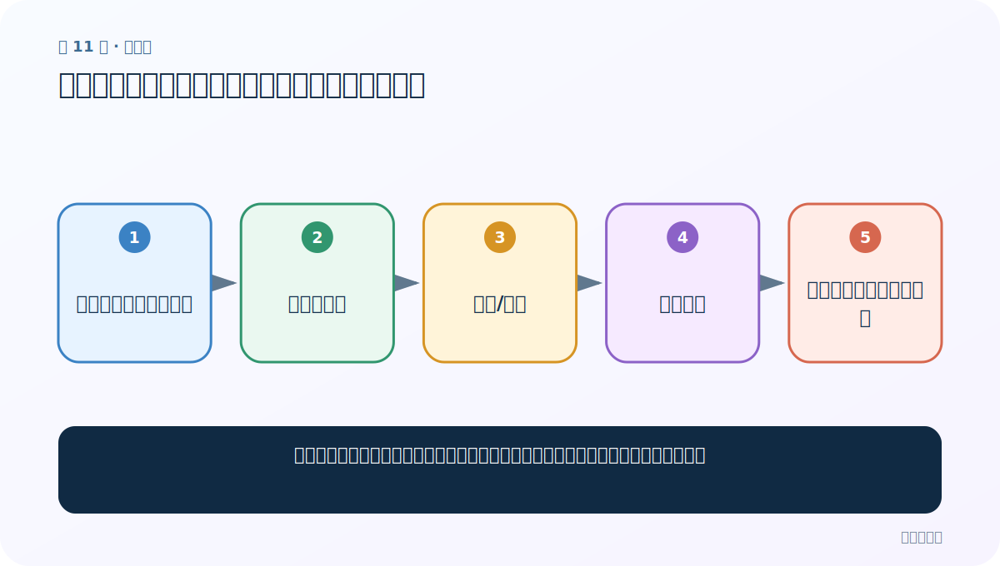
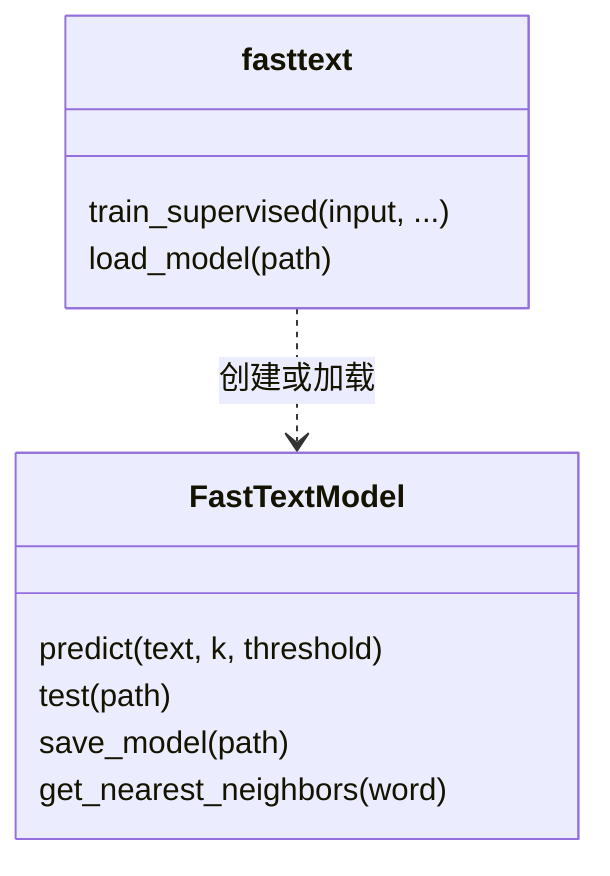

# 第 11 节：词向量迁移：把别人训练好的语义坐标系拿来起步

> 笔记编号 11/11 · 对应原视频 P154 · [打开这一集](https://www.bilibili.com/video/BV14mdfBDE4Q?p=154)

[← 上一节：10 保存与加载模型：训练一次，部署和复现实验反复使用](./10-save-load-model.md) · [返回总目录](./README.md) · 已是最后一节 →

## 这节解决什么问题

自己的标注数据很少时，怎样复用大语料上已经学到的词向量，而不是从随机数开始？



图从左向右读。先跟着数据或推理过程走一遍，再学习下面的术语。

## 辅助流程图


### 训练、预测、保存 API 关系



### FastText 文本分类总流程


## 老师原声整理稿（按讲解顺序）

### 0:00–1:47　回顾三类词表示

老师回顾 one-hot、Word2Vec 与 FastText 词向量，并介绍官方提供多语言预训练向量。迁移的核心是：别人先在大规模语料上学出“词在语义空间中的位置”，我们下载模型或向量后直接使用，或作为自己任务的初始化。大文件下载前要同时考虑压缩包、解压文件和最终模型占用，不能只看下载大小。

### 1:52–3:39　用最近邻做直观检查

加载后可用 `get_nearest_neighbors(word)` 查看最相似的 K 个词。老师回忆此前用某个词找到同类犬种的例子，并因前面 Word2Vec 专题已详细演示而不重复。近邻只能做直观 sanity check，不是下游任务质量的正式评估；错别字、领域词和语言不匹配都可能让结果失真。

### 3:39–4:24　下载、加载与继续训练

课堂把流程压缩为下载、解压、`load_model`、查看近邻或继续训练。迁移并不保证更好：预训练语料与当前领域差异太大时会产生负迁移。还要区分两种文件：可直接 `load_model` 的 FastText 二进制模型，与文本格式 `.vec` 词向量不是同一种加载方式。老师说明这一节是复习，随后正式进入迁移学习。

## 完整原声逐段记录

[查看本节按时间戳整理的完整音轨转写](./transcripts/p154.md)

逐段记录用于核查老师讲解是否遗漏；正文会进一步纠正口误和语音识别中的技术术语。

## 零基础先记住

- 迁移学习复用的是已经学到的参数/表示
- 二进制模型与 `.vec` 文本向量加载方式不同
- 同语言、同领域通常更容易迁移

## 最小可运行代码

下面代码默认从项目根目录运行；专题配套实现见 [FastText 原理配套练习包](../../fasttext_from_scratch/README.md)。

```python
import fasttext
model=fasttext.load_model("models/pretrained.bin")
for score, word in model.get_nearest_neighbors("语言", k=5):
    print(f"{word}: {score:.3f}")
```

### 输入和输出怎么看

打印“语言”的 5 个近邻及余弦相似度；实际结果取决于预训练模型。

## 最容易踩的坑

把任意 `.vec` 路径传给 `load_model`，或认为预训练模型在所有领域都必然提升。

## 本节知识链

`选择同语言预训练向量 → 下载并校验 → 解压/加载 → 检查近邻 → 用于下游任务或继续训练`

## 自测

**问题：词向量迁移为什么可能失败？**

<details>
<summary>点开核对答案</summary>

源语料与目标语料的词义、语言或领域差异过大时，预训练表示会带来不合适的先验，即负迁移。

</details>

## 学完检查

- [ ] 我能用自己的话复述老师的讲解顺序
- [ ] 我能在运行前预测关键输出或张量形状
- [ ] 我知道这节方法最容易用错的地方
- [ ] 我能独立回答自测题

[← 上一节：10 保存与加载模型：训练一次，部署和复现实验反复使用](./10-save-load-model.md) · [返回总目录](./README.md) · 已是最后一节 →
