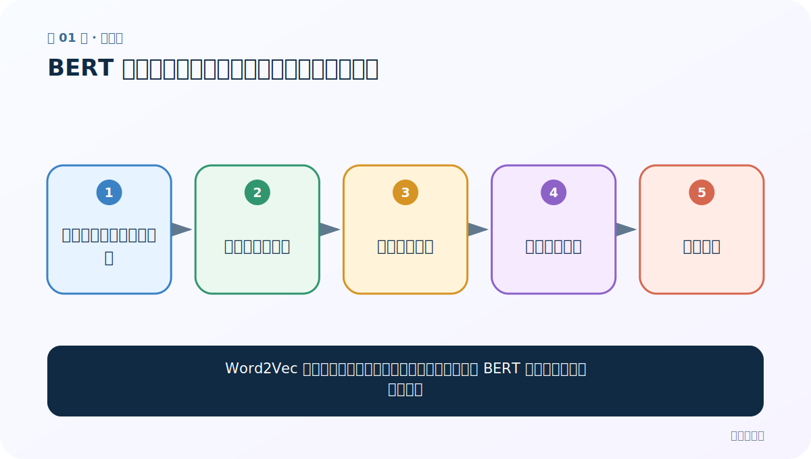
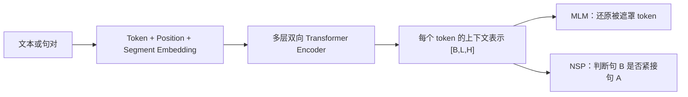
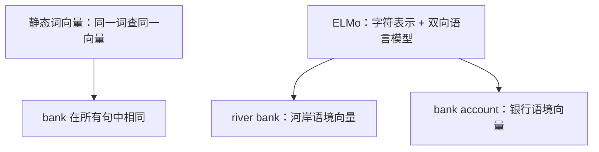

# 第 1 节：BERT 介绍：为什么它能成为通用的文本理解底座

> 笔记编号 1/6 · 对应原视频 P184 · [打开这一集](https://www.bilibili.com/video/BV14mdfBDE4Q?p=184)

← 已是第一节 · [返回总目录](./README.md) · [下一节：2 BERT 架构：三种 Embedding、Encoder 堆叠与关键形状 →](./02-bert-architecture.md)

## 这节解决什么问题

Word2Vec 和单向语言模型已经能学词义，为什么还需要 BERT 的深层双向上下文表示？



图从左向右读。先跟着数据或推理过程走一遍，再学习下面的术语。

## 辅助流程图


### BERT 从输入到预训练目标



### 静态词向量与 ELMo 动态词向量



## 老师原声整理稿（按讲解顺序）

### 0:00–4:56　名字、时间与公开基准

BERT 全称是 Bidirectional Encoder Representations from Transformers，可理解为“来自 Transformer 的双向编码器表示”。老师强调它由 Google 在 2018 年提出，底层依赖 2017 年 Transformer 和注意力机制，并在阅读理解、GLUE 等公开基准上取得当时非常突出的成绩。公开基准的意义是统一数据和评测，避免只在自制数据上宣布“100%”。

### 4:56–10:52　从神经语言模型到 BERT 的时间线

课堂沿时间线回顾：神经语言模型、2013 年 Word2Vec/词表示、RNN/Seq2Seq、2015 年 Attention、2017 年 Transformer、2018 年 ELMo/GPT/BERT。老师借此说明算法、互联网积累的数据和算力共同成熟后，预训练模型才快速发展。年份用于建立脉络，不必把每个模型名称都死背。

### 10:52–18:46　BERT 的主线：深度双向

传统单向语言模型从左到右或从右到左，BiLSTM/ELMo 可把两方向结果拼接；BERT 的关键是多层 Transformer Encoder 中的深度双向上下文。BERT Base 常见配置是 12 层、隐藏维 768、12 个注意力头；每头 64 维。模型每个 token 都能根据左右文得到动态表示。

### 18:46–26:36　老师用“撕开小说”解释只看半边

课堂用多人把小说撕成几份、有人先看结局的故事说明：只读左半边或右半边，语义理解有限；同时掌握前后文更容易推断中间词。这个类比对应 BERT 深度双向，但技术上并不是先完整阅读再把答案泄露给模型，而是用遮罩任务防止目标 token 直接可见。

### 26:36–28:56　用 MLM 与 NSP 实现预训练

为避免模型在双向上下文中直接看到待预测词，BERT 用 Masked Language Modeling；经典 BERT 还用 Next Sentence Prediction 学句间关系。老师把后两节的学习目标收束为：会解释深度双向、MLM 和 NSP，并与 ELMo 的较浅双向方式区分。

## 完整原声逐段记录

[查看本节按时间戳整理的完整音轨转写](./transcripts/p184.md)

逐段记录用于核查老师讲解是否遗漏；正文会进一步纠正口误和语音识别中的技术术语。

## 零基础先记住

- BERT 是 Encoder-only 双向上下文模型
- 预训练参数通过任务头迁移到下游
- 同一 token 的向量会随上下文变化

## 最小可运行代码

下面代码是帮助理解本节概念的最小示例，默认从项目根目录运行。

```python
import torch
from transformers import AutoTokenizer, AutoModel
path="your-bert-checkpoint"
tok=AutoTokenizer.from_pretrained(path)
model=AutoModel.from_pretrained(path).eval()
x=tok(["他去银行办理业务","他坐在河岸边"],padding=True,return_tensors="pt")
with torch.no_grad(): h=model(**x).last_hidden_state
print(h.shape)
```

### 输入和输出怎么看

得到 `[2,L,H]` 上下文化表示；同一词在两句中的向量通常不同。

## 最容易踩的坑

把 BERT 说成 Transformer 的完整编码器+解码器；标准 BERT 只使用 Encoder 堆叠。

## 本节知识链

`静态词向量的多义词问题 → 双向读取上下文 → 大语料预训练 → 加入小任务头 → 下游微调`

## 自测

**问题：为什么 BERT 比静态词向量更能处理多义词？**

<details>
<summary>点开核对答案</summary>

每个 token 表示由当前整句上下文动态计算，而不是永久查同一张词向量表。

</details>

## 学完检查

- [ ] 我能用自己的话复述老师的讲解顺序
- [ ] 我能在运行前预测关键输出或张量形状
- [ ] 我知道这节方法最容易用错的地方
- [ ] 我能独立回答自测题

← 已是第一节 · [返回总目录](./README.md) · [下一节：2 BERT 架构：三种 Embedding、Encoder 堆叠与关键形状 →](./02-bert-architecture.md)
