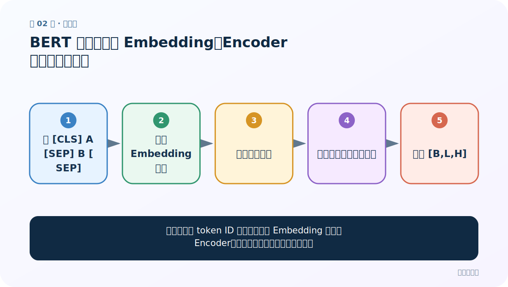
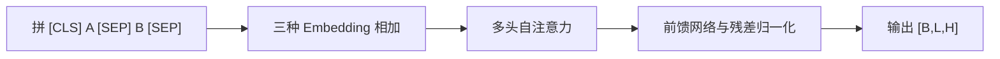
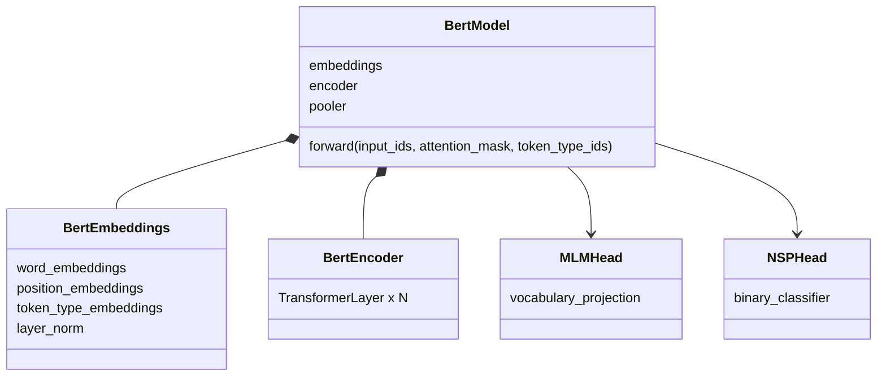
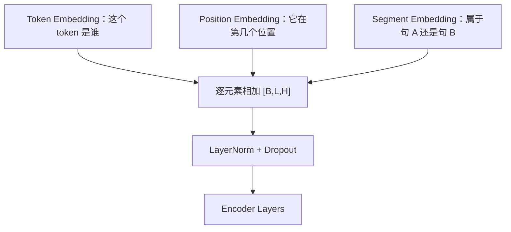

# 第 2 节：BERT 架构：三种 Embedding、Encoder 堆叠与关键形状

> 笔记编号 2/6 · 对应原视频 P185 · [打开这一集](https://www.bilibili.com/video/BV14mdfBDE4Q?p=185)

[← 上一节：1 BERT 介绍：为什么它能成为通用的文本理解底座](./01-bert-introduction.md) · [返回总目录](./README.md) · [下一节：3 BERT 预训练任务：MLM 与 NSP 怎样共同制造监督 →](./03-bert-mlm-nsp.md)

## 这节解决什么问题

一对句子的 token ID 怎样经过三种 Embedding 和多层 Encoder，变成可供各种任务使用的表示？



图从左向右读。先跟着数据或推理过程走一遍，再学习下面的术语。

## 辅助流程图



### BERT 模块 UML



### BERT 输入三种 Embedding



## 老师原声整理稿（按讲解顺序）

### 0:00–1:55　特殊 token 与句段

句对通常拼为 `[CLS] 句A [SEP] 句B [SEP]`。课堂把 `[CLS]` 解释为分类/汇总标记、`[SEP]` 解释为分隔/结束标记。注意 `[SEP]` 不是整个模型的 EOS 生成停止符，它主要做输入边界。

### 1:55–4:52　三种 Embedding 为什么相加

Token Embedding 表示 token 身份；Segment/Token Type Embedding 表示 A 段或 B 段；Position Embedding 表示位置。三者形状都是 `[B,L,H]`，逐元素相加，不是拼接。若 `[1,32,768]`，含义是 1 条序列 × 32 个 token 位置 × 每位置 768 维。老师还顺带提到后来模型会使用旋转位置编码等改进，但标准 BERT 用学习式绝对位置嵌入。

### 4:52–7:49　只使用 Transformer Encoder

BERT 不使用原始 Transformer Decoder。多层 Encoder 的自注意力是双向的；每层还含前馈网络、残差和归一化。主体输出 `last_hidden_state [B,L,H]`。

### 7:49–10:54　四类下游任务头

老师按原论文图解释：句对分类（相似、蕴含/矛盾等）、单句分类（情感）、抽取式问答（起止位置）、单句 token 标注（NER）。底部预训练 BERT 相同，顶部任务头和输出形状不同；微调时复用主体、按任务改变顶层。

## 完整原声逐段记录

[查看本节按时间戳整理的完整音轨转写](./transcripts/p185.md)

逐段记录用于核查老师讲解是否遗漏；正文会进一步纠正口误和语音识别中的技术术语。

## 零基础先记住

- 三种 Embedding 相加而非拼接
- Encoder 输出每个 token 的上下文表示
- 不同任务头读取同一主体的不同粒度

## 最小可运行代码

下面代码是帮助理解本节概念的最小示例，默认从项目根目录运行。

```python
from transformers import AutoTokenizer
tok=AutoTokenizer.from_pretrained("your-bert-checkpoint")
batch=tok("句子A","句子B",return_tensors="pt")
for k,v in batch.items():
    print(k,tuple(v.shape),v.tolist())
```

### 输入和输出怎么看

通常看到 input_ids、attention_mask、token_type_ids，形状均为 `[1,L]`。

## 最容易踩的坑

以为 token_type_ids=1 表示有效 token；有效/PAD 由 attention_mask 表示，段别由 token_type_ids 表示。

## 本节知识链

`拼 [CLS] A [SEP] B [SEP] → 三种 Embedding 相加 → 多头自注意力 → 前馈网络与残差归一化 → 输出 [B,L,H]`

## 自测

**问题：为什么三种 Embedding 可以相加？**

<details>
<summary>点开核对答案</summary>

它们为同一批、同一位置都提供 H 维表示，形状一致；相加把身份、位置和段信息融合进同一向量空间。

</details>

## 学完检查

- [ ] 我能用自己的话复述老师的讲解顺序
- [ ] 我能在运行前预测关键输出或张量形状
- [ ] 我知道这节方法最容易用错的地方
- [ ] 我能独立回答自测题

[← 上一节：1 BERT 介绍：为什么它能成为通用的文本理解底座](./01-bert-introduction.md) · [返回总目录](./README.md) · [下一节：3 BERT 预训练任务：MLM 与 NSP 怎样共同制造监督 →](./03-bert-mlm-nsp.md)
