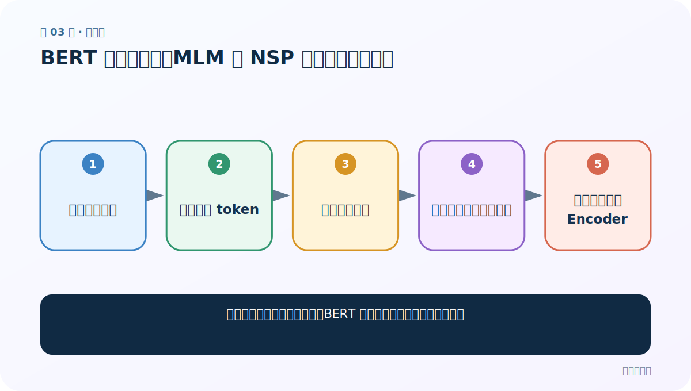
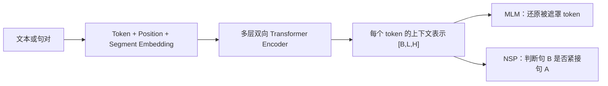
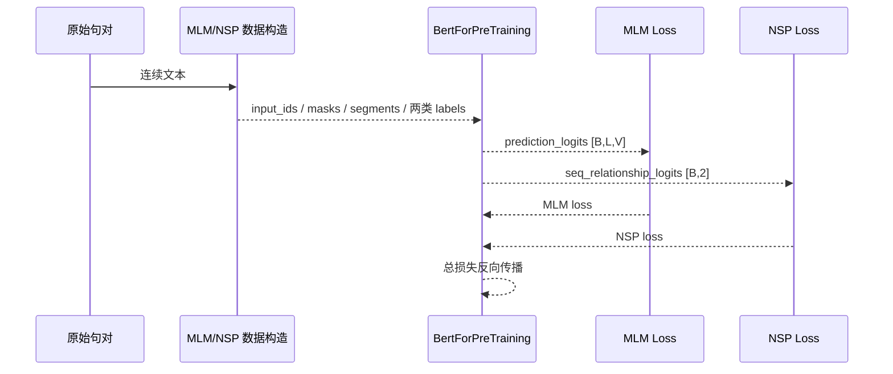

# 第 3 节：BERT 预训练任务：MLM 与 NSP 怎样共同制造监督

> 笔记编号 3/6 · 对应原视频 P186 · [打开这一集](https://www.bilibili.com/video/BV14mdfBDE4Q?p=186)

[← 上一节：2 BERT 架构：三种 Embedding、Encoder 堆叠与关键形状](./02-bert-architecture.md) · [返回总目录](./README.md) · [下一节：4 BERT 总结：MLM/NSP 复盘，以及 GLUE 与 CLUE 公共评测 →](./04-bert-summary.md)

## 这节解决什么问题

没有人工标签的大规模文本，BERT 从哪里得到可计算的训练目标？



图从左向右读。先跟着数据或推理过程走一遍，再学习下面的术语。

## 辅助流程图


### BERT 从输入到预训练目标



### BERT 一批预训练数据的时序



## 老师原声整理稿（按讲解顺序）

### 0:00–6:30　MLM：从原文自己造标签

随机选取一部分 token 作为预测目标，常见 BERT 方案约 15%。选中位置中约 80% 换 `[MASK]`、10% 换随机 token、10% 保持原 token；labels 保存原 token ID，其他位置设忽略值。模型输出 `[B,L,V]`，只在选中位置算词表交叉熵。

### 6:30–12:30　为什么不能把输入全遮住

模型需要上下文才能推断目标；全部遮罩会丢失句意。只替换 MASK 又会造成预训练看到特殊符号、下游不看到的差距，因此混入随机词和原词。经典比例是设计选择，不是自然定律。

### 12:30–18:30　NSP：句 B 是否真接句 A

从文档取句 A；一半用真实下一句 B，一半换随机句，标签常为 IsNext/NotNext。输入 `[CLS] A [SEP] B [SEP]`，句对头输出 `[B,2]`。NSP 希望学习句间关系，但负样本过简单会让模型走主题匹配捷径。后续 RoBERTa 等研究说明去掉 NSP 也能很好，因此不要把 NSP 当成所有 BERT 类模型不可缺少的真理。

### 18:30–24:00　联合损失

这里先说明公式解决什么问题：同一 Encoder 要同时学 token 级恢复和句对级关系。经典训练把两项损失相加：`L = L_MLM + L_NSP`（也可带权）。反向传播让共享 Encoder 同时服务两个目标。预训练完成后通常丢弃这两个头，换上下游任务头。

## 完整原声逐段记录

[查看本节按时间戳整理的完整音轨转写](./transcripts/p186.md)

逐段记录用于核查老师讲解是否遗漏；正文会进一步纠正口误和语音识别中的技术术语。

## 零基础先记住

- MLM 与 NSP 标签都可从原始文本自动构造
- MLM 只监督被选中的位置
- NSP 并非所有后续模型都保留

## 最小可运行代码

下面代码是帮助理解本节概念的最小示例，默认从项目根目录运行。

```python
from transformers import AutoModelForPreTraining
model=AutoModelForPreTraining.from_pretrained("your-bert-pretraining-checkpoint")
out=model(
    input_ids=batch["input_ids"],
    attention_mask=batch["attention_mask"],
    token_type_ids=batch.get("token_type_ids"),
    labels=mlm_labels,
    next_sentence_label=nsp_labels,
)
print(out.loss,out.prediction_logits.shape,out.seq_relationship_logits.shape)
```

### 输入和输出怎么看

得到总 loss、MLM `[B,L,V]` logits 和 NSP `[B,2]` logits。

## 最容易踩的坑

把 MLM labels 设成遮罩后的输入 ID，而不是遮罩前的真实 ID。

## 本节知识链

`原始连续文本 → 随机遮罩 token → 构造真假句对 → 同时预测词与句间关系 → 联合损失更新 Encoder`

## 自测

**问题：BERT 预训练为什么不需要人工逐条标注？**

<details>
<summary>点开核对答案</summary>

MLM 的原词和 NSP 的句子顺序都能从原始连续文本自动构造监督信号。

</details>

## 学完检查

- [ ] 我能用自己的话复述老师的讲解顺序
- [ ] 我能在运行前预测关键输出或张量形状
- [ ] 我知道这节方法最容易用错的地方
- [ ] 我能独立回答自测题

[← 上一节：2 BERT 架构：三种 Embedding、Encoder 堆叠与关键形状](./02-bert-architecture.md) · [返回总目录](./README.md) · [下一节：4 BERT 总结：MLM/NSP 复盘，以及 GLUE 与 CLUE 公共评测 →](./04-bert-summary.md)
