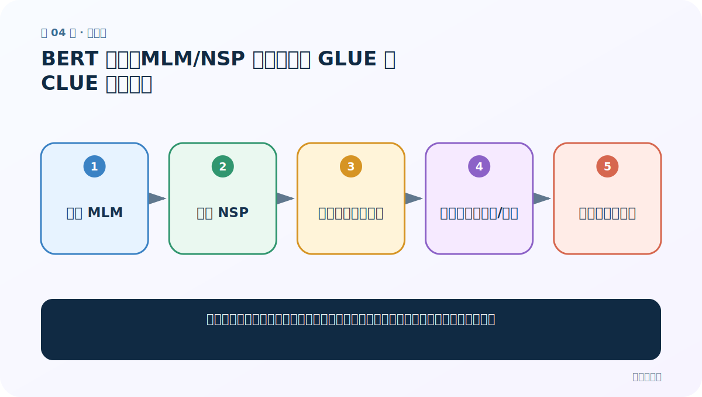
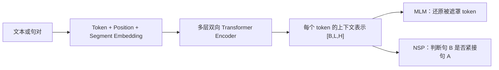
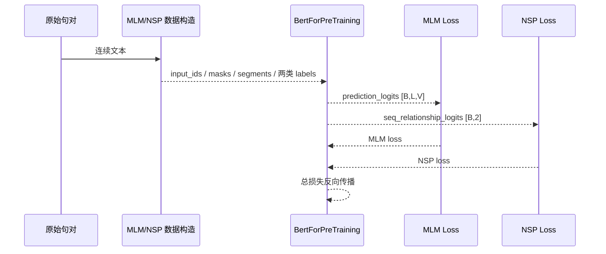

# 第 4 节：BERT 总结：MLM/NSP 复盘，以及 GLUE 与 CLUE 公共评测

> 笔记编号 4/6 · 对应原视频 P187 · [打开这一集](https://www.bilibili.com/video/BV14mdfBDE4Q?p=187)

[← 上一节：3 BERT 预训练任务：MLM 与 NSP 怎样共同制造监督](./03-bert-mlm-nsp.md) · [返回总目录](./README.md) · [下一节：5 ELMo：在 Transformer 之前，双向语言模型怎样生成动态词向量 →](./05-elmo-introduction.md)

## 这节解决什么问题

自己数据上分数很高还不够，怎样用公开基准与标准提交证明模型具备可比较的能力？



图从左向右读。先跟着数据或推理过程走一遍，再学习下面的术语。

## 辅助流程图


### BERT 从输入到预训练目标



### BERT 一批预训练数据的时序



## 老师原声整理稿（按讲解顺序）

### 0:00–0:56　两个预训练任务一句话复盘

MLM 通过 15% 候选位置与 80/10/10 替换，让 BERT 学单词在上下文中的含义；NSP 用真实/随机句对，让模型学句间关系。两项结合使经典 BERT 同时具备 token 级和句对级理解。

### 0:56–2:51　GLUE 为什么比自制测试更可信

GLUE 是由多个公开英文自然语言理解任务组成的基准。各研究者使用相同数据划分和指标，结果才可横向比较。老师强调：在自己的小数据上 100% 不足以证明模型好，公开基准结果更容易被行业认可。

### 2:52–4:36　中文对应的 CLUE

英文 GLUE 之外，中文有 CLUE 等公开评测，覆盖分类、阅读理解、自然语言推断等任务。使用时应读取每个子任务的许可证、字段、指标和提交规则；测试标签通常不公开，需要把预测提交到官方平台获得分数。

### 4:36–4:57　数据来源和简历表达

公开平台也可作为标准数据来源，但不要只报一个总分；应写清模型版本、子任务、验证/测试集、指标和复现实验设置。正文保留老师鼓励大家挑战榜单的意图，同时提醒公开榜单也可能受数据泄漏和反复调参影响。

## 完整原声逐段记录

[查看本节按时间戳整理的完整音轨转写](./transcripts/p187.md)

逐段记录用于核查老师讲解是否遗漏；正文会进一步纠正口误和语音识别中的技术术语。

## 零基础先记住

- GLUE 主攻英文理解任务，CLUE 面向中文
- 公开基准让结果可比较
- 必须写清子任务、split 和指标

## 最小可运行代码

下面代码是帮助理解本节概念的最小示例，默认从项目根目录运行。

```python
# 示意：统一记录每个公开子任务的结果，而不是只写“效果很好”
results = {
    "task_name": "your-clue-subtask",
    "split": "validation",
    "metric": "accuracy",
    "score": 0.0,
    "checkpoint": "your-checkpoint",
}
print(results)
```

### 输入和输出怎么看

输出一条可复现实验记录；实际评测应调用对应数据集的官方 metric/提交脚本。

## 最容易踩的坑

在公开 test 集上反复调参，或把 validation 分数写成官方 test 分数。

## 本节知识链

`复盘 MLM → 复盘 NSP → 选择公开基准任务 → 按官方划分训练/提交 → 与统一榜单比较`

## 自测

**问题：为什么公开基准比自制数据上的单个高分更有说服力？**

<details>
<summary>点开核对答案</summary>

数据、划分和指标统一，别人能复现并与其他模型公平比较。

</details>

## 学完检查

- [ ] 我能用自己的话复述老师的讲解顺序
- [ ] 我能在运行前预测关键输出或张量形状
- [ ] 我知道这节方法最容易用错的地方
- [ ] 我能独立回答自测题

[← 上一节：3 BERT 预训练任务：MLM 与 NSP 怎样共同制造监督](./03-bert-mlm-nsp.md) · [返回总目录](./README.md) · [下一节：5 ELMo：在 Transformer 之前，双向语言模型怎样生成动态词向量 →](./05-elmo-introduction.md)
