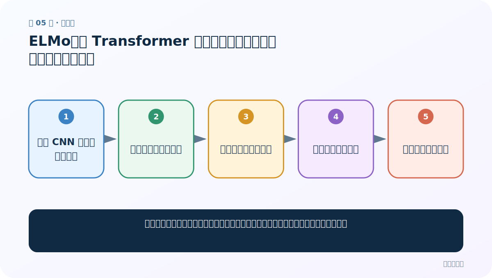
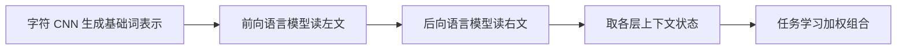
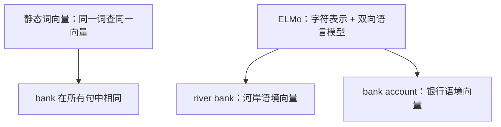
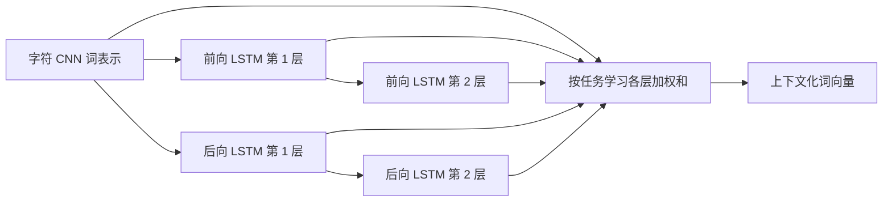

# 第 5 节：ELMo：在 Transformer 之前，双向语言模型怎样生成动态词向量

> 笔记编号 5/6 · 对应原视频 P188 · [打开这一集](https://www.bilibili.com/video/BV14mdfBDE4Q?p=188)

[← 上一节：4 BERT 总结：MLM/NSP 复盘，以及 GLUE 与 CLUE 公共评测](./04-bert-summary.md) · [返回总目录](./README.md) · [下一节：6 GPT：因果注意力怎样把“预测下一个 token”扩展成文本生成 →](./06-gpt-introduction.md)

## 这节解决什么问题

同一个词在不同句子含义不同，怎样不用固定查表，而是让整句上下文决定它的向量？



图从左向右读。先跟着数据或推理过程走一遍，再学习下面的术语。

## 辅助流程图



### 静态词向量与 ELMo 动态词向量



### ELMo 双向语言模型



## 老师原声整理稿（按讲解顺序）

### 0:00–5:30　从静态到动态

Word2Vec/GloVe 为一个词存一个固定向量，无法让 bank 在“river bank”和“bank account”中改变。ELMo 的名字来自 Embeddings from Language Models：词表示由整句经过双向语言模型后动态产生，同一词在不同上下文得到不同向量。

### 5:30–11:30　字符层与双向 LSTM

底层字符 CNN 帮助处理词形和未登录词；前向多层 LSTM 根据左侧预测下一个词，后向多层 LSTM 根据右侧预测前一个词。两方向独立训练/表示后合并，因此每个位置同时包含左、右上下文。

### 11:30–17:30　为什么要混合不同层

浅层更偏词法/句法，深层更偏语义。ELMo 不只取最后一层，而让具体下游任务学习各层的 softmax 归一化权重，再做加权和并乘缩放系数。这里公式解决的问题是让任务自己决定“更需要哪一层”：`ELMo_k = γ Σ_j s_j h_{k,j}`。

### 17:30–22:00　与 BERT 的关系

两者都生成上下文化表示，但 ELMo 主体是字符表示加双向 LSTM，前后方向不是同一层全局自注意力；BERT 用 Transformer Encoder 和 MLM 预训练，可深层联合双向交互。ELMo 仍有历史和概念价值：它清楚展示了“预训练语言模型表示迁移到下游”的转折。

## 完整原声逐段记录

[查看本节按时间戳整理的完整音轨转写](./transcripts/p188.md)

逐段记录用于核查老师讲解是否遗漏；正文会进一步纠正口误和语音识别中的技术术语。

## 零基础先记住

- ELMo 是上下文化动态词向量
- 主体是字符 CNN + 双向多层 LSTM
- 下游任务学习各层加权组合

## 最小可运行代码

下面代码是帮助理解本节概念的最小示例，默认从项目根目录运行。

```python
# 概念演示：不同任务对同一位置的多层表示做加权和
import torch
layers=torch.randn(3,8,1024)  # 3 层 × 8 个 token × 1024 维
weights=torch.softmax(torch.tensor([0.2,0.5,0.3]),dim=0)
elmo=(weights[:,None,None]*layers).sum(0)
print(elmo.shape)
```

### 输入和输出怎么看

把 3 层表示加权后得到 `[8,1024] = 8 个 token × 每 token 1024 维`。

## 最容易踩的坑

把 ELMo 说成 Transformer 模型；它的核心上下文编码器是双向 LSTM。

## 本节知识链

`字符 CNN 生成基础词表示 → 前向语言模型读左文 → 后向语言模型读右文 → 取各层上下文状态 → 任务学习加权组合`

## 自测

**问题：为什么 ELMo 不只用最后一层？**

<details>
<summary>点开核对答案</summary>

不同层包含不同层次的语言信息，下游任务学习加权能按需求组合句法与语义特征。

</details>

## 学完检查

- [ ] 我能用自己的话复述老师的讲解顺序
- [ ] 我能在运行前预测关键输出或张量形状
- [ ] 我知道这节方法最容易用错的地方
- [ ] 我能独立回答自测题

[← 上一节：4 BERT 总结：MLM/NSP 复盘，以及 GLUE 与 CLUE 公共评测](./04-bert-summary.md) · [返回总目录](./README.md) · [下一节：6 GPT：因果注意力怎样把“预测下一个 token”扩展成文本生成 →](./06-gpt-introduction.md)
