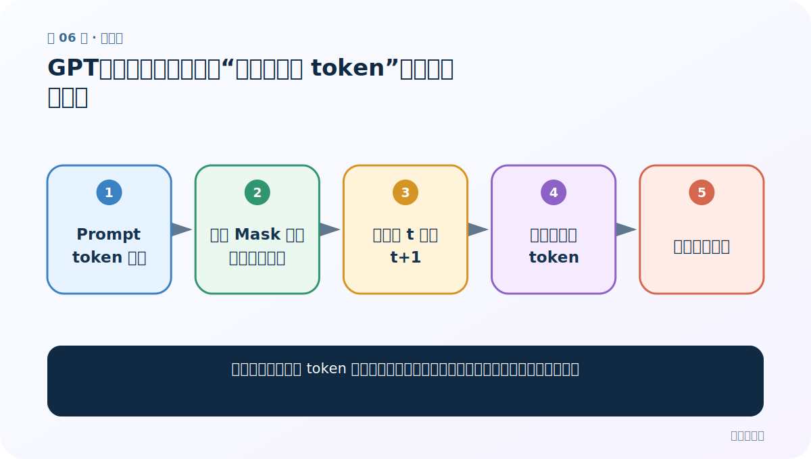
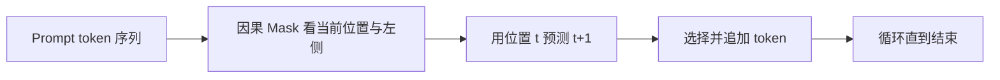
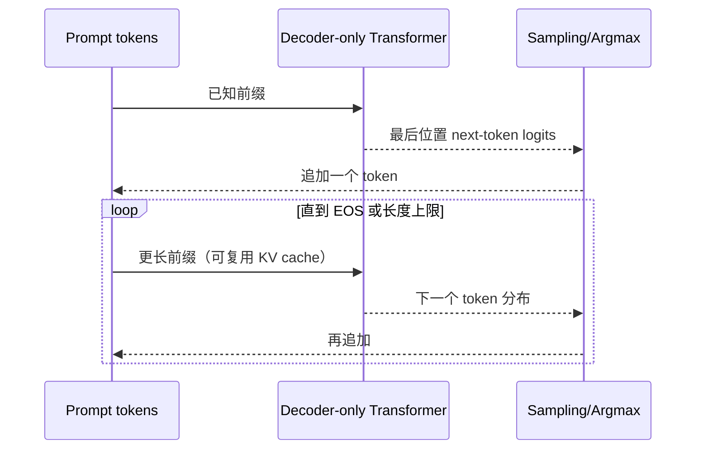
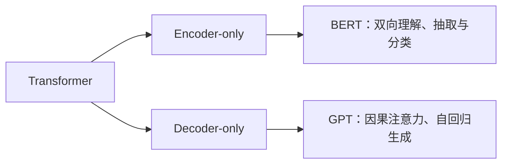

# 第 6 节：GPT：因果注意力怎样把“预测下一个 token”扩展成文本生成

> 笔记编号 6/6 · 对应原视频 P189 · [打开这一集](https://www.bilibili.com/video/BV14mdfBDE4Q?p=189)

[← 上一节：5 ELMo：在 Transformer 之前，双向语言模型怎样生成动态词向量](./05-elmo-introduction.md) · [返回总目录](./README.md) · 已是最后一节 →

## 这节解决什么问题

只训练一个下一个 token 预测任务，为什么模型能逐步生成段落并迁移到多种任务？



图从左向右读。先跟着数据或推理过程走一遍，再学习下面的术语。

## 辅助流程图



### GPT 自回归生成时序



### Encoder-only 与 Decoder-only



## 老师原声整理稿（按讲解顺序）

### 0:00–3:53　GPT 只保留 Decoder 的哪些部分

GPT 是 Generative Pre-trained Transformer，经典 GPT-1 在 2018 年提出，使用 Decoder-only Transformer。因为没有 Encoder，所以原始 Decoder 中读取 Encoder 输出的交叉注意力被移除，只保留 masked self-attention、前馈网络等。老师用图比较 BERT 主理解/NLU、GPT 主生成/NLG。

### 3:53–7:51　因果遮罩不许偷看未来

BERT Encoder 自注意力可双向看上下文；GPT 的位置 t 可以读取位置 `≤t` 的输入 token，也就是当前位置和左侧前缀，但不能读取 `>t` 的未来。训练标签右移后，位置 t 的隐藏状态用来预测 t+1。标准实现通常把未来位置的 attention score 加上负无穷，使 softmax 后概率为 0。课堂口头用 0/1 矩阵相乘帮助直觉，但若直接把 score 乘 0，softmax 后并不会严格为 0，这是必须纠正的技术点。

### 7:51–12:49　从向量化到 12 层 Decoder

文本先转 token ID 与 embedding，加位置表示后进入多层 Decoder。GPT-1 常见是 12 层，每层含 masked self-attention 与前馈网络；输出经线性层投到词表，再 softmax/采样选下一个 token，循环到 EOS 或长度上限。课堂把这条流程等价改写为“复述 Transformer Decoder 工作过程”。

### 12:49–15:22　三模型最终对比

ELMo 的历史贡献是动态上下文化词向量，但主体是双向 LSTM；BERT 使用 Encoder 深度双向，主理解；GPT 使用 Decoder 因果单向，主生成。老师要求最终掌握三点：看懂三类结构图、会解释 BERT 的 MLM/NSP、能说出 ELMo/BERT/GPT 的优缺点。进一步补充：主理解/主生成只是架构倾向，不表示 BERT 绝不能参与生成或 GPT 不能做理解任务。

## 完整原声逐段记录

[查看本节按时间戳整理的完整音轨转写](./transcripts/p189.md)

逐段记录用于核查老师讲解是否遗漏；正文会进一步纠正口误和语音识别中的技术术语。

## 零基础先记住

- GPT 是 Decoder-only 自回归模型
- 训练预测下一 token，推理逐 token 循环
- 流畅生成不保证事实正确

## 最小可运行代码

下面代码是帮助理解本节概念的最小示例，默认从项目根目录运行。

```python
from transformers import AutoTokenizer, AutoModelForCausalLM
path="your-causal-lm-checkpoint"
tok=AutoTokenizer.from_pretrained(path)
model=AutoModelForCausalLM.from_pretrained(path)
x=tok("今天学习自然语言处理，",return_tensors="pt")
ids=model.generate(**x,max_new_tokens=30,do_sample=True,top_p=0.9)
print(tok.decode(ids[0],skip_special_tokens=True))
```

### 输入和输出怎么看

在提示词后自回归生成最多 30 个新 token；内容取决于检查点与采样。

## 最容易踩的坑

把高概率生成当成经过事实核验的答案。

## 本节知识链

`Prompt token 序列 → 因果 Mask 看当前位置与左侧 → 用位置 t 预测 t+1 → 选择并追加 token → 循环直到结束`

## 自测

**问题：GPT 训练能并行，为什么生成仍是逐 token？**

<details>
<summary>点开核对答案</summary>

训练时整段真实目标已知，可同时监督各位置；生成时下一个 token 依赖刚生成的结果，必须按顺序产生。

</details>

## 学完检查

- [ ] 我能用自己的话复述老师的讲解顺序
- [ ] 我能在运行前预测关键输出或张量形状
- [ ] 我知道这节方法最容易用错的地方
- [ ] 我能独立回答自测题

[← 上一节：5 ELMo：在 Transformer 之前，双向语言模型怎样生成动态词向量](./05-elmo-introduction.md) · [返回总目录](./README.md) · 已是最后一节 →
