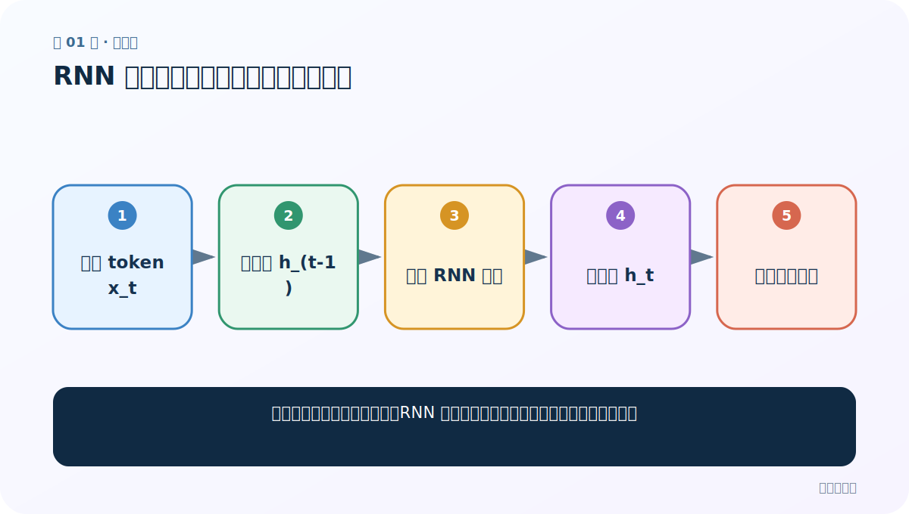
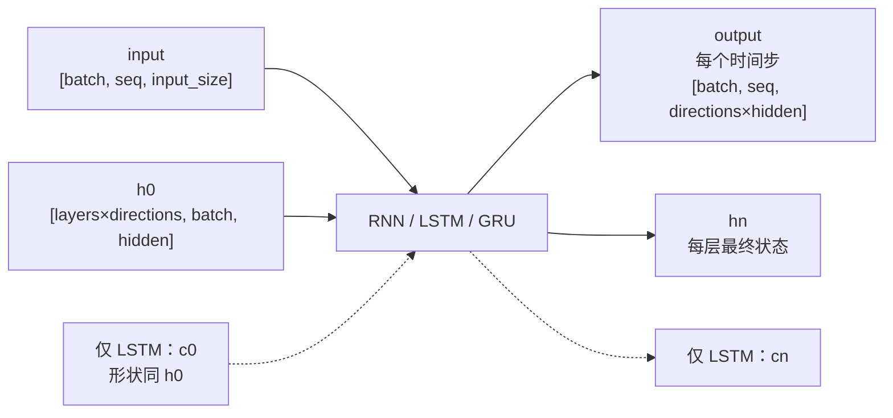

# 第 1 节：RNN 简介：让当前判断带上过去的信息

> 笔记编号 1/28 · 对应原视频 P38 · [打开这一集](https://www.bilibili.com/video/BV14mdfBDE4Q?p=38)

← 已是第一节 · [返回总目录](./README.md) · [下一节：2 RNN 分类：输入输出关系与内部结构是两个维度 →](./02-rnn-types.md)

## 这节解决什么问题

普通全连接网络看不到词序；RNN 如何一边读序列，一边把前文压进隐藏状态？



图从左向右读。先跟着数据或推理过程走一遍，再学习下面的术语。

## 辅助流程图


### PyTorch 循环层的张量形状



## 老师原声整理稿（按讲解顺序）

### 0:00–1:57　本章路线与 RNN 的位置

老师先给出路线：RNN、LSTM、GRU → 全球姓名分类 → 注意力 → Seq2Seq 英译法，随后才进入 Transformer。这里的意义是先理解“按时间一步步处理”，后面才能理解注意力为何要摆脱串行瓶颈。

### 1:57–5:55　输入、循环状态与输出

文本先数值化；循环层在第 t 步同时接收当前输入 x_t 和上一隐藏状态 h_(t-1)，产生 h_t。老师反复指着展开图说明：图上画了多个方框，但它们是同一个单元在不同时间重复使用，同一组权重被共享。

### 5:55–8:51　展开图怎样读

h_0 通常初始化为零。读入 x_1 得到 h_1，再把 h_1 带到下一步与 x_2 一起计算。每往后一步，状态就尝试携带更多前文信息。课程把每步概括成“两类输入、两类输出”；在 PyTorch 中要用张量形状理解，而不是误以为真有 12 个独立函数参数。

### 8:51–13:48　为什么适合语言与意图识别

语言、语音、时间序列都具有先后依赖。老师以银行助手的意图识别为例：把一句问题逐词读入，最后用最终隐藏表示做多分类。剧情类比帮助理解：看到第 3 集时，脑中应带着前两集信息。

### 13:48–15:25　本节结论

RNN 主要处理序列数据；结构仍是输入层、隐藏层、输出层，只是隐藏部分具有循环连接。它能记住多少并不只看维度，还受训练、序列长度和梯度衰减影响。

## 完整原声逐段记录

[查看本节按时间戳整理的完整音轨转写](./transcripts/p038.md)

逐段记录用于核查老师讲解是否遗漏；正文会进一步纠正口误和语音识别中的技术术语。

## 零基础先记住

- 同一 RNN 单元沿时间共享权重
- h_t 同时依赖 x_t 与 h_(t-1)
- 最终状态可用于整句分类

## 最小可运行代码

下面代码默认从项目根目录运行；专题配套实现见 [rnn_from_scratch 配套实现](../../rnn_from_scratch/README.md)。

```python
import torch
from rnn_from_scratch.model import SimpleRNNCell
cell = SimpleRNNCell(6, 8)
x_t = torch.randn(4, 6)
h = cell.initial_hidden(batch_size=4)
print(cell(x_t, h).shape)
```

### 输入和输出怎么看

4 个样本，每个当前输入 6 维；更新后的隐藏状态是 [4, 8]。

## 最容易踩的坑

展开图里的多个 RNN 方框不是多套不同参数，而是同一单元在多个时间步复用。

## 本节知识链

`当前 token x_t → 旧状态 h_(t-1) → 共享 RNN 单元 → 新状态 h_t → 序列任务输出`

## 自测

**问题：第 t 步最少需要哪两类信息？**

<details>
<summary>点开核对答案</summary>

当前输入 x_t 和上一隐藏状态 h_(t-1)。

</details>

## 学完检查

- [ ] 我能用自己的话复述老师的讲解顺序
- [ ] 我能在运行前预测关键输出或张量形状
- [ ] 我知道这节方法最容易用错的地方
- [ ] 我能独立回答自测题

← 已是第一节 · [返回总目录](./README.md) · [下一节：2 RNN 分类：输入输出关系与内部结构是两个维度 →](./02-rnn-types.md)
