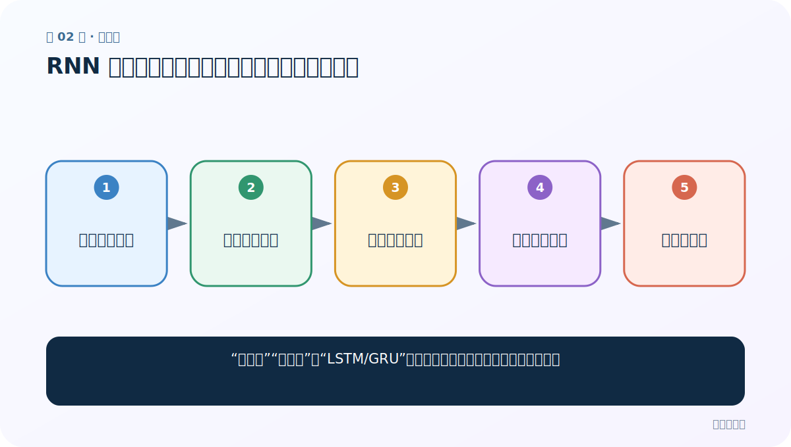
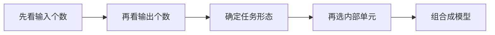
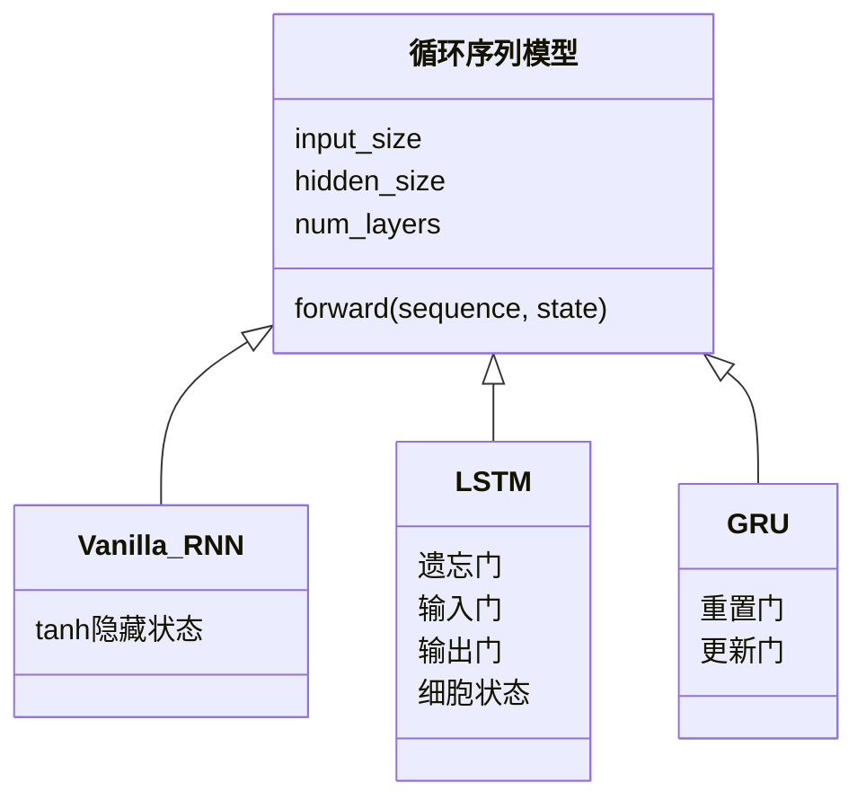

# 第 2 节：RNN 分类：输入输出关系与内部结构是两个维度

> 笔记编号 2/28 · 对应原视频 P39 · [打开这一集](https://www.bilibili.com/video/BV14mdfBDE4Q?p=39)

[← 上一节：1 RNN 简介：让当前判断带上过去的信息](./01-rnn-introduction.md) · [返回总目录](./README.md) · [下一节：3 RNN 模型结构：公式、共享权重与张量形状 →](./03-rnn-structure.md)

## 这节解决什么问题

“多对一”“多对多”和“LSTM/GRU”不是同一层级的分类，怎样把它们分清？



图从左向右读。先跟着数据或推理过程走一遍，再学习下面的术语。

## 辅助流程图



### RNN 家族 UML 关系




## 零基础精讲：先把这一节真正弄懂

### 先用一个场景理解

“一句话对应一个标签”和“每个词对应一个标签”是输入输出关系；RNN、LSTM、GRU 是内部怎样保存记忆。它们是两套不同的分类角度。

### 沿数据流一步一步走

1. 先看输入个数
2. 再看输出个数
3. 确定任务形态
4. 再选内部单元
5. 组合成模型

上面每一步都对应流程图的一段。读图时不断问自己：“此刻张量里装的是什么，形状是什么，下一步为什么需要它？”

### 第一次看代码只盯住这里

先给任务画输入和输出的数量，再决定内部单元，不要把 many-to-one 与 LSTM 当成同一级名称。

运行代码前先写出预期形状，运行后逐维核对。数值可以暂时算不出，但 B（批量）、L（长度）、D/H（特征或隐藏宽度）为什么出现，必须能说清。

### 本节边界

Bi-LSTM 不是一种新的输入输出数量关系，而是内部状态流向的选择。

本节过关不是背公式，而是能从第 1 步讲到最后一步，并指出哪一个状态把前文带到了后面。

## 老师原声整理稿（按讲解顺序）

### 0:00–3:55　按输入与输出数量分类

老师要求记住四种任务形态：N→N（等长序列标注或逐步生成）、N→1（文本分类/意图识别）、1→N（由单一条件生成序列，如图像描述的抽象形式）、N→M（翻译、摘要等输入输出长度不同的任务）。英译法属于 N→M。

### 3:55–7:55　按内部结构分类

第二个维度才是传统 RNN、LSTM、GRU。LSTM 用遗忘门、输入门、输出门和细胞状态管理长期信息；GRU 用重置门与更新门做较简化的控制。Bi-LSTM/Bi-GRU 表示从正向和反向各读一次再合并。

### 7:55–12:56　为什么面试回答要先说分类维度

只回答 N→M 或只回答 LSTM 都不完整。老师用翻译图预告编码器、解码器和中间表示 C；目前只需知道输入输出长度可以不同，后面的 Seq2Seq 会完整展开。

### 12:56–14:14　练习与收束

判断题时先问“它在讨论任务接口，还是内部循环单元”。双向模型能利用两侧上下文，但计算和延迟更高，也不适合必须实时只看过去的因果生成。

## 完整原声逐段记录

[查看本节按时间戳整理的完整音轨转写](./transcripts/p039.md)

逐段记录用于核查老师讲解是否遗漏；正文会进一步纠正口误和语音识别中的技术术语。

## 零基础先记住

- 任务形态和循环单元是两个正交维度
- N→1 常用于整句分类
- 双向模型不能用于严格的在线因果场景

## 最小可运行代码

下面代码默认从项目根目录运行；专题配套实现见 [rnn_from_scratch 配套实现](../../rnn_from_scratch/README.md)。

```python
tasks = {"sentiment": "N→1", "translation": "N→M", "tagging": "N→N"}
for task, shape in tasks.items():
    print(task, shape)
```

### 输入和输出怎么看

输出把典型任务映射到输入输出关系；之后仍需另外选择 RNN/LSTM/GRU。

## 最容易踩的坑

Bi-LSTM 不是一种新的输入输出数量关系，而是内部状态流向的选择。

## 本节知识链

`先看输入个数 → 再看输出个数 → 确定任务形态 → 再选内部单元 → 组合成模型`

## 自测

**问题：姓名国籍分类属于哪种任务形态？**

<details>
<summary>点开核对答案</summary>

输入多个字符，输出一个国家类别，因此是 N→1。

</details>

## 学完检查

- [ ] 我能用自己的话复述老师的讲解顺序
- [ ] 我能在运行前预测关键输出或张量形状
- [ ] 我知道这节方法最容易用错的地方
- [ ] 我能独立回答自测题

[← 上一节：1 RNN 简介：让当前判断带上过去的信息](./01-rnn-introduction.md) · [返回总目录](./README.md) · [下一节：3 RNN 模型结构：公式、共享权重与张量形状 →](./03-rnn-structure.md)
